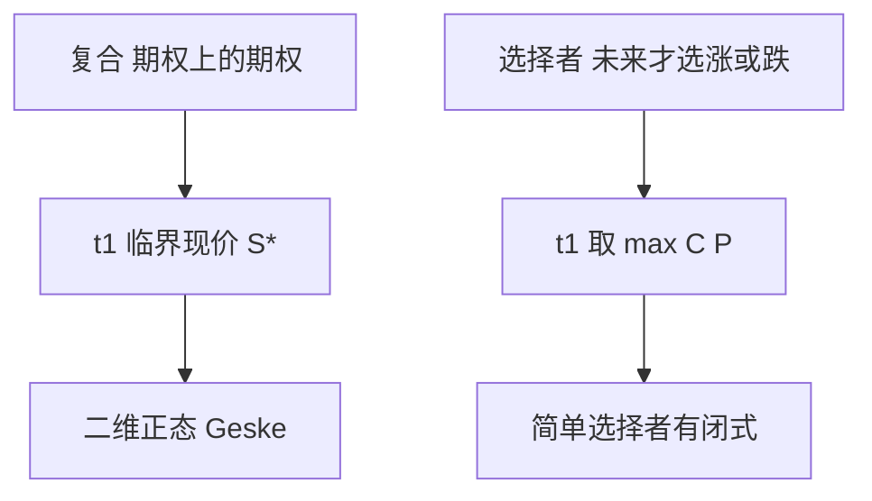

# 复合与选择者期权

复合期权是期权上的期权；选择者在未来某日才决定要看涨还是看跌。两者都把「今天还没选定的权利」标成可交易状态。

<footer>—— Geske, The Valuation of Compound Options, Journal of Financial Economics, 1979；Rubinstein, Options for the Undecided, Risk, 1991</footer>

[上一课](/quant/correlation-swap)把多资产相关收成互换。本课回到单资产，但把**权利本身**再期权化：复合看涨是在 $t_1$ 用执行价 $K_1$ 买入一份到期 $T$、执行价 $K_2$ 的香草；选择者在 $t_1$ 于看涨与看跌之间二选一。缺口不是再推 [BSM](/quant/bsm)，而是二维正态与「选择日」上的临界现价。后课才把这些零件组装进权证与结构票据。

## 问题

公司债、权证、雇员期权、可转债里经常嵌着「先有权再买期权」：股权本身可看成公司资产上的期权，再在其上写期权就是 Geske 的复合。选择者则出现在结构票据的「到期前决定方向」。问题是：复合价格依赖标的在 $t_1$ 是否越过临界值 $S^*$（使内层期权价值等于 $K_1$），因此出现二维累积正态，而不是把两份香草相乘。把复合当「杠杆香草」用更高 Vega 去套，会漏掉 $t_1$ 附近对临界值的数字风险。

选择者在 $t_1$ 的最优决策几乎总是：选当时更贵的那一侧，价值等于 $\max(C,P)$，再用看跌看涨平价化成香草加现金。简单选择者因而有闭式；复杂选择者（可在区间内任意时刻选）没有。

### $S^*$ 是内层期权的隐含执行价

Geske 把外层行权条件写成 $C(S_{t_1};K_2,T-t_1)=K_1$，反解 $S^*$。外层看涨于是像执行价为 $S^*$ 的数字叠加内层香草。数值上要对 $S^*$ 做一维根搜索，再送入二维正态；$\sigma$ 一变，$S^*$ 也变，Vega 不能只对内层香草取。

Geske 复合与公司债的结构性模型同源：股权是资产上的看涨，认股权证是股权上的看涨。本课停在期权公式；[Merton 结构模型](/quant/merton-structural) 不在这里重写。

## 方法

欧式复合：Geske 二维正态，注意看涨上看涨、看涨上看跌等四种的符号与 $S^*$。欧式简单选择者：Rubinstein 闭式，本质是 $t_1$ 处 $\max(C,P)$。美式、离散分红、微笑：闭式作废，用树或 [PDE](/quant/option-pde) 在选择日对 $\max(C,P)$ 取边界，或对复合在 $t_1$ 比较内层价值与 $K_1$。

有微笑时，内层期权必须用与市场一致的边际，外层再用同一模型走到 $t_1$。用两张不同的 BSM 隐波分别给内外层，会破坏 $t_1$ 处的无套利衔接。

## 机制

复合把时间切成两段：先决定是否支付 $K_1$ 买入剩余香草，再走内层。信息在 $t_1$ 被「行权或放弃」离散化，故出现临界现价与数字风险。选择者把方向选择推迟到 $t_1$，等价于持有一个在 $t_1$ 变成香草的或有要求权；推迟本身有价值，因为 $t_1$ 之前不必承诺 Delta 的符号。

## 边界

二维正态假设 GBM、常数 $\sigma$。利率随机、信用风险、提前行权都会让 Geske 变成近似。可转债里的转股权是复合的近亲，但叠加赎回、下修与信用，见 [可转债与信用](/quant/convertible-credit)，本课不写转债条款。

不要把选择者当「免费的跨式」。你付的是推迟方向决策的权利金；到期两边都赚的路径并不存在。

## 小结

- 复合期权在 $t_1$ 有临界现价 $S^*$，价格是二维正态，不是两份香草相乘。
- 简单选择者在选择日取 $\max(C,P)$，有 Rubinstein 闭式。
- 微笑下内外层必须同一模型衔接。
- 出处：Geske, *JFE*, 1979；Rubinstein, *Risk*, 1991。
