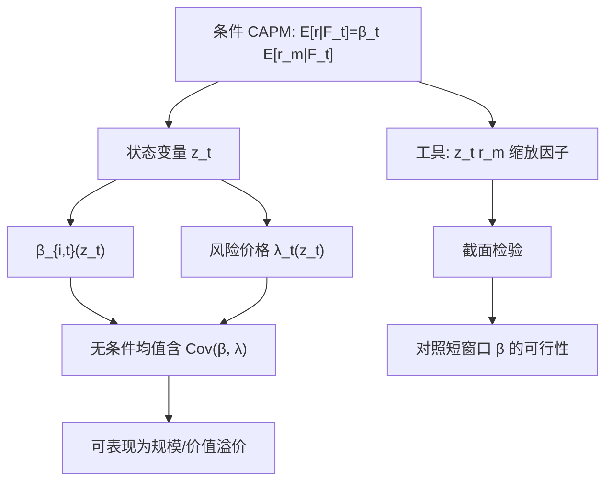

# 条件 CAPM

无条件的市场 beta 解释不了价值与规模，并不等于条件 CAPM 失败；若风险溢价与 beta 随状态同向变动，无条件回归会把定价误差剩在截距里。

<footer>—— Jagannathan–Wang；Lettau–Ludvigson 用 $cay$ 做条件定价</footer>

CAPM 说资产的条件期望收益正比于它对市场的条件 beta。实证里人们却拿全样本平均收益对全样本 beta 做截面回归，发现截距、规模、价值都拒绝模型。Jagannathan 与 Wang（1996）指出：若 beta 或市场溢价随状态变化，无条件 CAPM 可以不成立，而条件 CAPM 仍然成立。Lettau 与 Ludvigson（2001）用消费–财富比 $cay$ 作为状态变量，显示价值、规模等组合的条件 beta 在坏状态下更高，从而在无条件均值里表现为「异象」。条件 CAPM 要处理的，就是把时变风险从「alpha」里还给定价。

## 问题

条件模型写为

$$
E[r_{i,t+1}\mid \mathcal{F}_t]=\beta_{i,t}\,E[r_{m,t+1}\mid \mathcal{F}_t],
$$

$\beta_{i,t}=\mathrm{Cov}_t(r_{i,t+1},r_{m,t+1})/\mathrm{Var}_t(r_{m,t+1})$。无条件期望两边，会出现 $\beta$ 与市场溢价的协方差项。若价值股在衰退时 beta 升高，而衰退时市场溢价也高，则价值股无条件收益更高，即使每一期都按条件 CAPM 定价。无条件回归把这块协方差误读成 alpha。Fama–French 三因子可以被理解为用规模与价值去代理这种状态相关的风险，而不是对 CAPM 逻辑的彻底否定。

Hansen 与 Richard（1987）从理论上说明：条件均值–方差有效并不蕴含无条件有效。因此「市场组合无条件不在前沿上」不能单独杀死条件 CAPM。要拒绝它，必须在同一信息集下检验条件矩。

### 信息集无法被穷尽

条件期望相对于研究者使用的工具变量。工具太少，时变被低估，模型看起来像无条件 CAPM，继续被拒绝；工具太多或数据挖掘，又落入 Harvey–Liu–Zhu 的多重检验。Lettau–Ludvigson 选择 $cay$，是因为它来自消费与资产财富的协整剩余，有宏观含义，而不是在几百个宏观序列里挑 t 最大的那个——尽管任何单一宏观变量仍可能幸运。

用未来才知道的状态（下季度 NBER 衰退标签）做条件，是前视。状态变量必须属于 $t$ 时刻的信息集：$cay_t$、期限利差、默认利差、已实现波动，而不是 $t+1$ 的消费增长本身。

## 方法

工具变量或缩放因子。把条件 CAPM 写成无条件的多因子：市场、$z_t r_{m,t+1}$、以及必要时 $z_t$ 本身。Jagannathan–Wang 用劳动收入与违约利差一类变量；Lettau–Ludvigson 用 $cay_t$ 与 $cay_t\times r_{m,t+1}$。截面上检验这些缩放因子能否吸收 Fama–French 组合的均值。

时变 beta。滚动回归、DCC 或对状态变量的参数化 $\beta_{i,t}=b_{i0}+b_{i1}z_t$。再检验 $E[r_{i,t+1}-\beta_{i,t}r_{m,t+1}]=0$。Lewellen 与 Nagel（2006）强调：若用短窗口直接估条件 beta，许多声称成功的条件 CAPM 在合理的时变幅度下无法解释价值溢价——所需的 beta 波动太大，短窗口估计也噪声很大。

消费 CAPM 的条件化。Lettau–Ludvigson 把 $cay$ 放进消费 CAPM，坏状态下消费风险的价格更高。这与条件市场 CAPM 是表亲：市场是消费的代理，$cay$ 调节风险价格。

### 检验的功效与资产选择

用 25 个规模–价值组合去检验，相关结构很强，看似高 $R^2$ 可能来自组合的共同均值。Lewellen、Nagel 与 Shanken 呼吁加入其他资产、报告置信区间而不只是点估计 $R^2$。条件 CAPM 的论文尤其容易在「解释了这 25 个组合」上过度自信。工业应用里更应看：状态变量是否在样本外预测市场溢价，以及条件 beta 是否在真正的坏状态（而不是事后标签）上升。

$cay$ 的构建使用全样本协整，会有前视成分。实务复制应递归估计消费–财富关系，接受样本外 $cay$ 更噪，这才是条件信息集的诚实版本。

## 机制

经济机制是风险的跨期转移。投资者在财富受损、消费–财富比恶化时更厌恶风险，要求更高的市场溢价；同时，高经营杠杆、高财务杠杆的价值股在该状态下市场敏感度上升。两者相乘，无条件溢价出现在价值与小盘上。这与「价值是错误定价」不必然互斥：错误定价也可以在坏状态被放大。条件 CAPM 只是提供一个风险叙事，能否独占解释权要看条件矩是否被定价完。

统计机制是遗漏变量。无条件 CAPM 漏掉了 $z_t r_m$。把状态变量写进模型，等价于一个宏观因子模型的离散版本。Chen–Roll–Ross 的宏观因子、Fama–French 的回报因子、条件 CAPM 的缩放市场，是三种对「时变风险价格」的参数化。

### Lewellen–Nagel 的批评意味着什么

他们的短窗口 beta 估计显示，价值股的 beta 在坏时期升高的幅度，不足以在合理的市场溢价波动下产生观察到的价值溢价。这意味着：要么条件 CAPM 仍漏因子，要么状态变量选错，要么溢价有非风险成分。对量化实践的含义不是「不要做条件化」，而是不要以为加一个宏观变量就能把价值变成纯 CAPM。条件化是检验，不是自动洗白。

## 边界与工程取舍

状态变量有频率与修订。宏观序列滞后、修订，使 $z_t$ 在实盘 $t$ 不可得。金融变量（期限利差、信用利差、VIX）更及时，但更像是市场自己的价格，用它们「解释」市场溢价接近同义反复。Lettau–Ludvigson 的吸引力在于 $cay$ 来自宏观总量；代价是低频、估计误差与样本期短。

对组合管理：条件 beta 可用于风险预算（衰退状态下降低价值超配的名义额度，或提高对冲），但把条件 alpha 当成可交易信号，会迅速碰到宏观状态变量那一篇里的滞后、修订与多重检验。条件 CAPM 首先是定价检验框架，其次才是择时装置。

拒绝无条件 CAPM、接受某个条件版本、再拒绝另一个条件版本，可以同时为真。报告时应写明信息集 $\mathcal{F}_t$ 里到底有哪些 $z$，而不是笼统说「条件 CAPM 成立」。

## 小结

- 条件 CAPM 允许 beta 与市场溢价随信息集变化；无条件检验失败不足以否证条件版本（Hansen–Richard）。
- Jagannathan–Wang（1996）与 Lettau–Ludvigson（2001，含 $cay$）把条件模型写成可估的缩放因子，用以吸收规模与价值的无条件溢价。
- 状态变量必须属于期初信息集；全样本 $cay$ 有前视，复制应递归。
- Lewellen–Nagel（2006）表明许多条件 CAPM 所需的 beta 时变过大，短窗口证据并不支持「价值只是条件市场风险」。
- 条件化与 Fama–French、宏观因子是对时变风险价格的不同参数化，不是互相取消。
- 出处：Jagannathan and Wang, *The Conditional CAPM and the Cross-Section of Expected Returns*, Journal of Finance, 1996；Lettau and Ludvigson, *Resurrecting the (C)CAPM*, Journal of Political Economy, 2001；Lewellen and Nagel, *The Conditional CAPM Does Not Explain Asset-Pricing Anomalies*, Journal of Financial Economics, 2006；Hansen and Richard, *The Role of Conditioning Information in Deducing Testable Restrictions*, Econometrica, 1987。
