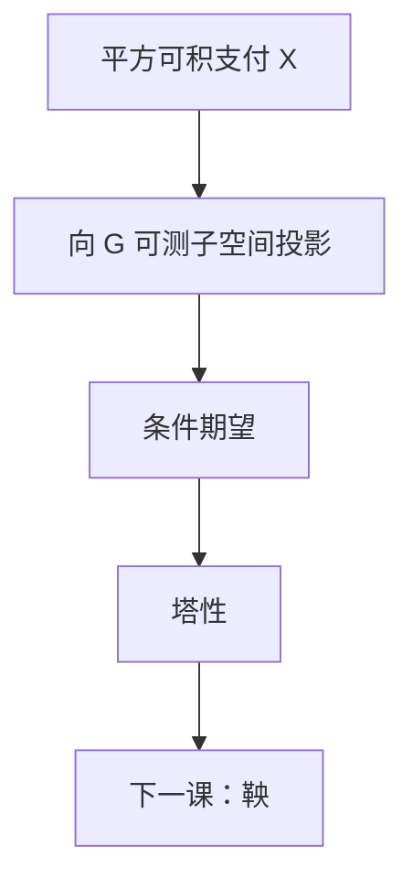

# 条件期望作为投影

条件期望 $\mathbb E[X\mid\mathcal G]$ 是 $X$ 到 $\mathcal G$-可测平方可积随机变量的正交投影：已知信息下对 $X$ 的最佳 $L^2$ 预测。

<footer>—— 据 Karatzas and Shreve, Brownian Motion and Stochastic Calculus, 1991, 第 1 章；Shreve, Stochastic Calculus for Finance I, 2004, 第 2 章整理</footer>

上一课[几何布朗运动](/quant/geometric-brownian-motion)给出了路径对象 $S_t$。缺口是：定价与对冲要的不是整条路径的清单，而是「给定到 $t$ 的信息，对尚未实现的支付取平均」。本课把条件期望钉成 $L^2$ 投影，后课的鞅、停时、换测度都只调用这条运算，不再从初等条件密度重讲。

## 问题

初等课里 $\mathbb E[X\mid Y=y]$ 是把密度拿 $y$ 切开再归一。连续时间里信息是 $\sigma$-代数流 $\mathcal F_t$，不是单个随机变量。缺口是换语言：给定 $\mathcal G\subset\mathcal F$，$\mathbb E[X\mid\mathcal G]$ 是唯一（a.s.）的 $\mathcal G$-可测可积随机变量，使得对一切有界 $\mathcal G$-可测 $Z$，

$$
\mathbb E[Z\mathbb E[X\mid\mathcal G]]=\mathbb E[ZX].
$$

这是定义，不是「先有条件密度再积分」。没有它，下一课无法写 $\mathbb E[M_t\mid\mathcal F_s]=M_s$。

路径已经会动；本课不重推 GBM，只补「给定信息之后还剩下什么随机性」。

### 条件期望不是用样本均值代替期望

对一条已实现路径取时间平均，是遍历问题，不是 $\mathbb E[\,\cdot\mid\mathcal F_t]$。条件期望仍是随机变量：信息变了，预测变了。把它理解成「历史上的平均价格」，后面风险中性定价会把时间序列和测度搞混。

$L^2$ 里投影的几何最干净：误差 $X-\mathbb E[X\mid\mathcal G]$ 与所有 $\mathcal G$-可测方向正交。可积但非平方可积时定义仍在，只是失去正交图像。

## 方法

在 $L^2$ 中，$\mathbb E[\,\cdot\mid\mathcal G]$ 是到闭子空间 $L^2(\mathcal G)$ 的正交投影，因而线性、幂等、范数不增。塔性：$\mathcal H\subset\mathcal G$ 则 $\mathbb E[\mathbb E[X\mid\mathcal G]\mid\mathcal H]=\mathbb E[X\mid\mathcal H]$。已知量可提出：$\mathcal G$-可测有界 $Y$ 满足 $\mathbb E[YX\mid\mathcal G]=Y\mathbb E[X\mid\mathcal G]$。独立性：若 $X$ 独立于 $\mathcal G$，则 $\mathbb E[X\mid\mathcal G]=\mathbb E[X]$。Jensen：凸 $\phi$ 时 $\phi(\mathbb E[X\mid\mathcal G])\le\mathbb E[\phi(X)\mid\mathcal G]$。

定价接口：未定权益 $H\in L^2$ 在信息 $\mathcal F_t$ 下的条件价格（尚未贴现、尚未换测度）就是投影 $\mathbb E[H\mid\mathcal F_t]$。本课不引入 $Q$，只把运算准备好。

## 机制

正交性解释「新息」：把 $X$ 拆成已由 $\mathcal G$ 决定的部分与正交残差。布朗运动的独立增量正是残差：$\mathbb E[W_t\mid\mathcal F_s]=W_s$，残差 $W_t-W_s$ 与过去正交。塔性把多期预测收成一次投影，这是离散鞅证明里「取条件再取条件」的几何。Jensen 给凸支付的下界，后课期权价值对标的凸性从这里来，不必先写 PDE。

条件期望对 a.s. 相等敏感：两个版本只差零测集。写过程时默认取右连左极修正，那是鞅课的正则性，本课只要求可测版本存在。

## 边界

本课不讲正则条件分布的存在定理，不把贝叶斯更新写成滤波。也不引入 ess sup、对偶预测。后课默认：见到 $\mathbb E[\,\cdot\mid\mathcal F_t]$ 即投影；塔性、可提出、独立性三条随手用。下一课[鞅与局部鞅](/quant/martingale-local)把投影沿时间排成过程。

## 小结

- 条件期望是到已知信息子空间的 $L^2$ 投影。
- 塔性、可提出、独立性是后课仅有的运算规则。
- 它是随机变量，不是一条路径上的时间平均。
- 布朗增量与过去正交，正是投影的例子。
- 出处：Karatzas–Shreve 第 1 章；Shreve SDE I 第 2 章。
