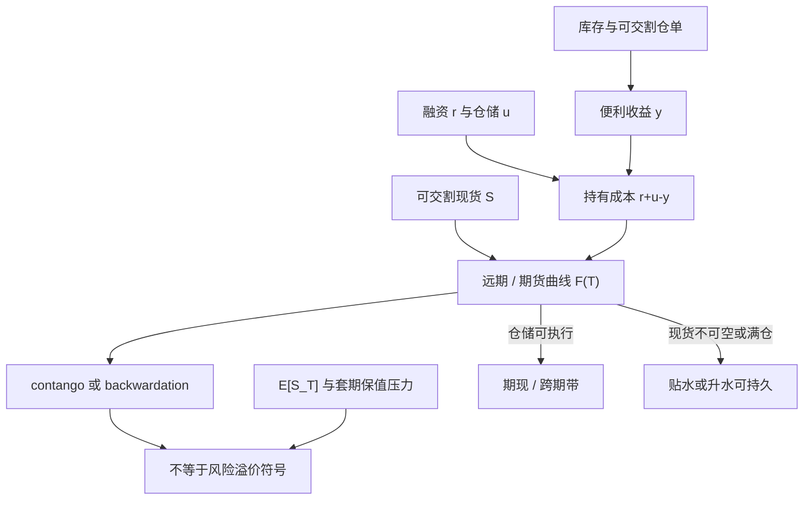

# Contango 与 Backwardation

仓单与库存把远期曲线写成持有成本加减便利收益；曲线的升贴水首先是存货状态，而不是一张人人可领的风险溢价支票。

<footer>—— Working, The Theory of the Price of Storage, American Economic Review, 1949；对照 Keynes 的正常贴水与 Erb–Harvey 对商品期货收益分解</footer>

[上一课](/quant/cn-night-session)把中国市场课序收在商品期货夜盘。本课打开期货与基差。商品与许多可交割期货的期限结构有两个常用词：正向市场（contango）指远月贵于近月或期货贵于现货；反向市场（backwardation）指近月贵于远月或期货贴水于现货。Keynes 在《货币论》里把正常贴水写成套期保值者付给投机者的保险费；Working 把同一条曲线改写成仓储供给。Kaldor、Brennan、Telser 补上便利收益：存货低时，持有现货有生产与销售上的选择权，现货可以持续贵于远期。Erb 与 Harvey、Gorton 与 Rouwenhorst 把这些形状重新接到可投资商品期货的收益分解上。把 contango 当成「空头一定赚钱」、把 backwardation 当成「多头一定赚钱」，是把曲线几何与风险溢价、把持有成本与可执行基差混成一句话。

## 问题

持有成本的连续近似是

$$
F_{t,T}=S_t\,\mathrm{e}^{(r+u-y)(T-t)},
$$

其中 $r$ 为融资，$u$ 为仓储与保险等持有成本，$y$ 为便利收益。$r+u>y$ 时远期升水，曲线看起来像 contango；$y$ 大到压过 $r+u$ 时出现 backwardation。问题不在会不会写这个指数，而在 $y$ 不是一个可直接观测的息票：它是库存稀缺、交割品质与地点、以及现货市场不可空的残差。Working 的仓储价格理论把基差（更准确是持有费，carrying charge）写成库存的函数：库存充裕时，远期相对近月的升水接近全额仓储加融资；库存紧张时，升水压缩甚至翻成贴水，因为现货被「扣住」在生产与渠道里。

Keynes–Hicks 的正常贴水说的是另一件事：即便曲线升水，期货价格仍可以低于未来现货的期望，多头赚风险溢价。曲线形状是 $F(T)$ 对 $T$ 的几何；风险溢价是 $F_{t,T}$ 对 $\mathbb{E}_t[S_T]$ 的差距。Fama 与 French（1987）在商品上同时检验预测力与仓储理论，发现基差含有关于未来现货变动的信息，也随存货周期变化。把「近月低于远月」直接翻译成「多头展期亏损」，或把「近月高于远月」翻译成「Keynes 溢价正在支付」，都跳过了这一层定义。

### 两种 backwardation 不要共用一个符号

市场术语里的 backwardation 多半指期限结构向下倾斜。理论术语里的 normal backwardation 指 $F_{t,T}<\mathbb{E}_t[S_T]$。可以同时成立，也可以只成立一个。能源在库存低、季节临近时常常是曲线 backwardation，同时现货波动极高，多头展期看似有 [展期收益](/quant/roll-yield)，但现货腿的负漂移与保证金可以吃掉它。农产品收获前与收获后，曲线可以在几周内从贴水翻到升水，那是库存路径，不是风险厌恶突然变号。金属有仓库与租借市场，$y$ 更接近租借率；贵金属长期 contango 更接近 $r+u$，因为货币性金属的便利收益通常低。

Erb 与 Harvey（2006）强调商品期货的超额收益在截面上差异极大，平均「商品 beta」并不是一个稳定的风险支票。曲线状态、现货动量与展期收益必须分开写，不能用一个 contango 虚拟变量去代表所有溢价。

## 方法

可审计的曲线状态应从可交易合约读，而不是从现货指数减近月。现货有品质、地点与升贴水；近月期货有交割选择权。实务上用第 $n$ 与第 $n+1$ 个流动性合约的价差除以间隔，得到年化斜率，再扣掉融资与仓储的可观测部分，残差才接近便利收益。库存用公开报告（见[库存报告与曲线](/quant/inventory-curve)）做状态变量：同一斜率在高库存与低库存下的含义不同。Gorton、Hayashi 与 Rouwenhorst（2013）把库存、基差与商品期货期望收益连在同一套仓储逻辑上——基差是状态的充分统计量之一，不是独立的「技术指标」。

交易上，曲线本身很少被当成无方向的套利。买近卖远或买远卖近是[跨期套利](/quant/calendar-spread-arb)或展期，收敛靠的是仓储与交割，不是协整。若把整条曲线的 PCA 一因子当成「contango 因子」去配股票组合，你配的是商品复合指数的展期与现货动量混合物，因子载荷会随指数的合约权重与滚仓规则跳。指数规则必须写进规格，否则回测的 backwardation 溢价只是某一种滚仓日历的函数。

### 升贴水带与可执行性

无套利不是 $F=S\mathrm{e}^{(r+u-y)\tau}$ 上的一个点。现货买得进、仓单开得出、期货交得出，带才窄；现货不可空、仓库满、交割月流动性迁移，带就宽。正向市场里做[期现套利](/quant/cash-and-carry)（买现货空期货）受仓储容量约束；反向市场里做反向期现（空现货多期货）受借货与现货做空约束。曲线显示巨大贴水，往往不是免费午餐，而是 $y$ 已经高到现货借不到、或交割地与你的库存不在同一市场。容量随仓库剩余库容、船期与仓单生成速度下降；拥挤的指数滚仓会在近月把曲线暂时打弯，那是[展期成交量](/quant/roll-volume-oi)问题，不是仓储理论失效。

## 机制

Working 的机制是存货的期权价值。库存高，边际仓储成本上升，持有现货等到远月必须被远期升水补偿，否则存货会流向现货销售——曲线被顶在全额持有成本附近。库存低，生产商与下游宁愿持有实物，便利收益上升，近月相对远月可以贵很多，且这种贴水不必被无风险套利抹平，因为空头现货做不成。Brennan 的仓储供给、Telser 对棉花与小麦的检验，走的都是这条库存—基差通道。Fama–French（1988）对金属的周期行为，同样把价格与库存、工业活动绑在一起。

风险溢价机制是另一条。套期保值压力（hedging pressure）说生产商空头对冲压低期货相对期望现货的价格；指数化多头在 2000 年代之后把压力的符号变得含糊。Cheng 与 Xiong 讨论金融化之后，曲线与溢价不再能用单一商业空头故事概括。Erb–Harvey 把商品组合的长期收益拆成现货贡献与展期贡献，并警告：历史平均展期来自曾经更常出现的贴水品种与滚仓规则，外推「永远做多贴水商品」忽略了曲线状态的均值回归与容量。

### 破裂：挤仓、满仓与伪现货

曲线在交割月附近可以与仓储理论短暂脱节。可交割库存被控制、仓单注销、或交割地点的局部短缺，会把近月拉成极端 backwardation，这是挤仓，不是全国库存真的为零。反向地，仓库满仓、升水顶格，contango 可以超过「合理仓储」，因为再入库的边际成本不是线性的——你要另租库、改港口或把货卖掉。用一个全球库存数字去对一条交割地曲线，是状态变量错配。现货指数若含不可交割品质，期货「贴水」可能只是品质与地点基差。

Hull 把商品远期写成现货加持有成本减便利收益，是定价语言。它不保证 $y$ 可交易，也不保证曲线斜率的符号等于事后超额收益的符号。把教科书等式里的 $y$ 当成可收息票，会把未实现的基差变动记成票息。

## 边界与工程取舍

不要用结算价曲线在非流动性远月上算斜率再当信号：远月买卖价差可以吞掉年化几百个基点的「contango」。不要在指数滚仓窗口用收盘斜率做战术配置，那是在与[展期成交量](/quant/roll-volume-oi)同一方向拥挤。融资 $r$ 在压力期应换成实际保证金与美元融资，而不是国债；否则会出现「假升水」——钱贵了，曲线变陡，并不是仓储突然充裕。

报告应分开：曲线斜率、库存分位、可交割库存与总库存、以及期货超额收益的现货腿与展期腿。Gorton–Rouwenhorst 的长期商品溢价、Erb–Harvey 的战术价值，都是组合层面的历史分解，不是单品种、可无限加杠杆的套利。策略若只做曲线形状、不碰现货，盈亏来自价差变动与展期，风险是挤仓与季节，容量是近月深度与仓库约束，不是名义上的未平仓合约总量。

把 Keynes 的正常贴水、Working 的仓储贴水、以及指数产品说明书里的「滚仓亏损」叫成同一个 backwardation，回测会看起来永远自洽：贴水时做多、升水时做空，样本内总能找到一段商品牛市去证明。样本外先问库存与可交割性，再问收益。

## 小结

- Contango 与 backwardation 描述的是曲线或期现相对位置；Keynes 的正常贴水描述的是期货相对未来现货期望的保险费，两者不可互换。
- Working、Kaldor、Brennan、Telser 把形状接到库存与便利收益；低库存支撑贴水，高库存把升水顶向全额持有成本。
- Fama–French 显示基差有预测力且随仓储状态变；Gorton–Hayashi–Rouwenhorst 把库存、基差与期望收益放进同一套基本面。
- Erb–Harvey 警告商品期货收益的截面差异与战术价值，不能把平均 contango 当成统一空头策略。
- 可执行性受仓储容量、借货与交割地约束；挤仓与满仓使曲线与宏观库存脱节。
- 出处：Working, *AER*, 1949 与 *Journal of Farm Economics*, 1948；Kaldor, *RES*, 1939；Brennan, *AER*, 1958；Telser, *JPE*, 1958；Keynes, *A Treatise on Money*, 1930；Fama and French, *Journal of Business*, 1987；Erb and Harvey, *FAJ*, 2006；Gorton and Rouwenhorst, *FAJ*, 2006；Gorton, Hayashi and Rouwenhorst, *Review of Finance*, 2013；Hull, *Options, Futures, and Other Derivatives*。
