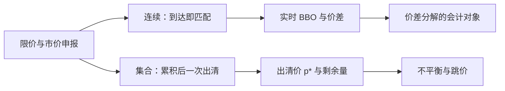

# 连续竞价 vs 集合竞价

连续市场把到达的指令立刻与簿上的对手成交；集合竞价把一段时间内的指令攒成一批，用一条出清价同时成交。价格发现的时钟因此不是同一把。

<footer>—— 据 Madhavan, Market Microstructure: A Survey, Journal of Financial Markets, 2000；Pagano and Schwartz 对集合竞价与连续交易的比较</footer>

[买卖价差的分解](/quant/spread-decomposition)把连续限价簿上的 $s$ 拆成处理、存货与逆向选择，会计默认指令是**陆续到达、立刻匹配**的。本课留下的缺口不是价差有哪三项，而是：一旦匹配规则改成批量出清，报价价差、有效价差和「谁在提供流动性」还能否用同一套符号。Madhavan 把市场设计写成价格形成的约束，而不是装饰；Harris 把连续竞价与集合竞价并列为两种合法的交易协议。后课默认已经读完本课：开盘收盘、波动中断再开盘，都是集合协议在日历上的特化，不再从零解释批量出清。

## 问题

连续竞价（continuous auction / continuous matching）里，一笔可立即成交的买单撞上卖一，成交价通常是被动方的挂单价，剩余量按价格-时间优先排队。价差是实时存在的状态：[LOB](/quant/lob-structure) 上的 $a-b$，成交可以发生在价差外沿或内部。集合竞价（call / batch auction）在累积期内不匹配，只收集买卖申报；到约定时刻（或满足触发条件时）用一条出清价 $p^*$ 最大化成交量（常见还附加最小剩余、最小价差等次级规则），所有满足条件的单在 $p^*$ 上同时成交。累积期内没有可交易的 BBO，[价差分解](/quant/spread-decomposition)里的报价价差暂时没有对象。

缺口因此是协议层的：同样的限价指令，在连续协议里是队列与价差，在集合协议里是供给曲线与需求曲线的交点。若把集合竞价的成交硬套有效价差 $2q(p-m)$，必须先发明一个当时并不存在的中点 $m$。若把连续竞价的盘中价差平均，当成「这个股票有多贵」，又会漏掉开收盘那一大块在集合里完成的量。问题是写清两种时钟各自的状态变量，以及它们如何交接，而不是争论哪一种「更有效」。

### 出清价不是中间价的另一个名字

集合竞价的 $p^*$ 是批量供需的交点，通常落在虚拟买卖曲线交叉的一个区间内，再按交易所规则取整到 tick、取能让剩余更平衡的一端。它不是连续簿买一卖一的中点，也不保证等于上一笔连续成交价。累积结束时若买量在所有价位都压过卖量，$p^*$ 会顶到涨停或虚拟上限，剩余未成交进入连续阶段或取消——这是数量配给，不是价差里的逆向选择项。把 $p^*$ 当成「公平价值」再去算实现价差，会计对象已经换了。

A 股开盘、收盘用集合竞价，盘中是连续竞价（创业板、科创板等还有盘后固定价格）。美股开收盘也是拍卖，但盘中连续且多场所并行。比较「价差」必须先声明窗口落在哪一种协议里。

## 方法

把一次交易日切成协议段：集合累积、集合出清、连续匹配，必要时再切出盘后。每一段单独定义可观测对象。连续段沿用先修课的报价价差、有效价差、实现价差。集合段改报：申报不平衡（未匹配买量减卖量）、虚拟参考价路径（若交易所披露）、出清价相对前收或相对连续段第一笔中点的跳价、以及出清量占全日量的份额。Pagano 与 Schwartz 比较巴黎交易所引入收盘集合前后的质量，用的就是分段质量，而不是把全日成交塞进一个 Roll 协方差。

交接规则必须写进撮合器，而不能在研究里用连续引擎去「模拟」开盘。集合结束未成交的限价，是否自动转入连续簿、是否保留时间优先、是否允许在不可撤窗口内修改，决定连续段开盘后的第一口价差。Madhavan 的综述把这种制度细节当成价格发现的一部分：同一组偏好，协议不同，观测到的价差路径不同。

### 流动性提供在两种协议里不是同一职业

连续协议里，挂在 BBO 上的限价是 maker，吃进的是 taker，[费用](/quant/maker-taker)沿这条边界走。集合协议里，所有参与出清的单在同一时刻、同一价格成交，没有谁「提供了买卖报价」。事前累积的限价提供了弹性，市价或保护市价提供了愿意在任何出清价成交的量。把集合成交全部标成 taker，会让开收盘的 make/take 统计无意义。方向分类也要换：集合里没有「主动撞上卖一」，[Lee-Ready](/quant/lee-ready) 的中点对照在出清瞬间不存在；能用的是不平衡符号、或出清价相对虚拟价的位置，那是另一套标签，本课只要求不要混用。

## 机制

连续匹配的信息写入是增量的：每笔成交更新信念与存货，价差随到达强度变化。集合匹配把一段时间的私人信息压进一次出清。知情者若能在累积期隐藏真实需求，出清价的冲击一次释放；若交易所披露虚拟参考价与不平衡，信息在累积期内就被部分写出，连续开盘后的跳价会变小。这是透明度与抢跑之间的权衡，不是「集合一定更公平」。

对非知情流动性，集合的好处是时间优先被削弱、大家在同一价格成交，大单不必沿连续深度一层层披露。代价是必须等待出清时刻，期间价格风险由持有未匹配意向的人承担。连续的好处是即时性：你现在就能与簿成交。代价是价差与深度成为实时成本，队列位置成为状态，见[撤单与队列](/quant/cancel-queue-position)。O'Hara 强调价格发现依赖谁先被匹配；协议决定的正是「先」的含义——连续里是到达时刻，集合里是出清规则下的价格优先。

不要用 [Roll 模型](/quant/roll-model) 的协方差去估集合竞价的「有效价差」：Roll 依赖连续成交价在买卖之间回跳。出清是单次定价，没有买卖回跳这一矩。

### 协议切换时价差会计必须断开

从集合出清进入连续的第一笔，报价价差会突然从「不存在」变成一个正的 $n\Delta$。把这一笔并入全日有效价差均值，等于把制度切换当成股票变贵。分段样本、分段对照，是本课对后课开收盘与波动中断的硬接口。

## 边界

两种协议可以在同一只证券的同一天共存，后课的开收盘与波动中断都是例子。不能把「集合竞价更不易被抢跑」写成无条件定理：虚拟价披露、最后时刻允许撤单、参与者能否用市价扫虚拟不平衡，都会改变博弈。也不能把连续竞价的盘中窄价差解释成全日成本低：若收盘集合占了三成成交额，全日机构成本由收盘拍卖主导。

暗池与中点匹配是第三种协议，本课不展开，见后续[暗池与中点单](/quant/dark-pool-midpoint)。多场所连续匹配还涉及[市场分割](/quant/market-fragmentation)。A 股没有美股式的盘中 SIP，但有开收盘集合与连续的交接；用美股有效价差文献的 $\tau$ 窗口去套 A 股开盘后五分钟，必须先确认这五分钟是不是已经离开集合。

本课不重写 [Kyle](/quant/kyle-model) 的批量拍卖均衡。Kyle 的单期拍卖是理论装置，用来谈信息被订单流线性写入价格；交易所的开收盘集合是重复进行的制度，有数量限制、涨跌停与披露规则。名字都叫 auction，对象不同。

## 小结

- 连续协议的状态是 BBO、队列与价差；集合协议的状态是累积供需、出清价与剩余量。
- [价差分解](/quant/spread-decomposition)只在连续段有直接对象；集合段应改报不平衡、出清跳价与成交份额。
- 集合里没有 make/take 与中点对照，方向标签不能沿用盘中规则。
- 透明度（虚拟价、不平衡）把信息从出清瞬间前移，同时改变抢跑激励。
- 全日成本必须按协议加权；只平均连续价差会漏掉开收盘。
- 出处：Madhavan, *Journal of Financial Markets*, 2000；Pagano and Schwartz, *Journal of Financial Economics*, 2003；Harris, *Trading and Exchanges*；制度对照见各交易所公开的集合竞价规则。
