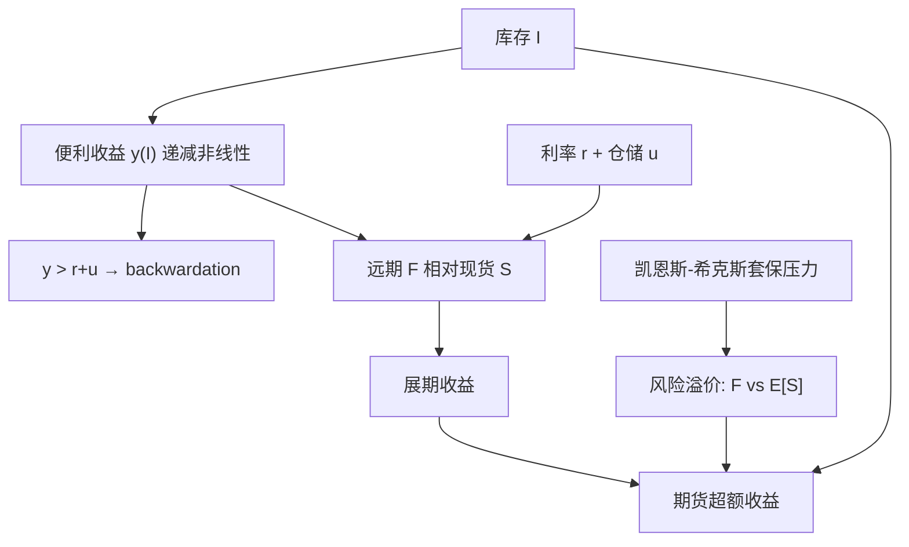

# 商品便利收益

持有库存不像持有国债那样只有利息与仓储账单；在供给可能中断时，现货在手本身值一个便利，这个便利把远期曲线往下拉。

<footer>—— Kaldor, Speculation and Economic Stability, Review of Economic Studies, 1939；凯恩斯正常 backwardation 见 A Treatise on Money, 1930；希克斯见 Value and Capital, 1939</footer>

[上一课](/quant/fx-triangle)写明交叉必须等于媒介路径乘积；远期三角与 CIP 是同一一致性的到期版本。外汇三角不解释商品远期相对现货的升贴水。仓储理论在利息与存储成本之外，加上一项便利收益：持有实物获得连续生产、避免停工的期权式好处，空头期货没有。缺口是把 $y$ 留在现货对远期的仓储恒等式里，把凯恩斯—希克斯留在风险溢价里，不要混成一句「商品该升水」。本课写这条识别。Gorton、Hayashi 与 Rouwenhorst（2013）更支持仓储作为一阶机制。

## 问题

在可储存商品上，无套利的粗略形式是

$$
F(t,T)=S_t\mathrm{e}^{(r+u-y)(T-t)},
$$

其中 $u$ 是仓储与保险等持有成本，$y$ 是便利收益。$y$ 高到超过 $r+u$ 时，$F\lt S$，现货升水、曲线 backwardation。若强迫 $y=0$，高库存时的 contango 还勉强说得通，低库存时的深度 backwardation 只能被写成「负仓储」，那是会计失败。问题是识别 $y$：它不能直接报价，只能从曲线、库存与现货可获得性里反演。金属租赁率、油品的期限结构、农产品的近月挤仓，都是 $y$ 的不同面具。

第二层是与风险溢价分工。即使 $y=0$，期货仍可以因套保压力而低于 $\mathbb{E}[S_T]$。交易员看到 backwardation 时，分不清是便利收益（库存紧）还是凯恩斯溢价（套保压力）。二者交易含义不同：前者应用库存验证，后者应用持仓验证。Gorton 等人发现库存与基差预测收益，持仓不额外预测——这把一阶故事推向仓储，而不是推向净套保。

### 便利收益不是股利

股票远期里的 $q$ 是可观测或可复制的股利与借券。便利收益没有对应的现金支票：它是实物持有者的影子价格，随停工概率与库存凸性而变。把它估成常数 $y$，等于假设紧张程度不变。Routledge、Seppi 与 Spatt（2000）在均衡里让便利收益内生于仓储决策，曲线形状随库存状态切换。实现上应把 $y$ 写成状态函数，而不是校准一个永久数字去给所有到期定价。

不可储存或储存极贵的商品（电、某些天气）便利收益的语言会崩：现货可以爆炸而远期仍平滑。那不是 $y$ 为负无穷的诗意说法，而是现货与远期不再由仓储方程连接。应改用高峰负荷与实时市场模型。

## 方法

从两条到期的远期反演净便利。忽略便利的随机性时，

$$
y-u=r-\frac{1}{T_2-T_1}\ln\frac{F(t,T_2)}{F(t,T_1)},
$$

近月相对更贵则净 $y$ 更高。Fama 与 French（1987, 1988）用基差检验仓储理论：库存低、景气周期时，金属的基差与波动升高，远期对现货的预测力变强。Gorton、Hayashi 与 Rouwenhorst（2013）直接把库存水平与便利收益、超额收益放在一起：便利收益是库存的递减**非线性**函数，低库存端特别陡。操作上，用库存分位或仓单去估计 $y(I)$，再比较市场反演的 $y$ 是否更陡——更陡意味着曲线对紧张定价过高，可能是挤仓或季节，见 [季节性展期](/quant/seasonal-roll)。

期权与波动：Samuelson 效应是近月波动高于远月，在库存紧、 $y$ 高时更强。Pindyck（2001）把现货与远期的联合动态写成便利收益与库存的系统。校准短端期权却用常数 $y$ 的远期，会在紧张期系统性错配对冲。

### 租赁率与回购特殊

贵金属市场报租赁率，近似 $y-u$ 的可交易版本：借出黄金收租赁费，类似便利的变现。原油与农产品没有同样干净的租赁，只能从曲线读。回购特殊（special repo）在国债里是便利收益的近亲：最便宜可交割与最流动性券有持有价值。商品仓单、交割地点升贴水扮演同一角色。反演 $y$ 时要扣掉品质与地点，否则会把休斯顿相对库欣的管道约束写成全球原油的便利收益。

## 机制

仓储机制：库存是缓冲。库存高时，额外一单位现货几乎不降低停工概率，$y$ 接近零，曲线反映 $r+u$，多头展期亏损。库存低时，缓冲期权处于实值，$y$ 急剧上升，现货与近月被需求方抢购，远月仍含有补库预期，于是 backwardation。Deaton 与 Laroque（1992, 1996）证明，竞争性仓储加上不能卖空库存，会产生价格的偏态、集群波动与「在库存为零附近才高度相关」的非线性——这正是 $y(I)$ 弯曲的微观基础。

凯恩斯—希克斯机制：生产商要锁定未来销售，净做空远期，投机者要求补偿，于是 $F\lt \mathbb{E}[S_T]$，即使仓储恒等式里 $y$ 不大。消费商套保（航空公司买油）可以把符号反过来。净效应是套保压力，应用持仓与商业净空头去测。Gorton、Hayashi 与 Rouwenhorst（2013）在广泛样本里拒绝「持仓预测溢价」；Fama 与 French 更早也发现仓储证据强于纯粹的正常 backwardation。合理的综合是：便利收益决定**曲线形状**（现货对远期），风险溢价决定**期货超额收益**里未被基差解释的部分。把二者都叫做 $y$，后续归因会乱。

正常 backwardation 说的是 $F$ 对 $\mathbb{E}[S]$，便利收益说的是 $F$ 对 $S$。一个是期望，一个是当期现货。只有在风险中性且 $y$ 已纳入漂移时，二者才在同一公式里见面。口头上「有便利所以有风险溢价」需要额外假设。

### 与展期收益的接口

多头展期收益的符号大致跟着 $F_{\mathrm{near}}-F_{\mathrm{deferred}}$，因而跟着 $y-r-u$。高便利、低库存的品种贡献正的展期，这是 Gorton 与 Rouwenhorst（2006）资产类别收益里「不是现货一路涨」的那一块，细节见 [商品展期 alpha](/quant/commodity-roll-alpha)。便利收益是微观定价核；展期 alpha 是把核在横截面上做成多空组合。

## 边界与工程取舍

$y$ 的反演对短端最敏感，交割与挤仓会让近月脱离仓储方程。远月 $y$ 被平滑，不能用来推断当前库存。指数投资改变谁在持有远期、不直接改变谁在持有库存，但可以通过滚仓拥挤改变近月 $F$，从而改变反演的 $y$——那是金融需求冲击，不是突然多出来的停工期权。Litzenberger 与 Rabinowitz（1995）讨论石油的生产期权：油在地下是另一种「库存」，便利与开采期权纠缠，简单的地上库存函数会低估石油曲线的复杂性。

不要用股票股利模型去给商品远期做离散股利调整。$y$ 连续、随机、且与 $S$ 负相关（现货跳涨时常是 $y$ 跳涨）。常数便利的 Black 公式只适合作业，不适合紧张期的风险管理。

电、运费、某些鲜活商品：仓储方程不是稍差，而是不适用。强行估一个 $y$ 再讲凯恩斯故事，会把现货尖峰全部解释成「便利无穷」。应把这些品种从便利收益横截面里剔除，或单独建模。

## 小结

- 便利收益是持有实物相对持有期货的影子价值，写入 $F=S\mathrm{e}^{(r+u-y)T}$；它由库存紧张驱动，不是股利。
- Kaldor（1939）、Working（1949）、Brennan（1958）把它建成仓储理论；凯恩斯（1930）与希克斯（1939）说的是另一件事：风险溢价。
- 实证上一阶故事是库存—$y$—基差（Fama–French；Gorton–Hayashi–Rouwenhorst），持仓预测力弱。
- $y$ 必须是状态依赖的；常数便利无法同时解释平静期的 contango 与紧张期的近月挤仓。
- 不可储存商品不要硬套该方程。
- 出处：Keynes, *A Treatise on Money*, 1930；Hicks, *Value and Capital*, 1939；Kaldor, *Review of Economic Studies*, 1939；Working, *AER*, 1949；Brennan, *AER*, 1958；Fama and French, *Journal of Business*, 1987 与 *Journal of Finance*, 1988；Gorton, Hayashi and Rouwenhorst, *Review of Finance*, 2013。
