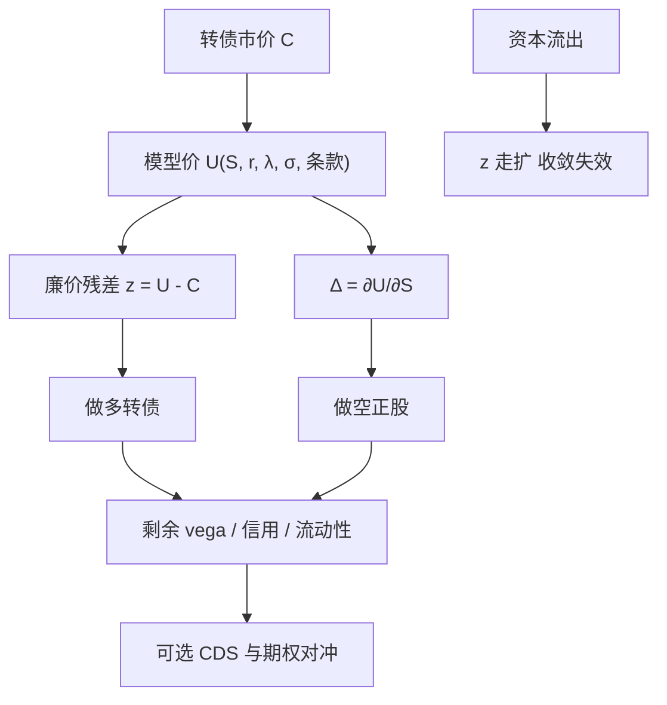

# 可转债套利

若可转债相对其复制组合——delta 份正股、信用暴露与利率——系统性便宜，买入转债并卖出对冲腿，赚的是廉价凸性收敛；当资本同时撤离时，便宜可以变得更便宜，对冲残差会像信用与波动一样跳。

<footer>—— 可转债套利的资本与流动性见 Mitchell, Pedersen and Pulvino, Slow Moving Capital, American Economic Review, 2007</footer>

[可转债与信用混合](/quant/convertible-credit) 写定价核：转股、赎回、违约要在同一套强度或结构模型里。[转债与正股联立](/quant/cb-equity-link) 写交易所约束下的瞬时弹性。本篇写**相对价值策略**：识别模型价高于市价的券，做多转债、按模型 delta 做空正股，残差暴露在隐含波动、信用与流动性上，再决定哪些用 CDS 或期权对冲、哪些当作要收的风险溢价。Agarwal、Fung 等人描述对冲基金如何把转债当廉价权证加债底；Mitchell、Pedersen 与 Pulvino（2007）用 2005 年转债套利去杠杆说明：慢移动的资本会让「便宜」持续并在赎回时放大。它与股票 [OU 配对](/quant/ou-spread) 的差别是：锚来自条款与无套利带，不是历史协整；与[并购套利](/quant/merger-arbitrage) 的差别是：没有交割日把价差收成零，收敛靠其他资本来买凸性。

## 问题

转债市价 $C$ 与模型价 $U(S,r,\lambda,\sigma;\text{条款})$ 之差 $z=U-C$（或溢价率相对理论溢价）。若 $z>0$ 且可对冲，$z$ 的来源可能是：隐含波动低于权证/期权市场、信用利差过宽、需求不足（一级发行后的供给冲击）、或模型错了（赎回通知期、下修、稀释）。策略做多便宜券、空 $\Delta=\partial U/\partial S$ 份正股，使一阶股票风险近零，留下 $z$ 的收敛以及对 $\sigma,\lambda,r$ 的二阶暴露。问题是：哪些残差有风险补偿，哪些是误设；以及 delta 对冲在涨跌停、停牌与做空约束下不可连续时，$z$ 还是不是同一个对象。

把转债套利写成「稳赚的转换套利」只在极短的、可同时成交的平价附近成立，且受交割与融券约束。大多数账户赚的是波动与信用的风险溢价减杠杆成本，不是瞬时无风险。2005 年与 2008 年的教训是：杠杆同质时，赎回与融资冲击让 $z$ 的均值回复失效，残差的「OU」半衰期可以突然变成断裂。

### 希腊值残差：先拆再决定对冲

股票 delta 是第一层，必须用模型对 $S$ 的导数，并随 $S$ 与条款重算，不能用历史回归 $\beta$ 替代——回归把信用和波动混进斜率，与 [Kalman 对冲](/quant/kalman-hedge) 的统计 $\beta$ 不是同一物体。Vega：转债隐含波动对上市期权，若可借期权对冲，残差更接近信用加流动性；若不对冲 vega，策略是做多廉价波动。Credit：深度虚值转债像高收益债，应用 CDS 或同类信用债对冲，否则「便宜」只是发行人利差。利率对高 delta 券是二阶，对债底主导的券不是。拆不开就不要把剩余 $z$ 叫做 alpha。

A 股转债当日回转、正股 T+1，空头与多头的可逆性不对称，见联立一文。把美股可转债套利的连续 delta 规则原样搬过来，盘中溢价会把无法成交的一边写成信号。

## 方法

**信号。** 用强度模型（TF 或 AFV 类）校准到 CDS 与股票波动，得到 $U$，再对流动性、规模、评级做截面标准化的廉价分数。不要在全样本上估一个「平均便宜」再当阈值：一级发行后的系统性折价是供给体制，应用 [Bai–Perron](/quant/bai-perron) 或制度日历切开，或把发行后时间当作协变量。收敛交易的开平更接近带成本的均值回复，但 $z$ 的扩散系数随杠杆与基金赎回变，常参数 [OU 最优停时](/quant/ou-optimal-stopping) 只在资本稳定的子样本有意义。

**对冲执行。** delta 用可成交的 $S$，停牌时停止按模型 $\Delta$ 调仓，把缺口记为跳风险。强赎通知期内有效到期缩短，$\Delta$ 迅速靠向转股比例，必须按公告重定价，否则空头股票不足或过多。下修预期会抬高期权价值、压低即时 delta 叙事，模型若不含下修期权，会把条款价值当成便宜。

**风险预算。** 报告三张暴露：股票（对冲后残差 delta）、信用（CS01）、波动（vega）。压力情景用：正股跳空而转债涨跌停不同步、信用利差跳、隐含波动上升同时股票下跌（困境凸性方向，但若你是多券空股，路径依赖仍能亏在执行）。2005 型去杠杆：假设同策略资本赎回 20%，折价扩大到历史分位，强制减仓的冲击。Mitchell–Pedersen–Pulvino 的要点是资本慢，价格可以离开模型很久；时间止损与融资止损优先于「模型说还会收敛」。

### 拥挤、发行供给与可借券

转债套利的拥挤度可用：对冲基金持仓占流通转债的比例、融券费率、一级市场发行后的折价持续时间。供给冲击（集中发行）让 $z$ 变宽，这是机会也是流动性吸收；若所有账户用相近 delta，正股空头同质，正股上涨时回补拥挤。可借券失败会把「对冲后」变成裸多信用加股票。策略文档应把融券当作硬约束，而不是事后残差。

与股票配对的门限类似：买卖价差与冲击构成 $z$ 的无套利带，带内交易只付换手。转债还有条款日历（转股期起算、赎回计数）使带的宽度随时间变。用全样本 $\sigma(z)$ 的 2 倍开仓，会在发行后折价最大的几天过度交易尚未被资本吸收的供给。

## 机制

定价机制：同一发行人的股权凸性在转债里若比权证/期权便宜，资本应买入并复制对冲，推高 $C$。摩擦机制：转债投资者群体与股票/期权投资者不完全重叠，一级配置、评级约束与基金杠杆使资本慢。慢资本下，$z$ 可以有均值回复外观，但回复速度由资金流入决定，不是由 $\kappa$ 从价格历史估出来的结构参数。一旦资金流出，回复符号可以反转——这是协整破裂在转债账本上的对应：不是 $\beta$ 换了，而是谁是边际买家换了。

对冲机制：连续 delta 在理论上对冲扩散，对冲不了赎回决策、下修表决与违约跳。残差在困境区因 $\lambda(S)$ 凸性而再获得 delta，必须提高对冲频率或加信用对冲，否则「中性」只在平静区成立。

把转债套利的历史夏普当成可重复 alpha，忽略了 2005–2008 的杠杆体制。样本若从高杠杆年代切到低杠杆年代，均值 $z$ 与 $\sigma(z)$ 都变，应当作结构断点，而不是更高的 $\kappa$。

### 与打新、强赎的边界

[打新与赎回](/quant/cb-call-put) 是条款与发行规则：中签期望、强赎通知期。套利账户可以参与一级，但一级折价与二级 $z$ 不是同一信号：一级还含中签率、缴款与首日涨跌停。强赎临近时凸性消失，策略应降 vega、把仓位当股票替换，而不是继续按「便宜期权」加仓。把强赎公告当 alpha 事件去赌发行人是否行使，是条款博弈，应与相对价值账本分开记账。

## 边界与工程取舍

不要用未校准信用的 BS 权证价减债底当 $U$，困境区会系统性算错便宜。不要在正股涨跌停时按理论 $\Delta$ 市价对冲。不要把 CDS 缺席的发行人当成「信用免费」——那是不可对冲的残差，仓位上限应更严。跨境转债还含外汇与不同步上市，HY 与 Epps 会出现在对冲腿上，但主导仍是条款与资本。

回测必须含融券费、转债买卖价差、调仓门槛（否则日度按理论 $\Delta$ 再平衡会耗尽 vega 利润）。用全样本平滑的「当时模型价」含未来校准，应只用到 $t$ 的曲线与波动面。

出处分工：定价核看 Ingersoll、Brennan–Schwartz、Tsiveriotis–Fernandes、Ayache–Forsyth–Vetzal；策略与资本看 Mitchell–Pedersen–Pulvino 与对冲基金绩效文献。本篇只承担后者在交易账本上的含义。

## 小结

- 可转债套利是做多相对模型便宜的转债、按模型 delta 做空正股，赚凸性与信用残差的风险补偿，不是瞬时转换无风险。
- 残差必须拆成股票、波动、信用、流动性；对冲不了的部分要当风险预算，不能都叫 alpha。
- Mitchell–Pedersen–Pulvino（2007）说明资本慢：便宜可更便宜，杠杆同质时出现断裂式走扩，常参数 OU 阈值失效。
- A 股 T+1、涨跌停与回转规则改变可执行 delta，必须与定价核分开约束。
- 一级打新、强赎博弈与二级相对价值应分账；强赎后凸性消失，仓位变成股票替换。
- 出处：Mitchell, Pedersen and Pulvino, *AER*, 2007；对冲基金转债策略见 Agarwal, Fung, Goetzmann, Hsieh 等；定价核见[可转债与信用混合](/quant/convertible-credit)。
