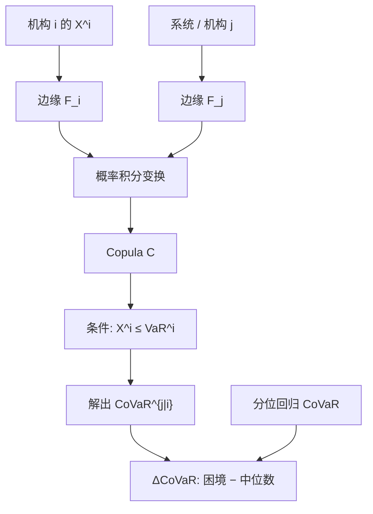

# Copula-CoVaR

系统风险不是机构自己的 VaR，而是它已经处在困境时，系统（或其他机构）的条件分位数还要再坏多少；把这条条件分位数用 Copula 从边缘里拆出来，才能对尾依赖单独收费。

<footer>—— Adrian and Brunnermeier, CoVaR, American Economic Review, 2016；条件事件的 Copula 写法见 Girardi and Ergün, Journal of Banking &amp; Finance, 2013</footer>

Adrian 与 Brunnermeier 把条件风险价值（CoVaR）定义成：给定机构 $i$ 处于困境，系统 $j$ 的 VaR。$\Delta\mathrm{CoVaR}$ 再减去 $i$ 处于中位数时系统的 CoVaR，度量的是**增量系统贡献**，不是 $i$ 自己的尾巴。原文用分位回归，条件事件取 $X^i=\mathrm{VaR}^i$——在连续分布上是零测集，估计上依赖线性分位。Girardi 与 Ergün 把条件改成 $X^i\le\mathrm{VaR}^i$，并证明可用 Copula 从边缘分位函数解出 CoVaR。本篇写这一条估计路径，与 [Copula VaR](/quant/copula-var) 的分工是：后者是**自己组合**损失的无条件（或市场因子条件）分位数；前者是**别人坏了之后自己（或系统）**的条件分位数。不要把 CoVaR 写成「系统性的 ES」。

## 问题

单名 VaR 回答「这家机构明天的损失分位数」。宏观审慎还要回答：它的困境会不会把系统分位数一起拖走。边际期望损失（MES）、SRISK 从资本短缺入手；CoVaR 从条件分位数入手。设 $X^j$ 为系统或机构 $j$ 的损失（Adrian–Brunnermeier 原文用收益，符号取负即可），$C(X^i)$ 为机构 $i$ 的困境事件。

$$
\mathrm{P}\bigl(X^j\le\mathrm{CoVaR}_q^{j\mid C(X^i)}\bigm| C(X^i)\bigr)=q.
$$

$\Delta\mathrm{CoVaR}_q^{j\mid i}$ 是困境条件与中位数条件之差。问题是 $C$ 如何取、联合分布如何估。分位回归假定 $X^j$ 对 $X^i$ 的条件分位是线性的，尾依赖若来自 Copula 角落而不是线性斜率，会估错增量。高斯联合下 CoVaR 几乎被 $\rho$ 决定，又回到「相关升高」的老故事，见[相关性崩溃](/quant/correlation-breakdown)。

### 等号条件与小于等于条件

Adrian–Brunnermeier 取 $X^i=\mathrm{VaR}_q^i$。连续密度下这是一条线，分位回归用整段样本的 $q$ 分位斜率去外推到该线。Girardi–Ergün 取 $X^i\le\mathrm{VaR}_q^i$，事件有正概率，CoVaR 是条件分布的 $q$ 分位，且与一致性风险度量的条件化更合拍。两种数字不可直接比较。监管或内部若写 CoVaR，必须声明条件事件；把分位回归的 $\Delta\mathrm{CoVaR}$ 和 Copula 的 $\Delta\mathrm{CoVaR}$ 排在一张表上，差的是定义，未必是系统贡献变了。

CoVaR 对 $j$ 不是连贯风险度量的条件版本：条件 VaR 仍可以不次可加。若要条件尾巴的连贯对象，应报条件 ES（CoES）。Adrian–Brunnermeier 选 VaR 是为了与当时的监管语言对齐，不是因为分位数在公理上更优。

## 方法

**Copula 求解。** 边缘 $F_i,F_j$ 用 GARCH 加厚尾新息或 EVT。Copula $C$ 在概率积分变换后的伪观测上估计。Girardi–Ergün 的 $\le$ 条件给出

$$
\frac{C\bigl(F_j(\mathrm{CoVaR}),\,F_i(\mathrm{VaR}_q^i)\bigr)}{q}=q_j,
$$

其中 $q_j$ 是系统侧要求的条件置信（常与 $q$ 相同）。已知 $C$ 与边缘，对 CoVaR 做一维根搜索即可。$t$ Copula 或 Clayton 会比高斯给出更大的 $|\Delta\mathrm{CoVaR}|$，这正是尾依赖的价格。时变 Copula（Patton）让 $\Delta\mathrm{CoVaR}$ 随状态走，避免用全样本一个 $\rho$ 代表危机。

**分位回归对照。** 原文把系统收益对机构收益与状态变量做 $q$ 分位回归，再用机构的 VaR 代入。优点是状态变量（VIX、利差、TED）可直接进方程，计算轻。缺点是线性、对称地处理涨跌，除非把样本拆成下行。报告应同时给：分位回归 $\Delta\mathrm{CoVaR}$、高斯 Copula、厚尾 Copula。三者发散时先查尾依赖，而不是先调 $q$。

**方向。** $\mathrm{CoVaR}^{j\mid i}$ 不是 $\mathrm{CoVaR}^{i\mid j}$。系统对机构的暴露与机构对系统的暴露可以不对称。宏观审慎通常要「机构 $i$ 困境 → 系统」，微观风控也可能要「系统困境 → 机构 $i$」作为反向压力的输入。网络里对所有对 $(i,j)$ 估一遍，须做多重检验，否则「贡献最大的十家」只是估计误差的排序。

### 与 Copula VaR、MES 如何一起用

Copula VaR 抽的是因子联合，给自己账簿的资本。Copula-CoVaR 抽的是机构与系统的联合，给外部性定价。MES 是系统已处在其 VaR 时机构收益的条件期望，方向与 CoVaR 常相反（Brownlees–Engle 的 SRISK 一路）。同一家机构可以 MES 高、$\Delta\mathrm{CoVaR}$ 低：它自己在系统危机里亏，但不把系统拖走。两者都要，不能互相替代。

边缘必须先条件化。无条件 Copula 会把波动聚类读成尾依赖，危机里所有机构 $\Delta\mathrm{CoVaR}$ 一起升，分辨不出谁是放大器。先对各序列做 GARCH，在标准化残差的 Copula 上算 CoVaR，再把条件波动映回收益尺度。

## 机制

$\Delta\mathrm{CoVaR}$ 大，来自两件事相乘：机构与系统的尾依赖 $\lambda$，以及系统边缘自己的厚度。高斯 Copula 压住 $\lambda$，只留下线性相关；危机里观测到的「一起爆」被低估。Clayton 把质量堆在双亏角落，即使 Kendall $\tau$ 中等，$\Delta\mathrm{CoVaR}$ 也可以很大。这与组合 Copula VaR 是同一角落，对象从「我的 $L$」换成「他坏时我的 $X^j$」。

分位回归的机制是斜率：机构多亏一单位，系统 $q$ 分位多移多少。它捕捉的是平均线性，不是角落质量。状态变量若已包含 VIX，斜率里的「传染」会被宏观状态吸走一部分——这是特征：Adrian–Brunnermeier 想把机构贡献从共同状态里分开。Copula 路径若不用状态变量，会把共同因子算进 $\Delta\mathrm{CoVaR}$，高估可归因于该机构的外部性。工程折中是：边缘或 Copula 参数随宏观状态变，机构特异残差的 Copula 才进 $\Delta\mathrm{CoVaR}$。

用权益收益当 $X^i$ 只覆盖上市机构，且杠杆在净值里已经折叠。银行账面杠杆升、股价还没跌时，权益 CoVaR 滞后。Adrian–Brunnermeier 讨论过用 CDS 或资产收益；数据更脏，但更接近账面困境。

### 时间序列上的反向因果

$\Delta\mathrm{CoVaR}$ 是同期条件分位，不是「$i$ 导致 $j$」。共同因子可以同时打到两家。要谈因果，需要工具变量、滞后结构或外生冲击，CoVaR 本身不提供。监管用途是排序与监测：谁在压力状态下与系统绑得更紧。把排序写成「系统重要性税基」之前，应做样本外稳定与定义敏感性（等号 vs 小于、高斯 vs $t$、权益 vs CDS）。

## 边界与工程取舍

高维机构网络上，两两 Copula 不保证联合相容；vine 或因子 Copula 才能生成一致的系统变量。系统若定义为等权指数，大行已经被算进 $j$，再对大行算 $\mathrm{CoVaR}^{j\mid i}$ 有机械相关，应使用 leave-one-out 系统。上市样本存活偏差：没上市或已倒闭的机构不在面板里，系统贡献被低估。

不要把 CoVaR 当定价核：它没有唯一对应的资本收费公式。不要用平静期相关标定高斯 Copula 再宣称做了系统压力。不要在未标准化的收益上估 Copula。计算上每日全样本重估 Copula 参数会抖，滚动窗口或动态 Copula 需预先冻结，避免把参数选择做成另一种 $\Delta\mathrm{CoVaR}$ 择时。

FRTB 与压力 VaR 管的是自己账簿在压力测度下的 ES；CoVaR 管的是外部性。两者都叫「系统」，账本不同。内部模型资本加不进 $\Delta\mathrm{CoVaR}$，除非另有宏观审慎附加。

## 小结

- Adrian–Brunnermeier 的 CoVaR 是条件分位数，$\Delta\mathrm{CoVaR}$ 度量相对中位数状态的增量系统贡献。
- Girardi–Ergün 把条件写成 $X^i\le\mathrm{VaR}^i$，用 Copula 从边缘解出 CoVaR，从而对尾依赖单独建模。
- 与 Copula VaR（自己的组合分位）、MES/SRISK（资本短缺）对象不同，不能互相替代。
- 等号条件与小于等于、高斯与厚尾 Copula、是否剥离共同状态，都会改排序；须冻结定义。
- 出处：Adrian and Brunnermeier, *American Economic Review*, 2016；Girardi and Ergün, *Journal of Banking & Finance*, 2013；Patton 条件 Copula；Brownlees and Engle, SRISK。
