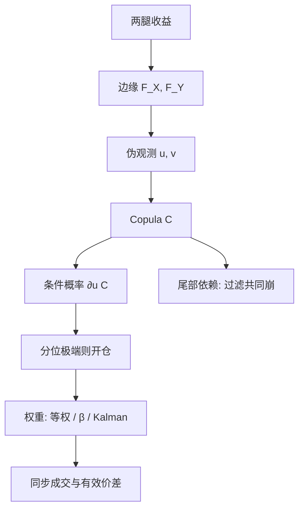

# Copula 配对

    
把边缘分布与依赖结构分开：两腿可以有各自的肥尾与偏度，配对信号来自条件概率——给定一条腿已经动了，另一条还不该那么偏，而不是来自价格路径的欧氏距离。

<footer>—— Sklar 定理见 Sklar, 1959；配对应用见 Liew & Wu, Pairs Trading: A Copula Approach, Journal of Derivatives & Hedge Funds, 2013 一类文献；综述见 Krauss, Statistical Arbitrage Pairs Trading Strategies: Review and Outlook, 2017</footer>

[上一课](/quant/avellaneda-lee)用 PCA 或 ETF 定义残差，用 OU 的均衡波动标准化成分数再做多空；交易对象是正交补，持有期以日计，$s$-score 在 $\kappa\to 0$ 时自动关机。缺口是依赖的语言。残差与 SSD 默认「走在一起」的 $L^2$ 邻近，会漏掉下尾强依赖、上尾弱依赖——而这正是配对在危机里一起裂开的来源之一。本课用 Copula 把边缘与依赖分开，用条件分位开仓。不重推 s-score。后课 Kalman 价差滤波默认已经读完：条件概率不等于误差修正。

## 问题

两只股票的收益可以边缘肥尾、非线性依赖：平时几乎独立，崩盘时一起跳。Pearson 相关只抓住线性；SSD 只抓住形成期价格曲线贴没贴。两者都会漏掉「下尾强依赖、上尾弱依赖」这种结构——而这正是配对在危机里一起裂开、平时看似回归的来源之一。Copula 把联合分布写成

$$
F(x,y)=C\bigl(F_X(x),F_Y(y)\bigr),
$$

$C$ 在 $[0,1]^2$ 上。交易者要的不是估计 $C$ 本身，而是条件对象：给定 $U=F_X(X)$ 已经很大，$V=F_Y(Y)$ 的条件分布是否仍支持「$Y$ 应该跟上来」。若条件期望显示 $Y$ 太低，则做多 $Y$、做空 $X$，美元中性或 beta 中性。问题是这个条件信号是否比价差 Z-score 更干净，以及估计误差会不会把尾部依赖变成虚假的开仓理由。

选对与交易是两步。有人仍用 SSD 或协整筛对，只在交易期用 Copula 发信号；有人用 Kendall $\tau$ 或尾部相关系数选对。前者更接近 GGR 的可复制日历，后者把多重检验从距离换到依赖测度。无论哪条，Copula 都没有提供制度收敛，没有申赎、没有转换比率。

### 条件概率不是均衡残差

协整给出一条 $I(0)$ 线性组合，误差修正有方向。Copula 给出的是同期（或短滞后）的条件分位，不自动蕴含「价差是平稳过程」。两腿可以在 Copula 意义下强依赖却不协整：共同跳跃、共同因子，线性组合仍是 $I(1)$。此时条件信号会反复出现，看起来像高换手的均值回归，其实是在共同趋势上做短持有的相对动量或反转。必须声明：你交易的是条件分位的偏离，还是一条已被检验的协整残差。把 Copula $p$ 值写成「更高级的协整」，是范畴错误。

高斯 Copula 的尾部依赖为零。用它做配对，极端日的条件概率接近独立，策略会在最需要识别「一起裂开」的时候把两腿当成可对冲的。学生 $t$ Copula 有对称尾部依赖；Clayton 强调下尾，Gumbel 强调上尾。族的选择是经济假设，不是软件默认。

## 方法

**边缘。** 对形成期收益估 $\hat F_X,\hat F_Y$，可用经验分布（避免边缘误设）或 $t$ / 偏 $t$。经验边缘在样本外要处理新极值：新收益超出形成期范围时，$U$ 被压到 $1-1/(T+1)$，条件信号被截断。滚动重估边缘会让同一绝对收益的 $U$ 天天变，换手上升。

**Copula。** 在伪观测 $\hat u_t=\hat F_X(x_t)$、$\hat v_t=\hat F_Y(y_t)$ 上用极大似然或 IFM（先边缘后 Copula）估 $C$。交易信号常用

$$
\mathbb{P}(V\le v\mid U=u)= \partial_u C(u,v),
$$

当条件 CDF 显示 $v$ 处于极端（如 $<0.05$ 或 $>0.95$）则开仓。也有人用「误定价指数」：两条条件期望相对对角线的偏离。持有期通常远短于 GGR 的 6 个月，因为 Copula 描述的是收益依赖而非价格水平的长期关系。平仓用条件概率回到中性区，或时间止损。

**与对冲比的接口。** Copula 不输出 $\beta$。腿的权重仍要另给：等权、回归 beta、或 [Kalman 对冲比](/quant/kalman-hedge)。只把 Copula 当开仓开关、权重仍用 OLS，是常见的混合规格；必须写清，否则样本内「Copula 策略」混进了时变 beta 的贡献。

### 尾部、择时与多重配对

尾部依赖参数在日频、一年形成期上估得很噪。危机子样本会主导 Clayton 的 $\theta$，使随后正常期的下尾信号过敏感。稳健做法是把尾部参数的置信区间写进开仓：区间含「无尾部依赖」则不做极端条件单。多对同时用 Copula 扫描时，5% 条件分位的名义开仓率被极值驱动，需要截面上的额度限制，不能每对独立过线就满仓。

执行上，条件信号往往在一条腿已经大动之后出现，开仓时该腿流动性更差、价差更宽。这与距离法在「价差已偏离 $2\sigma$」时开仓是同一类逆向选择：信号时刻正是冲击时刻。成本要用有效价差，并考虑两腿同步，见 [成交后分析](/quant/tca)。

日频 Copula 忽略隔夜跳空的同期性。开盘时两腿的 $U,V$ 可能同时跳到尾部，条件概率显示「正常的共同跳跃」，不该开仓；若你用昨日边缘去标准化今开，会把隔夜共同跳读成可交易偏离。

## 机制

Copula 配对能赚钱的机制，与 GGR 可以重叠：暂时的差异化反应、库存、非同步。差别在于它试图**不对边缘的波动和偏度下注**——边缘被 $F_X,F_Y$ 吃掉，只交易依赖。若真实 alpha 来自「波动低的那条腿被错杀」，边缘标准化会把这笔 alpha 洗掉。若真实 alpha 来自「相关结构的暂时破裂」，Copula 比 SSD 更对症。实证上两者经常分不清：形成期距离近的对，Copula 也往往拟合得好，信号高度相关。此时 Copula 的增量来自开仓时点（条件分位 vs 价差 $\sigma$），而不是来自另一组完全不同的名单。

危机机制。下尾依赖强时，两边一起跌，条件概率不会发出「做多弱腿」的信号——这是 Clayton 相对高斯的优点：它承认一起崩。若你仍用价格差 $2\sigma$ 开仓，危机会变成最大的「偏离」，也是最大的亏损。Copula 在这里更像一个不交易过滤器，而不是一个更高夏普的开仓器。把它的价值写成「危机也能赚钱」通常是错的；更准确的是「少在共同尾部上当回归来做」。

### 与距离法、协整的谱系

SSD 选对 + 价差阈值：可复制，边缘与依赖绑在一起。协整 + OU：有误差修正，线性。Copula + 条件分位：非线性依赖，无自动的 $I(0)$。三者可以叠：用协整筛线性长期关系，用 Copula 做短期条件开仓。叠得越深，样本内越好看，越需要样本外与成本。Krauss 的综述把 Copula 列为距离与协整之后的第三族，并提醒文献里的盈利对设定极度敏感。不要用某一篇 Journal of Trading 的夏普去代表「Copula 配对」这一整族。

## 边界与工程取舍

参数 Copula 在 $p=2$ 时已经有族误设；三维以上要用 vine，估计与交易的距离更远，本篇不推荐把 vine 直接当成篮子开仓器——那是把高维依赖估计的误差当成 alpha。[篮子 PCA 残差](/quant/pca-residual-basket) 对多腿更诚实。不要在 Copula 参数上网格搜索交易期 PnL。不要用高频收益估 Copula 再在日频交易，微观结构噪声会假造尾部依赖。

A 股涨跌停把边缘截断，$U$ 在板上堆在 0 或 1，条件概率失真。停牌使一对伪观测缺失，应跳过该日而不是前向填充。卖空约束下条件信号的空头腿经常缺，策略变成单边，Copula 的「依赖中性」只存在于概率文件里。

与 GGR 的工程分工：要可复制的历史锚点与简单规则，用距离法；要处理不对称尾部、并接受更重的设定风险，才引入 Copula。引入之后，形成/交易日历、次日成交、强制平仓仍应单独声明，不能默认继承 RFS 2006 的扣费结果。

Sklar 定理保证分解存在，不保证你用的参数族等于真实 $C$。拟合优度通过只说明样本内没被拒绝，不是交易许可。尾部几个点决定配对在危机里的行为，而那几个点的估计最不稳。

## 小结

- Copula 配对把边缘与依赖分开，用条件分位开仓，补的是非线性、不对称尾部，不是一条新的协整定理。
- 条件概率不等于误差修正；强依赖可以与 $I(1)$ 价差共存，必须单独声明交易对象。
- 高斯 Copula 无尾部依赖，危机里会把共同跳当成可对冲；族的选择是经济假设。
- 与 SSD 名单高度重叠时，增量主要在开仓时点；样本内拟合优势不能借用 GGR 的表。
- 出处：Sklar, 1959；Liew and Wu, 2013；综述 Krauss, 2017；对照 [距离法配对](/quant/distance-pairs)。
