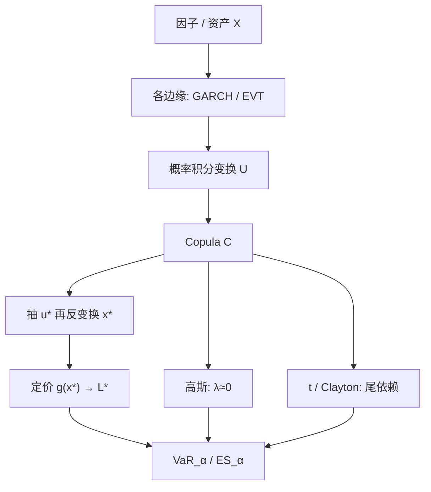

# Copula VaR

组合分位数的误差，多半不来自各资产自己的波动估错，而来自它们是否同时变坏；把边缘与 Copula 分开，才能让 VaR 对尾依赖单独收费。

<footer>—— Sklar 表示；金融风险中的应用见 Embrechts, McNeil and Straumann；条件 Copula 见 Patton, 2006</footer>

[参数 VaR](/quant/var-methods) 用协方差把依赖收成 $\Sigma$，隐含高斯 Copula：相关可以很高，极端仍渐近独立。组合在崩溃日一起爆，正是高斯假设漏掉的那一段。[Copula](/quant/copula) 文写相关结构本身；本篇写它如何变成组合损失的分位数与 [ES](/quant/expected-shortfall)。标准路径是：各边缘用 GARCH 或 EVT 固定，Copula 抽联合均匀变量，反变换成因子情景，再定价、取分位数。Rosenberg 与 Schuermann 把这一「风险加总」写成边缘–Copula–组合的三层。它补的是联合尾巴，不是单名波动。

## 问题

设组合损失 $L=g(X_1,\ldots,X_d)$，$X_i$ 为因子或资产收益。边缘 VaR 已知并不能给出 $L$ 的 VaR：需要 $X$ 的联合分布。方差–协方差法等于：边缘正态（或先映射成正态）、Copula 高斯、 $g$ 线性。三条里任意一条坏掉，数字就偏。期权使 $g$ 非线性；信用与股票使边缘厚尾；熊市使下尾依赖 $\lambda_L>0$。Copula VaR 的问题是在 $g$ 与边缘可以各自校准的前提下，只把「如何连在一起」换成一个能表达尾依赖的 $C$，再对 $L$ 做模拟分位数。

高斯 Copula 的 $\lambda_L=0$（除非 $|\rho|=1$）是 2008 年前 CDO 与组合 VaR 共用的误设：中间相关看起来分散，分位数以外同爆。$t$ Copula 用自由度 $\nu$ 产生对称尾依赖；Clayton 偏下尾。选错族，Copula VaR 只是换了一种方式低估。问题不只是「用了 Copula」，而是哪一个 $C$、是否时变、高分位是否被识别。

### 加总顺序：先边缘还是先组合

两条合法顺序。自下而上：估各 $X_i$ 的边缘与 $C$，模拟 $X$，算 $L$。自上而下：直接对 $L$ 的经验或参数分布取分位数，放弃归因。Copula VaR 属于前者，为的是能改一档边缘或改 Copula 做诊断。若数据只是组合日 P&amp;L，没有因子，Copula 没有对象，应退回 [历史](/quant/var-methods) 或 [FHS](/quant/fhs-var)。不要对已经加总的 $L$ 再套一层高斯 Copula。

边缘若是无条件的、Copula 却用日频同期，波动聚类会冒充尾依赖。应先对各边缘做条件模型，在概率积分变换后的 $U_t$ 上估 $C$，与 Patton 的条件 Copula 同一纪律。

## 方法

**两步估计加蒙特卡洛。** 对每个因子拟合条件边缘 $\hat F_{i,t}$（AR–GARCH 加 $t$ 或偏 $t$ 新息，高分位可接 [EVT](/quant/evt) 的 GPD）。取 $\hat u_{it}=\hat F_{i,t}(x_{it})$。在 $\{\hat u_t\}$ 上用伪似然估 Copula 参数 $\hat\theta$。模拟：从 $C_{\hat\theta}$ 抽 $\mathbf{u}^\ast$，用今日边缘的分位数函数反变换 $x_i^\ast=\hat F_{i,t+1}^{-1}(u_i^\ast)$，对组合全定价得 $L^\ast$。$M$ 条路径的经验 $\alpha$ 分位数是 Copula VaR；尾部平均是 Copula ES。

**族的选择。** 线性账簿、只关心中心：高斯 Copula 加 DCC 的 $\Sigma_t$ 可能够用。需要崩溃同现：至少 $t$ Copula，并报告 $\nu$。信用组合、股票熊市：检查 Clayton / 生存 Gumbel 或 vine 在下尾的拟合。高维时椭圆族仍最省事；vine 把高维拆成二维，结构选择是另一层 [过拟合](/quant/backtest-overfitting)。用超出联合阈值的频率校准 $\lambda$，比只看 Kendall 的 $\tau$ 更接近 VaR 的对象。

**与 FHS 的杂交。** FHS 用历史残差向量当非参数 Copula。参数 Copula VaR 用光滑的 $C$ 外推「比样本更极端的同现」。样本短、维度高时参数外推有用，也更危险。对照报告：FHS VaR、高斯 Copula VaR、$t$ Copula VaR，三者发散时先查尾依赖，而不是先改 $\alpha$。

### 定价器与映射

$g$ 必须与 [VaR 方法](/quant/var-methods) 文同一纪律：线性映射漏凸性；全定价吃计算。Copula 抽的是因子，不是希腊字母。对期权，因子应含标的与隐含波动；若只抽现货、波动当常数，Vega 尾被丢掉。信用则是违约指示的 Copula（一因子高斯曾是监管 IRB 的近亲），与市场因子 Copula 不要混成一个 $\rho$。

## 机制

概率积分变换把各边缘的尺度剥掉，$C$ 只在单位立方上分配质量。组合损失的尾巴由两件事相乘：边缘自己的高分位，以及立方角落里的质量 $\lambda$。高斯 Copula 把角落质量压到 0，于是组合 VaR 接近「分散化后的波动分位数」。$t$ 或 Clayton 把质量堆回角落，分散化红利在高 $\alpha$ 上消失——这是特征：尾依赖高时本来就不该报分散化。ES 对此比 VaR 更敏感，因为条件期望吃掉整个角落；用高斯 Copula 算 ES，只是更完整地读错。

条件 Copula 让角落质量随信息变：昨日同跌，今日 $\lambda$ 可升高。静态 Copula 加 DCC 相关，只让椭圆变「更斜」，$\lambda$ 仍可由族决定。危机里若只看到 $\rho_t$ 升高，VaR 上升来自相关，不是来自尾形状；两者应分开归因，否则无法决定是加资本还是换 Copula。

监管加总有时用 copula 式的「风险因子相关矩阵」。那是敏感性法里的线性相关，不是对损失 $L$ 的 Sklar Copula。名称相似，对象不同：一个加总希腊字母，一个加总概率。

### 维数、稀疏与假同现

$d$ 很大时，联合极端事件在样本里几乎不出现，$\lambda$ 的识别靠模型而不靠数据。此时 Copula VaR 的模型风险主导。不同步成交、流动性枯竭会造成假的同期极端（一个先跌、另一个报价未更新）。日频以下更严重。先对齐采样与流动性过滤，再估 $C$。缺失值用「昨日收益为零」填，会人为增加独立；用条件均值填，会人为增加相关。缺失机制应写进模型卡。

## 边界与工程取舍

Copula VaR 贵：每条路径全定价，参数还含 Copula。日常限额可用 FHS 或 $t$ Copula 的快速线性版本；复杂产品、集中信用、跨资产账簿再上全定价 Copula。不要用历史相关标定高斯 Copula 再宣称「做了 Copula 压力」——压力要的是 $\lambda$ 情景，例如把 $\nu$ 降到很低或把 Clayton 参数推到样本外，并声明这是判断不是估计。

边缘估错，伪观测 $\hat u$ 不是均匀的，任何 $C$ 的 GoF 都会拒绝或偏倚。先通过边缘诊断。动态 Copula 参数过程容易与 DCC 抢同一块持续性，难以识别。Sklar 是表示定理：任何联合都「有一个 Copula」，包括那个让组合在 2008 年爆炸的高斯 Copula。写进限额的必须是族、时变与尾依赖是否被数据识别。

组合优化若最小化 Copula-ES，目标对 Copula 参数极度敏感，估计误差会变成权重抖动。先把 Copula 当风险诊断与资本，再决定是否当优化器；后者需要强收缩或约束，见 [风险预算](/quant/risk-budgeting)。

## 小结

- Copula VaR 把组合分位数拆成边缘、Copula 与定价函数三层，专门修正依赖误设。
- 高斯 Copula 没有尾依赖；$t$、Clayton 或 vine 才可能对崩溃同现收费。
- 应在条件边缘的概率积分变换上估 $C$，避免波动聚类冒充 $\lambda$。
- 与 FHS 对照：一个非参数历史联合，一个参数外推联合；发散是诊断。
- 出处：Sklar, 1959；Embrechts, McNeil and Straumann 对相关与 Copula 的风险警告；Patton, *International Economic Review*, 2006；Rosenberg and Schuermann 风险加总；McNeil, Frey, Embrechts, *Quantitative Risk Management*。
