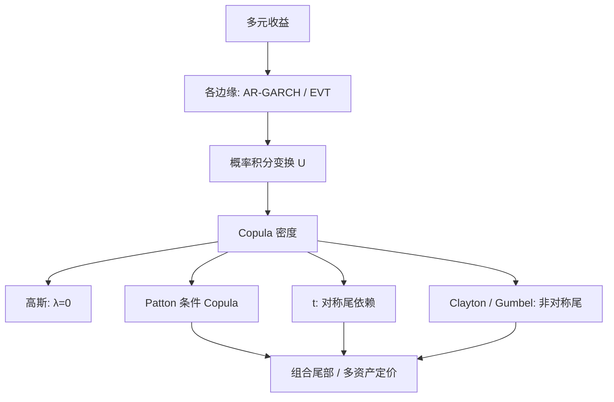

# Copula 相关结构

联合分布等于边缘各做概率积分变换之后，再由一个定义在单位立方上的 Copula 把依赖接回去；线性相关系数既不是依赖的定义，也不是尾部依赖的充分统计。

<footer>—— Sklar, Fonctions de répartition à n dimensions et leurs marges, 1959；金融时序中的条件 Copula 见 Patton, International Economic Review 2006</footer>

多资产的风险不来自各自的波动名单，而来自它们是否同时变坏。Pearson 相关把依赖收成一个数，却在边缘不是椭圆、或只关心尾巴时失效：相关可以很低，崩溃日仍然一起跌。Sklar 定理把联合分布拆成边缘与 Copula；边缘可以各自是 GARCH 或 [EVT](/quant/evt) 的 GPD，依赖交给 Copula。Patton 把这条拆分做成条件模型：每个时点的 Copula 可以随过去信息变，并且可以不对称——下跌时的下尾依赖强于上涨时的上尾。本篇写 Copula 作为相关结构的对象，以及它与相关矩阵、[DCC](/quant/dcc) 各管哪一段。

## 问题

对随机向量 $X=(X_1,\ldots,X_d)$，联合 CDF $F$ 与边缘 $F_i$ 之间，Sklar 保证存在 Copula $C:[0,1]^d\to[0,1]$ 使

$$
F(x_1,\ldots,x_d)=C\bigl(F_1(x_1),\ldots,F_d(x_d)\bigr).
$$

边缘连续时 $C$ 唯一，$C$ 就是 $(U_1,\ldots,U_d)=(F_1(X_1),\ldots,F_d(X_d))$ 的联合分布。这样一来，「各资产自己的分布」和「它们如何连在一起」可以分开估。问题是：金融关心的连接往往不是高斯 Copula 那种只有相关矩阵的椭圆依赖，而是熊市更黏、极端同向概率为正。

线性相关 $\rho$ 在边缘变换下会变，且要求方差有限。秩相关（Spearman、Kendall）是 Copula 的性质，对边缘单调变换不变。尾依赖系数 $\lambda_L=\lim_{q\to 0}C(q,q)/q$ 刻画「两边缘都低于极低分位」的条件概率极限。高斯 Copula 除非 $|\rho|=1$，否则 $\lambda_L=\lambda_U=0$：可以相关很强，极端仍渐近独立。这是用高斯 Copula 给 CDO 定价时最贵的误设之一。

### 非对称与时变

股权指数对在下跌时的经验尾依赖强于上涨，Patton 用条件 Copula 直接估这一点：令 $C_t$ 依赖一个时变参数，参数由滞后概率积分变换驱动，类似 ARMA 或 DCC 的思想，但对象是 Copula 参数而不是相关矩阵。对称的正态或 $t$ Copula 无法同时拟合上尾与下尾的差；$t$ 能产生对称的双向尾依赖，Clayton 偏下尾，Gumbel 偏上尾，Joe–Clayton 一类可以两尾分开参数化。

把收益「标准化」再算相关，仍然是椭圆世界的语言。概率积分变换之后，点落在单位方块里，散点在 $(0,0)$ 角落的密度才是下尾依赖。只报告 $\rho$ 或 DCC 的 $\rho_t$，等于把方块里的角落压成一个数。

## 方法

**两步估计。** 先对每个边缘建模型（常是 AR–GARCH，$t$ 或偏 $t$ 新息），取出概率积分变换 $\hat u_{it}=\hat F_i(x_{it}\mid \mathcal{F}_{t-1})$。再在 $\{\hat u_t\}$ 上用极大似然估 Copula 参数。Joe 的推断函数（IFM）给出这套两步的渐近；边缘估错会污染 Copula，但比同时估全部边缘加 Copula 稳定。Patton 的条件 Copula 把似然写成 $\sum_t \ln c_t(\hat u_t;\theta_t(\mathcal{F}_{t-1}))$，其中 $c_t$ 是 Copula 密度。

参数族要按尾部选型。椭圆族（高斯、$t$）由相关矩阵生成，高维相对容易，可用 [DCC](/quant/dcc) 提供时变相关再嵌进 $t$ Copula。阿基米德族（Clayton、Gumbel、Frank）参数少，适合二维或可交换的高维；非可交换要用 vine（pair-Copula 分解）把高维拆成一串二维 Copula，代价是结构选择。

### 与相关矩阵的分工

DCC、BEKK 估的是条件协方差，隐含高斯或椭圆新息。若新息确是椭圆，Copula 就是高斯或 $t$，DCC 已经把依赖说完。若新息有尾依赖或不对称，应：边缘仍用一元 GARCH 吸波动聚类，依赖改 Copula，而不是指望 DCC 的 $\rho_t$ 在崩溃日「自动」变成尾依赖——$\rho_t$ 升高只是相关变强，高斯 Copula 的 $\lambda$ 仍是 0。经验上两者常叠用：DCC 管动态相关的水平，Copula 管给定相关下的尾形状。

校准可用 Kendall 的 $\tau$ 与参数的闭式关系（阿基米德族），也可用伪似然。模型比较用 AIC、Vuong，或看超出联合阈值的频率是否被 $\lambda$ 说中。样本内拟合好的 Clayton，样本外体制一切换就错边。

## 机制

概率积分变换把每个边缘的尺度、偏度、波动聚类剥掉，剩下的 $U$ 在独立时均匀洒在立方体里；Copula 密度在对角、在角落的堆积，就是依赖。高斯 Copula 的密度沿对角隆起，但角落按高斯尾衰减，所以极端分位上条件概率趋于 0。$t$ Copula 多一个自由度，角落更厚，且对称。Clayton 在 $(0,0)$ 角落有奇性，下尾依赖为正，上尾为 0——适合「一起崩、不一定一起涨」。

条件 Copula 的机制是让这个形状随信息变：昨天两资产都大跌，今天的下尾参数可以升高。它与 DCC 的差别在于：DCC 更新的是二阶矩，Copula 更新的可以是尾参数。Patton 对汇率的实证是，美元对其他货币的依赖在贬值一侧更强，且该不对称随时间变，常相关模型抓不住。

秩变换对异常值比 Pearson 稳健，但不创造尾依赖。用 Spearman 相关替代 Pearson，只是换了边缘不变的刻度；若真实 Copula 是 Clayton，你仍需要一个能产生 $\lambda_L\gt 0$ 的模型，而不是一个更稳健的 $\rho$。

### 定价与风险里的同一对象

衍生品里，篮子、CDO、多资产障碍的价格对 Copula 的尾极度敏感：边缘可以由单名期权固定，剩余的溢价几乎全是依赖。风险里，组合 VaR 的加总误差同样来自 Copula 而不是边缘 VaR。两边用同一套语言：先固定边缘，再争 Copula。不要把「我们用了 Copula」当成已经处理了尾依赖——高斯 Copula 是否定句。

## 边界与工程取舍

边缘模型错，伪观测 $\hat u$ 不是均匀的，Copula 检验会拒绝一切。概率积分变换在小样本、参数估计后不是精确均匀，GoF 要用适合估计步的检验。高维时参数爆炸，vine 的树结构是另一层过拟合。动态 Copula 的参数过程可能把相关的均值回复与尾参数的均值回复混在一个方程里，难以识别。

不要在原始收益上拟合 Copula 却忽略波动聚类：无条件 Copula 会被 GARCH 效应撑厚。不要用历史相关去标定高斯 Copula 再去做压力测试——压力测试要的是 $\lambda$，不是 $\rho$。流动性与不同步成交会制造假的同期极端共现，尤其是日频以下；先对齐采样，再谈依赖。

静态 Copula 做配对交易，假定秩依赖稳定；体制切换时 Clayton 的 $\alpha$ 会漂。那是依赖层的结构断裂，与 [Engle–Granger](/quant/engle-granger) 残差在样本外失去平稳是同一类风险：不是再估一个边缘就能修好。

Sklar 是表示定理，不是估计方法。任何联合分布都「有一个 Copula」，包括那个让你在 2008 年亏钱的高斯 Copula。要写进模型的是哪一个参数族、是否时变、尾依赖是否被识别，而不是「用了 Copula」六个字。

## 小结

- Sklar 把联合分布拆成边缘与 Copula；连续边缘下 Copula 唯一，是依赖的完整对象。
- 线性相关既不不变也不描述尾依赖；高斯 Copula 在 $|\rho|\lt 1$ 时尾依赖为零。
- Patton 的条件 Copula 允许依赖时变且不对称，与只更新相关矩阵的 DCC 不是同一层。
- 两步法：先过滤边缘，再在伪观测上估 Copula；边缘错则 Copula 不可信。
- 高维用椭圆加 DCC，或 vine；选型必须看上尾下尾，而不是只看似然。
- 出处：Sklar, 1959；Patton, *International Economic Review*, 2006，及 Handbook of Financial Time Series 中的综述；相关陷阱见 Embrechts, McNeil, Straumann；教科书见 Nelsen 与 Joe。
