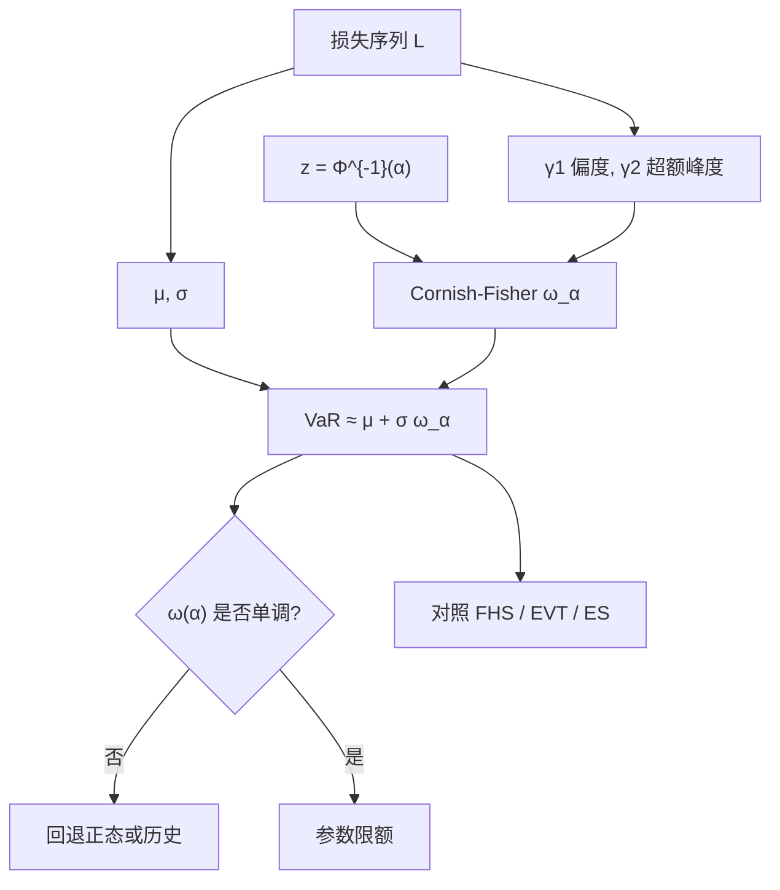

# Cornish-Fisher VaR

正态分位数只使用均值与方差；若损失还有偏度与超额峰度，可用 Cornish–Fisher 把标准正态分位数校正到更接近真实分位数的位置，从而在仍走参数法的前提下给尾巴一阶修正。

<footer>—— Cornish and Fisher, Moments and Cumulants in the Specification of Distributions, Review of the International Statistical Institute, 1937；风险应用见 Zangari, RiskMetrics Monitor, 1996</footer>

[上一课](/quant/pit-alignment)收束回测信息集。缺口是损失分位数在非正态下的闭式修正。[参数 VaR](/quant/var-methods) 在椭圆且线性的账簿上把分位数写成 $\mu+\sigma\Phi^{-1}(\alpha)$。真实损失常左偏、峰度高于 3：下跌日比对称正态更肥。完全放弃参数法、改历史模拟或蒙特卡洛，要付窗口噪声或模型风险；仍想闭式、只多两个矩时，Cornish–Fisher 展开把正态分位数 $z_\alpha$ 换成按偏度、峰度校正后的 $\omega_\alpha$。Zangari（1996）把它写进 RiskMetrics 的修正 VaR；Favre 与 Galeano（2002）用修正分位数做对冲基金组合。本篇写展开式、适用区间，以及它相对 [ES](/quant/expected-shortfall) 与 [EVT](/quant/evt) 只是中间一层近似——不是厚尾的极限定理。

## 问题

设损失 $L$ 的均值 $\mu$、标准差 $\sigma$、偏度 $\gamma_1$、超额峰度 $\gamma_2$。若 $L$ 正态，$\gamma_1=\gamma_2=0$，VaR 完全由 $\sigma$ 决定。若 $\gamma_1\gt 0$（损失右偏，坏的一侧更长）或 $\gamma_2\gt 0$（尾比正态厚），同一 $\sigma$ 下 $\alpha=0.99$ 的真实分位数大于 $\Phi^{-1}(0.99)\sigma$。历史法能读到这些矩的经验后果，但 99% 分位数只用到窗口里最差的两三个点，方差很大。问题是：能否用全样本估四个矩，再把分位数写成矩的光滑函数，既保留参数法的速度，又承认非正态。

Cornish–Fisher 提供的是分位数的 Edgeworth / Cornish–Fisher 渐近：在分布接近正态、累积量不太大时，把 $F^{-1}(\alpha)$ 展开成 $z_\alpha$ 与累积量的多项式。它回答的是「对正态公式的局部修正」，不是「任意厚尾的精确分位数」。$\gamma_2$ 很大或 $\alpha$ 极高时，展开可以失去单调、甚至给出荒谬的 $\omega_\alpha$。

### 符号：损失为正还是收益为负

文献里 Cornish–Fisher VaR 有两套符号。以损失 $L$ 为正、$\alpha$ 为右尾概率时，$\omega_\alpha$ 用 $z_\alpha=\Phi^{-1}(\alpha)$，偏度是 $L$ 的偏度。以收益 $R$ 为对象、VaR 为左尾时，要用 $z_{1-\alpha}$ 并对偏度变号。混用会把「左偏收益」校正到错误的一侧。工程上固定一种约定：全程用损失，矩从损失序列估，公式不再改号。

四个矩必须在与 VaR 同一地平线、同一标记口径上估。用日收益的峰度去校正十日 VaR，再乘 $\sqrt{10}$，把平方根法则与展开的误差叠在一起。应在目标地平线的损失上直接估矩，或先把十日损失合成再展开。

## 方法

到四阶累积量，常用的 Cornish–Fisher 分位数为

$$
\omega_\alpha=z+\frac{1}{6}(z^2-1)\gamma_1+\frac{1}{24}(z^3-3z)\gamma_2-\frac{1}{36}(2z^3-5z)\gamma_1^2,
$$

其中 $z=\Phi^{-1}(\alpha)$。参数 VaR 的修正是

$$
\mathrm{VaR}_\alpha^{\mathrm{CF}}\approx\mu+\sigma\,\omega_\alpha.
$$

$\gamma_1=\gamma_2=0$ 时退回正态。$\gamma_1\gt 0$ 且 $z\gt 1$ 时第一项为正，右尾分位数外移；$\gamma_2\gt 0$ 时 $z^3-3z$ 在 99% 附近为正，同样外移。平方偏度项是展开的二阶修正，避免只加线性偏度时的不完整。Zangari 的修正 VaR 即这一套；有人再加五阶项，实务上四阶已经噪声很大。

矩的估计要用足够长的窗口或稳健估计。样本峰度对个别脉冲极度敏感：一个错误印记可以把 $\gamma_2$ 抬到几十，$\omega_\alpha$ 失控。应设 $\gamma_2$ 上限（例如 5–10），或对损失做 Winsorize 后再估矩；清洗规则必须预指定，否则又变成 [试错次数](/quant/backtest-overfitting)。

### 与 ES 的配套修正

若仍假设展开后的分布，可用同一 $\omega_u$ 对 $u\in[\alpha,1)$ 积分来近似 ES，或对「修正正态」用解析尾期望。这比「CF-VaR 乘一个常数」干净，但仍然不是连贯度量的模型无关定义。更诚实的做法是：CF 只用于日常参数限额的偏度修正；资本与优化仍用 [ES](/quant/expected-shortfall) 的历史、MC 或 EVT 估计。Favre–Galeano 把修正分位数送进均值–VaR 优化，好处是闭式，代价是目标函数继承了展开的非单调区间。

## 机制

展开的机制是用累积量生成函数在正态附近做多项式逼近，再反演成分位数。它把「尾巴形状」压缩成两个数字 $\gamma_1,\gamma_2$，因此只能表达单峰、近椭圆的偏离，不能表达双峰、跳、或极值理论里的幂律尾。$\xi\gt 0$ 的 Fréchet 尾上，高分位数由尾指数主导，四阶矩甚至可能不存在；此时估 $\gamma_2$ 本身不合法，Cornish–Fisher 没有定义。这是它与 EVT 的分界：EVT 用阈值以上的超出量，不用中心矩。

波动聚类下，无条件偏度、峰度与条件偏度、峰度不同。用五年无条件矩去校正今日的条件 $\sigma_t$，会在平静期过罚、在危机里仍可能不够——因为危机里条件峰度也会升。条件 Cornish–Fisher 应在标准化残差上估 $\gamma_1,\gamma_2$，再乘今日 $\sigma_t$，精神与 [FHS](/quant/fhs-var) 相同：尺度用条件方差，形状用残差的矩。残差若仍很厚尾，应放弃 CF，改 FHS 或 $t$ 参数法。

$\omega_\alpha$ 对 $\alpha$ 不必单调。峰度大时，可能出现 99.5% 的 $\omega$ 反而小于 99% 的 $\omega$。实现上必须检查单调性：一旦破坏，弃用 CF，回退正态或历史分位数，并报警。不要把非单调当成「更高分位更安全」的反直觉发现。

### 组合层面：矩如何加总

单工具的四矩不能线性加总。组合的 $\gamma_1,\gamma_2$ 依赖联合分布的三阶、四阶交叉矩，维数爆炸。实务两条路：直接在组合损失序列上估四个矩（放弃归因）；或假设联合正态、只在组合 P&amp;L 上做 CF（交叉矩由正态决定，偏度来自非线性定价而非因子偏度）。期权账簿的偏度主要来自 Gamma，用线性映射的因子矩再 CF，会漏掉凸性；应对组合重定价后的损失做矩估计，或改 MC。

## 边界与工程取舍

Cornish–Fisher 是带宽很少的参数补丁：快、可解释、对中等非正态有用。它不是监管意义上的内部模型证明，也不是对 99.9% 的外推。Jorion 把修正 VaR 放在参数法章节的延伸，而不是与历史法、MC 并列的第三种定义。回测仍用 Kupiec / Christoffersen：CF 若在危机连续违反，说明矩窗口过旧或展开不够，不要再加五阶项去「修通过率」。

不要用 CF 替代流动性调整或压力情景。偏度修正的是标记-to-market 损失分布的形状，不包含变现价差，也不包含监管压力期。与正态参数 VaR 并行报告：若二者接近，非正态不重要；若 CF 大出一截，再决定是接受修正、改 FHS，还是上 EVT。对冲基金与 CTA 的月频样本很短，四矩噪声极大，CF 可能比朴素正态更不稳。

把样本峰度当成「已知的真实 $\gamma_2$」是范畴错误。峰度估计的标准误在厚尾下可以与点估计同量级。对 $\gamma_2$ 做敏感性：0、3、6 三档 CF-VaR，比报一个精确到小数点后两位的 $\omega_\alpha$ 更有信息。

## 小结

- Cornish–Fisher 用偏度与超额峰度校正正态分位数，得到闭式的修正参数 VaR。
- 展开在近正态、中等分位上有用；峰度过大或 $\alpha$ 极高时会非单调，必须设闸。
- 四阶矩在幂律尾上可能不存在；那种尾巴属于 EVT，不属于 CF。
- 条件使用时应在标准化残差上估形状、用今日 $\sigma_t$ 做尺度，与 FHS 同一分工。
- 组合四矩不能从边际线性加总；应对组合损失估矩，或放弃闭式。
- 出处：Cornish and Fisher, 1937；Zangari, *RiskMetrics Monitor*, 1996；Favre and Galeano, *Journal of Alternative Investments*, 2002；教科书对照见 Jorion, *Value at Risk* 与 McNeil, Frey, Embrechts。
