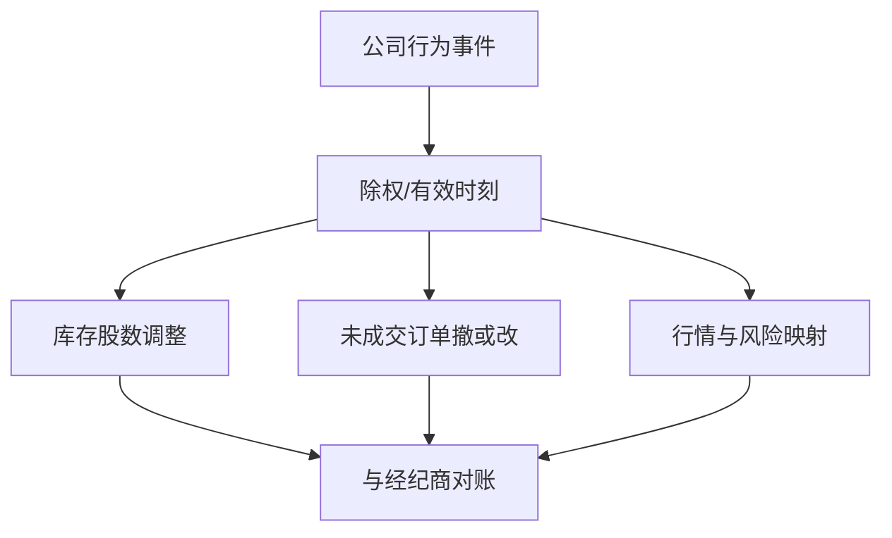

# 公司行动引擎

分红与拆股在研究里是收益定义；在交易系统里是必须在除权日前把仓位、限价、涨跌停与合约乘数同时改写的状态机。漏掉一次，监控上的 PnL 尖峰看起来像策略爆炸。

<footer>—— 对照 Fama, Fisher, Jensen and Roll 对拆股调整的经典处理；生产上对应的是调整因子与有效日的工程实现</footer>

[序号缺口](/quant/sequence-gap)保证行情事件流完整。[分红、拆股与复权](/quant/corporate-actions)已经把研究侧的总回报与前视写清。本课的缺口是**引擎**：如何在交易系统里把公司行为表变成对库存、订单、风控限额与行情映射的原子更新，以及如何与经纪商、交易所在除权日对账。交易系统课序在本课收束。不要重讲 FFJR 的事件研究，只补：宣布日、有效日、除权日在生产状态机上的位置。

## 问题

研究模块用调整因子把历史价连成一条线。生产不能等到日终再乘因子：隔夜拆股，未复权限价若仍留在簿上，可能变成远离市场一个数量级的错单，或变成意料之外的市价。涨跌停、最小价差、手数也会在除权后变档。引擎必须在有效日前完成：仓位股数互逆调整、未成交订单的改价或撤单、合约映射、风险乘数、以及行情订阅代码是否变更（合并、分拆出新 ticker）。

缺口是把公司行为当成与成交同级的事件，而不是当成数据供应商的一个复权字段。漏处理的症状是：交易所时钟上价格腰斩，本地库存没翻倍，PnL 出现假亏损，闸门误触发。这不是 alpha，是状态机 bug。

### 宣布、记录、除权、支付不是同一个事件

宣布日改变信息集，除权日改变可交易价格与仓位会计，支付日改变现金。引擎对交易的硬截止是除权（或合并终止）。宣布后、除权前，限价是否调整取决于场所规则；有的交易所自动调整未成交单，有的不调整。系统必须按场所规则分支，不能假设「都会自动改」。现金股利是否调整限价，同样因场所而异。

ETF 份额拆分、期货合约乘数变更、期权交割与股票拆股可能落在同一周。引擎的输入应是统一的公司行为事件，而不是每个资产类一个脚本。

## 方法

主数据：行为 ID、类型、标的、宣布时间、有效/除权时间（交易所时钟）、比例、现金、新标的。处理管道：在有效时刻（或该市场的业务截止）生成一组原子指令——调仓位、撤或改订单、改映射、打标「今日价格不可与昨日直接比」。指令与成交共用事件账本，便于复盘。日终与经纪商持仓、与交易所文件对股数，对不上则冻结该标的交易。

回测引擎必须调用**同一套**调整逻辑，而不是研究用复权价、实盘用另一套。差别只允许发生在：回测用点-in-time 已知的行为，实盘用当时已宣布的行为。用最终修订过的行为表去回测宣布前，是前视，先修课已禁。

### 合并、分拆、代码变更

换股合并：目标仓位在终止日变成对价。引擎要能下「换成买方股票或现金」的公司行为单，而不是等到目标停牌后当缺失填充。分拆：新 ticker 必须进入可交易宇宙与行情订阅，否则会出现「钱消失」。退市：最后可交易日之后禁止新订单。这些与幸存者偏差课是同一管道的两端。

## 机制

价格是未复权的交易所物体，收益是调整后的会计物体。引擎同时维护两者：撮合与涨跌停用未复权；PnL 与因子暴露用调整后的持有期回报。混用一次，监控课里的「会计 PnL 不是风险」会失败——假 PnL 尖峰会触发真闸门。公司行为也改相对 tick 与一手金额，市场设计课的栅格在除权日跳档，执行算法的投影函数必须重载参数。

不要在除权日用 [Roll](/quant/roll-model) 或实现价差去解释价格腰斩。先把因子应用完，再对调整后的序列做微观结构度量。

### 未成交订单的自动调整因场所而异

有的交易所在除权日自动改限价，有的把单子留在原价变成错单。引擎必须按场所规则分支：撤、改、或等待交易所调整回报。假设「都会自动改」会在某一所造成错价申报。

## 边界

债券的提前赎回、转换、要约收购是另一套行为表，字段不同，但应进同一引擎入口。加密「拆分」往往是链上或交易所记账，法律含义不同。本课不讨论税务 lot。另类数据课会碰到供应商回填；公司行为引擎是内部主数据，不能等另类数据供应商来通知拆股。

债券赎回、转股、要约与股票拆股应进同一入口，字段不同但有效日纪律相同。分开维护的脚本总会在同一周对不上。

## 小结

- 生产上公司行为是原子状态更新，不是复权价字段。
- 除权日同时改仓位、订单、映射与栅格参数；宣布日改信息集。
- 回测与实盘共用逻辑，差别仅在点-in-time 可知范围。
- 假 PnL 尖峰优先当引擎 bug 查，再当策略失效查。
- 微观结构度量必须在调整之后做。
- 出处：Fama, Fisher, Jensen and Roll, 1969；CRSP 类调整因子惯例；各交易所对除权日未成交订单处理的公开规则。
