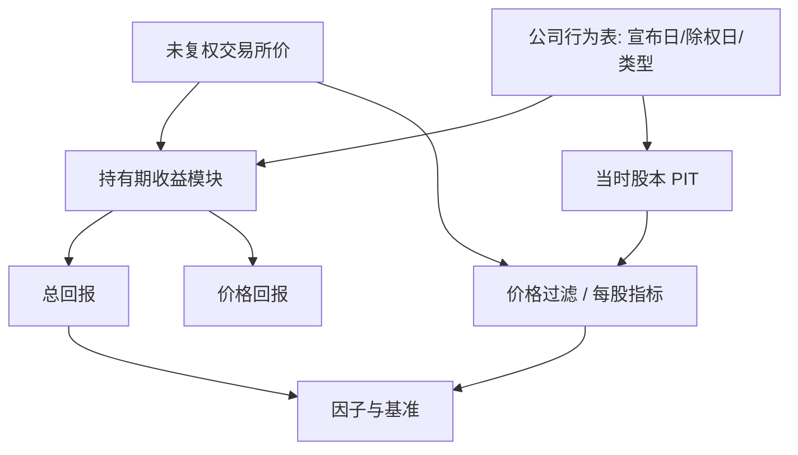

# 分红、拆股与复权

拆股本身不改变公司要求权的总和；价格对拆股公告的调整，检验的是市场如何吸收一条不改变现金流的信息。

<footer>—— 对照 Fama, Fisher, Jensen and Roll, The Adjustment of Stock Prices to New Information, International Economic Review, 1969</footer>

股票收益的定义看起来只是价格差，真正可投资的是公司行为调整后的持有期回报：现金分红、拆股与并股、配股、转增、分拆、合并、特殊股息。CRSP 把这些写成持有期收益与累积调整因子；Fama、Fisher、Jensen 与 Roll（1969）用拆股公告检验半强有效。搞错复权，因子会变成「对数据供应商调整算法的暴露」：动量用错价格，分红被丢掉的价值因子少了一块权益收益，拆股让换手与价格过滤全部错位。本篇写总回报与价格回报的差别、调整因子如何进入回测，以及它与[前视](/quant/look-ahead-bias)、[时点基本面](/quant/point-in-time) 的交界。

## 问题

未调整收盘价序列在拆股日会掉一半，这不是亏损。1 拆 2 之后股份翻倍，要求权不变。价格回报 $P_t/P_{t-1}-1$ 在除权日是错的；总回报还要把当天的现金股利 $D_t$ 加进分子。CRSP 的持有期收益近似 $(P_t+D_t)/P_{t-1}-1$，并在更复杂的公司行为上用调整因子把历史价格做成可比较的复权价。研究用复权价算收益可以，用复权价当「当时可下单的价格」不可以：委托、涨跌停、最低价格过滤、整手，都相对未复权的交易所价格。

分红不是免费的 alpha。除息日价格下跌的期望大约是股利的税后价值；Elton 与 Gruber 等早期工作讨论除息日行为与税率。因子若用价格回报，高分红股票被当成弱动量或弱反转，其实持有人收到了现金。Fama–French 的市场溢价用的是含股利的市场总回报。任何声称复制权益溢价或价值的回测，必须声明分红再投资假设：再投入原股票、进入现金、还是忽略。

### 调整因子、前复权与后复权

后复权：把历史价除以拆股因子，使序列在最新股本口径下连续，今日价等于交易所价。前复权：把最近价格往回折，使序列在某一基期股本下连续。两者算对时，日收益应一致；不一致通常来自分红是否进入调整（「向前复权」有时只调拆股不调息）。配股、转增、分拆出子公司，因子更复杂：要决定权利价值是否进入分子、分拆出的证券是否仍在可交易宇宙。漏掉分拆，等于在除权日记录一笔假亏损，并把子公司后续收益从样本里扔掉——与[幸存者](/quant/survivorship-bias) 类似。

供应商的「复权价」对特殊股息、回购式注销、非强制性配股处理不同。换数据源后动量开崩，优先对一下除权日收益，而不是先改信号参数。

## 方法

**收益以公司行为表为第一公民。** 主文件应是：有效日、类型（现金股利、拆股、配股、分拆、合并、退市）、比例、现金额、币种、宣布日与除权日。价格文件只提供未复权交易所价。收益模块按类型应用标准公式，而不是先画一条复权线再 diff。拆股：$P$ 变、股数互逆，仓位股数要同步调，否则名义暴露跳。现金股利：若策略自动再投资，增加股数或记录现金；若指数是价格指数，不要把股利当策略 alpha。

**宣布日与除权日分离。** FFJR 关心的是公告窗口的异常收益：拆股往往与股利增加一起宣布，价格在公告日就动，除权日只是机械调整。交易规则若在除权日把跳价当成信号，是在交易一个可预测的机械缺口。合法信号只能用公告后的公开信息，且不能把尚未除权的未来因子提前除进历史价去做价格过滤。

**与 PIT 对齐。** 拆股宣布后、除权前，市场已知道比例。PIT 可以在宣布后调整预期股本。数据库若只在除权日才插入因子，用复权历史价回看「宣布前」会把未来拆股提前反映到价格上——对收益若双向调整可抵消，对「价格水平规则」不可抵消。股份数量用于 EPS、每股股利、做空券源，必须用当时已宣布、已生效的股本，而不是最新股本往回除。

### 合并、退市与现金选择权

换股合并：目标股票在最后一日变成对价（现金、买方股票或混合）。回测必须在终止日把仓位换成对价资产，而不能把目标价当成缺失后前向填充。现金并购的最后收益是对价相对前收的溢价，漏掉它会少记事件收益。退市见 Shumway：最后一跳经常是大幅负值。公司行为模块与退市模块是同一条管道的两端，拆开维护必然有一天对不上。

ETF 与指数的「总回报点」已经假设股利再投资。用价格点序列去复制总回报指数，跟踪误差会在高分红月份系统出现，看起来像 alpha 衰减。

## 机制

Modigliani–Miller 意义上，拆股不改变资产与负债。FFJR 的问题是信息：拆股公告常是管理层对可持续盈利的信号，故公告日有正异常收益，随后市场把价格调到新的每股口径。分红涉及现金离开企业、投资者税负与迎合。资产定价里，股利进入总回报，也进入账面与再投资假设，从而进入价值与盈利的度量。搞错复权，等于在收益上乘了一个与基本面无关的噪声过程，IC 与换手都会偏。

执行层，除权日有缺口、有税率与结算习惯造成的微观结构（除息日交易、借券与股利补偿）。高分红、预告除权的名字在借券市场上有额外成本，空头腿的「价格动量」必须扣掉股利补偿。这与[对手方](/quant/counterparty-credit) 的融资条款相连：合约如何定义公司行为替代，决定空头的真实 PnL。

### 回测里最贵的几类错误

用后复权价做「低于 5 元过滤」；用价格回报做多空并声称是总回报因子；在拆股日不调整持仓股数导致杠杆翻倍；把分拆当普通分红只加现金、丢掉分出证券；用含未来拆股的复权线做技术形态。每一类都会稳定地抬高样本内业绩或制造虚假换手。单元测试应包括：已知拆股日收益是否接近零（在无其他新闻时）、现金股利是否进入总回报、股数是否与因子互逆。

## 边界与工程取舍

不同市场的除权日历、午盘除权、红利税代扣不同。A 股的转增与送股在价格上像拆股，会计上从公积或未分配利润走，PIT 股本与账面要一起变。ADR 与本地股的公司行为时差会造成一日错误定价，套利回测必须用两地各自的有效日。无法获得完整公司行为表时，至少用供应商总回报指数做对照，把残差当成数据风险而不是 alpha。

不要把「我们用了 Yahoo 复权价」当成方法。公开复权常滞后、常把特殊股息处理错。也不要在研究里用总回报、在归因里用价格回报，两套数字无法对账。

公司行为是少数可以用确定性测试锁住的数据风险。每次更换行情源，先对一篮子已知拆股与分红事件的总回报，再上线信号。

## 小结

- 可投资收益是公司行为调整后的持有期总回报；未调整价差把拆股当成损益，价格回报丢掉股利。
- Fama–Fisher–Jensen–Roll 把拆股公告当作信息事件；除权日的机械缺口不是信号。
- 复权价用于连续收益，未复权价用于下单、涨跌停与价格过滤；股本必须 PIT。
- 分拆、合并、退市与现金股利要走同一张公司行为表，否则缺口会冒充 alpha 或风险。
- 出处：Fama, Fisher, Jensen and Roll, *The Adjustment of Stock Prices to New Information*, International Economic Review, 1969；CRSP 持有期收益与调整因子方法；Elton and Gruber 等对除息日的讨论；Shumway, *The Delisting Bias in CRSP Data*, Journal of Finance, 1997。
