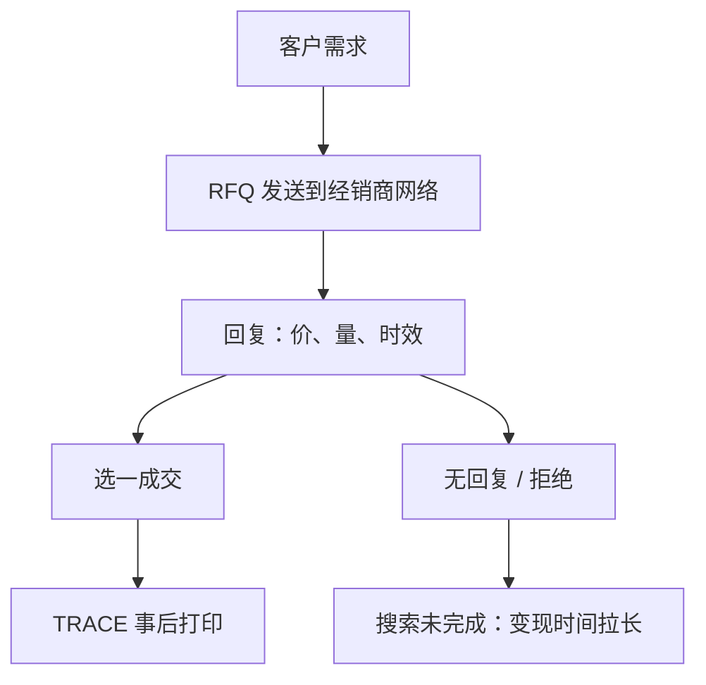

# 公司债 OTC 询价

询价市场里，价格是对特定对手、特定数量、特定时刻的回复，不是对全市场有效的报价。打印告诉你有人成交了，不问你能否在同一价格再成交。

<footer>—— 据 Duffie, Garleanu and Pedersen 对 OTC 搜索与议价的理论；对照 Bessembinder 与 Harris 对公司债经销商市场的经验描述</footer>

[债券流动性与 TRACE](/quant/bond-liquidity-trace)从打印估计成本。本课的缺口是协议：公司债如何在 OTC 里成交——请求报价（RFQ）、经销商存货、客户关系、电子询价平台——以及为什么股票式的 NBBO 在这里没有对象。Duffie、Garleanu 与 Pedersen 把 OTC 写成搜索与议价：找到对手要时间，议价力决定加价。期限结构课序在本课收束；执行时要把 RFQ 当成订单类型，而不是当成「慢一点的市价单」。

## 问题

股票连续竞价：你看到 BBO，选择吃或挂。公司债：你向一群经销商发送「买 2 百万面值的某 CUSIP」，收到若干回复，选一个成交，其余作废。回复可以只对你有效、只对该数量有效、只在几十秒内有效。TRACE 随后打印一个价格，其他客户并不能点击该价格。流动性的状态变量是：你的网络有多宽、经销商库存是否碰巧在你的方向、以及你是否被识别成知情或被识别成索引再平衡流量。

缺口是把「有成交价」与「可执行报价」分开。用昨日 TRACE 均价当今日可交易价，忽略了询价的搜索成本和经销商对你的定价歧视。评级下调日，打印稀疏，询价回复变宽或拒绝回复——这是流动性消失，不是数据缺失。

### RFQ、点击成交与语音并非同一市场

电子平台把 RFQ 标准化，但仍是询价。部分平台提供可点击的指示性报价，深度通常小于机构目标规模。大额、冷门、复杂条款仍走语音。混在一起估一个价差，会把电子小单的窄加价当成市场，把语音大单当成异常。方法是按渠道和规模分层，与 TRACE 规模分层对齐。

经销商知道你是否同时在向五家询价（部分平台会显示或被推断）。广泛询价改善竞争，也泄露需求。搜索理论里这是信息公开与议价力的权衡，不是执行技巧清单。

## 方法

执行会计以 RFQ 生命周期为对象：发送时刻、回复数量、最优回复相对基准的偏离、成交与否、成交后 TRACE 打印延迟、以及未成交时的机会成本（用随后打印或随后成功 RFQ 估价）。这对应股票里的实施缺口，但没有公开中点，参照改用基准曲线。填成率与回复率是流动性的一等指标，比「平均打印价差」更接近决策。

定价研究若用 TRACE 收盘合成价，应明白该价是谁的成交：零售小单与机构大单的加价不同，Edwards–Harris–Piwowar 已强调规模效应。指数纳入使许多账户同时询同一只券，经销商存货同向，加价上升——这是拥挤在 OTC 上的版本，不是股票 ADV 参与率。

### 存货、对冲与「两张簿」

经销商接单后，用国债期货、CDS、股票或已有库存对冲。报价宽度含预期对冲成本与无法对冲的跳跃风险。可转债课已经说明信用与股票相关；普通公司债的经销商对冲同样跨市场。客户看到的 RFQ 回复，已经含这些对冲摩擦。把回复价相对国债利差的偏离全部叫做「公司债 alpha」，会把经销商存货周期当成信号。

## 机制

OTC 的匹配靠搜索：Duffie–Garleanu–Pedersen 的模型里，对手到达是随机的，议价分享剩余。电子化提高到达强度，加价下降，但异质债券不会收敛到股票式连续簿——契约太多，每只券的自然对手太少。TRACE 事后透明改变议价的信息集：客户知道昨天的打印，经销商不能再对完全不透明的历史成交要价。事前仍不透明：你不知道此刻谁愿意在什么价位拿多少存货。

与集合竞价的对照：收盘拍卖是多边、同时、同一价格。RFQ 是双边、序贯、价格歧视。不要把债券「收盘价」理解成一场公开集合的出清价，它常常只是某种合成或最后打印。

[Roll](/quant/roll-model) 的买卖回跳假定同一市场来回成交。OTC 里相邻两笔可能是完全不同的客户与经销商，协方差不是价差。债券 Roll 估计要非常谨慎，优先用配对经销商买卖。

### 指示性报价不是可执行回复

平台上的可点击价格往往只对小规模有效。机构目标面值仍要走 RFQ。把可点击价差当市场，会把电子零售层当成整个 OTC。分层渠道是方法，不是修饰。

## 边界

美国投资级电子化程度高于高收益和新兴市场债。贷款、CDS 指数与单名 CDS 各有询价惯例。本课不提供如何选择询价家数以获取更好价格的操作建议。监管报告、最佳执行义务因司法管辖而异。下一课程投资组合不再默认「按收盘价调仓」；对债券，调仓是一次 RFQ 过程。

债券「收盘价」常常是合成或最后打印，不是集合出清。指数估值若把该价当成可交易，再平衡冲击会被低估。

## 小结

- OTC 价格是对手特定、数量特定、时效特定的回复，不是 NBBO。
- RFQ 生命周期（回复率、填成、相对基准偏离）才是执行会计。
- 电子小单与语音大单必须分层；TRACE 均价不是可点击报价。
- 搜索与议价解释加价；事后透明削弱但不消灭信息租金。
- 相邻打印的协方差不能直接当 Roll 价差。
- 出处：Duffie, Garleanu and Pedersen, *Econometrica* / RFS 对 OTC 搜索的工作；Edwards, Harris and Piwowar, 2007；Bessembinder 等对经销商市场的经验研究。
