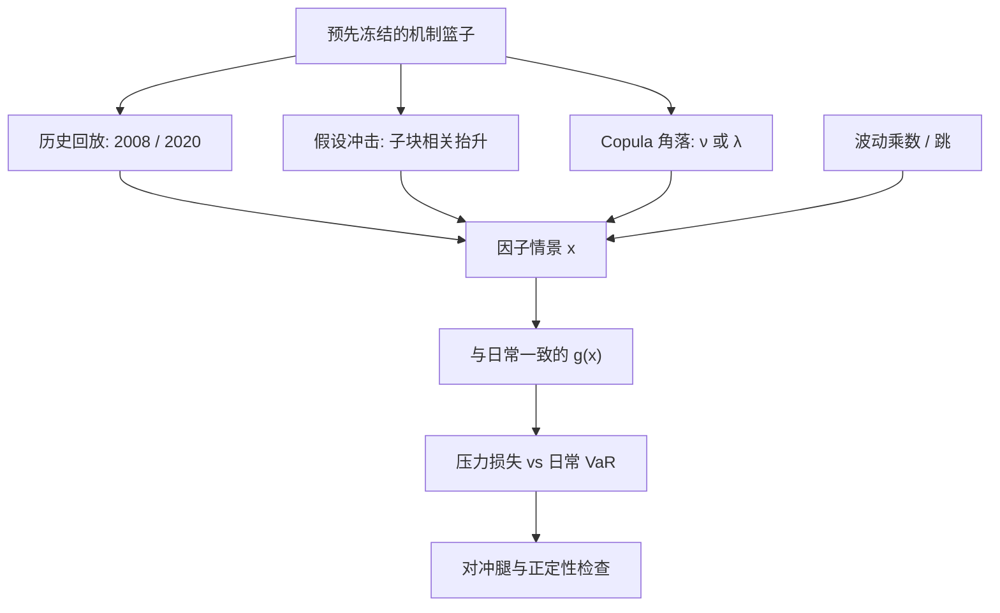

# 相关性崩溃情景

危机里「相关升到 1」是观测现象；风控要把它写成可复现的因子移动：哪一篮子必须同向、波动是否先标准化、以及这是历史回放还是假设冲击。

<footer>—— 现象见 Longin–Solnik、Forbes–Rigobon、Loretan–English；情景构造对照 Brunnermeier 对融资螺旋的叙述</footer>

[相关性崩溃](/quant/correlation-breakdown) 一文写现象：下行 exceedance correlation、异方差把传染测高、融资与火线抛售让分散化失效。本篇不重复那条证据链，只写**如何把崩溃做成压力引擎里的一条情景**：输入今日头寸，输出一条或一组 $x$，使指定篮子的共同运动达到预声明的强度，并与日常 DCC、Copula VaR、反向压力测试共用同一套 $g$。Loretan 与 English 早已警告：若不先定义压力期与波动调整，「correlation breakdown」可以在任何样本里被搜出来。情景若也在数据里搜最大相关段，只是把同一错误写进限额。

## 问题

日常 $\Sigma_t$ 或 DCC 的 $R_t$ 给出条件线性相关。压力日组合损失远大于 $w^\top\Sigma_t w$，因为：（1）波动升，Forbes–Rigobon 偏差让滚动相关跳升；（2）真尾依赖升高；（3）融资约束让可抵押篮子被同时卖出。限额系统不能在崩溃当天再估一张 $\Sigma$，必须预先有一条**不依赖当天实现**的规则：哪些名字被当成同一篮子、篮子内相关升到多少、篮子外是否保持、波动乘多少。

问题不是「把全市场 $\rho$ 乘 1.5」。那会错误惩罚真正的对冲腿（某些趋势、期权、黄金），也会放过「表面上分散、融资上同一抵押」的集中。情景要按**机制篮子**切：经纪商可接受的抵押、同一 CTA 信号、同一信用指数成份，而不是按行业分类表机械加相关。

### 三种合法构造，不要混成一个旋钮

**历史回放。** 把 2008 年 9–10 月、2015 年 8 月、2020 年 3 月的因子变化套在今日头寸上。相关结构是那段历史自己的，不是你估出来的。优点是无可争议的已实现联合；缺点是头寸换了之后，那段历史未必仍是最坏相关。**假设冲击。** 指定篮子 $B$，令 $R_{ij}\leftarrow 1-\varepsilon$ 对 $i,j\in B$，其余块保持日常 $R_t$，再配波动乘数。**Copula 角落。** 保持边缘，把 $t$ Copula 的 $\nu$ 降到很低或把 Clayton 参数推到样本外，抽联合极端。第一种是回放，后两种是判断。报告必须分开，不能把假设冲击的损失叫做「历史压力」。

先把收益用压力期或日常 $\sigma$ 标准化，再改相关，最后再乘回波动。把「未标准化的一起跌」直接写成相关情景，会把波动冲击与相关冲击算两遍，或算错遍。

## 方法

**篮子清单预先冻结。** 例如：股指与高贝塔成份、信用指数与成份 CDS、基差交易的现券与期货、风险平价的股债商品外汇、境内可抵押回购券。每只篮子写触发叙事（保证金上调、赎回、指数剔除）。同一名字可属于多个篮子；情景一次只激活一个主篮子，另做「多篮子同时激活」的组合情景，避免相关矩阵被改到不正定却说不清是谁。

**矩阵手术。** 在相关矩阵上把子块抬向 1，须做谱投影或收缩，保证正定。简单做法是：篮子内写成单因子，$x_i=\beta_i F+\varepsilon_i$，把 $\mathrm{Var}(F)$ 升到使两两相关达到目标，特异方差按比例缩小。这比逐元素改 $\rho_{ij}$ 更干净。目标相关不要写 1.00，写 0.85 或 0.9 并做敏感性；字面 $\rho=1$ 会让对冲腿的残差为零，造成虚假完美对冲或虚假无穷损失，取决于符号。

**波动与跳。** 相关崩溃几乎总与波动跳升同时发生。情景应给 $\sigma$ 乘数（例如 2×、3×）或直接用压力年的已实现波动，并单独加一条跳：指数缺口、信用跳违约。只用相关、不改波动，会低估期权与 CPPI 缺口；只改波动、不改相关，会低估看似分散的线性账簿。BN 跳跃检验提供「跳日」清单，可当回放子集，但假设情景不应在全历史里搜 $Z$ 最大的日子——那是数据挖掘。

### 校准目标来自现象文献，不是来自优化器

Longin–Solnik、Ang–Chen 的下行 exceedance correlation 给假设冲击一个数量级：从平静期 0.3 走到压力期 0.7 一类，而不是从 0.3 走到 1。Forbes–Rigobon 要求报告「除波动后相关是否仍升」：若标准化后相关几乎不变，情景应以波动冲击为主，不要强行改 $R$。Brunnermeier 的叙事给篮子：可抵押、被经纪商接受、被同一风险模型减仓的名字。校准是把文献数字写成参数范围，不是拟合一条使当前资本最大的相关路径——后者是反向压力的近亲，须声明。

与 DCC、Copula VaR 的日常数字对照：情景损失应高于日常 99% VaR 一个预先讨论过的倍数；若不高，说明篮子切错或头寸本来就极集中，相关改不动总风险。若过高到定价器崩溃，先检查正定与映射，再检查是否误把对冲腿也抬成同号。

## 机制

统计层：共同因子方差上升时，即使载荷不变，线性相关上升。情景里「升 $\mathrm{Var}(F)$」就是在写这个。额外的传染是新因子（融资）出现：原来正交的残差被同一个 haircut 绑在一起。机制篮子存在的理由是捕捉这第二个因子，而不是把 $\sigma_F$ 再乘一次。

经济层：火线抛售的冲击作用在被同时卖的篮子上，Kyle 的 $\lambda$ 让价格同向。相关矩阵的手术是对这一价格同向的线性近似。它不会自动包含流动性枯竭（买卖价差炸开、深度下降）。完整情景应同时降低可成交量或提高冲击函数，否则线性账簿的损失对、但执行与补保仍按平静期假设，现金会先于 VaR 耗尽。

风险平价与 vol target 在相关崩溃里不是被动受害者：规则本身在 $\sigma$ 上升时制造同步减仓，相关与拥挤互相放大。情景若只改 $\Sigma$、不改这些规则的内生流量，会低估第二轮。

### 与反向压力如何衔接

正向相关情景问「若篮子 $B$ 相关升到 0.9，我们亏多少」。反向问「要达到 $L^\star$，相关最少要升到哪、还是其实一个名字就够」。两者共用篮子清单。若反向优化总是走单一名称而非相关崩溃，说明当前组合的真正风险是集中度，相关情景是次要的——应改限额，而不是把相关乘数调到能「看见」崩溃为止。

## 边界与工程取舍

高维正定、缺失历史、停牌与涨跌停，使回放不可交易：指数路径你复制不出。假设冲击在新兴市场、商品、加密上更依赖判断，因为压力样本短。t Copula 对称尾会在上涨端也制造假同涨，对冲评估会偏。工程折中：日常仍用 DCC 或收缩 $\Sigma$；周频压力引擎跑冻结的历史回放 + 两到三个假设篮子冲击；反向压力另册。

不要把「股债相关转正」写成全球所有资产相关为 1。不要用指数相关替代可交易成份组合相关。不要在同一张情景里既把波动乘 3 又把未标准化相关拉到 1 却不做诊断。不要用情景损失去反推一个「隐含相关」再当 alpha。

情景参数（篮子、目标 $\rho$、$\sigma$ 乘数）与候选策略网格一样，不能看完结果再挑最温和的那组。冻结、敏感性、与 2008/2020 回放并列，是最低治理。

## 小结

- 相关性崩溃情景是预声明的因子移动规则，不是把全市场 $\rho$ 乘一个数，也不是在样本里搜最大相关段。
- 历史回放、假设篮子冲击、Copula 角落三种构造必须分开报告；先标准化波动再改相关。
- 篮子按融资与减仓同步机制切，目标相关用下行 exceedance 的数量级校准，并保持矩阵正定。
- 与日常 DCC/Copula VaR、反向压力共用 $g$；内生 vol target 流量应进入第二轮。
- 出处：Longin and Solnik, 2001；Ang and Chen, 2002；Forbes and Rigobon, 2002；Loretan and English, 2000；Brunnermeier, JEP 2009；现象综述见 [相关性崩溃](/quant/correlation-breakdown)。
