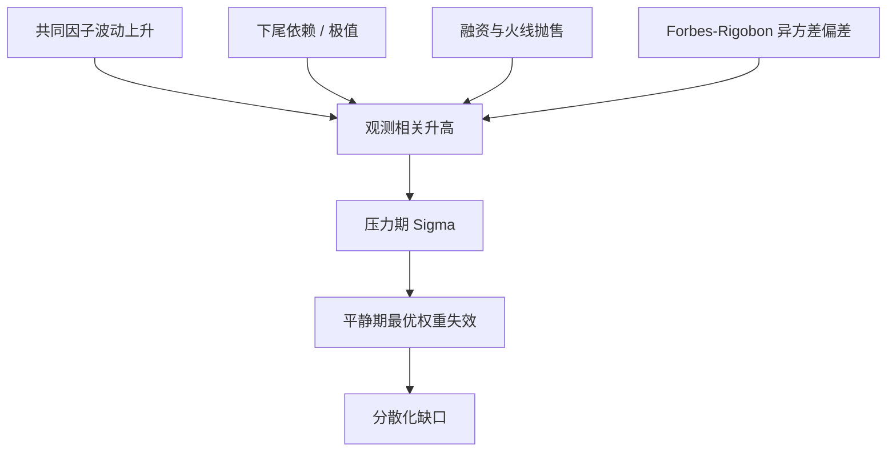

# 相关性崩溃

危机里资产一起跌，并不是相关矩阵偶然坏了：杠杆、抵押与市场流动性把原本分散的持仓逼进同一条卖出的窄路。

<footer>—— 对照 Brunnermeier, Deciphering the Liquidity and Credit Crunch 2007–2008, JEP 2009</footer>

[上一课](/quant/regime-break-risk)把体制切换失效写成旧参数在断点后仍被用于交易：反复马尔可夫体制与一次性结构断裂是不同装置，实时不能使用全样本才知道的 $\tau$。缺口是分散化依赖的那个数字：压力期共同运动远强于平静期，可能是尾部依赖升高、异方差造成的相关高估，或融资约束下的同步减仓。Longin–Solnik 与 Ang–Chen 记录下行端更黏。本课区分这三层，不重写 Bai–Perron 的断点检验。它与 [DCC](/quant/dcc)、[Copula](/quant/copula) 是同一现象的不同写法。

## 问题

记两资产收益的线性相关为 $\rho$。风险管理用一段滚动窗口估 $\hat\rho$，再拿去优化或报 VaR。压力日出现后，$\hat\rho$ 跳升，组合波动远高于 $\mathbf{w}^\top\Sigma\mathbf{w}$ 在平静期的值。问题有三层。第一，线性相关不是尾部依赖：高斯 copula 可以有很高的 $\rho$ 而渐进尾独立，也可以有中等 $\rho$ 而在极值上很黏。第二，波动升高等于把共同因子放大，Forbes 与 Rigobon（2002）证明异方差会把「传染」测高——条件于高波动的相关，即使无条件相关不变也会变大。第三，即使统计相关没变，杠杆与止损让所有策略同时减仓，价格路径仍会高度同步。Loretan 与 English（2000）系统讨论过「correlation breakdown」作为压力期现象时，必须先处理波动与样本的定义。

对配置而言，失败的不是「相关的点估计」，而是**用平静期 $\Sigma$ 去做的最优权重在压力期的风险贡献**。风险平价、最小方差会把权重堆到「过去低相关」的资产上；一旦这些资产在危机里被同一融资链绑在一起，事后集中度最高。

### 下行相关不是对称相关的一个分位

Longin–Solnik 用多元极值理论看超越阈值的相关：大跌端的 exceedance correlation 高于大涨端。Ang–Chen 在美股里对「双双下跌」与「双双上涨」分别估相关，并检验相对常相关的偏离。含义是：用全样本 $\rho$ 或用升市 $\rho$ 去做空头对冲，会系统性低估需要的对冲比。这不是把 DCC 的 $R_t$ 在跌日读得高一点就结束——DCC 仍是线性相关的动态，不自动等于尾部 copula 的依赖参数。

「相关到 1」几乎从不是字面的 $\rho=1$。更常见的是：残差里的第一主成分解释方差突然上升，或下行 exceedance correlation 从 0.3 走到 0.7。风控语言应说清是哪一个数字，否则无法校准。

## 方法

**先除波动再看相关。** 与 DCC 的第一步相同：用 GARCH 或已实现波动标准化，再估相关。若标准化之后压力日仍高度同向，才是依赖结构的变化，而不是 Forbes–Rigobon 偏差。报告时应同时给：原始滚动相关、剔除波动后的相关、以及下行阈值上的 exceedance correlation。

**Copula 与极值。** 把边缘与依赖分开：边缘用肥尾，依赖用 t copula 或 Clayton 一类下尾 copula。高斯 copula 在 2008 年 CDO 定价里的恶名，正是「中等 $\rho$ + 高斯尾独立」无法生成足够的联合违约。组合风险若只输入相关矩阵，等于把 copula 选成了高斯。

**经济约束情景。** 在 Brunnermeier–Pedersen 的逻辑下，设融资冲击让一组可抵押资产同时被抛售，把这组资产的残差相关临时抬到接近 1，同时保持其他资产不动。这比把全市场 $\rho$ 乘 1.5 更接近机制，也能避免对真正对冲工具（例如某些趋势与期权）错误施压。

### 估计窗口与「崩溃」的定义

短窗口：相关噪声大，容易把两周同向当成结构。长窗口：把 2008 稀释进十年平静，优化器以为分散化还在。Loretan–English 强调，比较「压力期相关」与「全样本相关」时，必须说明压力期如何定义——否则每次都能找到一段相关更高的子样本。预指定压力日（交易所熔断、Lehman 周末、2020 年 3 月）再比较，比在数据里搜最大相关段更干净。

优化器最喜欢的低相关资产，往往是样本里还没一起爆过的品种。把「历史上低相关」当成结构性正交，是在用未发生的危机做隐含担保。

## 机制

统计层：共同因子的方差上升时，即使因子载荷不变，$\rho_{ij}= \beta_i\beta_j \sigma_F^2 / (\sigma_i\sigma_j)$ 也会上升。这是 Forbes–Rigobon 的核心，不是传染。额外的传染是载荷本身变了，或出现新的共同因子（融资、流动性）。

经济层：Brunnermeier 的 loss spiral 与 margin spiral。资产跌价 → 资本与抵押不足 → 卖更多同类可抵押品 → 价格再跌。原本靠不同基本面分散的持仓，在「谁能当抵押、谁被经纪商接受」这一维上变成同一资产。火线抛售的价格冲击是跨名字相关的（Kyle 的 $\lambda$ 作用在被同时卖的篮子上）。因此相关性崩溃经常与[变现时间](/quant/liquidity-horizon)一起出现：你来不及在相关升高之前把篮子拆开。

### 与体制、拥挤的交叠

体制切换可以把「高相关」写成一个熊市状态的参数；拥挤把同质策略的持仓重叠写成残差 PCA。相关崩溃是观测现象，机制可能是体制、拥挤、融资或单纯的异方差。处置不同：异方差用标准化；拥挤要降杠杆、避免再纯化；融资要管抵押集中度；真体制切换要改长期配置。只改相关矩阵的乘数，是把所有机制收成一个旋钮，校准一次、下次危机换一种机制时失效。

## 边界与工程取舍

多元极值在维度上极难：超过几只资产，尾部建模要靠因子结构或成对估计再拼，正定性与校准都不稳。t copula 只有对称尾，会高估上涨端的共同运动。工程上常用的折中是：日常用 DCC 或收缩协方差，压力用预指定情景把融资相关篮子的相关抬高，并单独用历史压力日做回放，而不是声称估出了「真实的崩溃 copula」。

不要用指数收益的相关去替代成份股可交易组合的相关：指数有编制与再平衡，危机里的停牌、涨跌停会让你无法复制指数那条路径。也不要把信用 CDS 指数与股票的相关在基差炸开时仍当对冲比不变。

风险平价在 2020 年 3 月的同步去杠杆，是「低波动、中等相关」假设在融资约束下的一次性证伪。事后提高相关假设很容易；事前应限制单一融资渠道上的总风险预算。

## 小结

- 相关性崩溃是压力期共同运动强于平静期估计，来源包括异方差偏差、真尾部依赖、以及融资/火线抛售造成的同向交易。
- Longin–Solnik、Ang–Chen 记录下行相关更高；Forbes–Rigobon 警告把波动上升读成传染；Brunnermeier 给出流动性螺旋的经济机制。
- 先标准化波动，再报告 exceedance correlation；日常 $\Sigma$ 与压力情景应分开，而不是只用一个滚动 $\rho$。
- 低相关是优化器的诱饵：未一起爆过的资产，不能当成结构正交。
- 出处：Longin and Solnik, *Extreme Correlation of International Equity Markets*, Journal of Finance, 2001；Ang and Chen, *Asymmetric Correlations of Equity Portfolios*, Journal of Financial Economics, 2002；Forbes and Rigobon, *No Contagion, Only Interdependence*, Journal of Finance, 2002；Loretan and English, *Evaluating “correlation breakdowns”*, Federal Reserve IFDP, 2000；Brunnermeier, *Deciphering the Liquidity and Credit Crunch 2007–2008*, Journal of Economic Perspectives, 2009。
