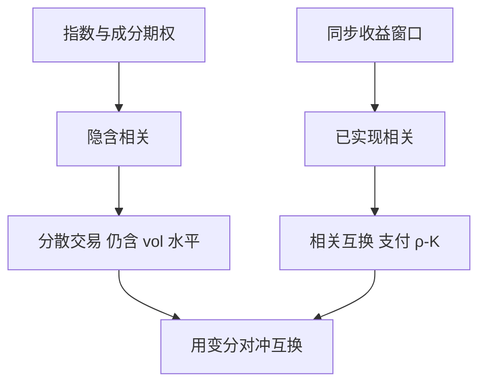

# 相关互换

相关互换交换已实现相关与约定执行价；它不是两份方差互换的差，也不是分散交易的残差记账。

<footer>—— 隐含相关与分散见指数/成分期权实务；相关互换合约定义见经纪商确认书与 Bossu 等对 correlation trading 的整理</footer>

[上一课](/quant/gamma-swap)还在单资产二次变差的加权。相关互换的对象是 **$\rho$**：一对或一篮子资产的已实现相关，对一个固定执行价 $K_\rho$ 结算。主干 [分散交易](/quant/dispersion-trade) 已经用指数期权对成分期权交易隐含相关。本课缺口是：把相关做成互换后，支付、年化、协方差估计窗口与分散的 Vega 残差如何分开。

## 问题

两资产已实现相关 $\hat\rho=\frac{\sum r^{(1)}r^{(2)}}{\sqrt{\sum(r^{(1)})^2\sum(r^{(2)})^2}}$。相关互换支付与 $\hat\rho-K_\rho$ 成正比。看起来像「把分散里的 $\rho$ 单拎出来」，但分散交易同时暴露于指数与成分的波动水平、权重漂移、分红与借券；相关互换把波动水平尽量除掉，只留相关。问题是已实现相关的估计：同步、隔夜、时区、以及零波动日子会让分母不稳定。把相关互换当「分散的线性化」，会在 vol 崩溃时发现互换与期权分散的 PnL 并不平行。

篮子相关互换常用等权平均成对 $\rho_{ij}$，或对指数方差公式反推一个平均相关。两种 $K_\rho$ 不是同一个数。

### 隐含相关不是已实现相关的无偏预报

从指数与成分期权反推的 $\rho_{\mathrm{imp}}$ 含相关风险溢价、跳跃共跳与流动性。相关互换的公平 $K_\rho$ 即使在无套利叙述里，也不等于历史 $\hat\rho$。交易的是溢价是否过厚，不是「相关会回归到历史均值」这一句。

相关互换通常不交换协方差。协方差互换吃波动水平；相关把水平除掉。Vol 突然上升且相关不变时，协方差互换大亏或大赚，相关互换可以几乎不动。

## 方法

合约写清：收益频率（日/周）、是否重叠、哪些交易日、是否用外汇 quanto 调整后的收益、篮子如何平均。估值：用高斯 copula 或因子模型生成风险中性已实现相关的期望，边际波动来自各资产方差互换或香草；更稳的是把相关互换当分散组合的近似对冲去标定。对冲：短指数变分、长成分变分（分散），再把剩余的 vol 水平用方差互换削掉，尽量留下 $\rho$。残差来自权重、跳、以及相关的高阶（相关的波动）。

[彩虹与篮子](/quant/basket-rainbow) 的期权对 $\rho$ 的敏感是非线性的；相关互换更接近线性 $\rho$。两者不要用同一套希腊值报告。

## 机制

指数方差 $\sigma_I^2\approx\sum w_i^2\sigma_i^2+2\sum_{i<j}w_i w_j\rho_{ij}\sigma_i\sigma_j$。固定 $\sigma_i$ 时，$\rho$ 升则 $\sigma_I$ 升。分散卖指数波动、买成分波动，近似卖 $\rho_{\mathrm{imp}}$。相关互换直接在 $\rho$ 上结算，省掉把 $\sigma_i$ 波动当噪声的那一层，但失去了期权凸性：相关到 1 附近，期权分散还有 vega 凸性，互换是线性的。

## 边界

异步报价让日度相关偏低（Epps），高频相关另算，见计量课的刷新时间。危机里相关冲向 1，互换卖方像在卖深度尾部，线性名义会迅速变成非线性经济暴露。单名停牌、除权、指数调样都会打断收益序列，合同需要后备定义。

本课不提供「如何把相关推高/推低」的交易清单。对象是合约与对冲分解。

## 小结

- 相关互换结算已实现 $\rho$ 对 $K_\rho$，与协方差互换、与期权分散都不是同一工具。
- 隐含相关含溢价；公平执行价不是历史均值。
- 用分散对冲时要再削掉 vol 水平，并接受权重与跳的残差。
- 出处：分散与隐含相关见指数期权实务；Epps 效应见 Epps, *Journal of the American Statistical Association*, 1979。
