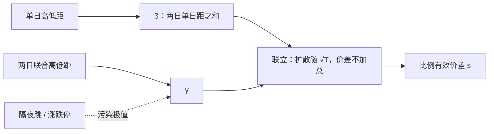

# Corwin-Schultz 价差估计

日最高价与最低价既含波动也含买卖价差；利用价差不随时间加总、波动却按根号时间加总这一差异，可以从高低价里把有效价差解出来。

<footer>—— Corwin & Schultz, A Simple Way to Estimate Bid-Ask Spreads from Daily High and Low Prices, Journal of Finance, 2012</footer>

[上一课](/quant/mrr-decomposition)把 $\Delta p_t$ 写成意外订单流的永久冲击 $\theta$、方向切换的暂时成分 $\phi$，以及公共信息残差；隐含价差 $2(\theta+\phi)$。许多历史样本只有日开高低收，没有 Lee–Ready 所需的中点时间戳，MRR 跑不起来。[Roll](/quant/roll-model) 在日频上协方差为正时没有实数解。缺口是 Corwin–Schultz：用单日与两日高低价距的不同时间加总性质，从日线里解有效价差。本课写这一估计量，不重推 MRR 的 AR(1)。它估的是宽度，不是 Kyle 的 $\lambda$。

## 问题

高低价是极端统计量。波动大的日子，高低距自然大；价差宽的股票，即使价值没怎么走，成交也会在买卖报价两端各点一下，高低距同样被拉大。若把高低距直接当波动，价差被算进已实现波动；若把高低距当价差，繁荣期估计会被吹成天文数字。需要一个能把「按根号时间增长的扩散」和「不随区间长度加总的弹跳」分开的方程。

日频数据的第二个麻烦是隔夜。两日窗口的最高最低可能分别落在两天，中间隔着一个不能交易的跳空。若把两日高低距当成连续交易的两倍时间，隔夜跳变会被当成波动或价差。Corwin–Schultz 必须在方法里处理这个缝，而不能假装日线是连续扩散的采样。

### 为何高低价携带买卖方向

在有买卖报价的市场里，日最高成交价更可能是某次主动买打在卖价上，日最低更可能是主动卖打在买价上。于是观测高低距 $\ln(H/L)$ 大约等于真实价值的高低距再加上一个与价差成比例的项。这不是每分钟都成立——盘中可以在中间价附近来回、最高最低碰巧都是同一侧——但作为日频的期望，它给出可识别的偏置。识别靠的是：把窗口从一天拉到两天，扩散项大约乘 $\sqrt{2}$，价差项几乎不变。

这不是 Parkinson 波动估计的「改进版」。Parkinson 假定没有微观结构、高低价来自连续扩散的极值。Corwin–Schultz 明确把价差放进极值，目的是把价差拿出来，而不是把高低距当更有效的 σ。先估价差再回代波动，与直接把高低距当波动，是两个问题。

## 方法

记单日高低价比为 $\beta = \mathbb{E}[\sum_{j=0}^{1} \ln^2(H_{t+j}^O/L_{t+j}^O)]$，两日窗口的高低价比为 $\gamma = [\ln(H_{t,t+1}^O/L_{t,t+1}^O)]^2$，上标 $O$ 表示观测价。真实价值的日方差为 $\sigma^2$，比例有效价差为 $s$。在若干关于极值分布与买卖落点的近似下，可得到 $\beta$、$\gamma$ 与 $(\sigma^2,s)$ 的两个代数关系。解出

$$
s = \frac{2(e^\alpha-1)}{1+e^\alpha},
$$

其中 $\alpha$ 是 $\beta$、$\gamma$ 的闭式函数（原文把中间量写成 $\alpha = \frac{\sqrt{2\beta}-\sqrt{\beta}}{3-2\sqrt{2}} - \sqrt{\frac{\gamma}{3-2\sqrt{2}}}$ 一类形式）。实践上对每个两日窗口算一个 $s$，再在月内取平均；负的中间结果通常截断为零，表示该窗口无法把价差从波动里分开。

### 隔夜与停牌

若次日开盘跳空，两日最高或最低可能完全由开盘价决定，连续交易假定失败。Corwin–Schultz 的调整是：当次日开盘相对前日收盘的跳变超过一定阈值，把次日的高低价按开盘平移，使两日窗口更接近「去掉隔夜跳」之后的日内极值。停牌、涨跌停把极值钉在制度边界上，高低距被截断，价差估计偏向零或偏向涨跌停幅度，必须单独标记，不能当普通交易日平均进去。

估计应在日历的相邻交易日上进行，而不是在任意两个有成交的日子上拼接——中间若隔了长假，两日窗口的扩散时间不是两天。股票若某日没有成交，高低价未定义或退化成同一点，该窗口应缺失，而不是用收盘价填成零价差。

## 机制

机制可以想成：价差是每个交易瞬间都在的加性宽度，波动是价值的随机游走。把观测区间拉长，游走的极差按扩散尺度增长，宽度几乎还是那一档报价。两日极差因此相对「两个单日极差之和」更「便宜」——因为价差没有被加两次到同样的程度。联立方程利用的就是这笔差额。若买卖不是随机落在两端，而是趋势日里最高最低都在同一侧报价上，价差项变弱，估计会把一部分价差误判成波动，从而偏低。

与 Roll 的对比是矩的选择。Roll 用相邻收益的协方差，签名是负相关；信息与方向持续会把协方差推向正，估计失败。Corwin–Schultz 用极值，签名是高低距被撑开；趋势与隔夜跳会污染极值，但不必让公式失去实数解。两者都会在信息不对称强的日子里偏离「纯处理成本价差」，因为成交已经把价值推走，最高最低不再只是买卖弹跳。它们估的是**有效**意义上的宽度，不是报价价差本身。

### 与直接有效价差的对照

有逐笔与 BBO 时，[有效价差](/quant/effective-realized-spread) 是 $2D(P-M)$，不必借极值。Corwin–Schultz 的价值在于：CRSP 一类日线长样本、早期场外、以及许多国际市场只有高低收。经验上，它与月平均有效价差、与买卖报价价差的截面相关较高，水平不必逐日相等。用它当交易成本去扣组合收益时，应把它当作「日频代理的月平均」，不要当成某一笔成交的执行成本。

把 Corwin–Schultz 的 $s$ 与 Roll 的 $s$ 在同一只股票上逐日画在一起，分歧最大的日子往往是协方差变号或隔夜跳大的日子。这是诊断：不是哪一个软件算错，而是两个识别策略在同一天被不同的污染项击中。

## 边界与工程取舍

近似依赖高低价的期望，小样本（一个月只有十几个有效窗口）噪声大，截面排序可以，个股日度水平不能当高频信号。低价股 tick 相对价格很大，高低距的离散化让 $s$ 呈阶梯，缩尾与价格过滤是默认。不要对指数本身的高低价直接套用个股公式再解释为「指数的买卖价差」——指数高低是成分股的极值混合，不是一张可成交的簿。

不要在已有毫秒有效价差的研究里用高低估计去「平滑」：你平滑掉的可能正是公告日的冲击。也不要把估计出来的 $s$ 当作 [Kyle](/quant/kyle-model) 的 $\lambda$；量纲是相对价差，不是每单位订单流的永久冲击。A 股涨跌停日应剔除或单独建模，否则两日窗口会把封板当成巨大高低距或零高低距，取决于你如何记录停在板上的最高最低。

真实出处：Corwin & Schultz, *A Simple Way to Estimate Bid-Ask Spreads from Daily High and Low Prices*, Journal of Finance, 2012。Parkinson 1980 是无价差的高低波动；Roll 1984 是成交价协方差。三篇不要在参考文献里互相替代。

## 小结

- Corwin–Schultz 用单日与两日高低价距的不同时间加总性质，从日线里解有效价差。
- 隔夜跳与涨跌停必须调整或剔除，否则两日窗口不是两倍的日内扩散。
- 相对 Roll，它较少因协方差为正而无法开方；相对逐笔有效价差，它是长样本代理而非逐笔成本。
- 估的是宽度，不是 Kyle 的 λ，也不能替代报价价差的直接平均。
- 出处：Corwin & Schultz, Journal of Finance, 2012。
