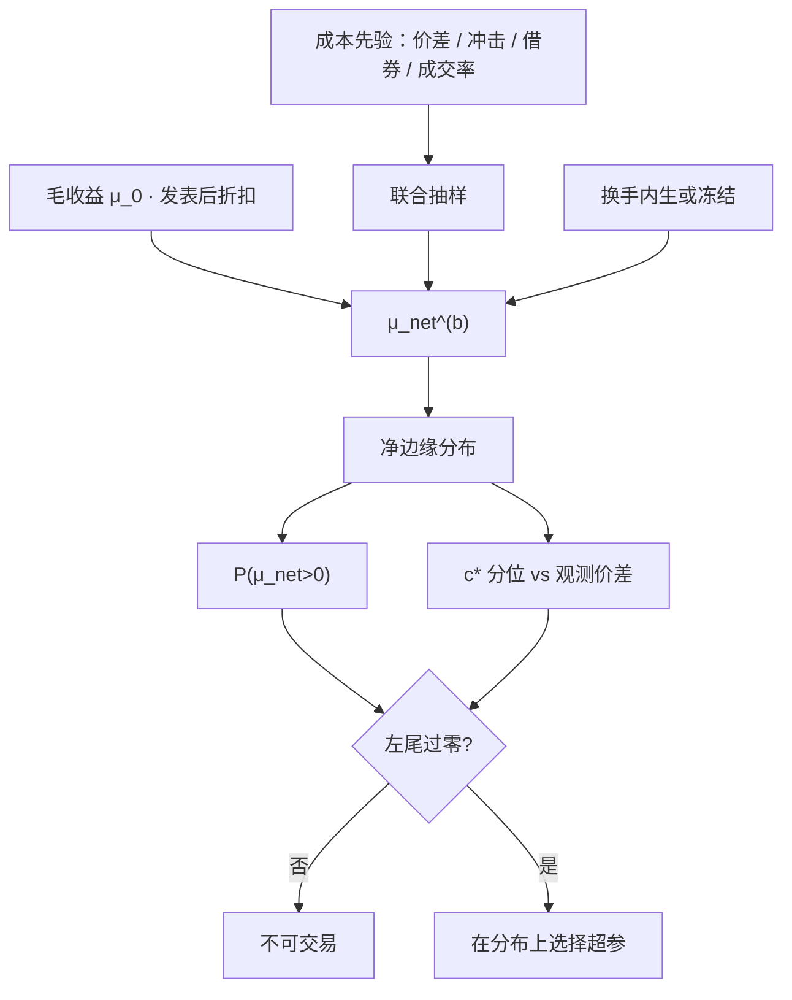

# 费用滑点蒙特卡洛

    
许多异常按换手排序后，高换手一端在交易成本上不可交易；结论随价差与冲击假设而翻转，说明「扣费后仍显著」必须做成对成本参数的函数，而不是做成一个点。

    <footer>—— Novy-Marx and Velikov, Review of Financial Studies, 2016；对照 Perold, Journal of Portfolio Management, 1988</footer>

[费用敏感性](/quant/cost-sensitivity) 用网格扫价差乘数与冲击系数，画出 $\mathrm{SR}_{\mathrm{net}}(c)$ 和保本成本 $c^\star$。网格假定每个 $c$ 都是已知常数。真实成本是一组不确定的参数：有效价差、[平方根冲击](/quant/sqrt-impact)的系数、借券费率、成交率、时机误差，彼此相关，且随波动与拥挤变。蒙特卡洛把 $c$ 写成分布，把净业绩写成该分布下的随机量：不是「我们扣了 8 个基点」，而是「在成本先验下，净边缘为正的概率、以及翻转点落在观测价差的哪一段」。它与[成交后分析](/quant/tca)互补：TCA 校准分布的位置，MC 传播校准误差。Hou–Xue–Zhang 复制时经济幅度已经变小，成本先验稍往上移，许多「加权后仍显著」的异常会过零；McLean–Pontiff 的发表后剩余收益同样要在成本分布里重新过零，而不是点估计过零一次就算数。

## 问题

净收益 $\mu_{\mathrm{net}}=\mu_0-\tilde{c}\cdot\mathrm{TO}$，其中 $\tilde{c}$ 是单位换手的随机成本。$\tilde{c}$ 至少含：半价差或有效价差、临时冲击、永久冲击、借券、税费、未成交的机会成本。把它们压成常数，等于假设一个与名字、波动、参与率无关的世界。对该世界里的夏普做[Deflated Sharpe](/quant/deflated-sharpe)，统计量再干净，输入也是错的。

更麻烦的是参数相关。波动上升时价差与冲击系数往往一起变大，换手也可能上升；拥挤时永久冲击比例上升，借券费跳升。网格把各轴独立扫一遍，会低估「坏成本同时发生」的尾部。MC 用联合分布——经验上可用历史有效价差、短fall、借券时间序列的自助法或参数 copula——才能看到净边缘的左尾。高换手策略对这个左尾最敏感：Novy-Marx–Velikov 按换手分档之后，高换手一端在成本假设上不可交易，结论随模型翻转。

### 实施缺口的每一项都是一个随机源

Perold 的实施缺口是决策价到最终成交的全程差异。滑点常被回测写成「相对下一根 bar 偏了若干 tick」。前者是账户诊断，后者是模拟器参数。MC 应分别冲击：价差乘数、冲击函数系数、成交率、延误、借券。只扰动一个「总费用 bp」，会把延误与冲击的协方差藏掉。身份也要进分布：Frazzini–Israel–Moskowitz 的机构短fall 低于许多学术价差模型；用他们的点估计当唯一 $c$，再声称零售可复制的日频策略「对成本不敏感」，是身份错配。MC 的每一列先验都要注明：谁的成本、哪一段样本估出来的。

只对最终冠军做一次成本 MC，是虚假稳健。冠军是在某一种 $c$ 下选出来的。应在每次 MC 抽样里重新选择，或至少对候选集合同时评分，让选择程序本身对 $c$ 的分布稳健。

## 方法

**先验。** 价差：用历史有效价差的截面分位或按 ADV、波动分层的回归残差，做成对数正态或经验分布。冲击系数：用自己成交回报校准平方根或线性核，参数给标准误，MC 从渐近正态或自助法抽。借券：对空头腿用费率的历史路径重抽样，危机月单独加一层膨胀。成交率：对涨跌停、浅簿名字用 Beta 分布，均值取模拟器完成率。相关：至少让价差与冲击系数正相关，让换手与波动正相关。

**目标量。** 每次抽样计算：扣费后夏普、$\mu_{\mathrm{net}}$、$c^\star$ 是否低于该次抽样的实现成本、最大回撤、以及 $\mu_{\mathrm{net}}(A)$ 过零的规模。报告这些量的中位数、10% 分位、以及「净边缘 $>0$」的频率。对统计套利还应按 ADV 分位分层抽，避免用指数期货的窄先验给小盘策略背书。成本参数在训练段估计、在检验段冻结后再做 MC，否则用全样本价差解释全样本信号，又是一层[泄漏](/quant/cv-leakage-finance)。

**与选择的联合。** 对每一组超参计算一条 $c\mapsto\mathrm{SR}_{\mathrm{net}}(c)$，在 MC 样本上取最差 10% 或期望作为选择标准。另一种做法是把成本情景嵌进 [CPCV](/quant/cpcv) 路径：过拟合概率应在坏成本下仍然不是二分之一。回测引擎必须把费用、税费、借券与滑点写成可配置输入，否则 MC 每次都要改代码，实际上不会做。

### 保本成本的分布比一个 $c^\star$ 难作假

点估计 $c^\star$ 使 $\mu_{\mathrm{net}}=0$。MC 给出 $c^\star$ 的分布，再与观测有效价差的分布比。若 $c^\star$ 的 10% 分位已经低于价差的 10% 分位，策略在观测成本下经常没有边缘；若 $c^\star$ 的下尾仍高于价差的上尾，结论对成本较不敏感。把这条比较按发表前后切开：McLean–Pontiff 的发表后毛收益更低，$c^\star$ 左移，许多原文「扣费后仍显著」会翻转。Hou–Xue–Zhang 的市值加权把 $\mu_0$ 本身削薄，同样左移 $c^\star$。MC 要同时扰动毛收益的衰减情景与成本先验，否则只是在一个已经乐观的 $\mu_0$ 上撒成本噪声。

平方根系数的标准误往往被低估：校准样本是活下来的策略与当时选中的名字。MC 应把校准的选择偏差加成更厚的先验，而不是把回归标准误当成全部不确定性。

## 机制

成本进入期望的方式是乘换手，但换手本身对成本参数有弹性：价差变宽，阈值再平衡会少交易；冲击变贵，优化器会降换手。MC 若把换手冻在 $c=0$ 的路径上，会高估成本的伤害，也会低估「高换手冠军在坏成本下会先被换掉」的选择效应。完整做法是每次抽样重跑带成本的目标函数，让换手内生。这比事后减常数贵，但对应的是真实决策。

永久冲击与临时冲击在 MC 里不应共用一个乘数。临时部分随参与率、当日深度变；永久部分随信息泄露与拥挤变。对容量曲线做 MC，扰动的是核 $G$ 的半衰期与永久比例，见[策略容量与冲击衰减](/quant/strategy-capacity-decay)。只扰动「滑点 bp」，会把存量容量问题误写成流量费用问题。

### 经济显著性是 MC 左尾过零与否

统计显著的多空，在成本分布的左尾上可能没有经济显著。[经济 vs 统计](/quant/econ-vs-stat-sig) 把门槛说清楚：t 高可以来自微盘等权、来自长样本的微弱溢价、来自未扣费。MC 是把「微弱溢价 × 不确定成本」变成可报告的概率。Harvey–Liu–Zhu 的 t>3 管发现；成本 MC 管发现之后能不能付账。两道闸都要通过。

## 边界与工程取舍

历史价差不是未来成本。电子化之后有效价差系统性下降，用 1990 年代先验会过度惩罚；用最近三年最窄价差又会过度乐观。应至少做两种先验：保守（含危机分位）与基准（近期中位数），分别报告。A 股涨跌停使成交率的先验在板上坍缩到零，MC 必须允许「未成交」这一原子事件，而不是把滑点加到无穷。不要用危机期高 ADV 去收窄冲击系数的先验。

不要把 MC 当成可以把任意策略「做成稳健」的仪式。若 90% 的抽样净边缘为负，结论是策略不可交易，而不是再抽一次直到频率好看。参数先验的支撑必须预先指定；看到结果后改分布，是另一层过拟合。

出处：Novy-Marx and Velikov, *RFS*, 2016；Perold, *JPM*, 1988；Keim and Madhavan, *FAJ*, 1998；Korajczyk and Sadka, *JFE*, 2004；McLean and Pontiff, *JF*, 2016；Hou, Xue and Zhang, *RFS*, 2020。冲击函数见 Almgren–Chriss；身份错配见 Frazzini, Israel and Moskowitz 的执行短fall 讨论。

## 小结

- 费用滑点蒙特卡洛把成本参数写成联合分布，报告净边缘为正的概率与 $c^\star$ 相对观测价差的位置，而不是一个扣费点。
- 高换手策略对成本左尾最敏感；独立网格会低估坏成本同时发生。
- 选择必须在抽样内重做或对成本分布稳健，只对冠军扫一遍是虚假稳健。
- 毛收益应叠加 McLean–Pontiff / Hou–Xue–Zhang 的衰减与加权缩水，再扰动成本。
- 先验要声明身份与样本；涨跌停下成交率必须允许未成交。
- 出处：Novy-Marx–Velikov, *RFS*, 2016；Perold, *JPM*, 1988；McLean–Pontiff, *JF*, 2016；Hou–Xue–Zhang, *RFS*, 2020。
