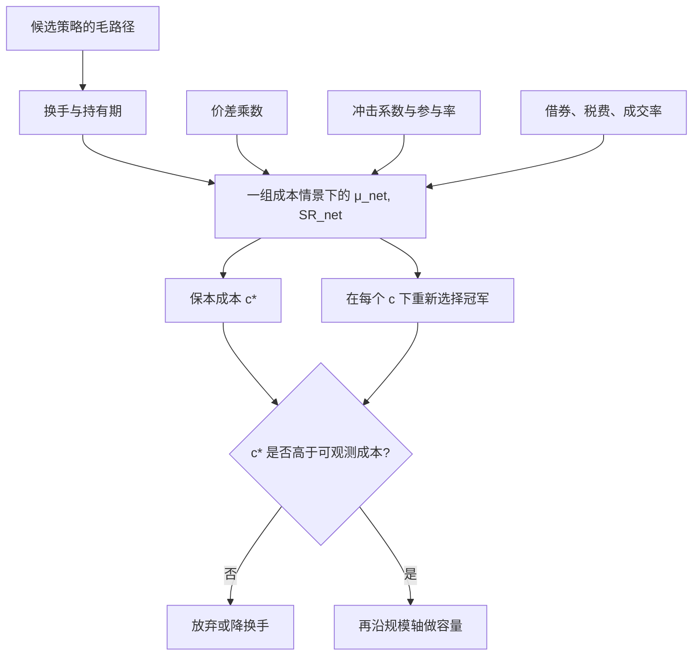

# 费用、滑点敏感性

许多异常按换手排序后，高换手一端在交易成本上不可交易；结论随价差与冲击假设而翻转，说明「扣费后仍显著」必须做成对成本参数的函数，而不是做成一个点。

<footer>—— Novy-Marx and Velikov, Review of Financial Studies, 2016；对照 Perold, Journal of Portfolio Management, 1988</footer>

回测表最底下常常有一行：扣除若干基点费用之后夏普仍高于 1。这一行把成本当成已知常数。真实成本是价差、冲击、借券、税费与时机误差的和，并且随名字、波动、参与率与拥挤状态变化。Novy-Marx 与 Velikov（2016）表明，按换手给异常分档之后，高换手策略对成本假设最敏感。Korajczyk 与 Sadka、Lesmond、Schill 与 Zhou 在动量上得到同一形状：无成本很强，成本模型一换，可交易性就变。敏感性分析要回答的不是「我们用了 8 个基点」，而是：成本在哪一段区间里结论翻转，以及这个翻转点相对你能观测到的有效价差是否可信。它是实验设计，与[可交易性](/quant/net-edge)互补：前者画弹性，后者给身份绑定的净期望。

## 问题

净收益可以写成毛收益减去单位成本乘换手。单位成本 $c$ 不是标量。报价价差的一半、有效价差、实现价差依次更接近你付的钱；冲击随 $q/\mathrm{ADV}$ 上升；卖空还有借券。把它们压成「单边 10bp」，等于假设一个与规模、名字、波动无关的世界。对该世界里的夏普做[Deflated Sharpe](/quant/deflated-sharpe) 或 CPCV，统计量再干净，输入也是错的。

更麻烦的是成本与信号选择纠缠。网格搜索偏爱高换手规则，因为无摩擦时换手把微弱的条件期望放大成高夏普。一旦 $c$ 上升，这些规则最先死亡。若你先在 $c=0$ 上完成选择，再对冠军做一次成本扣除，敏感性被低估：死去的那些高换手兄弟没有进入分母，冠军看起来「扣费后还行」。正确顺序是：成本模型进入训练目标，或至少对每一候选在一组 $c$ 上同时评分，让选择本身对 $c$ 稳健。

### 实施缺口与滑点不是同一会计科目

Perold 的实施缺口是决策价到最终成交的全程差异：延误、部分成交、放弃的单。滑点常被回测写成「成交价相对下一根 bar 的开盘或中点偏了若干 tick」。前者是账户层面的诊断，后者是模拟器里的一个参数。把滑点设成常数 tick、却用决策价记账，会漏掉延误；只在成交上加价差、却假设全部立即成交，会漏掉未成交。敏感性必须分别冲击这几项：价差乘数、冲击函数的系数、成交率、借券费率，而不是只扫一个「总费用 bp」。

Frazzini、Israel 与 Moskowitz 用机构执行数据估计的短fall 低于许多学术价差模型。用他们的数字当唯一 $c$，再声称零售可复制的日频策略「对成本不敏感」，是身份错配。敏感性表的每一列都要注明：谁的成本。

## 方法

一张最低限度的敏感性表：横轴是成本情景（例如有效价差的 $0.5\times,1\times,2\times$，再叠加平方根冲击的不同系数），纵轴是扣费后夏普、换手、最大回撤、以及 $\mu_{\mathrm{net}}$ 过零的规模。Novy-Marx–Velikov 的精神是按换手分档展示，避免用低换手因子的稳健性给高换手策略背书。对统计套利与微观结构信号，还应按波动分位与 ADV 分位分层：同一 $c$ 在低价小盘上可以是致命的，在指数期货上可以忽略。

保本成本（break-even cost）是使 $\mu_{\mathrm{net}}=0$ 的那个 $c^\star$。若 $c^\star$ 低于你历史有效价差的下分位，策略在观测到的成本下没有边缘；若 $c^\star$ 远高于上分位，结论对成本较不敏感。把 $c^\star$ 与 Almgren–Chriss 一类冲击在目标参与率下的预测值比较，比报「我们扣了 8bp」更难作假。成本参数本身应在训练段估计、在检验段冻结，否则用全样本价差去解释全样本信号，又是一层[泄漏](/quant/cv-leakage-finance)。

### 让选择对成本稳健

对每一组超参计算一条 $c\mapsto\mathrm{SR}_{\mathrm{net}}(c)$ 曲线，用该曲线在合理 $c$ 区间上的最差或积分作为选择标准，而不是用 $c=0$ 的夏普。这会自然惩罚换手。另一种做法是把成本情景当成 CPCV 路径的一个额外维度：过拟合概率应在「坏成本」下仍然不是 $1/2$。工程上，回测引擎必须把费用、税费、借券与滑点写成可配置输入，而不是写死在成交函数里，否则敏感性分析每次都要改代码，实际上不会做。

只对最终冠军扫一遍 $c$，是最常见的虚假稳健。冠军是在某一种 $c$ 下选出来的；对它扫 $c$ 只描述它的局部弹性，不描述选择程序的弹性。应报告「在每一种 $c$ 下重新选择」时冠军是否还是同一个家族。

## 机制

成本对期望的侵蚀与换手成正比，对夏普的侵蚀还通过波动：扣费后若减少的是正的均值而不是波动，夏普下降得比均值更快。冲击是凸的：参与率上升时边际成本上升，所以规模放大不是把 $c$ 线性外推。拥挤使 $c$ 变成状态变量——2007 年 8 月那类同步退出里，价差与冲击同时跳升，平静期校准的 $c$ 完全不够。敏感性若只用平静期的价差分布，会漏掉左尾最要紧的那一截。

滑点与信号衰减同向恶化。衰减快的信号必须更快成交，于是成为 taker、付有效价差与临时冲击；衰减慢的信号可以排队、用时间换价格，但对[队列位置](/quant/cancel-queue-position)敏感，回测若假设中点成交，等于把 maker 的等待无偿赠送。Harris 对 make/take 的划分在这里变成成本情景：主动成交情景与被动成交情景应分开画，而不是平均成一个滑点。

### 税费、最小变动价位与离散

A 股印花税、T+1、涨跌停使「对称的双边 bp」模型失效：卖边更贵、未成交与延迟隔夜暴露都是成本。最小变动价位把滑点量子化，低价股上一个 tick 可以是几十个基点。敏感性分析应把 tick 成本单独扫一遍。期货与 ETF 一级市场有另一套费用与冲击，不能用股票有效价差去填。身份、场所、指令类型都是成本函数的自变量，见[订单类型](/quant/order-types)。

## 边界与工程取舍

学术成本模型有测量误差，机构执行数据有选择偏差。敏感性分析不能消灭误差，但能告诉你结论依赖哪一段假设。若翻转点落在模型误差范围内，策略尚未准备好谈部署。不要用「我们做过敏感性」这句话替代那张表：必须出现 $c$ 的定义、样本、以及翻转点。也不要把成本敏感性当成优化目标去搜一组「在所有 $c$ 下都好看」的超参——那会把成本情景变成新的样本内维度，需要外层[滚动](/quant/walk-forward)来约束。

容量是敏感性的规模轴。同一参与率下，$c$ 随 ADV 与波动变；把规模轴与成本轴拆开，才能看到是「费用假设杀了策略」还是「规模杀了策略」。二者的联合报告见[容量与参与率](/quant/capacity-participation)。

Lesmond–Schill–Zhou（2004）把动量利润称作 illusory，针对的是当时无成本表。后续文献并未证明所有高换手策略都是幻觉；证明的是：不扫成本、不报翻转点的夏普，不能当作可交易边缘。

## 小结

- 费用与滑点应做成情景表与保本成本，而不是回测表底下一行常数 bp。
- 高换手策略对 $c$ 最敏感；选择必须在扣费目标上进行，否则冠军本身是无摩擦世界的产物。
- 实施缺口、价差、冲击、未成交要分开扫；身份与场所决定你该用哪一列成本。
- 平静期价差不能代表拥挤与涨跌停；翻转点若落在测量误差里，策略不可部署。
- 成本轴与规模轴是联合约束，下一步是容量与参与率。
- 出处：Novy-Marx and Velikov, *RFS*, 2016；Perold, *JPM*, 1988；Korajczyk and Sadka, *JFE*, 2004；Lesmond, Schill and Zhou, *JFE*, 2004；Almgren and Chriss, *Journal of Risk*, 2000/2001；Frazzini, Israel and Moskowitz, 执行成本研究。
