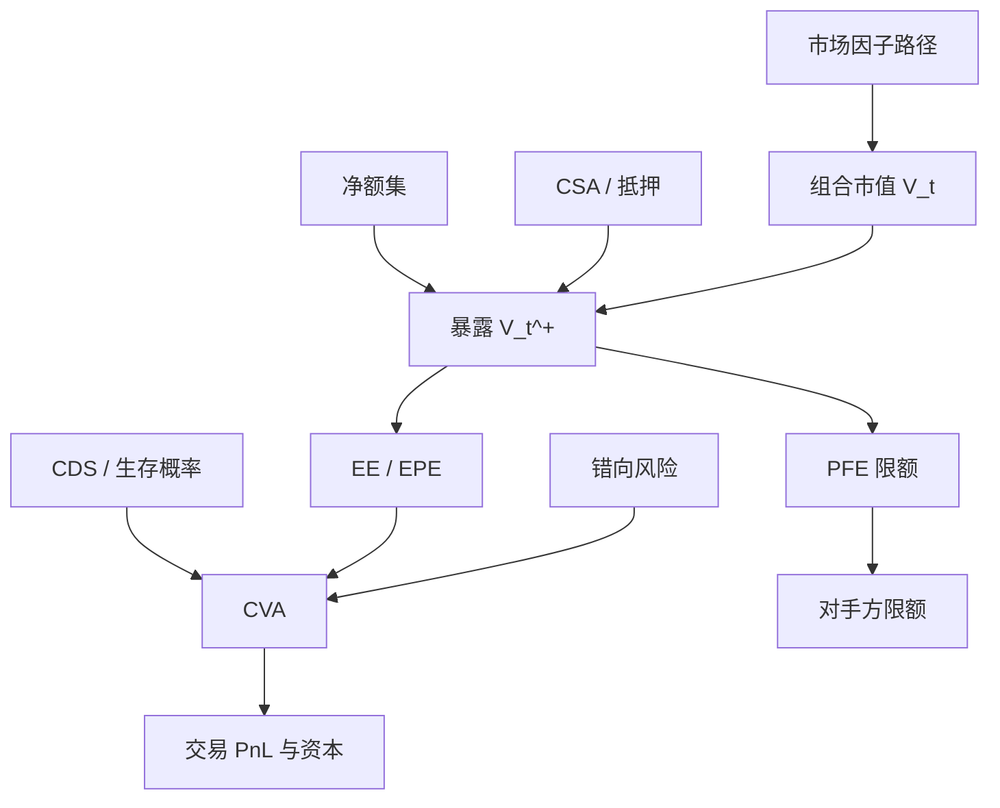

# 对手方与信用风险要点

衍生产品的信用风险不是一张固定面值的贷款：暴露随市值波动，可正可负，还与对手方的违约强度纠缠在一起。

<footer>—— 对照 Canabarro and Duffie, Measuring and Marking Counterparty Risk, 2003</footer>

买债券时，你借出本金，信用风险的上界大致是面值减回收。做互换、期权、回购时，今天市值可能对你有利、明天翻面，违约若发生在暴露为正的日子，损失是重置该合约的成本。对手方信用风险（CCR）研究的就是这条随机暴露，以及如何用净额、抵押品、CVA 把它标成价格与资本。Merton（1974）给出企业负债的期权图景；Duffie 一脉把它接到强度模型与对手方估值。2008 年之后，CVA 从「调整项」变成交易台自己的风险因子——对手方利差一动，未违约也可能立刻亏钱。

## 问题

记与对手方 $C$ 的组合在 $t$ 的市值为 $V_t$（对我为正表示对方欠我）。若 $C$ 在 $\tau$ 违约，损失大约是 $(1-R)\,V_{\tau}^+$，其中 $R$ 是回收，$V^+$ 是正暴露。与贷款不同：$V_t$ 本身由市场风险驱动，可能在违约前已经回到零。因此需要一整条暴露过程，而不是一个 EAD 常数。常用统计量：期望暴露 $\mathrm{EE}(t)=\mathbb{E}[V_t^+]$，期望正暴露的时间平均（EPE），潜在未来暴露 $\mathrm{PFE}(t)$ 为 $V_t^+$ 的高分位数。PFE 管限额，EE/EPE 进 CVA 与资本。

第二个问题是依赖。若对手方在市场朝你有利时更容易违约（例如你买了它的信用保护、或它与你的抵押品同向），叫错误方向风险（wrong-way risk）。此时 $\mathbb{E}[V_\tau^+]$ 大于无条件 EE，用独立假设算 CVA 会系统性偏低。Brunnermeier（2009）叙述的 2007–2008 年，正是对手方风险、融资流动性与火线抛售缠在一起：AIG 的 CDS 账面在抵押品催缴下变成流动性危机，不是「等到违约再计损失」。

### 净额与抵押把暴露从名义本金里救出来

ISDA 主协议下的 close-out netting：同一对手方的多笔合约在违约时轧差成一个净值，再决定谁欠谁。没有净额，每笔正市值都可能全损，负市值的对手方破产管理人仍向你要钱。CSA（信用支持附件）再要求按净值每日或阈值抵押。有了合格抵押，当前暴露被压缩到阈值加最低转账额加抵押品估值折扣；剩下的主要是边际期内（margin period of risk）市值跳出来的那一块。Pykhtin 与 Zhu（2007）把这些从模拟引擎写到资本公式的翻译，是实务 CCR 的标准地图。

净额是法律对象，不是风险系统里「把正负 MtM 加总」那么简单。跨管辖、跨产品、未签署协议的分支机构，可能不在同一个净额集。模型若假设全球一张网，限额会假瘦。

## 方法

**暴露模拟。** 在一组市场因子上做路径（利率、外汇、信用利差、股票），对每条路径、每个未来日期按估值模型重算组合 $V_t$，再按净额集与 CSA 规则扣抵押，得到 $V_t^+$。EE 与 PFE 是路径截面的均值与分位。抵押品的延迟、争议、降级触发（downgrade triggers）必须进模拟，否则有 CSA 的组合会显示接近零暴露——与 2008 年的催缴现实不符。

**CVA。** 在无错误方向、强度与市场独立的简化下，

$$
\mathrm{CVA} \approx (1-R)\sum_i \mathrm{DF}(t_i)\,\mathrm{EE}(t_i)\,\bigl(Q(t_{i-1})-Q(t_i)\bigr),
$$

其中 $Q$ 是对手方生存概率，由 CDS 曲线校准。这是把暴露当成「随机名义」的单名 CDS。DVA 是自己违约时对方承担的对称项；FVA 把自身融资加进贴现，争议更多。Basel 的 CVA 资本还对对手方利差的市场风险收资本，因为 CVA 会随 CDS 波动——即使 EE 没变。

**错向风险。** 把对手方hazard 写成市场因子的函数，或在模拟里用对手方资产价值与组合驱动因子的相关。无法校准得很稳时，至少做压力：把 EE 曲线在利差走阔的路径上单独加权。Merton 结构模型提供相关的微观故事：对手方资产下跌时，它更可能违约，同时某些与它同向的风险因子也在跌——你的接收腿可能正在升值。

### 限额、资本与价格是三套数字

PFE 限额防止「潜在」集中：即使今天 MtM 为零，远期 PFE 大的对手方也不能无限加仓。EPE 与监管资本（CEM/SA-CCR 或内部 IMM）决定占用。CVA 进入交易价格与 PnL。三者用同一套净额与 CSA 假设时才可对账；若交易台用无抵押 EE 报价、风控用有抵押 PFE 限额、资本用监管公式，会出现「价格很便宜、限额已满、资本极贵」的分裂。工程上应把净额集、抵押协议、模拟日历做成主数据，而不是三个团队各写一套。

中央对手方（CCP）把双边 CCR 变成对 CCP 的暴露加违约基金。初始保证金降低 EE，但不消灭尾部：会员违约时的 loss allocation 仍是信用风险，只是分布形状变了。把 CCP 当零风险，只是把名字从 CVA 挪到营运与系统性。

## 机制

经济上，CCR 是重置风险：违约时你要在当时的市场上再找人接那笔合约，重置价格就是 $V^+$。抵押品把重置风险缩短到边际期；净额把重置从「每笔」变成「每个净额集」。CVA 把这件事先卖成利差：你向对手方收的费率里，有一块是在卖它的违约。当市场上该对手方的 CDS 走阔，CVA 亏损立刻实现，无需等到违约——这是 2008 年后交易台最痛的一课。

与发行人信用的差别：债券信用的暴露几乎就是本金；衍生品信用的暴露是市场的期权。同一名字，你可能对它有债券多头（经典信用）又有互换负市值（它违约你反而少了一笔应付）。风险报告必须按净额集拆开，不能按「我喜欢这个名字」合并。可转债里的信用（见[可转债与信用](/quant/convertible-credit)）是发行人风险；OTC 对冲该可转债的互换则是经销商对手方风险，两条腿的违约事件不是同一个。

### 流动性螺旋里的对手方

Brunnermeier 描述的挤兑，很多不是债券违约，而是对手方担心对方会倒、要求更多抵押，把对方逼进火线卖出。CCR 模型若把抵押品当成总是可获得、总是低折扣的现金，就看不到这条路径。合格抵押的范围收窄、外汇错配、再抵押链条断裂，都会让「有 CSA」的 EE 在压力里重新膨胀。因此压力 PFE 必须用压力折损与拉长的边际期，而不是把基准 CSA 模拟的分位数乘一个乘数。

## 边界与工程取舍

强度模型对短期限 CDS 校准很好，对没有 CDS 的名字要靠映射（评级、区域、行业），映射误差会进入 CVA 的第一主成分。回收率 $R$ 在衍生品 close-out 里还取决于净额与估值争议，不是债券回收的同一个数。错误方向风险几乎无法用历史违约直接估——违约样本太少——只能情景化，并避免用「历史上没发生」当作零。

模拟的市场模型必须与前台估值足够近，否则 EE 是错的价格上的正确统计。利率与外汇的美式、可赎回结构需要在路径上做嵌套估值或美国蒙特卡洛，计算代价高；用欧式近似会系统性偏暴露。不要用债券 VaR 的 99% 去替代 PFE：持有期、净额、抵押与期权性都不同。

CVA 对冲会买进对手方 CDS 或代理指数，本身又制造新的对手方与流动性风险。对冲的是利差，不是违约事件的法律回收；基差在名字违约时可以炸开。

## 小结

- 对手方风险的损失是违约时的正暴露乘 LGD，暴露由市值路径、净额与抵押决定，不是固定面值。
- EE/EPE 服务估值与资本，PFE 服务限额；CVA 把期望损失提前标进价格，并随对手方利差波动。
- 净额与 CSA 大幅压缩当前暴露，剩余主要是边际期内的跳价与法律可执行性。
- 错误方向风险与融资催缴使独立假设下的 CVA 偏低；2008 年是同时爆发的样本。
- 出处：Merton, *On the Pricing of Corporate Debt*, Journal of Finance, 1974；Canabarro and Duffie, *Measuring and Marking Counterparty Risk*, 2003；Pykhtin and Zhu, *A Guide to Modelling Counterparty Credit Risk*, GARP, 2007；Brunnermeier, *Deciphering the Liquidity and Credit Crunch 2007–2008*, Journal of Economic Perspectives, 2009。
