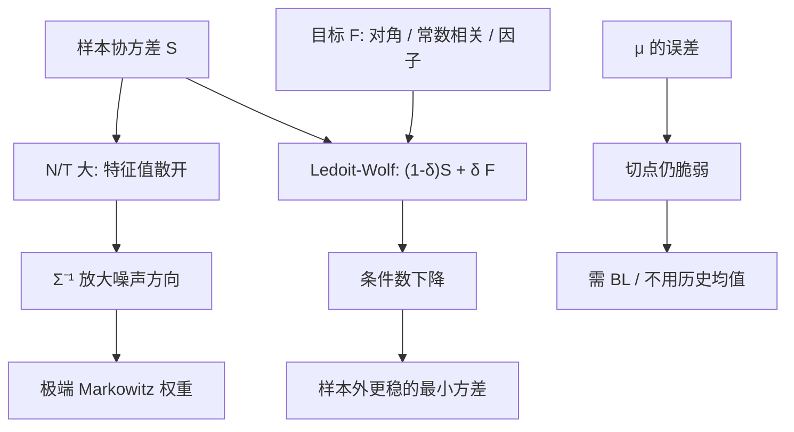

# 估计误差与收缩

样本协方差在维度与样本量同阶时病态；把它向一个结构良好的目标拉近，往往比「用更多数据硬估」更能改善组合。

<footer>—— Ledoit & Wolf, Honey, I Shrunk the Sample Covariance Matrix, Journal of Portfolio Management, 2004；以及 2003–2004 年的最优收缩公式</footer>

[Markowitz](/quant/markowitz) 的二次型需要 $\Sigma$。样本协方差 $S$ 在 $N/T$ 不小时特征值散开：最大的过大、最小的过小甚至为零，优化器对着噪声特征向量下重仓。Jobson 与 Korkie（1980）已经展示样本切点的崩溃；Michaud（1989）称之为误差最大化。Ledoit 与 Wolf 把 Stein 式收缩写成对 $S$ 的凸组合：$\hat\Sigma=(1-\delta)S+\delta F$，并给出使期望二次损失最小的 $\delta$。本篇写估计误差如何破坏前沿、收缩目标怎么选、以及它与因子风险模型、[统计 PCA](/quant/stat-risk-pca) 的分工。均值的估计误差通常比协方差更致命，但协方差病态是可以单独先修的一层。

## 问题

设有 $N$ 个资产、$T$ 个观测。$S$ 有 $\min(N,T-1)$ 个非零特征值。$N\gt T$ 时 $S$ 不可逆，最小方差组合没有定义。即使 $N\lt T$，当 $N/T\to c\in(0,1)$，随机矩阵理论表明样本特征值按 Marčenko–Pastur 律散开，真 $\Sigma$ 的条件数被夸大。$\Sigma^{-1}$ 把最小特征值的倒数变成巨大权重，而这些方向往往是估计噪声。结果是：样本前沿远远好于真前沿（样本内），样本外一塌糊涂。

均值更吵：年化超额收益的标准误在波动 20%、十年样本上仍是几个百分点，与风险溢价同阶。切点 $w\propto\Sigma^{-1}(\mu-r_f\mathbf{1})$ 对 $\mu$ 线性、对 $\Sigma$ 的逆也敏感，两头放大。问题是设计估计器，在偏差与方差之间换：给 $S$ 加结构（因子、常数相关、单位阵），或给 $\mu$ 加均衡先验（[Black-Litterman](/quant/black-litterman)），或干脆放弃 $\mu$、只做最小方差或 [风险平价](/quant/risk-parity）。

### 误差最大化不是优化器的性格问题

优化器做的是它被要求的事：在给定输入下把二次型最小化。输入的噪声方向若表现为「低风险高超额」，权重就会堆上去。换求解器、加随机种子，解决不了这件事。能改变的是输入的有效自由度：收缩、特征值截断、因子结构、权重约束，都是在减少优化器可利用的噪声维数。把「优化有害」写成方法论，不如写成「未正则的样本 $\Sigma^{-1}$ 有害」。

日度数据增加 $T$，也增加微观结构噪声与非同步，见已实现协方差的文献。把采样频率拉到分钟并不自动让 $S$ 变好。收缩与因子结构处理的是维度，不是 tick 噪声；两者要分开修。

## 方法

Ledoit–Wolf 一类估计器

$$
\hat\Sigma=(1-\delta)S+\delta F,
$$

$F$ 是目标。常见目标：单位阵（或对角，保留方差、收缩相关）、常数相关（Ledoit–Wolf 2004 JPM「honey」）、单因子（市场）、多因子。最优 $\delta$ 最小化 $\mathbb{E}\|\hat\Sigma-\Sigma\|_F^2$，在正态或更弱条件下可用样本矩一致估计，不必交叉验证网格——这是相对朴素混合的要点。$\delta$ 随 $N/T$ 增大而增大：越病态，越信目标。

特征值清理（Random Matrix Theory）：把 Marčenko–Pastur 上沿之外的特征值当成信号，之内的压成常数再重构，是另一种收缩。因子模型 $\Sigma=BFB^\top+\Delta$ 用经济结构当 $F$ 的来源，特异方差 $\Delta$ 保持可逆。Ledoit–Wolf 与因子可以叠：对残差协方差再收缩。均值侧：James–Stein 把样本均值拉向总均值；对超额收益，更常见的是不用历史均值，而用均衡 $\Pi=\delta\Sigma w_{\mathrm{mkt}}$ 或零（最小方差）。

### 损失与评价

应在样本外评价：滚动估计 $\hat\Sigma_t$，形成组合（最小方差、等风险、或带收缩 $\mu$ 的切点），看下一期的已实现波动、换手与夏普。样本内的 $w^\top S w$ 必然偏小。评价还要固定约束：无约束切点的崩溃不能拿来否定带卖空限制的收缩最小方差。Ledoit–Wolf 的论文用的是协方差估计的 Frobenius 损失以及最小方差组合的样本外方差，不是「把夏普最大化到不能再高」。组合目标变了，最优 $\delta$ 也会变；为定价因子估计 $\Sigma$ 与为 500 只股票优化，不必共用一个 $\delta$。

## 机制

收缩起作用，是因为它牺牲无偏、换条件数。目标 $F$ 把质量堆到低维结构上，噪声特征方向被抬离零，逆矩阵不再爆炸。偏差是：若真相关结构与 $F$ 冲突（行业块、突然的拥挤因子），$\hat\Sigma$ 会低估那些方向的风险——直到样本 $S$ 的权重 $(1-\delta)$ 把它们部分带回。$\delta$ 的最优公式已经在平均意义上平衡这一点；在结构破裂的个别月份，你会暂时估计不足。这与 [统计 PCA](/quant/stat-risk-pca) 的权衡同构：结构稳则偏差小，结构错则要靠样本。

均值不收缩时，协方差收缩仍能显著降低最小方差组合的样本外波动，因为该组合不依赖 $\mu$。对切点组合，只收缩 $\Sigma$、不处理 $\mu$，改善有限：错误的超额仍被 $\Sigma^{-1}$ 投影成极端多空。因此收缩协方差是必要层，不是充分层。实务上的稳健栈往往是：因子 $\Sigma$ + 残差收缩 + 不用历史 $\mu$ + 权重约束。

把所有相关缩到零（对角 $F$）会让优化器接近按 $1/\sigma_i^2$ 加权，这与逆波动、某些风险平价在相关均匀时的行为相近。相关并不是「越缩越好」：常数相关目标往往比单位阵更适合股票，因为股票相关均值明显为正。

### 高维渐近给出的直觉

当 $N,T\to\infty$、$N/T\to c$，样本特征值的上沿与下沿有显式公式。真特征值若埋在 bulk 里，就不可能被一致分开。收缩与 RMT 清理接受这一点：不试图识别 bulk 内的因子。Bai–Ng 一类准则试图估计可识别的因子个数 $K$，那是另一条路：先定 $K$，再估因子，而不是把整个 $S$ 向 $F$ 拉。两条路可以在混合模型里会合。不要用 $c\approx 1$ 的样本去声称「发现了第 17 个风险因子」。

## 边界与工程取舍

不要对已经因子化、条件数良好的 $\Sigma$ 再做一次无结构的大幅度收缩，以免把行业块抹平。不要用全样本估 $\delta$ 再在同一样本上报告组合表现。不要把 Ledoit–Wolf 的 $\delta$ 当成风险预算：它是估计参数，不是资产配置。收益率若有厚尾与波动聚类，$S$ 本身不是有效估计，应先用稳健协方差或已实现核，再收缩。

国际资产、不同币种、不同流动性，样本同步性差，$S$ 的相关会偏短。收缩不能修复非同步偏差，只能让矩阵可逆。均值的 Stein 收缩把所有股票拉向同一均值，会消灭截面风险溢价——若你的策略正是要吃截面，应收缩 $\Sigma$ 而把 $\mu$ 交给因子模型或 Black–Litterman 观点，而不是对 $\mu$ 做全局 James–Stein。

「Honey, I shrunk the sample covariance matrix」不是幽默标题党：目标选常数相关时，收缩的是相关矩阵的离差，方差可以保持。实现时要看你缩的是协方差还是相关；先把方差标准化再缩相关，再还原方差，是常见且更干净的顺序。

## 小结

- 样本协方差在高维下病态，$\Sigma^{-1}$ 把噪声方向变成极端权重；这是估计问题，不是均方目标的失败。
- Ledoit–Wolf 用最优强度把 $S$ 缩向结构目标（单位阵、常数相关、因子），最小化期望 Frobenius 损失。
- 最小方差主要吃协方差估计的改善；切点还要处理 $\mu$，否则收缩 $\Sigma$ 不够。
- 因子模型、RMT 特征值清理与收缩是同一病的不同药，可以叠加，不要重复抹平已有结构。
- 评价必须样本外，并声明组合规则与约束。
- 出处：Jobson & Korkie, *Journal of the American Statistical Association*, 1980；Michaud, *Financial Analysts Journal*, 1989；Ledoit & Wolf, *Journal of Empirical Finance*, 2003；*Journal of Multivariate Analysis*, 2004；*Journal of Portfolio Management*, 2004。
