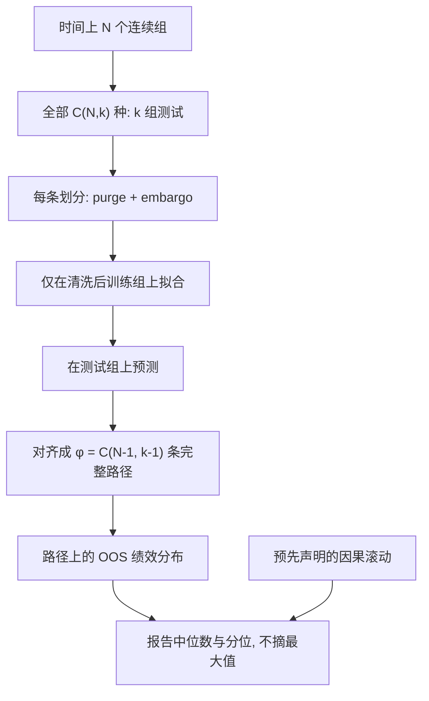

# Combinatorial Purged CV

单条回测路径是一次历史实现；把样本切成 $N$ 组、对测试组做组合，可以在同一段历史上生成许多条经过清洗的样本外路径，从而看到评估本身的分布。

<footer>—— López de Prado, Advances in Financial Machine Learning, Chapter 12, 2018</footer>

[组合过拟合 CPCV](/quant/cpcv) 一文从 Bailey 等人的回测过拟合概率（PBO）出发，把组合对称划分写成估计「样本内冠军样本外是否掉到中位以下」的实验设计。AFML 第 12 章的 Combinatorial Purged Cross-Validation（CPCV）还有另一半用途，而且常常才是工程上先碰到的那一半：对**已经冻结的一个估计器**，生成许多条样本外预测路径，用路径上的绩效分布代替「那一条幸运的 walk-forward」。本篇写这一半：组数 $N$、每组测试块数 $k$、路径条数如何计数、每条路径上如何 purge，以及它与 PBO、与[滚动检验](/quant/walk-forward)如何分工。不把 CPCV 再讲成一种优化器。

## 问题

Walk-forward 尊重时间箭头，但只给出一条（或很少几条）拼接的样本外曲线。窗口个数往往是十几，相邻窗口还共享波动状态。你看到的夏普是这条路径的点估计，看不到「若切分稍有不同，点估计会散成什么样」。普通 $K$ 折给出 $K$ 段折外，却破坏时间，且金融标签重叠会泄漏，见[交叉验证泄漏](/quant/cv-leakage-finance)。需要一种划分：每一段历史都有机会当测试，测试段的训练标签被清洗，并且测试结果可以拼成**覆盖全样本的多条路径**，而不是 $K$ 个碎片。

López de Prado 的构造是：把 $T$ 个观测按时间分成 $N$ 个连续组（groups）。每一次划分选取其中 $k$ 个组当测试、其余 $N-k$ 个当训练，测试组不必相邻。全部组合有 $\binom{N}{k}$ 种。每种组合在清洗后的训练集上拟合一次，在该组合的测试组上预测。于是每个组会在许多种组合里当测试，得到多套折外预测。再按规则把这些预测对齐成若干条完整路径。问题从「报告一条 OOS 夏普」变成「报告 OOS 夏普的经验分布」。

### 路径条数不是组合数

组合数是 $\binom{N}{k}$。每个组出现在测试中的次数是 $\binom{N-1}{k-1}$。一条完整路径需要对每个组选取一次「当它是测试组时」的预测。可以证明，能够对齐出来的路径数是

$$
\varphi=\binom{N-1}{k-1}=\frac{k}{N}\binom{N}{k}.
$$

例如 $N=6,k=2$，$\binom{6}{2}=15$ 种划分，$\varphi=5$ 条路径。每条路径仍覆盖全部 $N$ 组的时间，但每组上的预测来自不同的训练补集。$\varphi$ 才是你用来画分布的样本路径数；把 15 种划分的夏普当 15 条独立回测，会重复使用同一段测试、高估精度。

$k=1$ 时 CPCV 退化为 purged $K$-fold：$\varphi=1$，只有一条由 $N$ 段折外拼成的路径。要看到分布，必须 $k\ge 2$。这是组合验证相对普通 $K$ 折的全部意义所在。

## 方法

选定 $N,k$ 使 $\varphi$ 足够大、而每次训练仍留有 $N-k$ 组。对每一个组合 $c$：测试索引为所选 $k$ 组；训练索引为其余组再减去与测试标签重叠的样本（purge），并在每个测试块结束后禁运一段（embargo），细节见 [Embargo 与 Purge](/quant/purge-embargo)。在清洗后的训练索引上拟合预处理与模型，对测试索引预测。把预测写入一张「观测 × 路径」的表：同一观测在 $\varphi$ 条路径里各有一个折外预测（来自不同组合里该观测所在组当测试的那些次）。

绩效在**路径维**上算：每一列是一条完整的样本外收益或预测序列，得到 $\varphi$ 个夏普、$\varphi$ 个最大回撤。报告中位数、分位、以及最差路径，而不是报告最好路径。若还要一条可叙述的因果曲线，另外跑预先声明的 walk-forward，不要从 $\varphi$ 条里挑最好的那条充当「样本外」。

### 与 PBO 的接口

PBO 需要 $M$ 个候选：在每个划分的训练块上选冠军，看冠军在测试块上的相对排名。[cpcv.md](/quant/cpcv) 写的是这件事。本章的路径分布针对 $M=1$：它回答「这个冻结的估计器在不同训练补集下有多稳」，不回答「你搜过的集合是否过拟合」。两者应串联：先用带 PBO 的组合实验看搜索过程，再对晋级的那一个估计器做本章的路径分布，最后用 [DSR](/quant/deflated-sharpe) 把尝试次数写进夏普的检验。跳过第一层、只用路径中位数当选模标准，等于把 $\varphi$ 条路径又变成一次选择。

计算上 $\binom{N}{k}$ 次拟合必须向量化。订单级回测跑不了这么多次时，应在研究层用同一套标签与成本模型评分，晋级后再对冻结候选做少量事件级模拟。评分函数若含全样本标准化，组合次数只是把泄漏复制 $\binom{N}{k}$ 遍。

交错的测试组使部分路径在时间上不是「先训练后交易」的部署顺序。这些路径合法地用于估计评估不确定性，不合法地用于估计冲击与容量。可部署性仍以因果滚动为准。

## 机制

每条路径对应一种「哪些历史被拿去训练、哪些被拿来考试」的选择。真实技能在多数训练补集下仍应给出同类预测；过拟合于某段噪声的模型，一旦该段被拿去测试、训练里没了这段，绩效会塌。路径分布的离散度因此是**划分敏感性**的估计。它不能创造新的历史：$\varphi$ 条路径高度依赖同一段噪声实现，三年数据上的窄分位并不等于三年外的保证。

与 CSCV 的对称一半对一半相比，CPCV 的 $k$ 可调：测试块更少则每次训练更充分、更像部署，但 $\varphi$ 的解释变成「在较厚的训练集上换较薄的测试块」；测试块更多则更接近 Bailey 的对称设计，训练更饿。没有 universally 最优的 $(N,k)$。预先冻结，并报告一组邻近值的敏感性，而不是看完分布再选 $\varphi$ 最大的那个。

### 每个观测的多预测不是集成指令

同一 $t$ 上有 $\varphi$ 个折外预测，可以用来看该 $t$ 上预测的稳定度，但不要把它们平均成一个「更聪明」的信号再交易——那是在用测试期的多个模型做事后集成，部署时你没有这些平行宇宙。路径是评估用的，不是新的 alpha。若要集成，必须定义一种不看测试标签的规则（例如只平均当时已经拟合完成的模型），并单独走一遍验证。

## 边界与工程取舍

CPCV 不替代成本、容量与非平稳。路径中位数好看而因果滚动失败，通常是交错划分平均掉了体制顺序。反过来，滚动好看而路径分布极宽，说明你看到的滚动夏普高度依赖窗口。两者都要报。$N$ 太大则每组太短，purge 之后训练集空洞；$N$ 太小则 $\varphi$ 不够。标签很长时，先缩短标签或加长组，不要取消清洗。

候选一旦因看到路径分布而增删，分布作废，必须回到 PBO 那一层重新冻结集合。这与「在验证集上早停后再把验证曲线当样本外」是同一类错误。

AFML 把回测定义为对无偏评估器的输入。CPCV 的输出是分布；研报标题若只摘上分位，组合验证就被降级成又一次选美。

## 小结

- AFML 第 12 章的 CPCV 用 $\binom{N}{k}$ 种划分、对齐成 $\varphi=\binom{N-1}{k-1}$ 条清洗后的完整样本外路径，用来估计单个估计器的划分敏感性。
- $k=1$ 退化为单条 purged $K$ 折；要分布必须 $k\ge 2$。
- 路径分布回答稳不稳，PBO 回答搜索过不过拟合，walk-forward 回答可不可按时间部署，DSR 回答夏普在尝试次数下还剩多少。
- 交错路径不是交易模拟；禁止从路径里挑最好的一条当样本外。
- 出处：López de Prado, *Advances in Financial Machine Learning*, Wiley, 2018，第 12 章；PBO/CSCV 见 Bailey, Borwein, López de Prado and Zhu, *Journal of Computational Finance*, 2017，综述见 [组合过拟合 CPCV](/quant/cpcv)。
