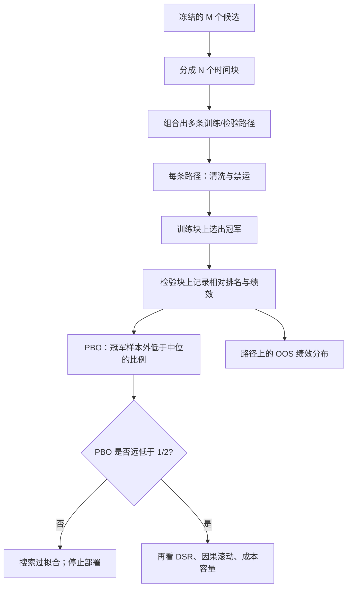

# 组合过拟合 CPCV

单条样本外路径太容易被选中；组合对称地生成许多条训练–检验划分，才能估计「样本内冠军在样本外仍高于中位数」这一事件的概率。

<footer>—— Bailey, Borwein, López de Prado and Zhu, The Probability of Backtest Overfitting, Journal of Computational Finance, 2017；López de Prado, AFML, Chapter 12</footer>

滚动检验给出一条沿时间拼接的样本外曲线，信息有限：窗口个数通常是十几，而且相邻窗口共享状态。Bailey、Borwein、López de Prado 与 Zhu（2017）问的是另一个量：在你搜索过的策略集合里，把样本内最优者拿到样本外，它的表现低于中位数的概率有多大——回测过拟合概率（Probability of Backtest Overfitting, PBO）。估计 PBO 需要许多条对称的训练–检验划分，而不是一条幸运的切分。组合对称交叉验证（CSCV）以及 López de Prado 在 *Advances in Financial Machine Learning* 第 12 章写的组合清洗交叉验证（Combinatorial Purged Cross-Validation, CPCV），就是为了生成这些路径。它们是实验设计，不是又一种优化器。

## 问题

设候选策略有 $M$ 个，历史长度 $T$。样本内挑出夏普最高的 $m^\star$，再看它在某段样本外的夏普。若只有一次切分，$m^\star$ 的样本外好坏高度依赖切点：末端若正好是该策略擅长的体制，你会相信发现；末端若不擅长，你会改切点。PBO 把「样本内最优在样本外相对整个集合的表现差于中位」定义为过拟合事件。技能真实且选择温和时，PBO 应明显低于 $1/2$；纯噪声搜索时，PBO 接近 $1/2$ 或更高——冠军在样本外没有优势。

$K$ 折交叉验证路径太少（只有 $K$ 条），且金融里有[标签泄漏](/quant/cv-leakage-finance)。普通 walk-forward 路径更少。要估计一个概率，需要组合：把 $T$ 分成 $S$ 组，在 $\binom{S}{S/2}$ 种「一半训练、一半检验」的划分上重复「样本内选冠军、样本外记相对排名」。这就是 CSCV 的骨架。CPCV 在同一骨架上加上清洗与禁运，使每一条路径的训练标签不偷看检验期。

### 为什么对称划分

若总是「前半训练、后半检验」，所有路径共享同一个时间箭头，估计的是某种特定的非平稳，而不是选择偏差本身。组合对称让每一段历史都有机会当训练、也有机会当检验，从而把「这段日子特别好」平均掉，留下「挑选冠军」这一操作带来的偏差。代价是部分路径在时间上是交错的，不再模拟真实的部署顺序；PBO 度量的是过拟合，不是可部署性。可部署性仍要靠[滚动](/quant/walk-forward)那一条遵守因果的路径。

PBO $=0.2$ 不是许可。它只说明在你声明的候选集合与划分方案下，冠军并不系统性地在样本外掉到中位以下。候选集合若事先用全样本筛过一遍，PBO 会假低：真正的搜索空间比送进 CPCV 的 $M$ 更大。

## 方法

CSCV（Bailey 等，2017）。将观测均分为 $S$ 个连续块（$S$ 为偶数）。每一个组合 $c$ 取其中 $S/2$ 块为训练、互补块为检验。在训练块上对 $M$ 个策略评分，记下最优者 $m^\star_c$，再看 $m^\star_c$ 在检验块上相对 $M$ 个策略的相对排名。若一半以上的组合里 $m^\star_c$ 的样本外表现低于中位数，则 $\widehat{\mathrm{PBO}}$ 高。同时可画样本内绩效与样本外绩效的散点：过拟合表现为明显的负斜率——样本内越好，样本外越差。

CPCV（AFML 第 12 章）。测试集不再固定为「一半块」，而是从 $N$ 个组里组合出 $k$ 个测试组，生成 $\binom{N}{k}$ 条路径；每条路径上对训练样本做 purge 与 embargo，避免标签重叠。每个观测会出现在多条测试路径里，于是得到该观测上的一簇样本外预测或收益，而不只是单次切分的一个点。这比 $K$ 折更充分地使用数据，也比单次 walk-forward 更能看到评估的不确定性。

### 报告什么

最低报告应包括：候选集合如何构造（是否含已被全样本淘汰的兄弟）、$S$ 或 $(N,k)$、清洗长度、$\widehat{\mathrm{PBO}}$、IS–OOS 散点、以及各条路径样本外夏普的分布。López de Prado 建议把回测看成对无偏评估器的输入，而不是看成一张权益曲线。CPCV 的输出是分布；只摘分布的上分位，等于把组合验证又变成一次选择。若还要报一个点估计，应预先声明是路径中位数还是遵守时间顺序的那条滚动路径，不能是路径最大值。

候选之间高度相关时，$M$ 很大但有效试验很少，PBO 可能看起来很好——大家样本外一起好或一起坏，冠军相对中位的优势稳定，却只是同一个赌注。应先对策略收益做相关聚类，按有效独立个数读 PBO，并与 [Deflated Sharpe](/quant/deflated-sharpe) 的有效 $N$ 交叉核对。

## 机制

选择偏差的几何图像是：样本内绩效把噪声抬进冠军，样本外噪声独立（在无泄漏、无重叠标签时），于是冠军的样本外条件期望低于它的样本内，甚至低于集合的无条件中位。CSCV 用对称划分逼近这种条件期望。若泄漏存在，训练与检验共享噪声，PBO 被压低，过拟合被评估器藏起来——所以 CPCV 必须先 purge。这与 White Reality Check 的精神一致：承认你看了许多规则；差别在于 CPCV/PBO 给出的是路径上的相对排名概率，Reality Check 给出的是最大统计量相对基准的 $p$ 值。

路径条数随组合数指数增长，这是有意的。$K$ 折的 $K$ 条路径估计不出「冠军掉到中位以下」这种尾部事件。组合验证用的是同一段历史的不同切法，不是新的历史：它不能创造信息，只能把已有信息里被切分选择所掩盖的变异性展示出来。因此 CPCV 不能拯救一个只有三年数据的高换手策略；三年数据的组合路径高度依赖同一段噪声实现。

### 与滚动、DSR 如何一起用

一个完整的实验设计可以是：用 CPCV 估计搜索是否过拟合，用 DSR 给最终候选的夏普放气，用嵌套滚动给出一条可叙述的因果样本外曲线，用成本与容量决定能否交易。四者回答不同问题。只用滚动，你不知道若切分不同会怎样；只用 DSR，你不知道相对排名；只用 PBO，你没有一张可审计的「若从某年做到某年」的权益曲线。López de Prado 把 CPCV 放在回测架构的中心，正是因为业界最常犯的错是把一条路径的夏普当成总体参数。

## 边界与工程取舍

组合路径不是交易模拟。交错的训练/检验块无法对应真实的下单顺序，也不能直接用来估[冲击](/quant/cost-sensitivity)。PBO 低且 DSR 高的策略，仍可能在因果滚动上因非平稳而失败。反过来，PBO 接近 $1/2$ 时，几乎不应进入模拟账户：你还没有证据表明搜索产生了可迁移的优势。

计算上 $\binom{N}{k}$ 可以很大，需要对策略向量化评分，而不是对每条路径重跑订单级回测。若评分函数本身有泄漏（全样本标准化），CPCV 只是把泄漏复制到每一条路径。候选集合必须冻结：看到 PBO 偏高就删掉一些差的候选再算一次，PBO 会下降，这是对评估器动手。诚实的做法是扩大报告：给出搜索日志上的 PBO，而不是给出清洗后集合上的 PBO。

Bailey 等人也讨论过拟合的「第二类」错误：真技能被保守评估杀掉。PBO 不是越小越好的目标函数；把它当优化目标去调 $S$、调清洗、调 $M$，会得到好看的 PBO 和同样过拟合的系统。

## 小结

- CPCV/CSCV 用组合划分生成许多条样本外路径，用来估计回测过拟合概率，而不是用来再挑一个更漂亮的切分。
- PBO 高意味着样本内冠军在样本外没有稳定的相对优势；路径中位数与 IS–OOS 散点应一起报告。
- 金融标签必须在每条路径上 purge/embargo，否则 PBO 被泄漏压低。
- 组合路径度量选择偏差，不替代遵守时间顺序的滚动模拟，也不替代成本。
- 候选集合与划分方案必须冻结；在 PBO 上再优化是第二层过拟合。
- 出处：Bailey, Borwein, López de Prado and Zhu, *Journal of Computational Finance*, 2017；López de Prado, *Advances in Financial Machine Learning*, Wiley, 2018，第 7、12 章；White, *Econometrica*, 2000。
