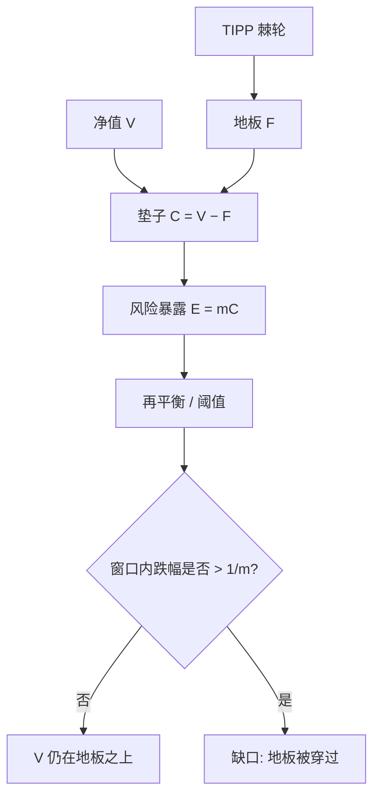

# 组合保险 CPPI / TIPP

把风险资产仓位钉在乘数乘以垫子上：垫子是净值与地板之差。只要再平衡足够密、路径足够连续，净值就不会穿过地板；离散与跳跃把这条保证变成缺口风险。

<footer>—— Black and Perold, Theory of Constant Proportion Portfolio Insurance, Journal of Economic Dynamics and Control, 1992</footer>

组合保险要的不是最大化夏普，而是在事先声明的地板之上参与上涨。期权复制（OBPI）用看跌或动态 Delta 去买这份凸性，贵且依赖隐含波动。Black 与 Jones（1987）、Perold 与 Sharpe（1988）把同一思想收成常数比例组合保险（Constant Proportion Portfolio Insurance, CPPI）：风险暴露等于固定乘数 $m$ 乘以垫子。Black 与 Perold（1992）给出连续时间理论：在无跳、可连续交易时，CPPI 等价于一份幂效用下的最优策略，并保证不破地板。Estep 与 Kritzman（1988）的时间不变组合保护（Time Invariant Portfolio Protection, TIPP）把地板随净值新高上移，把已实现收益锁进保险。本篇写垫子、乘数与缺口，不把 CPPI 写成止损规则的别名，也不把它与[回撤约束优化](/quant/drawdown-calmar)混成同一个规划。

## 问题

记净值 $V_t$，地板 $F_t$（通常按无风险利率增长，或按名义本金的固定比例），垫子 $C_t=V_t-F_t$。CPPI 令风险资产名义 $E_t=m\,C_t$，余下 $V_t-E_t$ 放现金或债券。$m\gt 1$ 时策略对垫子加杠杆；$C_t$ 缩小则自动降仓，直到 $C_t=0$ 时 $E_t=0$，全部坐在地板资产上。问题是：在什么交易与路径假设下，$V_t\ge F_t$ 几乎必然成立；一旦假设坏掉，破地板的损失有多大、由谁承担。

OBPI 的地板由看跌执行价决定，成本在期初以权利金付清。CPPI 的「权利金」是机会成本：上涨时因 $m$ 有限而少赚，下跌时因降仓而少亏，再平衡摩擦另计。两者凸性来源不同：OBPI 买的是市场隐含的跳风险价格；CPPI 自己制造凸性，却把跳与缺口留在组合里。

### 保证成立的路径类

Black–Perold 在连续半鞅、无摩擦、可连续再平衡下证明：只要初始 $C_0\gt 0$ 且 $m$ 有限，$V$ 不会穿过 $F$。直觉是仓位随垫子线性收缩，在触及地板的瞬间暴露已为零。离散再平衡破坏这一点：若两次调仓之间风险资产跌幅超过 $1/m$，垫子被一次吃光并穿到负，此时 $E$ 仍按旧垫子杠杆，缺口 $F-V$ 要由保本承诺方补。跳跃过程同样：价格不连续，仓位来不及收。因此 CPPI 的「保险」是对连续路径的复制，不是对任意半鞅的套利界。

$m=5$ 意味着两次再平衡之间只要跌过 20%，地板就会破。宣传材料里的「保本」若不同时写再平衡频率与允许跳幅，说的是定理假设，不是产品条款。缺口通常由发行商、担保人或投资者的剩余索取权承担，三方合同必须写清。

## 方法

**地板与乘数。** $F_0$ 常取初始本金的 $80\%\sim 95\%$，再按 $r$ 增长；或取零息债面值，使到期名义保本。$m$ 在 3 到 6 之间最常见：太小则参与率低，太大则缺口概率升。约束 $E_t\le V_t$ 防止无融资时名义超过净值；允许融资时 $E_t$ 可大于 $V_t$，缺口风险进一步放大。债券腿的久期若与地板的折现不匹配，利率上升会同时打债券市值与地板现值，垫子的会计与经济口径会分叉。

**再平衡规则。** 连续理论要求瞬时调仓。实务用阈值：垫子相对上次调仓变化超过若干比例，或日历定期（日、周）。阈值过宽等于主动放大缺口窗口；过窄则换手与冲击吃掉凸性。交易约束、涨跌停与停牌使「想调不能调」，缺口在这些日子集中出现。把 CPPI 套在期货上时，保证金与展期成本进入债券腿，须从垫子里扣，否则 $C_t$ 被高估。

**TIPP 的棘轮。** Estep–Kritzman 令地板随净值上移：例如 $F_t=\max(F_{t-},\,\alpha V_t)$，$\alpha$ 为保护比例。高水位一旦锁定，随后的下跌只消耗新垫子，已实现涨幅不再用来冒险。代价是参与率路径依赖：一波大涨之后 $C/V$ 变薄，$m$ 即使不变，有效风险暴露下降，后续牛市里更像债券。TIPP 不是更高的 $m$，而是把保险对象从「初始本金」改成「锁定过的高点」。

### 与 OBPI、止损、波动目标的分工

OBPI：期初买看跌，或用 Black–Scholes Delta 复制。隐含波动升时权利金贵，CPPI 不受这笔直接收费，但市场跳的时候 CPPI 恰好最脆弱。止损是一次性降到现金，没有垫子公式，跌穿后再涨也不会按 $mC$ 加回，凸性不对称。波动目标按 $\sigma$ 缩放名义，地板不是状态变量：低波动时杠杆升高，即使净值已贴近心理止损。四者可以叠用，叠用后不再有 Black–Perold 的保证，必须重新仿真缺口。

## 机制

CPPI 的收益对风险资产是凸的：上涨时垫子变厚、仓位变大，下跌时相反，类似复制看涨。连续情形下，这与 CRRA 或 HARA 在存在生存约束时的最优投资一致——Black–Perold 把乘数与风险厌恶、地板贴现链在一起。TIPP 的棘轮相当于不断把新的财富水平宣布为不可侵犯，投资者的有效风险厌恶随财富上移而升高。

缺口的机制是杠杆与离散的乘积。单步收益 $r$，旧暴露 $E$，新净值 $V'=V+E r$。若 $V'\lt F$，缺口为 $F-V'$。最坏单步是风险资产跳到接近零；$m$ 越大、再平衡越稀、资产越能跳，期望缺口越大。这与[跳跃检验](/quant/jump-tests)的对象直接相关：保本产品的风险不是日波动，而是再平衡窗口里的跳。用 HAR 预报的连续 RV 去设 $m$，会系统性低估缺口——连续波动再高，只要路径连续且调仓够密，理论仍保本；真正打破保证的是跳与停牌。

危机里 CPPI 会在低点附近把股票卖完，随后反弹买不回来，造成「锁定损失」。这不是公式算错，是凸性策略在跳与缺口之后的路径依赖。TIPP 在高点锁地板，会更早进入纯债券，反弹缺席更严重。

### 乘数不是风险预算的倒数

风控上的杠杆上限、保证金与 CPPI 的 $m$ 同量纲但不同对象。$m$ 相对于垫子，不是相对于净值：净值远高于地板时，净值杠杆 $E/V=m(1-F/V)$ 可以低于 $m$。把 $m$ 写成「五倍杠杆产品」会误导。反过来，净值贴近地板时，净值杠杆仍可接近 $m$，小垫子配高乘数，绝对风险资产金额已经很小，但相对垫子的跳风险最大。报告应同时给 $E/V$ 与 $E/C$，以及再平衡窗口内的历史最大不利跳幅是否超过 $1/m$。

## 边界与工程取舍

CPPI 不处理对手方：债券腿若是发行人负债，地板本身会在发行人违约时消失。担保人、SPV、国债抵押必须写进产品，而不是写进乘数。交易成本使连续再平衡不可行；应在含冲击的仿真里选阈值，而不是在无摩擦净值上画「从未破地板」。A 股涨跌停与 T+1 让股票腿无法按公式调仓，期货或 ETF 往往才是可执行的风险腿，基差与升贴水进入垫子误差。

不要把 CPPI 当 alpha：乘数不创造风险溢价，只分配已有溢价与保险。不要在已经 vol target 的 CTA 上再套一层同向的 CPPI 而不检查减仓同步——两者都会在波动升高时卖出，见[拥挤与清盘螺旋](/quant/crowding-spiral)。不要用期权隐含波动去「校准」$m$ 却仍按无跳理论报保本概率。

压力测试 CPPI 应直接对再平衡窗口施加历史跳幅与流动性枯竭，而不是只把年化波动乘 1.5。反向问题是：要使缺口超过承诺，需要多大的单步跌幅与多长的无法交易区间，见[反向压力测试](/quant/reverse-stress-test)。

## 小结

- Black–Perold 的 CPPI 用固定乘数乘垫子配置风险资产；连续无跳时可保证不破地板。
- 离散再平衡与跳跃把保证变成缺口风险，临界跌幅约为 $1/m$。
- TIPP 把地板随净值高点上移，锁住已实现收益，代价是随后参与率下降。
- 与 OBPI、止损、波动目标对象不同，叠用后须重新仿真，不能沿用连续理论的保本陈述。
- 出处：Black and Jones, *Simplifying Portfolio Insurance*, JPM, 1987；Perold and Sharpe, *Dynamic Strategies for Asset Allocation*, FAJ, 1988；Estep and Kritzman, *TIPP: Insurance without Complexity*, JPM, 1988；Black and Perold, *Journal of Economic Dynamics and Control*, 1992。
