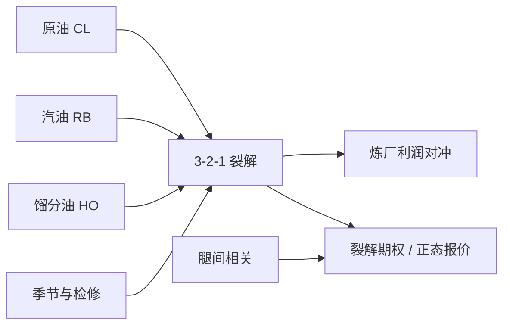

# 能源裂解价差

    
炼厂卖出的是成品油，买入的是原油；二者的价差才是加工利润。把这一价差写成可交割的期货组合，裂解就从会计科目变成可对冲的风险因子。

    <footer>—— 能源商品实务；裂解期权与价差合约见 NYMEX / CME 产品说明</footer>

[上一课](/quant/commodity-roll-alpha)按基差与库存在品种与到期之间排序，把平均展期变成横截面；现货溢价与期限溢价应分开记账。那是跨品种规则，不是一张加工利润单。原油价格本身不决定炼厂赚不赚钱：汽油与馏分油跟不上则裂解收窄。缺口是标准化价差——空原油、多汽油与取暖油，比例近似炼厂收率。它不是协整残差，而是有物理约束的加工利润。本课写 3-2-1 何时是可对冲利润、期权波动该从哪条曲面读，不重做展期排序。

## 问题

记原油期货价格为 $F^{\mathrm{CL}}$、汽油（RBOB）为 $F^{\mathrm{RB}}$、取暖油 / ULSD 为 $F^{\mathrm{HO}}$。美国炼厂经验收率大约是：三桶原油产出约两桶汽油与一桶馏分油。于是 3-2-1 裂解（未做单位换算时）形状为

$$
\mathrm{Crack}_{321} = 2\,F^{\mathrm{RB}}+F^{\mathrm{HO}}-3\,F^{\mathrm{CL}}.
$$

报价单位不一致：原油是美元/桶，汽油与馏分油常是美元/加仑，一桶约 42 加仑。实务要把成品油乘 42 再进价差，否则数字差一个数量级。问题是：这一价差何时是炼厂的可对冲利润，何时只是三条曲线的瞬时线性组合；以及期权若以裂解为标的，波动率与偏斜应从哪一条曲面读。

裂解还会随季节翻转主导腿。夏季驾驶季汽油权重大，冬季取暖与柴油权重大；同一 3-2-1 在八月与一月的风险因子不同。出口窗口、炼厂检修、强制规格切换（夏季汽油蒸汽压）都会让「固定比例」变成错误对冲。把裂解当成单因子利率互换去套 [Delta / Gamma / Vega 对冲](/quant/greeks-hedge) 的模板，会漏掉跨商品 Gamma 与曲线展期。

### 为何是 3-2-1 而不是 1-1

1-1 裂解（汽油减原油，或柴油减原油）便于报价，却对不上整厂收率：炼厂不能只产汽油。3-2-1 是对综合利润的一阶近似，不是每座炼厂的真实线性规划。高复杂度炼厂能把渣油再裂化，有效裂解更接近「更多汽油、更少残渣」；简单炼厂在重质原油上裂解更差。交易的标准化合约选择流动性最好的比例，而不是每家炼厂的边际桶。因此裂解期货的持仓里，既有炼厂锁利润，也有宏观账户把「炼厂利润」当成能源风险的一个主成分。

把裂解的「3」当成必须同时成交三张原油合约，是教学口算。生产上按美元中性或桶中性再缩放，并处理 RB/HO 与 CL 的合约乘数、交割月错配。比例是风险权重，不是下单手数的迷信。

## 方法

**现货与期货裂解。** 现货裂解用地区成品油与原油现货，含运费、品质与规格差；期货裂解用同一交易所的对应月。基差把两者拆开：炼厂真正锁定的是自己进出厂的现货裂解，期货只对冲其可交易部分。品质（WTI / Brent / 迪拜）、含硫、API 度都会改变有效裂解，不能把 Cushing 的 CL 当成所有原油的通用对冲。

**单位与乘数。** 令汽油、馏分油报价为美元/加仑，原油为美元/桶，则美元/桶计的 3-2-1 为

$$
\mathrm{Crack}_{321}^{\$/\mathrm{bbl}} = \frac{2\times 42\,F^{\mathrm{RB}}+42\,F^{\mathrm{HO}}-3\,F^{\mathrm{CL}}}{3}.
$$

分母除以 3 是「每桶原油」的利润；有的报价不加这个 3，只报组合总价差，比较时必须声明。CME 另有裂解价差期权，执行价直接打在裂解点数上，结算按期货组合，避免分别执行三条腿的钉住风险。

**对冲比。** 炼厂预期加工 $Q$ 桶，对冲手数按合约规模换算，再按计划收率微调汽油与柴油腿。若收率随原油品质变化，对冲比本身是状态变量：重质原油到来时汽油收率下降，原 3-2-1 变成过度对冲汽油。动态调整接近商品版的 Delta，只是标的是收率而非股价。

### 裂解期权与波动率坐标

裂解期权的隐含波动率不是三条腿隐含波动的线性组合。即使各腿都用 Black 公式报价，价差的分布更接近近似正态或移位对数正态，因为价差可正可负。用对数正态 Black 硬套可能在价差靠近零或转负时崩溃，实务常用 Bachelier（正态）报价，这与利率 SABR 在低利率上的选择同构，见 [SABR](/quant/sabr) 的 $\beta=0$ 端。希腊字母：对原油的 Delta 为负、对成品油为正；交叉 Gamma 来自腿间相关。相关上升时裂解方差下降（三腿同向动），裂解期权变便宜——这是 vol-of-spread，不是原油自身的 vol-of-vol。不要把 Heston 的 $\sigma$ 或 SABR 的 $\nu$ 未经换算接到裂解切片上。

## 机制

裂解的经济学是加工约束加库存。原油供给冲击若同时抬高成品油，裂解未必动；成品油需求冲击（驾驶季、取暖季、出口套利打开）在炼厂产能短跑时把裂解拉宽。产能是缓慢变量，检修与意外停工是跳跃。因此裂解过程常呈现：平季均值回复、旺季或中断时跳升、而后被增产与进口压回。均值回复速度远快于原油本身的长期趋势，这使裂解更像利差而非价格水平。

季节性进入曲线形状。汽油裂解在春夏升水、馏分油裂解在秋冬升水；3-2-1 是二者的加权，年初与年中的主导风险不同。把全年样本估一个半衰期去交易均值回复，会把季节当成 alpha。正确做法是先剥季节与检修日历，再看残差是否还有可交易的偏离。

### 与单腿能源曲线的分工

单腿原油曲线交易的是库存与便利收益；裂解交易的是炼厂边际。二者相关但不互相包含：原油 backwardation 可以与裂解极窄并存（成品油库存同样紧），也可以与裂解极宽并存（原油紧在井口、成品油因炼厂故障而更紧）。风险分解应把能源账面拆成基准原油、产品裂解、地区价差、品质价差，而不是只报一个「石油 Delta」。期权账本上，单腿香草的 Vega 与裂解期权的 Vega 对冲不了对方，除非相关与权重恰好使价差波动被单腿波动解释——市场里这很少成立。

裂解走宽时，空头裂解的 Gamma 与空头香草类似：大跳吃亏。但跳的来源是停工与规格切换，不是股价跳。隔夜缺口来自海外市场与美国库存公布，对冲频率问题见 [隔夜跳空对冲](/quant/overnight-gap-hedge)，不要用股票指数的 16:00 收盘去套能源 14:30 的 EIA 窗口。

## 边界与工程取舍

3-2-1 忽略化工轻烃、渣油、氢气与环保指标（RINs、硫含量）。欧洲以柴油为主的裂解、亚洲以石脑油与中质馏分的裂解，不能把美国 3-2-1 数字横搬。布伦特体系用不同成品油规格与不同交割地，基差会吞掉纸面裂解。交割月必须对齐：用近月汽油对冲远月原油，剩下的是曲线风险，不是裂解风险。

期权方面，裂解市价稀疏，翼部无套利检验比股指更难做；[蝶式与日历](/quant/butterfly-calendar-arb) 的密度解释在三条腿的联合分布上，不是单标的 Breeden–Litzenberger。模型若用三资产相关扩散，校准相关与各腿微笑会竞争，和单标的 [Heston](/quant/heston) 五个参数不是同一套识别。纸货与实货结算差异、税务与运费，会使「期货裂解」与「现金利润」长期偏离，这不是定价公式的套利，是基差。

库存周报与炼厂利用率是裂解的宏观状态变量，不是期权隐含波动的替代。把 EIA 公布后的跳空写成「实现 vol」，可以；把它直接当成次日裂解期权的公平隐含，忽略风险溢价与跳跃补偿，会把保险卖错边。

## 小结

- 裂解价差度量炼厂加工利润；标准化 3-2-1 用两份汽油、一份馏分油对冲三份原油，并必须做加仑–桶换算。
- 它是有物理收率约束的多腿组合，不是单因子价格，也不是协整残差。
- 裂解期权常用正态报价；波动来自腿间相关与各腿波动，不能把 Heston / SABR 参数未换算套用。
- 季节、检修、规格切换改变主导腿；固定比例只是一阶对冲。
- 风险应拆成基准原油、裂解、地区与品质，单腿 Vega 对冲不了裂解 Vega。
- 出处：NYMEX / CME 裂解价差与裂解期权产品说明；能源商品曲线与库存机制见商品衍生品实务（Geman 等）；微笑工具见 Hagan et al.，SABR，2002，以及 Heston，1993。
