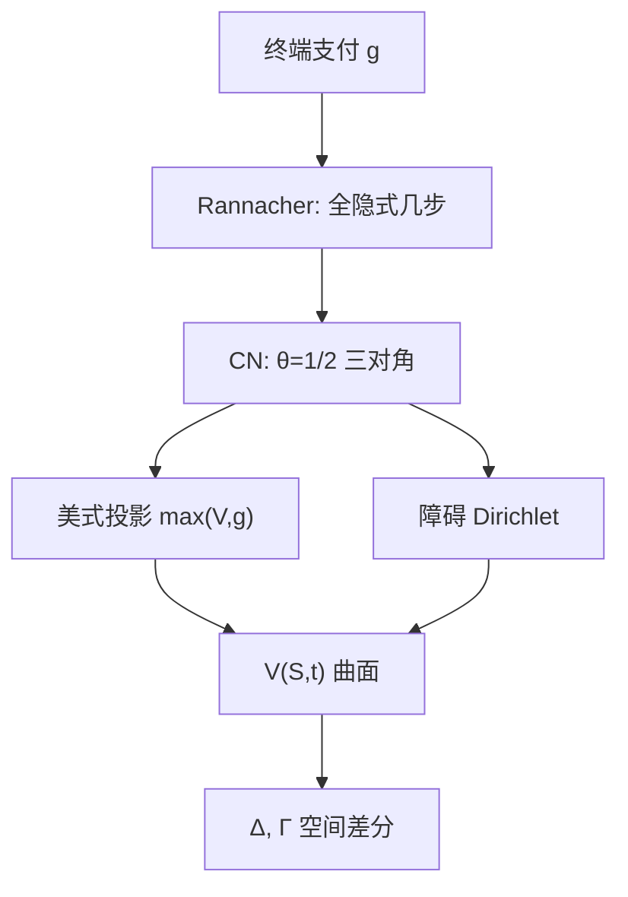

# PDE Crank-Nicolson

    
把抛物方程在相邻两层时间上各做一半空间差分再平均，得到对时间二阶、对空间二阶、且无 CFL 限制的线性系统；光滑解上这是默认格式，折角支付上则要先隐式平滑。

    <footer>—— Crank and Nicolson, A Practical Method for Numerical Evaluation of Solutions of Partial Differential Equations of the Heat-Conduction Type, Proceedings of the Cambridge Philosophical Society, 1947</footer>

[上一课](/quant/lsm-american)用有限基上的最小二乘代替续持条件期望：TVR 闭环价值，LS 闭环停时现金流；一维香草用网格，LSM 的理由是维数与复杂可行集。回到低维抛物方程，[PDE 与有限差分](/quant/option-pde) 已经写出显式/隐式权、美式投影与边界。缺口是把时间离散钉在 Crank–Nicolson：$	heta=1/2$ 的 $	heta$-方法，以及折角支付上的振荡与 Rannacher 起步。本课只写这一格式，不重推 LSM 的基函数。二维因子要换成 [ADI](/quant/adi-pde)；高维则回到蒙特卡洛。

## 问题

时间向后（从到期走到今天），空间二阶中心差分把方程收成半离散系统 $V'(t)=AV(t)+b(t)$，$A$ 为三对角（对数坐标、常系数时）。$\theta$-方法

$$
\frac{V^{n+1}-V^n}{\Delta t}=\theta A V^{n+1}+(1-\theta)A V^n
$$

里 $\theta=0$ 显式，受 CFL 约束；$\theta=1$ 全隐式，无条件 $L^2$ 稳定但时间一阶；$\theta=1/2$ 即 CN，局部截断 $O(\Delta t^2+\Delta x^2)$。问题是：期权支付在到期有折角，$\Gamma$ 像尖峰，二阶精度的前提「解对时间充分光滑」不成立；CN 的放大因子在高频上模为 1，不衰减，尖峰会振荡进网格，价格出现负的风险中性权或锯齿希腊值。需要一套在保持二阶的同时压振荡的起步与平滑。

金融里还要求离散最大值原理或至少正权，以免数值价格掉出无套利界。CN 在 $L^2$ 稳定，却**不**保证最大值原理——这与全隐式不同。美式投影、障碍 Dirichlet 与 CN 的振荡叠在一起，必须当成同一套规格，而不是先 CN 再「顺便」投影。

### $\theta$-方法与放大因子

对热方程的 Fourier 模 $e^{i\xi x}$，CN 的放大因子 $g(\xi)=(1-z)/(1+z)$，其中 $z\propto \Delta t\,\xi^2$。$|g|=1$ 对所有 $\xi$，高频不衰减。全隐式 $|g|\lt 1$ 且随 $\xi$ 增大而变小，天生耗散。因此：光滑欧式香草，CN 用较少时间步达到同样误差；数字期权、离散观察障碍、二元支付，全隐式或 Rannacher（先做两步或四步 $\theta=1$ 的半步，再切到 $\theta=1/2$）更干净。Rannacher 的作用是在折角被耗散掉之后，再启用二阶——不是让格式「看起来更高级」。

把 CN 写成「无条件稳定所以任意 $\Delta t$」会误导。稳定不等于准。时间步大到与到期同阶时，二阶常数仍让 ATM 附近的 $\Theta$ 失真。实践上空间加密与时间加密应匹配截断阶：$\Delta t\sim\Delta x$ 对 CN 是量级合理的起点，而不是 $\Delta t\sim\Delta x^2$ 那种显式 CFL。

## 方法

对数价格 $x=\ln S$ 上，对流–扩散项用二阶中心差分，贴现并入对角。每步解

$$
\bigl(I-\tfrac12\Delta t A\bigr)V^{n+1}=\bigl(I+\tfrac12\Delta t A\bigr)V^n+\Delta t\,\bar b,
$$

左端三对角，Thomas 算法 $O(J)$。边界：看涨在 $x\to-\infty$ 为 0，在远场用线性渐近或 $V_{xx}=0$；看跌对称。局部波动 $\sigma(S,t)$ 使 $A=A^n$ 时变，CN 变成在 $n$ 与 $n+1$ 之间取系数——常用层 $n+1/2$ 的 $\sigma$，以保持二阶。美式：每步解完欧式 CN 后做 $V=\max(V,g)$，或把投影写进扫描（Brennan–Schwartz 对看跌从低 $S$ 扫到自由边界）。罚方法把互补问题变成非线性，牛顿内层仍是三对角。

障碍：敲出节点对准障碍，Dirichlet 写进系统，不要在障碍之间插值后再差分。离散观察障碍只在观察日改边界，其余时间按欧式 CN；这与连续障碍不是同一价格。

### Rannacher、光滑支付与希腊值

数字期权把支付换成窄牛市价差或累积正态，再走 CN，比硬 0-1 后靠 Rannacher 补洞更可控。$\Delta$、$\Gamma$ 用内部中心差分，取自同一张曲面，这是 PDE 相对 MC 的优势。振荡未压住时 $\Gamma$ 先坏，价格看起来还像那么回事——验收必须看希腊值剖面，不能只看 $S_0$ 一个点。对执行价的有限差分应与空间网格对齐，否则蝶式会假负。

## 机制

CN 是梯形规则作用在半离散 ODE 上：两端导数各一半。对线性热方程它对称、可逆、耗散为零，故守恒高频能量。期权方程在对数坐标上接近热方程，到期尖峰的高频分量被原样传回 $t=0$，表现为价格对 $K$ 的涟漪。隐式起步提供人工黏性，只作用在前几步，之后恢复梯形的二阶。这与迎风差分压对流振荡是不同的旋钮：迎风改空间离散的单调性，Rannacher 改时间离散的高频增益。

离散生成元的行若可写成贴现概率，方案就是一棵变系数树。CN 的权可以暂时为负，对应「负概率」；$L^2$ 里仍收敛，套利界上不可接受。因此对要保持凸性的香草，有人改用二阶单调格式或缩小 $\Delta t$ 使 CN 权变正。这是金融约束，不是数值分析课本里的稳定性定义。

Crank–Nicolson 的时间二阶是对**光滑**终值而言。Black–Scholes 看涨的 $\Gamma$ 在 $T$ 处是 Dirac，理论阶会降。加密网格时若观测到一阶而非二阶，先检查支付折角与边界，再怀疑实现写错 $\theta$。

### 与显式树、全隐式的分工

显式格式与 [三叉树](/quant/binomial-tree) 同族，实现简单，美式投影自然，但 $\Delta t$ 被 $\sigma^2/\Delta x^2$ 卡住，局部波动大时步数爆炸。全隐式无条件稳定、单调性更好，适合障碍与数字，校准里时间步可以更少但要付一阶。CN 是光滑香草与局部波动曲面扫描的默认。同一套空间网格上三种 $\theta$ 应给出一致的欧式 Black–Scholes 价格，这是代码回归；不一致时先查边界与贴现，再查 $\theta$。

## 边界与工程取舍

二维 Heston 的 $A$ 不是三对角，CN 变成稀疏大系统，应改 ADI 或带预条件的迭代，而不是天真地每步做二维直接解。跳跃变成 PIDE，积分项要卷积，CN 只覆盖局部微分部分。交易成本的非线性方程仍可用 CN，比较原理需另证。远场截断太近，误差以边界层形式污染 $\Delta$，与时间格式无关。

不要把 CN 的发明归给期权论文；不要在数字期权上吹二阶精度；不要用未做 Rannacher 的 $\Gamma$ 去对冲。测试清单：欧式复现公式、平价、美式不低于欧式、加密时光滑产品呈二阶。Brennan–Schwartz 是金融应用的出处之一，格式本身是 Crank and Nicolson, 1947。

Wilmott、Tavella–Randall 把 Rannacher 与金融 PDE 的振荡写成工程问题。实现时把「起步步数」当成与 $J$、$N_t$ 并列的规格，写进测试夹具，而不是出了锯齿再临时改 $\theta$。

## 小结

- CN 是 $\theta=1/2$ 的时间离散：无 CFL、光滑解上时间二阶、每步三对角。
- 高频放大因子模为 1，折角支付会振荡；Rannacher 全隐式起步先耗散再恢复二阶。
- $L^2$ 稳定不保证正权与最大值原理；金融上还要检查无套利界与 $\Gamma$ 剖面。
- 美式投影与障碍应对齐节点，与时间格式同时规格化。
- 一维香草、局部波动扫描用 CN；二维用 ADI；欧式随机波动香草优先特征函数。
- 出处：Crank and Nicolson, 1947；金融差分见 Brennan and Schwartz, *JFQA*, 1978；总览见 [PDE 与有限差分](/quant/option-pde)。
