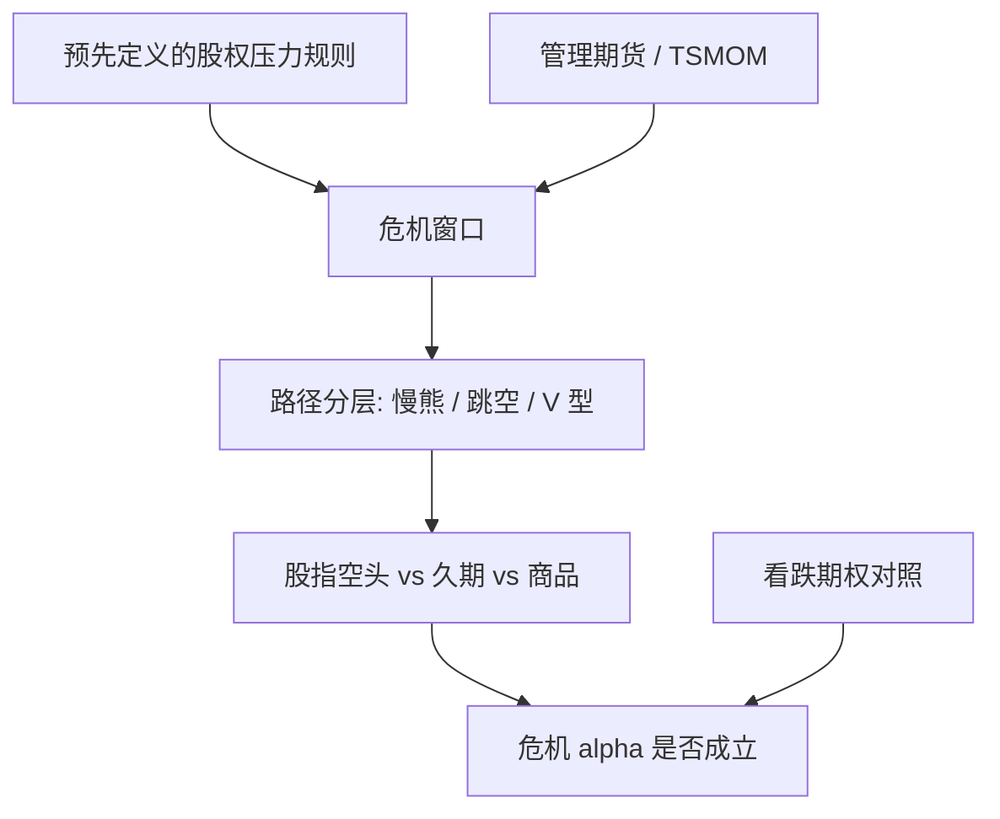

# 危机 alpha

管理期货的危机 alpha 不是买入看跌期权：它是趋势仓位在股权持续下跌的路径上翻成净空，并在波动上升时按风险预算存活下来的那一段凸性。

<footer>—— Kaminski, In Search of Crisis Alpha, 对照 Greyserman & Kaminski 对趋势跟踪与危机的论述</footer>

向股票组合配置 CTA，通常不是为了再要一个商品 beta，而是为了 **危机里可能赚、至少不按 beta 一起死**。Kathryn Kaminski 把这件可陈述的事叫做危机 alpha：在事先定义的股权压力窗口里，管理期货的条件收益。Hurst、Ooi、Pedersen 的长样本与 Moskowitz 的 TSMOM 提供机制背景——时间序列动量可以空头股指。它不是保险：费是震荡市的磨损与 V 型反转的亏损，赔付依赖路径足够长、趋势足够慢。把 CTA 的全样本夏普与看跌期权的最大回撤比来比去，会把两种凸性混成一句广告。

## 问题

定义危机。若用事后最大回撤月份，任何在那些月份碰巧为正的策略都会被叫做危机 alpha，这是循环。Kaminski 的用法是预先指定压力规则：例如股权指数低于长期均线且波动升破阈值，或事先列明的历史危机日期集，再看 CTA 在这些窗口的平均收益、命中率与路径。问题是窗口长度：1987 年几天、2008 年数月、2020 年数周，趋势滤波器的滞后决定你能不能赶上空头。

第二个问题是对照。买看跌、低波、国债久期、黄金、尾部风险平价，都会在某些危机里为正。危机 alpha 要回答的是：管理期货的条件收益是否来自**趋势翻空**，而不是碰巧持有久期或商品通胀。归因应拆开股指腿、债券腿、商品腿、外汇腿在危机窗口的贡献。

### 路径依赖：慢危机付赔，V 型收保费

趋势仓位 $w_t=\mathrm{sign}(r_{t-L,t})/\hat\sigma_t$。股权缓慢下跌且 $L$ 不过长时，$w$ 翻空，后续下跌变成利润，这是危机 alpha 的主通道。股权跳空下跌后迅速 V 型反转时，信号还没翻或刚翻空就被反打，vol targeting 还可能在底部附近把名义砍掉，反弹时仓位不足——这是左尾。Kaminski 强调的正是这种路径依赖：危机 alpha 是对「持续、可交易的压力」的暴露，不是对「任何坏日子」的期权。

$$
\mathbb{E}[R^{\mathrm{CTA}}\mid \text{慢熊市}]\gt 0
\quad\text{不蕴含}\quad
\mathbb{E}[R^{\mathrm{CTA}}\mid \text{单日崩盘}]\gt 0.
$$

用 2008 年全年 CTA 正收益去外推「下一次闪崩」。2008 有足够长的下跌让慢信号翻空；2015 年 8 月、2018 年 2 月、2020 年 3 月后半段的路径完全不同。危机 alpha 必须按路径类型分层，而不是按「股权为负的月份」一锅炖。

## 方法

预先锁定期权式的危机定义，例如：股权指数 20 日或 60 日收益低于若干负阈值、或低于 200 日均线且 VIX 分位极高。在样本外日历上计算 CTA 的条件均值、Calmar、以及相对买跌期权组合的成本效率（不要只比最大回撤）。分快慢尺度：短通道在急跌里更快翻空，也更容易在反弹里假突破；长 TSMOM 在 2008 类事件里更稳，在六周完成的熊市里可能全程落后。

归因：把危机窗口 PnL 写成四类资产贡献 + 杠杆变化贡献。若正收益主要来自债券多头，那是久期危机 alpha，风险平价也能给，不必付趋势磨损。若主要来自股指空头，才更接近 Kaminski 所描述的管理期货功能。与未缩放趋势对照：缩放会在波动冲高时减名义，可能减少危机段的绝对利润、改善危机前的回撤；两列都要。

### 凸性来自非线性仓位，不是来自期权复制

仓位对过去收益是阶跃（符号）或分段（通道），对价格路径是凸的：大段单边赚得多，来回穿亏得少但频繁。这与期权的 gamma 相似，却不支付隐含波动率，也不保证单日跳跃赔付。用 Black–Scholes 的看跌复制去理解 CTA，会高估对跳空的保护、低估对震荡的磨损。正确的对照是：同样预算下，买跌的确定保费 vs CTA 的随机保费（假突破）。投资者选的是路径假设，不是「谁更凸」。

## 机制

行为与套保让趋势在多个资产上存在；股权危机里，增长预期下修使股指趋势为负，债券往往为正，CTA 从「可以空股票」获利。资金与风险预算：波动上升时 CTA 减杠杆，避免在最肥的左尾上保留危机前的名义——这是存活机制，也会截断赔付额度。拥挤：若大量 CTA 在同一慢信号上翻空，执行会变差，但方向仍可能对；若危机是短促的波动事件，拥挤的 vol target 会在无方向的卖出中一起受伤。

危机 alpha 不是市场的免费午餐承诺。它更像一种状态或有的风险转移：在持续压力中提供流动性（或至少不同步去买下跌的股票），在震荡中消耗。Kaminski 把它从「CTA 夏普」里单列出来，是为了让股权投资者按自己的危机定义去验收，而不是按卖方的全样本数字。

### 与尾部因子、国债、黄金的分工

尾部风险因子往往是卖保险的另一面，危机里为负。国债在通缩危机里为正、在通胀危机里可能为负。黄金在部分美元危机里为正。CTA 的符号不绑定单一宏观标签，只绑定趋势。1970 年代通胀、2008 年去杠杆、2022 年股债双杀，趋势组合的危机表现可以来自完全不同的腿。这是优点（不押一种危机），也是沟通成本（不能保证「像 2008」）。产品设计若把 CTA 与风险平价捆绑，应分别验收「股债双杀」与「慢熊」两套窗口。

把危机 alpha 写成「永远正偏度」是错的。全样本偏度可能接近零：左尾是突然反转，右尾是持续趋势。条件于慢熊，偏度才转向投资者想要的那一侧。

## 边界与工程取舍

不要用事后挑选的危机名单优化 CTA 参数。不要把债券牛市里的 CTA 正收益全部算进危机 alpha。不要承诺对隔夜跳空的期权式赔付。国内股指期货在限制期无法提供空头腿，当地产品的危机 alpha 必须降级为「商品 + 国债 + 汇率」，并写进说明书。快慢尺度的混合比例会改变验收结果，应作为产品特征冻结，而不是作为危机后的可调参数。

与[时间序列动量 CTA](/quant/cta-tsmom)、[跨资产趋势相关](/quant/xasset-trend-corr)一起读：前者给规则，后者给分散化何时失效，本篇给股权投资者的验收语言。出处上，Kaminski 的危机 alpha 是实践与研究之间的桥梁，不是对 MOP 公式的替代。

出处：Kaminski, *In Search of Crisis Alpha*（CME / 管理期货行业论述）；Greyserman and Kaminski, *Trend Following with Managed Futures*。学术趋势事实见 Moskowitz, Ooi & Pedersen, JFE, 2012；Hurst, Ooi & Pedersen 的世纪样本。止损与路径见 Kaminski and Lo, 2014。

## 小结

- 危机 alpha 是管理期货在预先定义的股权压力窗口中的条件收益，主通道是趋势翻空而非买入看跌。
- 赔付路径依赖：持续下跌可交易，V 型与跳空不保证；必须分层验收。
- 归因要拆开股指空头、久期与商品，避免把债券牛市算进 CTA 的危机功能。
- 保费是震荡磨损与假突破；vol targeting 既保命也截断赔付额度。
- 出处：Kaminski 的 crisis alpha 论述；Moskowitz et al., 2012；Hurst–Ooi–Pedersen。
