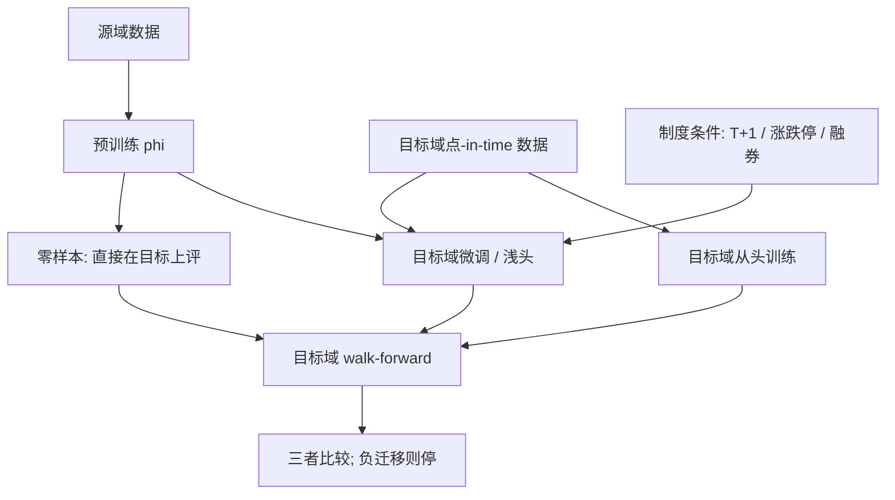

# 跨市场迁移学习

    
源域上估得再好的预测规则，在目标域的边际与条件分布一变，风险就会从源域的经验误差换成不可控的迁移误差；有用的是显式建模这一差距，而不是假定标签函数通用。

    <footer>—— 对照 Ben-David 等人对域适应可学习性的分析，以及量化研究里市场之间微观结构与制度不可交换的事实</footer>

美股截面上训好的 [GBDT](/quant/gbdt-alpha) 或 [DeepLOB](/quant/deeplob-cnn-lstm)，能否直接拿到 A 股、港股、期货或加密上用？迁移学习把这个问题写成：源域 $\mathcal{D}_S$ 样本多、标签相对干净，目标域 $\mathcal{D}_T$ 样本短、制度不同，希望借用 $f_S$ 的表示或参数，降低 $f_T$ 的样本外误差。它不是「多市场一起拟合所以更鲁棒」——把不同交易所的行堆进同一张表，往往会学到源域体量最大的那个市场，并对目标域产生负迁移。本篇写分布偏移的类型、冻结与微调、以及制度变量为什么必须当域标签而不是当又一个普通特征。评估只在目标域的时间外样本上进行。

## 问题

标准监督学习假定训练与测试同分布。跨市场时至少有三种偏移。协变量偏移：$P_T(X)\neq P_S(X)$，例如 A 股小盘占比、涨跌停截断后的收益分布与美股不同，但 $P(Y\mid X)$ 或许近似。标签偏移或概念漂移：$P(Y\mid X)$ 本身变了，T+1、涨跌停、融券约束改变了同一组财务特征与可实现收益的关系，见 [T+1](/quant/cn-tplus1) 与涨跌停。特征空间不对齐：档位、拍卖机制、tick 与手数使 LOB 张量的通道含义不同，不能把源域的第一档直接当成目标域的第一档。

Ben-David 等人指出，源上的误差加上两个域之间的可区分性（$\mathcal{H}$-divergence），给出目标误差的上界。若一个分类器能轻松分出「这行来自美股还是 A 股」，表示偏移大，无约束的迁移没有保证。量化里这个分类器几乎总能分出来——日期、币种、涨跌停指示都是完美特征——所以「源域夏普高所以目标域也能用」在理论上就没有支撑。

### 负迁移比没有迁移更常见

源域若主导损失，模型会为美股的隔夜信息、做空便利和连续竞价去调参数。目标域上这些通道不存在或含义相反：A 股不可日内回转，空头腿受限。微调若学习率大、目标样本又含一段短暂行情，会把源域表示毁掉，同时过拟合目标域噪声。负迁移的经验信号是：仅用目标域训练的浅模型，测试 IR 高于「源域预训练再微调」的深模型。此时应停，而不是加更多源域数据。

用同期美股因子当 A 股开盘特征，涉及的是信息时差，不是迁移学习。合法与否取决于时间戳：美股收盘必须已经发生在 A 股决策之前。把这当成「跨市场迁移」会掩盖一个更简单的前视或滞后问题。

## 方法

**表示冻结。** 在源域学 $x\mapsto z=\phi(x)$，在目标域只训一个浅头 $z\mapsto\hat y$。适合表格因子：源域学到的是非线性交互的形状，目标域样本只够估一组新斜率。LOB 上对应冻结卷积核、只训最后的时间层。冻结失败时，$\phi$ 捕获的是源域微观结构特有的纹理（例如特定 tick 下的队列形状），对目标域无意义。

**微调与正则。** 允许 $\phi$ 以小学习率在目标域移动，并用相对源域参数的惩罚（L2-SP）防止跑远。验证必须是目标域内部的 walk-forward，早停看目标域验证 IC，绝不看源域误差。超参网格里应包含「完全不迁移」的基线：目标域从头训练。迁移只有在这一基线被稳定超过时才成立。

### 域对抗与再加权只解决协变量偏移

域对抗（DANN 一类）让编码器欺骗「源/目标」判别器，迫使 $z$ 的分布靠近。它假设标签函数在两个域上相同。制度不同时，这个假设坏了：编码器会对齐 $X$ 的边缘，却把 $Y\mid X$ 拧断。重要性加权 $P_T(X)/P_S(X)$ 同样只对协变量偏移一致。概念漂移需要目标域标签，至少要有一段标注的目标历史；「无标签自适应」在收益预测上通常是自我安慰。实务上更稳的是：把制度写成显式条件——市场哑变量、涨跌停状态、可否融券——让模型学 $P(Y\mid X,\text{市场})$，而不是假装存在一个通用 $P(Y\mid X)$。

多源迁移（美、日、欧一起帮 A 股）要把各源当不同域，而不是加权成一个超级样本。体量最大的源会吞掉损失。应按源估计相似度（行业结构、短卖约束、集合竞价规则），只借用近邻源。加密与股票之间，订单流的时间尺度和参与者结构差一个数量级，默认不迁移，只迁移非常抽象的归纳偏置（例如「用 CNN 看档位、用 LSTM 看短历史」这一架构），权重全部重训。

目标域验证期必须 [清洗](/quant/purge-embargo) 与源域预训练窗口的时间重叠。全球资产在危机周共动，源域 2020 年 3 月的表示已经「看见」了目标域同期路径的一部分。按日历切开，不要按随机股票切开。

## 机制

能迁移的部分，是跨市场重复出现的条件关系：价值在极便宜端更强、短期反转在高换手更强、簿的队列不平衡对短时中点有符号。这些关系的**斜率、截断和可交易性**不迁移。架构迁移（CNN 看相邻档位）比权重迁移更常成功，因为归纳偏置不依赖具体的 tick 表。权重迁移成功，通常要求目标与源在交易机制上接近（例如两个电子限价簿期货，tick 与连续竞价相似），而不是「都是股票」。

失败机制有三条。第一，标签定义不同：源域用开盘到开盘、目标域因涨停用不可实现价格，迁移的是不可比的 $Y$。第二，特征编码不同：源域用美元成交额，目标域未做截面 rank，模型变成隐性的汇率与量纲记忆。第三，评估泄漏：用源域测试集调完再「迁移」，目标域测试集与源域测试集通过全球因子相关，乐观偏差会穿过市场边界，见[交叉验证泄漏](/quant/cv-leakage-finance)。

### 和仿真、实盘的距离

从美股回测迁到 A 股回测，仍都在仿真里。再迁到实盘是 [sim-to-real](/quant/sim-to-real-trading) 的另一层：延迟、部分成交、自己的冲击。跨市场迁移不能替代这一层。若目标域只有仿真标签（例如用 [ABIDES](/quant/abides-simulation) 生成的 A 股风格簿），则迁移路径变成源真实 $\to$ 目标仿真，评估必须在目标真实簿上另留一段，否则只是在生成器的风格里自洽。

## 边界与工程取舍

不要把全球股票做成一个巨型面板、加一个市场 ID 就称为迁移学习。那是带固定效应的混合估计，目标域的系数会被源域似然淹没。不要在目标域测试年用源域模型做「已经样本外」的声明——对目标域那是样本内的另一种预训练污染，除非源域预训练严格停在目标测试年之前，且全球冲击的共动已被禁运。

监管与数据许可常禁止把源域客户微观结构直接带到目标域产品。即使统计上可迁，合同上不可迁。研究记录应写清：迁的是公开因子、公开摘要统计，还是专有 L3。后者的迁移一旦进入生产，合规风险大于 IR 增益。

A 股研究若以美股论文的超参为初始化，这是合法的弱迁移；必须在 A 股 walk-forward 上重新早停。Leippold、Wang 与 Zhou（2022）表明 A 股存在 ML 可预测性，但那是目标域自己训出来的，不是美股权重的免费午餐。把他们的结果当成「所以可以加载美股 DeepLOB 权重」，是把存在性误读成可迁移性。

报告迁移结果时，必须同时报告目标域从头训练、源域直接零样本、微调三条曲线。只展示最好的一条，等于在三条协议上做了未校正的多重选择。

## 小结

- 跨市场迁移面对协变量偏移、概念漂移与特征不对齐；源域误差加域差距才给出目标误差上界，源域夏普不能当目标域承诺。
- 架构与归纳偏置比权重更容易迁；制度不同时域对抗不够，要把市场规则写成条件，并保留「不迁移」基线。
- 评估只在目标域时间外样本上，处理全球共动造成的跨市场泄漏；三条协议（零样本、微调、从头）必须一起报告。
- 负迁移时应停。仿真目标不能替代真实目标簿上的最终检验。
- 出处：Ben-David et al. 对域适应的理论分析；Gu, Kelly and Xiu, *RFS*, 2020 与 Leippold, Wang and Zhou, *JFE*, 2022 分别给出美股与 A 股的 ML 可预测性，二者不可直接互换权重。
