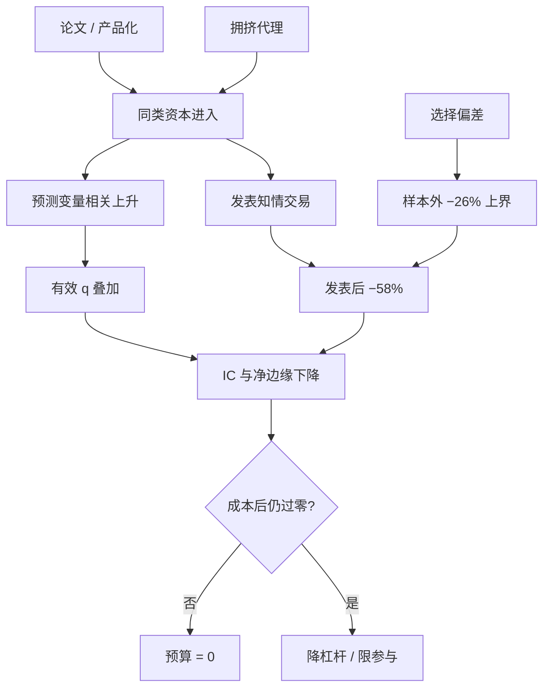

# 拥挤 alpha 衰减

    
样本外多空收益低 26%，发表后再低到 58%；把前者当作统计偏差的上界，剩下约 32 个百分点来自读过论文的交易。

    <footer>—— McLean and Pontiff, Does Academic Research Destroy Stock Return Predictability?, Journal of Finance, 2016</footer>

[因子拥挤](/quant/factor-crowding) 问谁还在买；[清盘螺旋](/quant/crowding-spiral) 问减仓会不会自我强化。本篇问第三句：拥挤如何把 alpha 的期望本身削薄。McLean 与 Pontiff 跟踪 97 个已发表截面预测变量，发现可预测性在样本外下降、在发表后下降更多，且预测变量组合之间的相关在发表后上升——资金在学同一组多空。Hou、Xue、Zhang 用统一手续复制 452 个异常，交易摩擦类几乎复制失败，活下来的经济幅度也更小。衰减因此不是「IC 的半衰期」这一条曲线，而是统计偏差、套利交易与拥挤相关三条机制叠在一起。它与[策略容量与冲击衰减](/quant/strategy-capacity-decay)共用冲击，但强调的是横截面上许多人同时交易，而不是你自己的 $A$。

## 问题

无拥挤时，一个预测变量的样本外衰减主要是选择偏差：原文挑了那段历史最好的设定，下一段自然变差。McLean–Pontiff 把发表前、样本外、但尚未正式发表的窗口当作统计偏差的上界（平均 −26%），因为工作论文阶段已有人交易，26% 高估了纯数据挖掘。发表后相对样本内再掉到 −58%，差额约 32% 被解释为发表知情交易。需要回答的不是「异常会不会消失」——他们拒绝了完全消失，也拒绝了完全不变——而是：**剩余可预测性还够不够覆盖成本，以及拥挤有没有把剩余部分变成同步风险。**

第二个问题是测量。持仓不可见，拥挤只能代理。代理选错，会把「大家都赚钱」当成拥挤、把「最近没人做」当成 alpha 还在。真正对应衰减的是：高相关持仓、低深度、高换手、规则同步。Lou 与 Polk 的共动量一类指标，刻画的是同一篮子被同步交易的程度，而不是因子过去的夏普。

### 发表后相关上升是拥挤的指纹

McLean–Pontiff 报告：预测变量组合在发表后与其他已发表预测变量的相关升高。机制很窄。论文提供了标准化的排序与再平衡规则，后来者复制的是相近的多空，而不是相近的经济故事。相关上升有两重后果：一是分散失效，组合波动里出现共同因子；二是冲击叠加，有效 $q$ 变成行业加总。Stein（2009）指出精明投资者同质化之后，套利本身制造不稳定。Khandani–Lo 对 2007 年 8 月量化震荡的叙述是同一结构的极端实现：统计套利拥挤，价格在数日内自我实现，随后部分反转。慢性的拥挤 alpha 衰减是同一机制的低频版——IC 往下走，相关往上走，夏普掉得比 IC 更快。

不要用因子过去三年的夏普当拥挤指标。高夏普吸引资金，是拥挤的原因，不是安全证明。更有用的是预测变量之间的相关、借贷费率、残差第一主成分，以及发表后窗口的单独 IC。

## 方法

把样本切成三段：原文样本内、发表前样本外、发表后。分别报告多空收益、换手、成本后净收益、以及与其他预测变量的相关。McLean–Pontiff 的分解应原样保留：样本外下降是偏差上界，发表后超额下降是交易效应下界。不要用全样本 IC 去「证明因子还在」。

复制手续要与 Hou–Xue–Zhang 对齐，否则拥挤被微盘掩盖。NYSE 断点、市值加权、金融与负账面权益剔除之后，许多高换手异常的 t 过不了 1.96；多重检验门槛 2.78 时失败率到 82%。交易摩擦类失败率约 96%。这些不是「拥挤把 alpha 做没了」，而是「本来就不可交易的统计幻象」；但二者在实盘上的处方相同：不要把等权微盘上的样本内 t 当成可部署边缘。对仍然显著的异常，比较发表前后的经济幅度，而不是只比较 t——下一篇[经济显著性](/quant/econ-vs-stat-sig)把这件事单独展开。

拥挤代理分层：位置（13F、ETF 份额、空头利息）、策略（同类基金相关、共动量）、融资（借券费、保证金）。代理进入衰减回归：$\Delta\mathrm{IC}$ 对拥挤滞后项，控制波动与宏观。若拥挤升高之后 IC 下降、相关上升，才叫拥挤衰减；若只是 IC 下降而相关不变，更像是体制切换或单纯过拟合。

### 衰减预算：把 26% 与 32% 写进期望

新策略上线前，先给期望打折。保守做法：把回测毛收益乘 $(1-0.26)$ 作为「尚未发表的同类想法」的折扣，再乘一层与拥挤代理挂钩的交易折扣；若信号已在文献或产品里出现，直接用发表后那一档。折扣后过不了[保本成本](/quant/cost-sensitivity)的，风险预算为零。Bailey 的紧缩夏普处理的是你自己的尝试次数；McLean–Pontiff 处理的是全行业已经做过的尝试。两层都要扣，只扣一层会把别人的数据挖掘当成自己的技能。

LLM 挖因子会把「尝试次数」从实验室扩到模型预训练语料。Alpha-GPT 一类系统若从 Kakushadze 101 与公开文献起步，先验已经偏向拥挤模板。负例检索与家族惩罚，见 [Hubble](/quant/hubble-alpha-agent)，是对拥挤衰减的工程对策，不是对论文的复述。

## 机制

统计机制：原文 t 是截断样本，期望不可外推。经济机制：错误定价被交易进去，价格更有效，剩余 alpha 向成本靠近。拥挤机制：交易不是均匀渗入，而是在规则同步的窗口里集中发生，冲击永久成分变厚，预测变量相关上升。三条可以同时成立。McLean–Pontiff 强调高样本内收益的预测变量发表后掉得更多，符合「越明显越先被套利」；同时，高特质波动、低流动性名字上剩余收益更高，符合「成本保护了错误定价」。Hou–Xue–Zhang 则表明：把微盘与等权拿掉之后，许多「剩余」根本没有经济幅度。拥挤衰减只解释那些在可交易加权下仍然存在、却随资金进入而变薄的部分。

CTA、风险平价、统计套利的拥挤衰减形态不同。慢因子（价值、盈利）衰减以年为单位，更像风险溢价被重新定价；快因子（反转、微观结构）衰减以日为单位，更像冲击核被加厚。把不同半衰期的东西放进同一个「拥挤指数」，会把慢溢价的稳健性借给快信号。

### 测到拥挤之后不能立刻做空 alpha

做空拥挤交易需要能熬过拥挤继续加码的阶段。许多拥挤指标在趋势加速时同步升高，这时做空等于与动量对撞。正确用法是：拥挤高则降低自己的杠杆与参与率，拉长减仓窗口，避免与指数再平衡、期权到期同一天抢出口。把拥挤当择时空头，必须另有独立的负相关腿。对研究流水线，更干净的闸门是：与已部署因子相关过高、或落在负例模板里的新信号，直接不进模拟，而不是进了模拟再靠样本外一段碰巧好来开脱。

## 边界与工程取舍

发表日不是资金进入日。工作论文、研讨会、数据供应商的因子库会把「发表效应」提前。McLean–Pontiff 已警告 26% 高估纯偏差。13F 滞后一个季度，管不了期货与互换里的拥挤。A 股的北向、融券、涨跌停改变拥挤释放的速度：不是不会衰减，而是以贴水、封板、基差跳开的形式出现。

不要把复制失败写成「市场已经完全有效」。Hou–Xue–Zhang 的结论是市场比原文承认的更有效，仍留下一部分在更严门槛下显著的异常；McLean–Pontiff 拒绝可预测性完全消失。工程含义是：剩余 alpha 必须按可交易加权、成本后、拥挤态分别报告，而不是用一句「异常已死」或「异常还在」结束讨论。

出处：McLean and Pontiff, *JF*, 2016；Hou, Xue and Zhang, *RFS*, 2020；Stein, *Presidential Address*, *JF*, 2009；Khandani and Lo, 2007/2011。共动量见 Lou and Polk 及相关从业研究。Harvey, Liu and Zhu, *RFS*, 2016 给出多重检验门槛，与拥挤衰减分工：前者管发现的假阳性，后者管发现之后被交易掉的真阳性。

## 小结

- 拥挤 alpha 衰减是统计偏差、套利交易与持仓相关上升的乘积，不是单一的 IC 半衰期。
- McLean–Pontiff：样本外 −26% 为偏差上界，发表后 −58%，约 32% 归因于发表知情交易；预测变量相关在发表后升高。
- Hou–Xue–Zhang：可交易加权下多数异常复制失败，摩擦类尤甚；拥挤只解释那些加权后仍在、却随资金变薄的部分。
- 期望应预扣偏差与拥挤两层；高相关新信号不应进入模拟。
- 测到拥挤应先降杠杆，而不是无条件做空该因子。
- 出处：McLean–Pontiff, *JF*, 2016；Hou–Xue–Zhang, *RFS*, 2020；Stein, *JF*, 2009；Harvey–Liu–Zhu, *RFS*, 2016。
