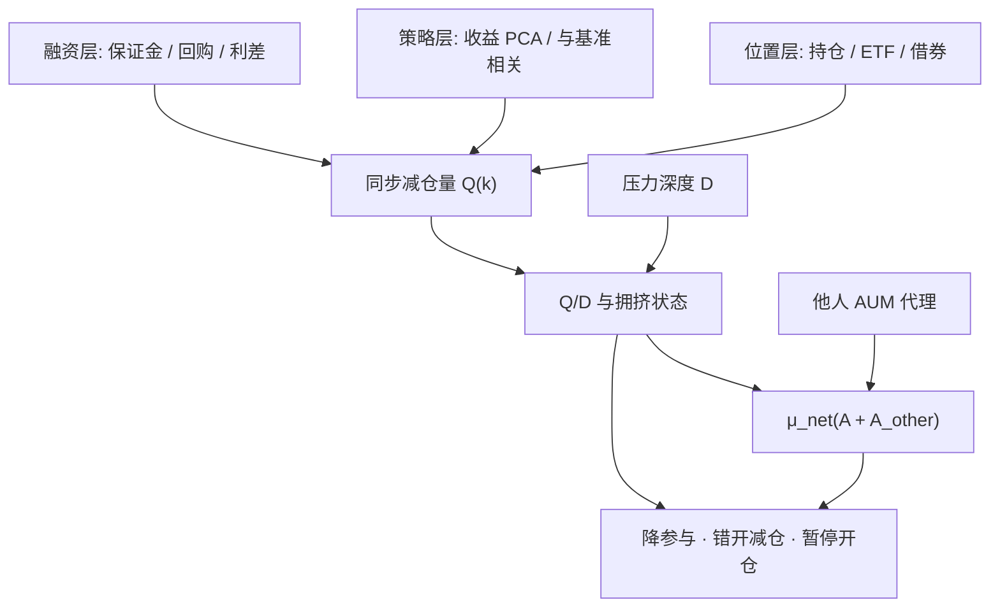

# 拥挤度与容量指标

拥挤要测的是能在几天内同步变现的名义；容量要测的是你的规模加上别人的规模之后，冲击把净优势吃到哪一条供给曲线。两者都是可观测的状态变量，不是事后叙事。

<footer>—— 拥挤机制见 Brunnermeier–Pedersen 与 Stein；容量见 Perold and Salomon, The Right Amount of Assets Under Management, FAJ, 1991</footer>

[拥挤度与清盘螺旋](/quant/crowding-spiral) 写亏损螺旋与保证金螺旋如何在同步减仓下自我强化。[容量与参与率](/quant/capacity-participation) 写单策略 AUM 与 $p=q/V$ 如何决定净优势。本篇把两者收成**可计算的指标**：位置层、策略层、融资层的代理，以及如何把别人的 AUM 加进自己的冲击函数。Koijen 与 Yogo 一类需求系统、Lou 对互持与流量、Khandani–Lo 对 2007 年量化熔断的记录，提供的是测量思路，不是又一个万能指数。指标的用途是降杠杆与错开出口，默认不是做空拥挤本身。

## 问题

持仓不可见。未平仓、ETF 份额、13F、CTA 行业 AUM 都是上界或滞后影子。真正进入螺旋的是：波动翻倍或保证金上调时，**必须在 $T$ 日内卖掉的名义** $Q$，相对当时深度 $D$ 的比。容量问题是同一 $Q$ 的另一面：你的下单 $q$ 与 $Q_{\mathrm{other}}$ 一起进冲击 $g(q+Q_{\mathrm{other}})$，净 $\mu$ 随规模下降。没有状态变量，回测只能用平静期 ADV 外推，容量上偏、拥挤在点火那天才被「发现」。

第二个问题是同步性。同样 AUM，1 个月趋势与 12 个月趋势、有无 vol target、是否风险平价配股债，减仓函数完全不同。指标必须能区分「钱多但触发器分散」与「钱未必最多但触发器相同」。后者才是 $Q$ 的来源。

### 指标分层，而不是一个拥挤指数

**位置层。** 期货非商业净持仓、ETF/ETN 份额变化、借券利用率与费率、大宗商品指数持仓。给出方向性拥挤：大家都在同一侧。**策略层。** 同类基金收益的第一主成分解释比例、截面离散度、与公开基准（TSMOM、风险平价、波动卖出）的滚动相关。给出规则同步：即使净持仓看起来中性，减仓指令仍会同日发出。**融资层。** 回购特殊、主经纪商保证金通知、TED/LIBOR–OIS、期权隐含融资。给出 $m$ 会不会在冲击日一起上调。三层缺一，单一数字会把长期套保当成泡沫，或把无杠杆的拥挤当成即将螺旋。

13F 季度滞后、不含衍生品、不含大多数对冲基金。用它管期货拥挤，频率与对象都错。13F 更适合慢股票因子的持仓重叠；快策略用收益同步与融资层。

## 方法

**$Q/D$ 的工程近似。** 对每个策略簇估计：若 $\hat\sigma$ 升至 $k$ 倍（vol target 仓位 $\propto 1/\sigma$），或回撤触及常见风控线，名义减仓 $\Delta E$。加总得到 $Q(k)$。$D$ 用压力期可吸收成交（不是平静 ADV），或用冲击函数反推的深度。点火规则：$Q(k)/D$ 超过阈值则限制开仓、拉长减仓窗口。$k$ 取 1.5、2、3 做情景，与[相关性崩溃情景](/quant/corr-break-scenario)共用波动乘数，避免两套互不相认的压力。

**持仓重叠。** 对可观测组合（共同基金、部分 13F）算权重余弦、最小方差重叠、或 Lou 式的流量冲击。对冲基金不可见时，用收益回归到一组风格上的 $R^2$ 与残差相关：残差第一主成分升，是拥挤或共同冲击；须用融资层把两者分开。短期借券利用率对股票多空尤其直接：$Q$ 的空头腿受可借量硬约束，利用率高时覆盖挤压与减仓是同一深度的两侧。

**容量曲线含他人。** Perold–Salomon 的 $\mu_{\mathrm{net}}(A)$ 在拥挤态应改成 $\mu_{\mathrm{net}}(A+A_{\mathrm{other}})$。$A_{\mathrm{other}}$ 用策略层代理缩放：例如公开 CTA AUM × 信号同号比例。输出不是一个「容量 20 亿」的点，而是平静与拥挤两态下 $\mu_{\mathrm{net}}$ 过零的 $A$，以及该点上的平均参与率与最差日参与率。冲击函数至少报平方根与线性两种，见容量文。

### 把指标写进状态机，而不是写进 alpha 公式

每日（或每周）更新三层分数，映射到动作：正常 / 降参与率 / 只减不加 / 暂停。动作须预先冻结，不能在指标升高的那天讨论「这次是不是真的」。不要把拥挤分数当空头信号：趋势加速期指标会升，做空等于与动量对撞。正确用法是自己的 $p_{\max}$ 随 $Q/D$ 下降，出口日历避开指数再平衡、期权到期、已知保证金调升日。

与 CPCV 的关系：容量与拥挤是经济约束，不是统计过拟合。PBO 低的策略在拥挤态仍可以有负的净 $\mu$。回测网格若含「拥挤过滤器」，过滤器本身是候选，须进 [Nested CPCV](/quant/nested-cpcv) 的内层，不能用全样本拥挤标签挑阈值再报样本外。

## 机制

Stein 指出精明投资者同质化之后，套利本身制造不稳定：指标在策略层看到的「离散度下降、与基准相关上升」，就是同质化的可观测面。Brunnermeier–Pedersen 的 $\Delta\mathrm{Position}$ 在行业加总后，第二项 $W\Delta m/m^2$ 因同类风险模型而高度相关——融资层指标就是在监测 $\Delta m$ 是否将要同步。Khandani–Lo 记录的 2007 年 8 月没有宏观新闻，价格在数日内自我实现：位置层当时未必极端，策略层与融资层已经齐备。

容量机制是冲击的供给曲线。你看到的 ADV 已被 $A_{\mathrm{other}}$ 占用；拥挤高时，表面上 $p$ 不高，永久冲击已经发生在别人的交易里。因此平静期估的容量是上偏的，不是因为冲击函数形式错了，而是因为状态错了。把拥挤当状态变量，容量曲线自然分叉，不必发明新的 $g(\cdot)$。

量化熔断、波动率产品清盘、2020 年 3 月趋势与风险平价同步减仓，共同结构是「规则 + 杠杆 + 浅深度」。归因写成 alpha 衰减会去翻信号；应先看 $Q/D$ 与策略层主成分。

### 截面与时间序列不要用同一套阈值

同一指标，在商品期货与 A 股上的无条件分布差很远。阈值应按品种或按策略簇用历史分位，而不是用全局绝对值。时间序列上的「拥挤处于历史 90 分位」对点火有用；截面上的「这个名字比其他名字更拥挤」对选股有用，但是另一策略，且自身会成为拥挤的一部分。本篇默认只做风险状态，不做截面 alpha。若要做后者，须独立的负相关腿与单独的验证协议。

## 边界与工程取舍

代理滞后、口径含套保、ETF 创设与期货仓位不是同一对象。压力里 $D$ 内生下降，用平静 ADV 估 $Q/D$ 系统性乐观。A 股涨跌停与停牌改变螺旋速度：指标可能表现为贴水、基差跳开、而非连续抛售。国内商品持仓披露与境外 CTA 公开 AUM 频率不同，跨市场加总会假精确。

不要用单一 CTA AUM 代表拥挤。不要把「大家都赚钱」当拥挤——那只是绩效，可能是因子真的在工作。不要在已经 vol target 的组合上再叠一条与同业相同的回撤止损，而不检查触发器相关：指标会显示策略层同步，动作却在同一天抢出口。不要把拥挤指标的回测夏普写进营销材料。

指标清单与阈值是另一场多重检验。冻结版本号，变更走研究日志，用外层样本只评估动作规则的后果，而不是回头调阈值让历史螺旋「刚好被避开」。

## 小结

- 拥挤指标应分层测可同步变现名义，容量指标应把 $A_{\mathrm{other}}$ 写进冲击；两者共用 $Q/D$。
- 位置、策略、融资三层缺一不可；13F 与公开 AUM 只覆盖各自的时间尺度。
- 用途是状态机上的杠杆与参与率，默认不是做空拥挤；过滤器进内层验证。
- 平静期 ADV 外推的容量上偏；压力深度与分态曲线是最低交付。
- 出处：Perold and Salomon, *FAJ*, 1991；Brunnermeier and Pedersen, *RFS*, 2009；Stein, *Journal of Finance*, 2009；Khandani and Lo, 2007；Koijen–Yogo 需求系统；Lou 对持仓与流量。
