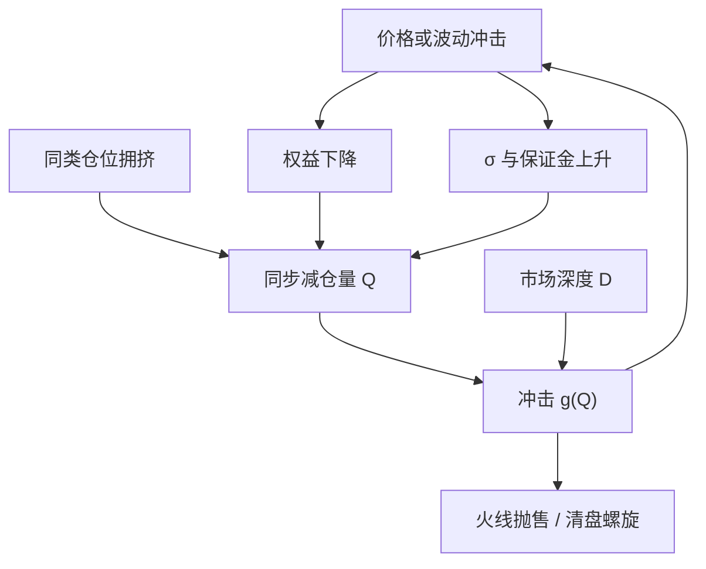

# 拥挤度与清盘螺旋

价格下跌削弱抵押品，保证金上调迫使变现，变现再打压价格；当许多账户挤在同一侧时，这条环路不再是单户的强平故事，而是市场价格本身的供给冲击。

<footer>—— Brunnermeier and Pedersen, Market Liquidity and Funding Liquidity, Review of Financial Studies, 2009</footer>

[资金流动性](/quant/funding-liquidity) 写的是中介能不能借到钱；[杠杆与强平](/quant/leverage-liquidation) 写的是单账户触及维持保证金之后的算术。拥挤度问的是第三句话：有多少钱、多少杠杆、多少止损线叠在同一张合约、同一个因子、同一条 CTA 信号上。Brunnermeier 与 Pedersen 的亏损螺旋与保证金螺旋，在拥挤状态下从「可能」变成「几乎必然」——不是因为波动公式变了，而是因为被迫卖出的数量已经大到自己制造下一轮波动。Stein 指出，精明投资者同质化之后，套利本身会制造不稳定。本篇把拥挤当成可观测的状态变量，把清盘螺旋当成拥挤与融资约束的乘积，而不是事后叙事。

## 问题

无拥挤时，一笔止损只是噪声供给。有拥挤时，许多基金的风险模型、波动目标、保证金公式在同一天给出同一方向的减仓指令。价格冲击 $\Delta P$ 同时改写三类约束：市值亏损降低权益（亏损螺旋），已实现波动上升提高保证金与风险预算（保证金螺旋 / vol targeting 螺旋），相关上升使「分散」失效、总风险占用超限（[相关性崩溃](/quant/correlation-breakdown)）。需要回答的不是「会不会有人亏钱」，而是：**减仓流量相对市场深度有多大，以及流量是否自我强化。**

第二个问题是测量。持仓不可见，拥挤只能代理。代理选错，会把「大家都赚钱」当成拥挤、把「最近没人做」当成安全。真正危险的是：**高杠杆、高相关、低深度、止损与风控规则同步。** 四者缺一，螺旋可以熄火；四者齐备，小冲击足够点火。

### 拥挤不是持仓量，是可同步的减仓量

未平仓合约多，可以是套保对冲、也可以是投机拥挤；前者在价格跌时生产商未必砍空头，后者会。因此名义持仓、ETF 份额、CTA 行业 AUM 都只是上界。更接近机制的量是：若波动翻倍、保证金上调、或净值回撤触发风控，有多少名义必须在 $T$ 个交易日内卖掉。记市场深度为 $D$（单位冲击下的可吸收名义），同步减仓量为 $Q$，则粗略的自我强化条件是 $Q/D$ 大到使新波动再次触发下一轮 $Q$。Brunnermeier–Pedersen 的 $\Delta\mathrm{Position}\approx -\Delta W/m - W\Delta m/m^2$ 在行业加总后，第二项会因为大家用同类风险模型而高度相关。

把「持仓集中度高」直接叫拥挤，会把长期套保当成投机泡沫。拥挤要带时间尺度：能在几天内同步变现的那一层，才进入螺旋。养老金的战略配置即使权重大，通常不是同一条触发器。

## 方法

代理分层，而不是找一个万能指数。

**位置层。** CFTC 非商业净持仓、商品指数与 ETN 份额、股指期货投机净头寸、债券基差交易的估计规模。这些给出方向性拥挤：大家都在曲线的同一侧。

**策略层。** 同类基金收益的截面离散度下降、与某一基准（TSMOM、风险平价、波动卖出）的相关上升，是「规则同步」的痕迹。2007 年 8 月量化熔断里，Khandani 与 Lo 记录的是统计套利拥挤，不是宏观新闻；价格在数日内自我实现。CTA 上，趋势信号在资产间已经高度同号时，组合看起来分散、减仓指令却会在波动冲击下同时发出。

**融资层。** TED、LIBOR–OIS、GC 回购特殊、主经纪商保证金通知，决定 $m$ 与 haircut 会不会在冲击当天一起上调。没有融资层，位置层的拥挤只是慢性折价，不一定螺旋。

点火规则应写成状态机：波动或回撤越过阈值 → 估计 $Q$ → 与深度 $D$ 比较 → 决定是降杠杆、错开减仓日历，还是暂停开仓。把拥挤当回归信号（「太多人做多，所以做空」）是另一策略，且自身会成为拥挤的一部分；本篇只管风险。

### 螺旋的会计：从单户到市场

单户临界收益见杠杆篇：$r_{\mathrm{liq}}=m-1/\lambda$。行业层把 $N$ 换成同类账户名义之和，把冲击函数写成 $r = -g(Q)$。若 $g(Q)$ 使一批账户同时穿过 $r_{\mathrm{liq}}$，则 $Q$ 在下一期更大。这是火线抛售（fire sale）的最小模型。CTA 的特殊性在于 vol targeting：即使未触及经纪商强平，目标波动规则也会在 $\hat\sigma$ 上升时按 $1/\hat\sigma$ 砍仓，等价于一条更早触发的「软强平」。于是拥挤的 CTA 可以在交易所保证金还没上调之前，就已经把深度吃掉。

## 机制

Brunnermeier 2009 年对 2007–2008 的叙述把对手方风险、融资流动性与火线抛售绑在一起：不是先违约再亏损，而是催缴与去杠杆先把价格打到违约边界。拥挤是这条链的放大器。Stein 的机制更「理性」：套利者使用相似模型、相似资金，对同一错误定价过度套利，使得拥挤交易在资金撤出时反向过度。两者对交易的含义相同——**拥挤改变的是冲击弹性，不是信号的无条件均值。** 趋势、Carry、波动卖出都可以在不拥挤时有正期望，在拥挤时期望被执行成本改写。

CTA 与风险平价特别容易形成跨资产拥挤：信号在股指、债券、商品、外汇上并行，一次全球波动冲击通过 vol target 变成四类资产同时减杠杆。看起来「跨资产分散」的组合，在拥挤状态下减仓相关可以接近 1。这与危机 alpha 不矛盾：缓慢的趋势危机里，CTA 先赚钱再按波动缩仓；突然的 V 型反转里，拥挤的趋势仓与拥挤的 vol target 一起成为供给。

### 测到拥挤之后不能立刻当 alpha

做空拥挤交易需要能熬过拥挤继续加码的阶段。很多「拥挤指标」在趋势加速时同步升高，这时做空等于与动量对撞。正确用法是：拥挤高则降低自己的杠杆与参与率，拉长减仓窗口，避免与指数滚仓、期权到期、保证金调升同一天抢出口。把拥挤当作择时空头，必须另有独立的负相关腿，否则只是把螺旋的另一侧也做成产品。

量化熔断、波动率产品清盘、趋势基金在 2020 年 3 月的同步减仓，共同结构都是「规则 + 杠杆 + 浅深度」，不是某个因子「失效」。归因若写成 alpha 衰减，下一步会去翻信号；应先看 $Q/D$。

## 边界与工程取舍

持仓数据滞后、口径含套保、ETF 创设赎回与期货仓位不是同一对象。用滞后一个月的 13F 去管今天的期货拥挤，频率错了。深度 $D$ 在压力里内生下降，用平静期 ADV 估 $Q/D$ 会系统性乐观。A 股与国内商品的持仓披露、涨跌停与交易限额会改变螺旋的速度：不是不会螺旋，而是以停牌、贴水、基差跳开的形式出现，见[涨跌停与集合竞价](/quant/cn-limit-auction)。

不要把 Brunnermeier–Pedersen 的螺旋写成「做空流动性」的无条件策略。不要在已经 vol target 的 CTA 上再叠一层与同业相同的回撤止损，而不检查触发器相关。不要用单一「CTA AUM」数字代表拥挤：同样 AUM，1 个月与 12 个月信号、有无波动缩放、是否风险平价配股债，减仓函数完全不同。

出处：Brunnermeier and Pedersen, *Market Liquidity and Funding Liquidity*, Review of Financial Studies, 2009；Brunnermeier, *Deciphering the Liquidity and Credit Crunch 2007–2008*, Journal of Economic Perspectives, 2009。精明投资者拥挤见 Stein, *Presidential Address*, Journal of Finance, 2009。量化拥挤平仓见 Khandani and Lo, 2007。

## 小结

- 清盘螺旋是亏损螺旋与保证金（及 vol targeting）螺旋在拥挤条件下的加总，减仓量相对深度足够大时自我强化。
- 拥挤应测「可同步变现的名义」，而不是未平仓或 AUM 的水平值。
- CTA 与风险平价的共同风险模型会让跨资产组合在冲击下一起砍仓，分散化在减仓相关上失效。
- 拥挤首先是风险与执行约束，直接当反转 alpha 会与动量对撞。
- 出处：Brunnermeier and Pedersen, RFS, 2009；Brunnermeier, JEP, 2009；Stein, JF, 2009。
