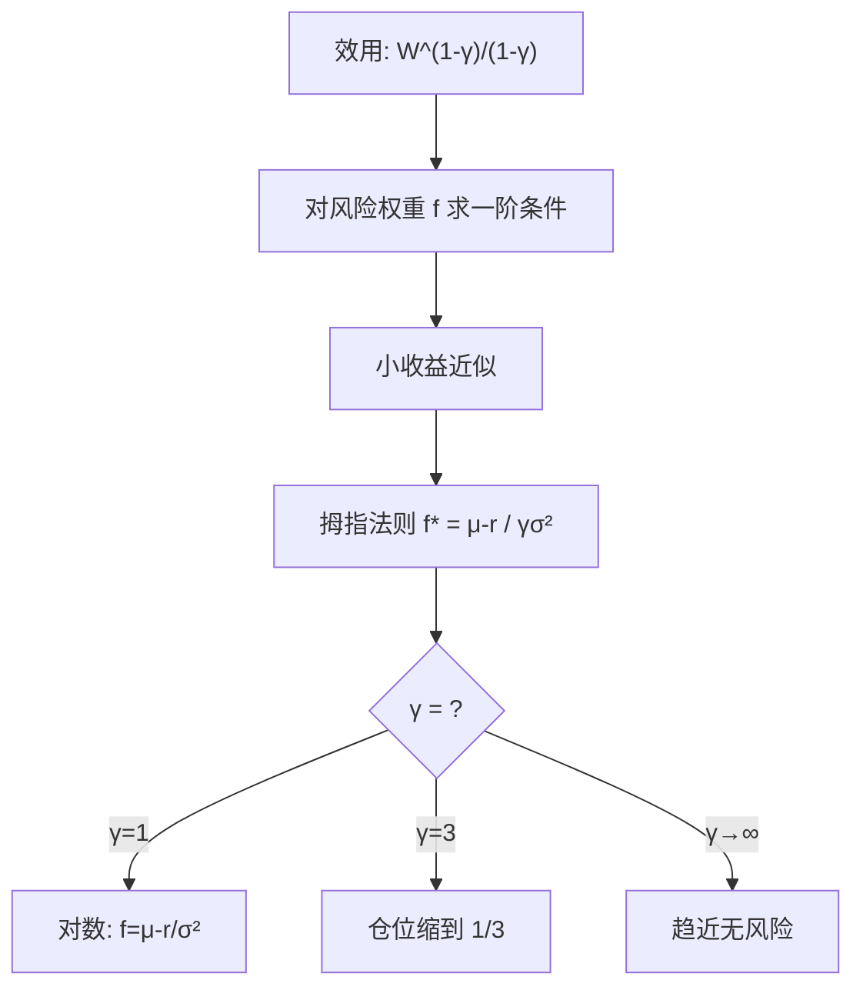
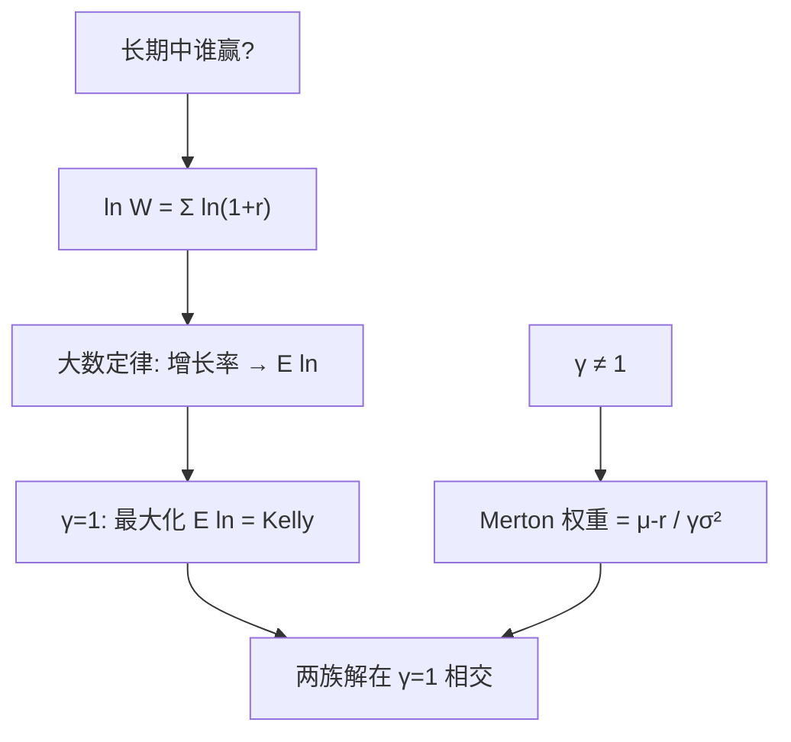

# crra-portfolio-choice

风险厌恶不是一句「保守」，是一个数：CRRA 效用里它叫 γ——γ 一变，最优仓位、杠杆与生命周期储蓄全跟着改写。

<footer>—— 据 Merton (1971) 连续时间组合选择；Campbell–Viceira《Strategic Asset Allocation》</footer>

[Kupiec 回测](/quant/kupiec-backtest)检验的是模型输出，本课回到选择的原点：给定收益分布，投资者该持多少风险资产。缺口是**效用函数的具体形状**——CRRA（常相对风险厌恶）是资产配置的默认语言，$\gamma$ 是其中唯一旋钮。本课只做单期与连续时间同分布情形，不做时变预期收益。

## 问题

最大化期望财富会全押高风险资产（期望更高），最大化对数财富又过于削峰——哪个对？缺一个既平滑又可标定的目标函数。CRRA $u(W)=W^{1-\gamma}/(1-\gamma)$ 给出：相对风险厌恶恒为 $\gamma$，行为不随财富规模改变。问题拆两问：$\gamma$ 取多少合理？给定 $\gamma$，最优风险权重是多少？

术语翻译：相对风险厌恶 $RRA=-W u''/u'$——「对财富百分比波动的厌恶」；CRRA 即它为常数。γ=1 时退化为对数效用；γ→∞ 是无限保守。

数字实例：50/50 抛硬币 ±20%。对数投资者（γ=1）的最优杠杆 $f=2p-1=0$——什么都不押；γ=3 的投资者只押约 $1/3$；期望财富最大化者全押但长期中位数财富趋零。同一个分布，γ 一变答案全变。

## 方法

单期解两步：写出 $EU=u(W_0(1+r_f+f(r_e-r_f)))$；对 $f$ 求一阶条件。收益小时用泰勒展开得拇指法则 $f^\*\approx(\mu-r_f)/(\gamma\sigma^2)$——超额收益除以「γ 乘方差」。连续时间 Merton 解同形：$\pi^\*=(\mu-r)/(\gamma\sigma^2)$，无劳动收入、常数机会集下权重是常数，再平衡就是让它保持常数。

直觉类比：γ 像汽车的避震硬度——γ=1 是跑车悬架，颠簸全受、吃满速度；γ=6 是越野悬架，稳但慢。Merton 公式说「油门开度 = 路况奖励 ÷（避震硬度 × 颠簸方差）」，硬度调一倍，油门就得松一半。

## 机制

CRRA 的两个解析福利：一是**同质性**——财富翻倍最优仓位百分比不变，适合跨投资者比较；二是**闭式路径**——连乘 $W_T=W_0\prod(1+r_f+f r_i)$ 取对数后是独立同分布之和，大数定律保证长期增长率 $\ln W$ 收敛于 $E[\ln(1+r_f+f r)]$，最优 $f$ 就是最大化这个增长率——这正是 Kelly 准则与 γ=1 的重合点。Merton 70/30 拇指（若 $\mu-r=6\%$、$\sigma=20\%$、γ=3，则 $f=0.06/(3\times0.04)=50\%$）把标定误差的影响也摆在明处：分母是 γ 与 σ² 的乘积，σ 估差 1 个百分点，仓位差四分之一。

常见误区：把问卷风险得分直接当 γ——「能承受 20% 回撤」翻译成 γ 需要经过收益分布假设，同一句话在 σ=10% 与 σ=25% 的世界里 γ 差 6 倍；另一误区是 γ 全资产共用——人力资本是隐性债券，年轻投资者的有效 γ 对金融资产要折价。

## 边界

CRRA 假设偏好不随财富改变，行为金融的损失厌恶（前景理论）直接拒绝这一点；时变机会集下最优仓位应随预期收益漂移，常数 $\pi^\*$ 只在 IID 世界成立。γ 的实证区间 1–10 跨两个数量级，资产配置对它一次幂敏感——报出仓位时同时报出 γ 与 σ 的标定来源是职业规范。本课与 [Kelly 准则](/quant/kelly-sizing)、[风险预算](/quant/risk-budgeting)的关系：Kelly 是 γ=1 的特例，风险预算是把 γ 换成「各资产风险贡献相等」的另一族解——三家是同一枚硬币的三种面。

直觉类比：γ、Kelly、风险预算像同一台调音台的三个推子——Kelly 按增长率推满，风险预算按各声部均衡推平，CRRA 按客户的耳朵（偏好）推；音乐不同，电路是同一套。

## 小结

- CRRA 用一个 γ 概括风险厌恶；Merton 权重 $\pi^\*=(\mu-r)/(\gamma\sigma^2)$。
- γ=1 退化为 Kelly——增长率最大化是效用族的特例而非对立面。
- 标定诚实：报仓位必须同时报 γ 与 σ 的来源，否则不可复核。
- 出处：Merton「Optimum Consumption and Portfolio Rules」1971；Campbell–Viceira 2002；Kelly 1956。
