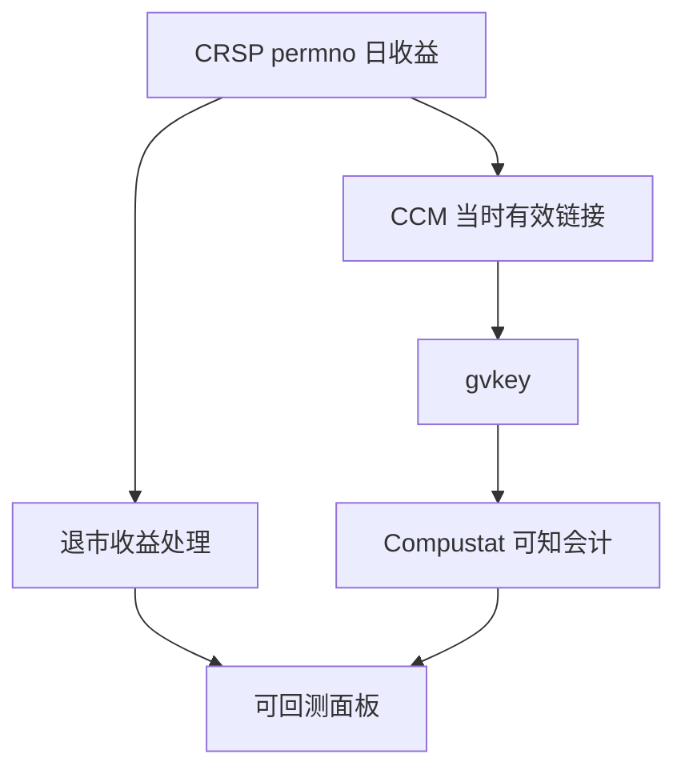

# CRSP / Compustat 对齐

价格在 CRSP，报表在 Compustat；两者的主键不是同一家公司的同一天。链接错了，因子就是在把别人的盈利接到自己的收益上。

<footer>—— WRDS CRSP/Compustat Merged（CCM）说明；Shumway, The Delisting Bias in CRSP Data, Journal of Finance, 1997；对照 Bali, Engle and Murray 对美股实证数据实践的讨论</footer>

[上一课](/quant/options-expiration-process)收束交易所课序。本单元转到研究基础设施。缺口从「成交如何发生」变成**历史如何被拼成可回测的面板**。CRSP 给美股收益、退市、分布；Compustat 给会计。CCM 的 `gvkey–permno` 链接有生效日与链接类型。Shumway（1997）证明退市收益处理足以改变小盘结论。后课 TAQ 把频率从日频升到逐笔；本课先把公司身份与退市做对。不要在这里重写[限价簿](/quant/lob-structure)。

## 问题

日频美股研究的最小对象是：某 `permno` 在日 $t$ 的收益，与当时已知的会计特征。Compustat 用 `gvkey` 与财政年度、季度。一家公司多次上市、并购、股票类别（A/B）、以及链接在某日才生效，使「按名称合并」非法。CCM 提供链接表，但链接有 `linktype`、`linkprim`、生效区间。用期末最新链接回填全历史，会把并购后的 gvkey 接到并购前的价格上。问题是点-in-time 链接：在 $t$ 日只使用当时有效的主键映射。

退市：CRSP 的 delisting return 在部分代码上缺失或为部分收益。Shumway 建议对绩效退市填入惩罚性收益（原文对缺失的绩效退市给出经验处理）。忽略退市的组合会把消失的公司当成「不再存在于样本」而不是「以很差的价格退出」，小盘、亏损、高波动因子被高估。这与存活偏差同方向。

### 财政日历不是交易日历

会计时点是财季末与发布日。用财季末的 Compustat 行去对财季末当天的 CRSP 收益，通常前视：市场尚未看见报表。正确对齐是发布日（或保守的假设发布滞后）之后。后课重述会再加版本；本课先把「哪一期报表」与「哪一天可知」分开。IBES、共识在再后一课，不要把初步盈利与 Compustat 定稿混成一列。

中国没有 CRSP。对应工作是：交易所代码、公司代码、退市与 ST 状态、财务发布日。原则同构：身份、生效区间、退市收益、可知时点。不要把 CCM 的 permno 概念硬套到 A 股六位代码上而不做历史复用检查。

## 方法

流水线：以 CRSP 日频为骨架 → 用 CCM 在每条收益上左连接当时有效 gvkey → 再连接 Compustat 中 `datadate` 对应、且 `rdq`（或你定义的可知日）$\le t$ 的最新一期。链接类型过滤：研究须声明使用哪些 `linktype`（如 LC、LU）以及是否仅 primary。多类股票：明确是用 permno 还是用公司级市值加权。退市：实现 Shumway 或后继文献的填补规则，并报告填补前后的因子差异。

质量控制：孤立 gvkey、短链接、一天内多个 permno 映射到同一 gvkey。并购日附近的收益与会计应人工抽查。市值、价格、成交量用 CRSP；账面用 Compustat，注意单位与货币。ADR、REIT、封闭式基金是否进入样本必须显式，不能靠「CRSP 股票文件里有」默认纳入。

### 退市与停牌是收益的一部分

停牌期无收益不是零收益。退市日收益若缺失，应按规则填或把该仓位标为不可交易退出。把退市公司直接从面板删除，等于条件于存活。这与指数成分课的存活偏差是同一类错误，后课会在指数层面再写一次。

## 机制

错误链接制造虚假的会计–收益关系：把成长公司的盈利接到价值公司的价格上，因子 IC 可以很好看，经济是错的。退市偏差选择性地丢掉左尾，使任何与困境相关的异常被放大。CCM 的生效区间是为了阻止这类错配；绕过区间等于绕过识别。

日频骨架一旦错，TAQ、IBES、指数成分都会沿错误主键传播。所以本课在数据单元的第一课：身份先于频率。

## 边界

CCM 覆盖并非宇宙中一切证券。私募、新近上市、非美会计主体会缺失。Compustat 工业与金融格式不同，银行用另一套科目。本课不提供未经许可批量转载 CRSP/Compustat 的数据。许可与引用以 WRDS 与供应商合同为准。

## 小结

- 用点-in-time 的 CCM 链接，禁止期末链接回填。
- 退市收益必须处理，否则小盘与困境因子被高估。
- 会计按可知日对齐，不按财季末日对齐。
- 出处：WRDS CCM；Shumway, *JF*, 1997。
