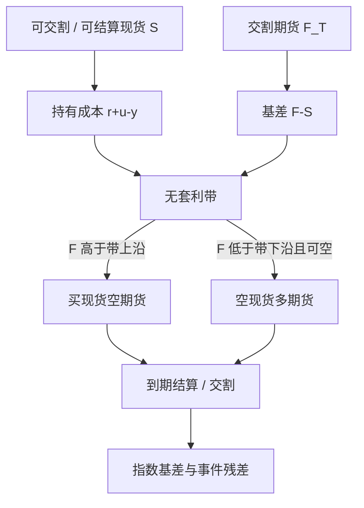

# 加密期现基差交易

    
买现货、卖有到期的期货，利润边界由融资、托管、交割或现金结算规则决定；曲线看起来陡，不等于仓单已经锁进了交割流程。

    <footer>—— 据 Hull 对期现关系的论述，以及加密交割期货与永续并存的公开合约结构整理</footer>

加密市场同时存在现货、有到期的交割或现金结算期货、以及 [永续合约](/quant/crypto-perp-funding)。期现基差交易通常指：买入现货、卖出交割月期货（正向），或相反（反向），把升贴水当成持有成本的报价。牛市阶段交割期货相对现货的升水曾经很陡，被当作「无风险年化」宣传；实际兑现率取决于能否开齐两条腿、保证金能否撑到结算、以及结算价定义是否等于你的现货可成交价。这与商品 [期现套利](/quant/cash-and-carry) 同族，但仓储变成托管与链上转账，品质变成分叉与合约规格，便利收益变成借币费率。本篇写交割期货相对现货的基差、与永续资金结构的差别、以及收敛机制。对象是公开合约规则，不是跨所延迟或指数操纵。

## 问题

记现货可成交价 $S_t$，到期 $T$ 的期货为 $F_{t,T}$。持有成本上界的粗形式是

$$
F_{t,T} \stackrel{?}{\approx} S_t\,e^{(r+u-y)(T-t)},
$$

其中 $r$ 是融资（稳定币或法币），$u$ 是托管与保险，$y$ 是借出该币能收到的费率。$F$ 明显高于右端，正向期现有空间：买现货、空期货，持有到 $T$ 用交割或现金结算对齐。$F$ 明显低于右端且现货可空，则反向。问题是右端每一项都是制度变量：你的 $S$ 必须是期货结算所承认的那种现货（同一币、能否进入结算篮子），$r$ 不是国债，$y$ 在挤空时可以跳升到使贴水「合理」。用指数现货减期货得到的陡升水，可能是指数里含不可提的场所价格，或期货流动性溢价。

第二句话是日历。交割期货有明确 $T$，基差的时间衰减可规划；永续没有 $T$，租金每期重定，见 [Funding rate 套利](/quant/funding-rate-arb)。把永续升水与季度升水当成同一个「币圈期现」，会在展期、资金脉冲和结算规则上算错现金流。

### 结算价必须等于你能卖出的现货

现金结算期货在 $T$ 按官方指数（一段时间平均、多场所加权）兑付。你持有的现货若只能在单一场所按另一个价格变现，交割日的 $F\to$ 指数并不保证 $F\to$ 你的 $S$。正基差交易的收敛是「期货兑指数、现货兑你的场所」，剩余是指数基差。实物交割则要求你能把币转到指定账户、满足时间窗与手续。无法进入交割流程的现货，对空头期货没有交割价值，与商品里买到不能生成仓单的货物同类。规格应写成「可进入结算或交割的库存」，而不是「任何交易所报价」。

分叉、空投与合约是否继承新币，会打破期现一对一。事件窗口里现货多了一项权利，期货可能按规则不跟。基差交易必须有事件日历，否则你在做公司治理（链上治理）而不是做持有成本。

## 方法

检查单。第一，读合约：实物还是现金、结算时间窗、指数构成、最后交易日、交割手续。第二，锁现货：充提、确认数、托管、能否在 $T$ 前移动。第三，锁融资与保证金：现货货款、期货初始与维持、两端是否在同一主体下可净额。第四，往返滑点与手续费计入半宽。第五，只有期货卖价高于「现货加全成本加半宽」才开正向，并规定：停充提、指数成分场所中断、保证金上调时的退出。展期：若不持有到 $T$，卖近月买远月是另一笔曲线交易，收益来自展期而不是锁定的期现，见 [Contango 与 Backwardation](/quant/contango-backwardation)。

执行上，现货与期货很少同时成交。部分成交时未锁的一腿是方向性风险。容量取现货可买、期货可空、保证金缓冲的最小者。期货深度常小于现货叙事里的「全市场」，尤其远月。用永续深度去推断交割月容量会高估。

### 升水的分解：融资、风险溢价、无法套利的残差

观测基差 $= $ 融资与托管 $+$ 借币便利 $+$ 保证金与对手方溢价 $+$ 冲击 $+$ 残差。牛市里残差往往是杠杆多头宁愿付期货升水也不愿买现货（现货无杠杆或杠杆更贵），于是期货贵。这是需求，不是公式错误。套利资本进入后升水应降到成本带内；若升水持久高于成本，应先怀疑带没写全：提币排队使现货腿无法对冲、期货保证金随波动上调、或套利者的资金本身有上限。Fama–French 检验仓储理论时用可观测库存；加密里对应的可观测是充提队列、借币费、未平仓量，而不是社交媒体上的年化截图。

与永续对比：季度升水一次性锁进 $F_{t,T}-S_t$，持有期资金流主要是期货盯市与现货融资；永续把升水切成资金脉冲。两条曲线应分开记账。用永续去对冲季度期货的日历价差，是曲线交易，不是期现锁定。

## 机制

正向期现的硬收敛是结算：现金结算把期货 P&amp;L 钉在指数路径上，现货市值钉在你的托管价格上，两者之差收敛到指数基差；实物交割则把币与现金交换，期货与指定现货强制对齐。提前平仓的收敛靠其他套利资本把 $F$ 压向持有成本。软的部分与 Working 的仓储叙事类似：现货「库存」（链上可转移余额、场所可提余额）充裕时，升水有上界，否则现货会被买去交割；现货紧、借币贵时，贴水可以持久，反向期现做不成。

盯市把利率路径写进期货腿，现货腿通常没有每日现金兑付。现货大涨，期货空头追加保证金，现货尚未卖出——现金缺口与传统商品期现相同，见 [保证金与盯市](/quant/futures-margin)。加密波动更高、保证金调整更频繁，缺口更常见。Geanakoplos 的杠杆周期在此表现为：升水吸引加杠杆的套利者，波动一升，保证金上调，套利者去杠杆，升水不降反升。纸面「套利」在最需要它把曲线拉平的时候消失。

同一币的永续与交割期货之间还有一块基差。它不是期现，是两种衍生品的曲线。用永续资金去「解释」季度升水可以作叙事，但不能把两个合约的保证金与结算混成一条腿。

### 破裂：指数、停提、分叉、交割窗

指数若包含你无法交易的场所，结算价可以印在你不可达的点上。停提把现货变成不可转移的仓单，正向期现的交割腿断裂，只剩价格对冲的希望。分叉使现货权利与期货规格分叉。交割时间窗、手续失败、最小交割量，使「理论上可交割」变成「这一笔交割不上」。这些是制度破裂，应事先写成停机条件，而不是事后解释为何年化没有兑现。反向期现额外破裂在借币被召回：现货空头必须在期货仍贴水时买回，挤空与基差同时动。

## 边界与工程取舍

对手方、托管与稳定币脱锚属于风险预算，不属于残差 alpha。历史升水样本若集中在单一场所可提、指数正常的年份，外推到压力年会高估兑现率。不要用永续的瞬时资金年化去给季度期货定价，周期与夹紧不同。不要假设跨币对的基差可加：ETH 与 BTC 的融资、借币与期货深度不同。

回测必须按合约规格切换：有的季度是现金结算、有的场所提供实物；最后交易日与指数平均窗口会改。用日收盘期货价减日收盘现货指数，忽略盘中无法同时成交与保证金路径，会把不可执行的标记当成套利收益。执行记录应分列：锁定时的基差、持有期融资、盯市现金流、结算残差、费用。

本篇说明公开期现结构如何定价与何处破裂，不提供干扰结算指数、在交割窗拥堵中抢位或针对托管安排的攻击路径。

「年化 50% 无风险」若未声明融资、保证金、结算基差、停提情景与对手方，其精度只精确到营销。内部应给出压力路径上的净兑现，而不是把开仓时的升水除以剩余天数。

## 小结

- 加密期现基差交易是有到期期货对可结算现货的持有成本交易，与永续资金结构分账。
- 无套利带由融资、托管、借币、保证金与冲击构成；陡升水可能是杠杆需求，也可能是带没写全。
- 结算价对齐的是官方指数或指定交割，不一定对齐你的场所现货；指数基差是残差。
- 盯市使期货腿出现现金缺口，现货涨、空头期货追加，与商品期现同一逻辑、波动更大。
- 停提、分叉、借币召回、指数成分中断是否定硬收敛的制度事件，应写入停机。
- 开仓升水除以剩余天数不是兑现收益；应报告压力路径上的净现金流。
- 出处：Hull, *Options, Futures, and Other Derivatives*；Working, *American Economic Review*, 1949；现金结算与保证金见 Black, 1976；Cox, Ingersoll and Ross, 1981；对照永续资金费的公开合约机制。
