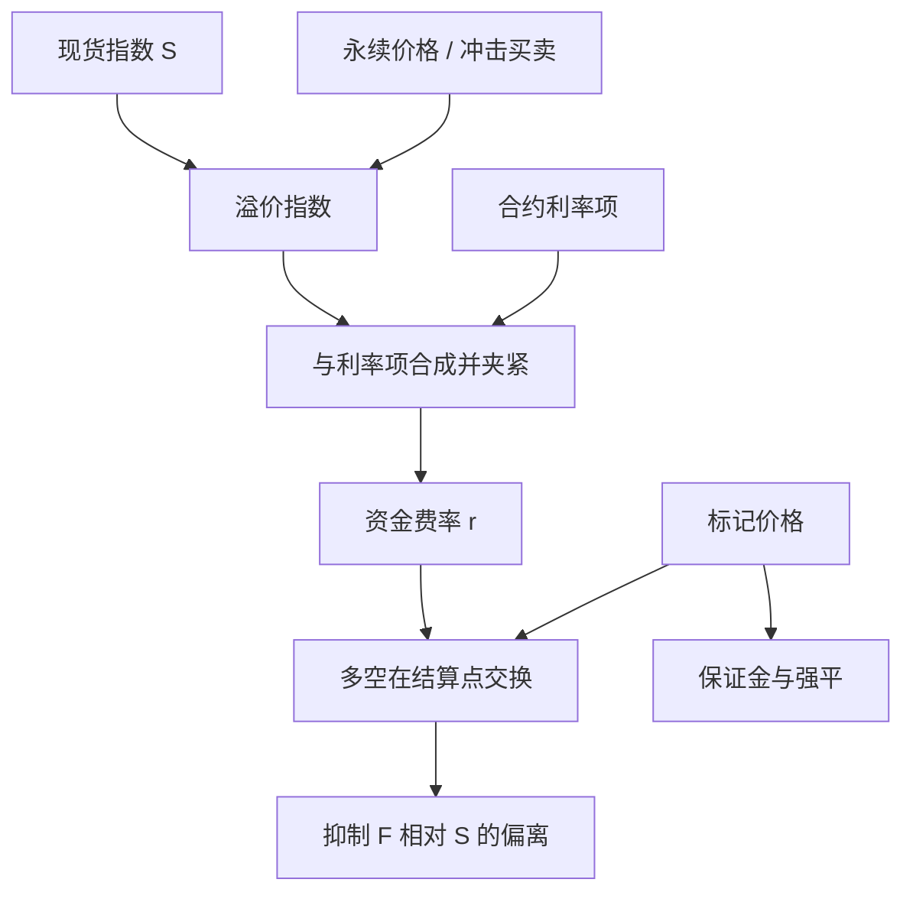

# 永续合约资金费率

    
永续合约没有交割日，用定期资金费把合约价拉向现货指数；费率是公开公式对溢价与利率的输出，不是预测下一根 K 线的信号源。

    <footer>—— 据永续合约的公开资金费机制（溢价指数、利率、结算周期）整理</footer>

[上一课](/quant/iceberg-detection)把高频因子课序收在公开簿上的隐藏量推断。本课打开加密市场微观结构。传统期货靠到期交割或现金结算把期现拉齐；加密市场广泛交易的永续合约（perpetual swap / perpetual futures）没有到期日，多空可以无限展期。为了让永续价格不永久偏离现货指数，合约规定周期性资金费（funding）：当永续相对指数升水，多头按公式付钱给空头；贴水则空头付给多头。BitMEX 早期把这一机制写成可计算的溢价指数加利率项，随后多数场所采用同族公式，周期从八小时到一小时不等。本篇写资金费的会计、标记价格与持仓成本，对象是公开机制。它与 [利率平价](/quant/irp) 里用利率差锚定远期的逻辑同类——都是用一笔定期现金流代替交割——但没有央行利率与交割库，只有指数与合约参数。不讨论如何操纵指数或利用撮合漏洞。

## 问题

永续在 $t$ 的交易价为 $F_t$，现货指数为 $S_t$。若没有锚定，投机需求可以使 $F$ 长期高于或低于 $S$，基差没有到期收敛。资金费引入一个持有成本：多头在每个资金时点支付（或收取）

$$
\mathrm{Funding}=q\cdot F_{\mathrm{mark}}\cdot r_{\mathrm{fund}},
$$

其中 $q$ 为仓位， $r_{\mathrm{fund}}$ 由溢价指数与利率夹紧而成， $F_{\mathrm{mark}}$ 为标记价格（通常接近指数，用于结算与强平，而不是最后成交价）。问题是：溢价如何定义、利率项起什么作用、资金费如何进入多空双方的损益，以及回测里若忽略资金费会错在哪里。

第二句话是杠杆。永续几乎总是保证金交易，资金费从保证金余额扣除。费率极端时，资金本身可以打穿维持保证金，即使价格没动。把永续当「无到期的期货」却只用价格 P&amp;L 回测，会把牛市里空头收取的资金、或挤空时多头支付的资金整段漏掉。

### 溢价指数不是最后成交的简单升水

公开公式通常用冲击买价 / 冲击卖价相对指数的偏离来定义溢价，再做时间平均，避免用单笔成交或最佳买卖的瞬时噪声。利率项提供一个小的基准（例如按八小时折算的年化一小段），再与溢价作差并用上下限夹紧，使费率不会完全等于瞬时升水。夹紧的含义是：升水很大时，资金费仍可能被封顶，剩余偏离靠交易者开反向仓去修，而不是靠公式一次性罚满。各场所的夹紧、冲击深度、指数成分与周期不同，不能把一个场所的历史费率接到另一个场所的成交上。

标记价格用指数加资金基差，是为了让强平不钉最后成交。最后成交可以被薄簿上的一笔扫过；指数来自一篮子现货场所的中位数或加权。回测强平与资金应用标记价路径，用最后成交会高估被「针」到的次数。这是公开风控设计，不是交易诀窍。

## 方法

会计。每个资金时点，多头支付 $r_{\mathrm{fund}}$（符号随溢价），空头收取，总额相加为零（在忽略保险基金与手续费时）。期间持有，资金按仓位与当时费率累加，与开仓滑点分开，见 [滑点归因](/quant/slippage-attribution)：资金是持有的期间成本，不是成交短fall。把八小时费率年化成「资金年化 80%」可以作量级比较，但不能当无风险收益率：费率下一期就会变，且你必须维持保证金才能收到。

预测。下一期资金常用「预测资金费」字段，它是已实现溢价的滚动，不是结算保证。策略若按预测费率开仓，必须用结算时的实际费率记账，并把预测到结算之间溢价的变化当成风险。样本外要按场所、按币对、按周期分段：同一「BTC 永续」在不同场所的资金费相关性高但不全相同，跨场所价差本身是另一条腿。

### 资金费与期现基差、交割期货的对照

有到期的交割期货靠时间流逝使基差收敛，持有成本是融资、托管与可能的借贷。永续把收敛义务切成离散的资金脉冲。升水时做空永续、做多现货，期望收取资金，这是 [Funding rate 套利](/quant/funding-rate-arb) 的原型，经济上接近 [期现套利](/quant/cash-and-carry)，但没有交割日保证基差归零——归零靠的是资金费改变持有意愿。若资金费被夹紧而升水仍大，套利资本必须靠交易把 $F$ 拉回 $S$，容量受现货深度、充提时间和保证金约束。回测应同时记录：资金现金流、基差变动、开平仓滑点、资金费是否触及夹紧上限。

利率项在加密里往往不是 LIBOR，而是合约写死的常数或很小的参考。它使平水附近仍有一笔小的多付空或空付多，避免费率在零附近频繁翻符号噪声。不要把这一项理解成「无风险利率平价已经成立」；CIP 式的平价在此被资金公式**定义**出来，而不是从两个货币市场套利出来。

## 机制

资金费的机制是把库存压力货币化。永续升水意味着愿意出更高价做多杠杆的人多，公式让他们向空头付租金，空头更愿意提供负库存，升水被抑制。贴水对称。这与商品便利收益、与期货升贴水的叙事同类：谁更急着持有合成敞口，谁付持有费。不同之处是脉冲频率高、杠杆高、参与者可以迅速进出，费率可以在数小时内从接近零跳到夹紧上限。脉冲使持有成本的路径比季度期货的平滑展期更尖。

标记价格把强平从最后成交上解开，降低「用一笔扫单触发他人清算」的敏感性。资金费仍按标记或按合约规定的价格计。机制上，资金与清算是两套规则：资金转移的是存活账户之间的租金；清算处理的是保证金不足的账户，见 [清算连锁](/quant/liquidation-cascade)。极端升水时两套同时紧张：多头又付高额资金又接近维持水平。风险系统应把下一期应付资金当成保证金的确定扣减，而不是当成可选费用。

资金费在多空之间零和，不创造现货市场的新现金流。现货腿的借贷、稳定币利率、链上转账费是另一套真实成本。把永续资金年化直接当成美元无风险利率，忽略了稳定币脱锚、提币排队与对手方风险。

### 周期缩短如何改变风险形状

八小时结算把一天切成三次脉冲；一小时结算使费率更贴近瞬时溢价，夹紧若仍按比例缩放，日内路径更噪。周期缩短降低「预测与结算之间」的基差风险，提高操作频率与漏记一笔资金的会计风险。回测的采样必须对齐实际结算时点，用日收盘价乘「当日平均费率」会抹掉脉冲，尤其在单日极值。跨场所对冲若结算时钟不同步，会在一小时窗口内暴露单腿资金。

## 边界与工程取舍

指数成分、权重、异常值过滤由场所公开，但指数仍可能在现货场所中断、停牌或点差极端时偏离你可成交的现货。资金公式对不可成交的指数计价，套利腿必须用可成交报价。充提延迟使现货腿不能瞬时对冲，资金周期越短，延迟越致命。不要用单一场所的历史费率分布去设所有币对的保证金附加：小币对溢价更肥、更常触达夹紧，尾部与 BTC 不同。

本机制描述公开资金费如何锚定永续，不提供操纵溢价指数、刷冲击买价或干扰标记的任何路径。公式里的冲击深度正是为了提高对薄簿刷价的成本；把它当成攻击面不属于本篇范围。会计上应将资金、手续费、滑点、清算罚金分列，禁止把四者揉成一个「资金策略收益」。

回测若在资金结算时点才「决定」仓位，会用已经确定的费率当未来函数。决策必须发生在结算之前，用当时已公布的预测或已实现溢价，实际资金用结算值记账。

## 小结

- 永续用周期性资金费代替交割，升水时多付空、贴水时空付多，把持有成本写成公开公式。
- 溢价通常来自冲击买卖相对指数的时间平均，再与利率项夹紧；各场所参数不可混用。
- 资金是持有的期间成本，应与开仓滑点分开记账；极端费率可在价格不动时消耗保证金。
- 标记价格用于资金与强平，回测不要用最后成交替代。
- 资金在多空间零和；现货借贷、稳定币与转账成本不在公式里。
- 决策不得使用尚未结算的确定费率，否则是未来函数。
- 出处：永续合约公开资金费与标记价格机制（溢价指数、利率、夹紧、结算周期）；经济对照 Keynes / Hull 对远期持有成本的讨论；利率平价见 Keynes, 1923。
