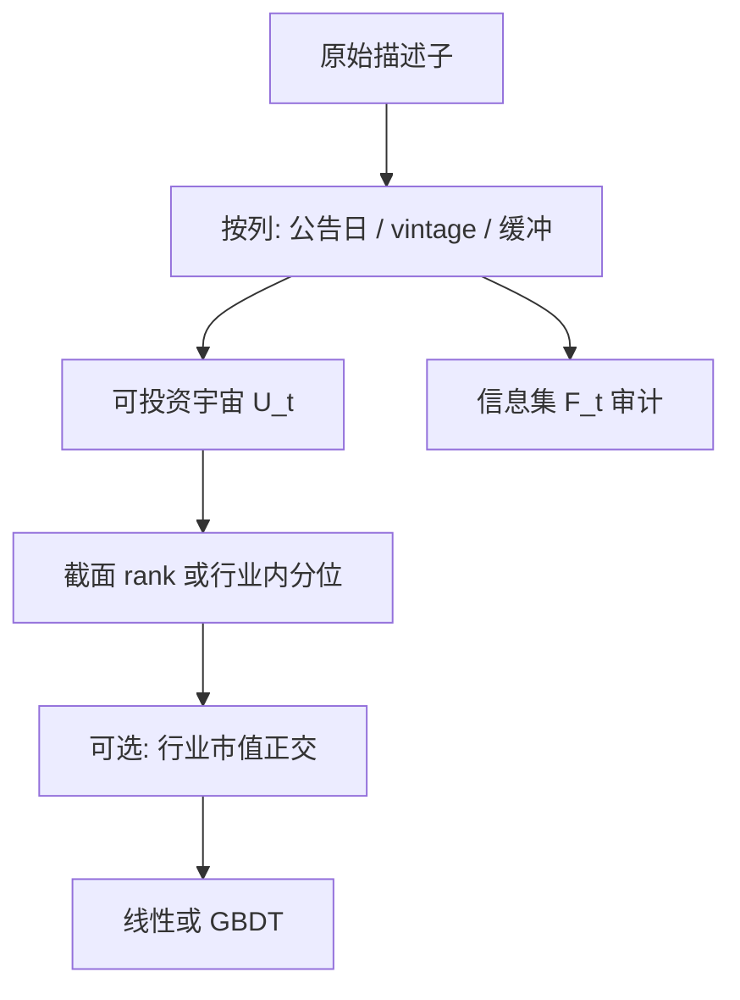

# 特征：滞后、截面 rank

会计变量在进入横截面之前必须滞后到投资人可获得；用财政年度结束日的账面去解释当年收益，测到的不是价值溢价，是前视。

<footer>—— 据 Fama and French 对账面市值比构造与 Compustat 可获得性滞后的标准处理</footer>

表格特征在进入模型之前有两步几乎决定结论：什么时候能用（滞后），以及在谁之间比较（截面变换）。Fama 与 French 把账面股权放到至少六个月后的组合形成日，避免用尚未公布的年报。Hou、Xue 与 Zhang（2020）在复制异常时强调 NYSE 断点与滞后，许多「显著」在这一手续下消失。Green、Hand 与 Zhang（2017）同时放入几十个特征，问的是增量信息而不是单个 t。Kelly、Pruitt 与 Su（2019）的 IPCA 把特征当作载荷的函数；Kozak、Nagel 与 Santosh（2020）在特征空间里收缩。截面 rank 或 z-score 是 Barra 与多空排序的共同语言，见[单因子排序](/quant/long-short-sort)。本篇把滞后与 rank 写成特征工程的最小充分统计：不做这两步，[GBDT](/quant/gbdt-alpha) 会把规模、单位和前视当成「非线性」。

## 问题

原始描述子的量纲不可比：B/M 是比率，过去收益是小数，成交额是货币，分析师人数是计数。树模型虽然对单调变换不敏感，但对**离群点与缺失**敏感，且不同特征的分裂增益会偏向高方差、厚尾的列。线性模型则直接被量纲支配。截面 rank 把每个 $t$ 上的 $x_{i,t}$ 变成 $\{1,\ldots,N_t\}$ 上的次序或分位，去掉水平漂移（通胀、指数点位）并压住极端值。问题是 rank 的总体是谁：全体股票、NYSE、某个流动性宇宙。总体一变，同一家公司的分位可以穿过整个因子，这与 FF 用 NYSE 断点是同一道理。

滞后是信息集。财报、分析师、宏观、另类数据各有可获得时钟。用 $t$ 月的应计去预测 $t$ 月收益，若应计要到季报发布才知，就是未来函数。即使「季度已经结束」，未公布仍不可交易。Fama–French 的六个月是保守规则；更精细的做法是用实际公告日（Compustat RDQ）逐公司滞后，但缺失与修正会引入选择偏差。另类数据的 vintage 见[卫星](/quant/satellite-geo)与[卡消费](/quant/card-spending)：供应商回填历史等同于把未来的商户分类用到过去。

### Rank 不是唯一的截面变换，但往往是最可审计的

截面 z-score（减中位数、除以中位数绝对偏差）保留一点形状，仍对极端值敏感。行业内 rank 先去掉[行业](/quant/industry-neutral)水平，相当于把特征变成行业相对。市值分层后的 rank 避免小盘包办两端。Freyberger、Neuhierl 与 Weber（2020）用自适应分组看特征的非线性；那是估计问题。工程上应先交付「日期 $t$、宇宙 $U_t$、行业内分位」这一可复现对象，再谈自适应。缺失值：不参与 rank 的股票应保持缺失，而不是填 0.5，否则模型把「没数据」当成中性，对分析师覆盖稀疏的名字系统性误分类。

对时间序列做 rank（一只股票自己过去一年的分位）测的是自身极端程度，不是横截面相对价值。两种 rank 可以同时用，但必须命名：cs_rank 与 ts_rank 混用是常见的研究不可复现来源。

## 方法

**滞后表。** 为每一列写：源、频率、法定或供应商延迟、保守缓冲、修订政策。价格与成交来自市场，滞后通常是「只用 $t$ 日收盘及以前」；会计用公告日或 FF 六个月；分析师用 IBES 统计日；宏观用实时数据库 vintage。特征矩阵的每一行对应一个**可交易日期**，该行所有列必须属于该日信息集。Gu–Kelly–Xiu 的特征清单长，正是因为每列都经过这一手续；复制他们的结果却用点对点对齐的 Compustat 当年值，不是复制。

**截面变换。** 每个 $t$ 在宇宙 $U_t$ 上计算分位 $q_{i,t}=F_{t,U}(x_{i,t})$。$U_t$ 应与组合可投资集合一致：有价格、有最小成交额、未停牌。Winsorize 再 z-score 是线性模型的传统；树可以用分位，减少一次超参。行业内分位：先按分类映射，行业内不足够多名字则退回全局分位并做标记。双重 rank（先行业再全局）要预先指定顺序，顺序会改变正交含义，见[因子正交](/quant/factor-orthogonal)。

**与排序实验对齐。** 若最终交易是十分位多空，训练标签与特征都应在同一宇宙、同一断点哲学下生成，否则模型在学一套分布、组合在另一套上成交。Hou–Xue–Zhang 复制失败常常来自断点与滞后，而不是来自机器学习。

### 滞后不足与滞后过度

滞后不足：前视，样本内完美，实盘崩塌。滞后过度：用一年前的会计去预测下周微观结构收益，IC 被衰减掉，模型只能去拟合噪声。会计特征配月频标签、微观结构特征配短 $h$，见[标签与重叠](/quant/label-horizon-overlap)。把全部特征强行滞后到最慢的那一列（例如都等年报），是在用会计日历阉割高频信息；正确做法是**按列滞后**，而不是按行统一延迟。

拆股、分红调整会改变过去收益与价格特征。应用同一套调整规则，并在除权日检查 rank 是否跳变。跳变若来自调整错误，会成为树的虚假分裂点。

## 机制

截面 rank 使特征对共同水平冲击（市场上涨、通胀）近似不变，于是线性模型的系数更接近「相对高低」而不是「绝对大小」。这也去掉一部分时变波动：牛市里原始动量绝对值变大，分位仍然在 $0$ 与 $1$ 之间。代价是丢掉水平里可能存在的宏观信息——若你确实要用估值的绝对水平做择时，应另建时间序列特征，不要让截面 rank 偷偷承担择时，见[IC 与择时](/quant/ic-ir-timing)。

Rank 的非线性：两端的经济含义往往更强（极端价值、极端动量），中间接近噪声。树会自动在分位两端多分裂；线性模型需要预先加平方项或分位哑变量。Freyberger–Neuhierl–Weber 的非参数结果表明许多特征的效应集中在尾部，这与「只用 rank 再线性」并不矛盾：rank 已经把尾部标出来。

滞后机制是可交易性。市场只对信息集 $\mathcal{F}_t$ 定价。特征若属于 $\mathcal{F}_{t+k}$，回归估的是不可实施的相关。McLean 与 Pontiff（2016）的发表后衰减之外，还有一类更平凡的衰减：研究用了比实盘更短的滞后。

### 高维特征中的共线与 rank 的限度

几十个特征在截面上高度相关（价值族、质量族）。逐列 rank 不消除共线，只统一量纲。随后仍需正交、PCA、IPCA 或正则，见[协方差收缩](/quant/cov-shrinkage)与 Kozak–Nagel–Santosh。GBDT 会把共线列的重要性拆得看起来很散，或集中在某一列上随种子变化。报告时应给一族特征的联合置换重要性，而不是只看单列 gain。Green–Hand–Zhang 的问题意识仍适用：独立信息含量，不是列数。

## 边界与工程取舍

不要用未来宇宙（事后进入指数的成分）做当日 rank。不要把测试期的截面均值与标准差用于训练期标准化。不要对百分比特征再做一次跨期标准化导致双重缩放。中文会计科目与海外 Compustat 的滞后规则不同，必须按交易所披露时钟重写，而不是翻译列名。另类数据列的滞后往往长于供应商宣传的「T+1」，应以你实际收到文件的时间为准。

Rank 在 $N_t$ 很小时（行业内三只股票）不稳定。应设最小截面宽度，否则分位在 0、0.5、1 上跳动，成为噪声源。

特征存储应保存原始值、滞后后的可交易值、以及 rank 后的值三层，并记录 $U_t$ 名单。只存最终分位，五年后无法回答「当时宇宙里有没有这只停牌股」。

## 小结

- 滞后定义信息集：Fama–French 的会计滞后与 Hou–Xue–Zhang 的复制纪律，比模型选择更常决定异常是否存在。
- 截面 rank 统一量纲、压制极端值、去掉水平漂移；宇宙与行业内总体必须与可交易集合一致。
- 按列滞后、按日 rank；用最慢列统一延迟会浪费高频信息，用未公布会计会前视。
- Rank 不消除特征族共线；增量信息仍要按 Green–Hand–Zhang 与 IPCA / 收缩的逻辑检验。
- 出处：Fama and French, *Journal of Finance* / *JFE* 对 HML 的构造；Hou, Xue and Zhang, *RFS*, 2020；Green, Hand and Zhang, *RFS*, 2017；Kelly, Pruitt and Su, *JF*, 2019；Kozak, Nagel and Santosh, *JF*, 2020；Freyberger, Neuhierl and Weber, *RFS*, 2020；Gu, Kelly and Xiu, *RFS*, 2020。
