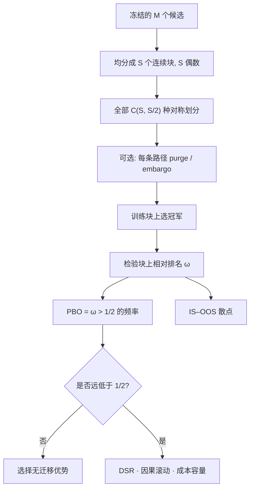

# CSCV 组合对称交叉验证

把样本均分成偶数块，枚举所有「一半训练、一半检验」的组合，才能把切点运气平均掉，留下选择过程本身：样本内冠军在样本外是否仍高于中位。

<footer>—— Bailey, Borwein, López de Prado and Zhu, The Probability of Backtest Overfitting, Journal of Computational Finance, 2017</footer>

[回测过拟合概率](/quant/pbo) 一文写 PBO 的定义与误用：它是相对排名事件的频率，不是可优化的目标。[组合过拟合 CPCV](/quant/cpcv) 把同一骨架加上 purge 与可变的测试块数 $k$，并讨论与 DSR 的接口。[Combinatorial Purged CV](/quant/cpcv-lopez) 则把组合划分用于**单个冻结估计器**的路径分布。本篇回到 Bailey 等人 2017 年原文的实验设计本身：组合对称交叉验证（Combinatorially Symmetric Cross-Validation, CSCV）。它不是又一种优化器，也不是 walk-forward 的替代。对象是：在候选集合已冻结时，如何生成足够多、且对时间块对称的训练–检验划分，使 PBO 与 IS–OOS 散点可估计。

## 问题

单次「前半训练、后半检验」把 PBO 变成一个 0/1，完全依赖切点。滚动给出十几条相邻窗口，共享状态，估不准「低于中位」这种比例。普通 $K$ 折路径只有 $K$ 条，且打乱时间。Bailey 等人要的是：每一段历史都有机会当训练、也有机会当检验，从而把「这段日子特别适合某条规则」平均掉，留下**挑选冠军**这一操作的偏差。

设候选 $M$ 个，观测长度 $T$。将时间均分为 $S$ 个连续块，$S$ 为偶数。每一个组合 $c$ 取其中 $S/2$ 块为训练、互补 $S/2$ 块为检验，共

$$
|\mathcal{C}|=\binom{S}{S/2}
$$

条路径。$S=16$ 时已有 12870 条，足以估频率；$S=8$ 只有 70 条，分位会吵。问题是 $S$ 的选择、块内依赖性、以及对称划分与真实部署顺序的冲突——后者不是缺陷，因为 CSCV 度量过拟合，不度量可部署性。

### 为什么必须对称，而不是「更多的滚动」

滚动的所有路径共享同一个时间箭头：若样本末端是某策略擅长的体制，多数窗口都会沾光，PBO 被压低。对称组合让末端块在半数路径里当训练、半数里当检验，末端运气被对冲。代价是部分路径在时间上交错，训练与检验可以互嵌。这合法地用于估计选择偏差，不合法地用于估计冲击、容量或因果权益曲线。可部署性仍靠预先声明的 [walk-forward](/quant/walk-forward)。

送进 CSCV 的 $M$ 必须是实际搜索过的集合。看过结果再改的过滤、换过的起止日期、Git 里删掉的网格，都算。只把最后留下的「合理」配置拿去算，PBO 假低。

## 方法

**步骤。** 收益矩阵为时间 $\times$ 配置。对每个 $c$：在训练块拼接的样本上计算绩效 $R^{\mathrm{IS}}_{n,c}$（通常是扣费夏普），$n^\star_c=\arg\max_n R^{\mathrm{IS}}_{n,c}$；在检验块上计算 $R^{\mathrm{OOS}}_{n,c}$，得到冠军的相对排名 $\omega_c$（高于其样本外绩效的配置所占比例）。过拟合指示 $1\{\omega_c\gt 1/2\}$。

$$
\widehat{\mathrm{PBO}}=\frac{1}{|\mathcal{C}|}\sum_{c} 1\{\omega_c\gt 1/2\}.
$$

同时画 IS–OOS 散点：横轴训练绩效、纵轴检验绩效，每点一个组合上的冠军。过拟合常表现为负斜率。Bailey 等人还建议 logit 变换与 IS–OOS 相关系数。技能真实且选择温和时，PBO 应明显低于 $1/2$，散点不出现稳定负斜率。

**绩效指标。** 必须与实盘一致。用毛夏普算出来的低 PBO，在扣费后可能翻转，因为高换手配置在样本内更容易靠忽略成本取胜。若效用是 Calmar 或扣费后期望，CSCV 的 $R$ 就用那个，不要用夏普选冠军、用 Calmar 写故事。

**与 CPCV 的差。** CSCV 固定「一半对一半」，组合数 $\binom{S}{S/2}$，原文针对 PBO。CPCV 取 $k$ 个测试组，路径数 $\varphi=\binom{N-1}{k-1}$，并在每条划分上 purge/embargo。金融标签重叠时，朴素 CSCV 的交错块会让训练与检验共享同一段价格路径，PBO 被泄漏压低。诚实做法是：对称骨架保留，每条组合上做清洗，即 CPCV 精神下的 CSCV。$k=N/2$ 时两者最接近。不要把未清洗的 CSCV 数字和清洗后的 CPCV 数字混排。

### 报告清单

最低报告：候选如何构造、$S$、是否 purge、绩效定义、$\widehat{\mathrm{PBO}}$、IS–OOS 散点、各路径上冠军样本外绩效的分布。不要只摘分布上分位。不要调 $S$ 使 PBO 最低。配置高度相关时，先聚类，按有效独立个数读 PBO，并与 DSR 的有效 $N$ 核对——名义 $M$ 很大但大家样本外一起动，相对中位优势可以稳定却只是同一个赌注。

$S$ 太小，频率估不稳；$S$ 太大，每块太短，切断依赖，路径看似很多、信息重复。预先声明 $S$ 并做邻近偶数敏感性。块应在时间上连续，禁止打乱观测后再分块。

## 机制

样本内绩效 = 技能 + 该划分上的噪声。取最大值系统性地挑中噪声为正的配置；样本外噪声若近似独立，条件期望下降，相对中位的优势被侵蚀。信噪比越低、搜索越宽、配置越能贴合特定块，侵蚀越严重。CSCV 用对称划分逼近这种条件频率。若泄漏存在，训练与检验共享噪声，PBO 被压低，过拟合被评估器藏起来。

几何图像是 IS–OOS 负斜率：越能在训练块上拟合 idiosyncrasy 的配置，越不能在互补块上重复。弱相关或零相关也可能只是信噪比太低，未必是过拟合；须与绝对绩效分布一起读。纯噪声搜索时 PBO 靠近 $1/2$ 或更高；PBO $=0$ 在有限组合下几乎意味着候选太同质或 $S$ 太粗，不是圣杯。

CSCV 不能创造新历史。三年数据上的一万条组合路径高度依赖同一段噪声实现。窄分位不等于三年外的保证。短样本应降低 $M$，而不是加密 $S$ 假装有很多独立考试。

### 与 Nested CPCV、RW 如何分工

CSCV/PBO：候选已闭合，度量选择是否带来相对优势。Nested CPCV：候选尚未闭合，网格必须待在内层。Romano–Wolf：相对明确基准的 FWER 名单，绝对边缘。可以 CSCV 显示相对中位仍好，RW 却不拒绝相对现金——全体没有经济边缘，只是冠军不比同伴更差。完整实验设计把 CSCV 放在搜索闭合之后、部署滚动之前，而不是用 CSCV 去再挑一个更漂亮的切分。

## 边界与工程取舍

交错路径不是交易模拟。PBO 低且 DSR 高，仍可能在因果滚动上因非平稳失败。反过来，PBO 接近 $1/2$ 时几乎不应进模拟账户。计算上应对配置向量化评分；订单级回测跑不了 $\binom{S}{S/2}$ 次。评分若含全样本标准化，组合次数只是复制泄漏。

不要把 PBO 写进自动调参。不要用一次实盘碰巧好来否证高 PBO：单次实现推不翻关于选择过程的频率陈述。Bailey 等人讨论第二类错误：真技能被保守评估杀掉。PBO 不是越小越好。研究迭代本身在增加 $M$：每月「改进」一次，一年后的曲线是十二次选择的复合，应冻结规则、把改动当新候选重新走 CSCV。

原文把 CSCV 定义为估计 PBO 的工具。研报若只贴一条「CSCV 平均 OOS 夏普」，等于把组合验证降级成又一次选美。输出是频率、散点与分布。

## 小结

- CSCV 用偶数块上的对称一半对一半组合，生成估计 PBO 与 IS–OOS 散点所需的路径。
- 对称是为了平均切点运气，不是为了模拟部署；可部署性仍靠因果滚动。
- 金融标签重叠时应在每条组合上清洗，此时 CSCV 与 $k=N/2$ 的 CPCV 对齐。
- 候选集合与 $S$ 必须冻结；在 PBO 上再优化是第二层过拟合。
- 出处：Bailey, Borwein, López de Prado and Zhu, *Journal of Computational Finance*, 2017；López de Prado, *Advances in Financial Machine Learning*, 第 11–12 章。PBO 定义见 [PBO](/quant/pbo)，清洗组合见 [CPCV](/quant/cpcv)。
