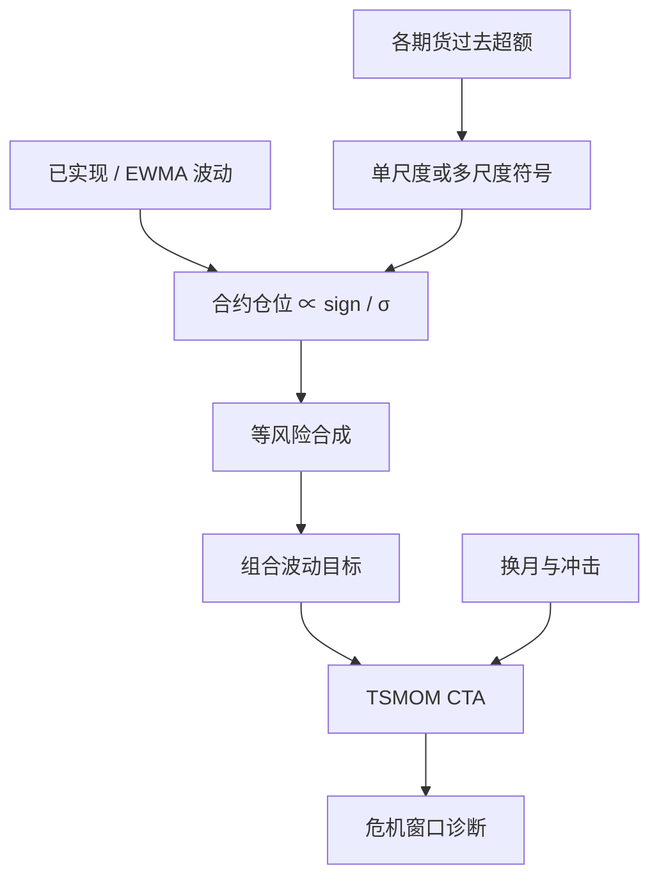

# 时间序列动量 CTA

若资产自己过去十二个月的超额收益为正，则做多；为负则做空；再按波动把仓位缩放到目标风险。管理期货把同一条规则写成可交易的跨品种组合。

<footer>—— Moskowitz, Ooi & Pedersen, Time Series Momentum, Journal of Financial Economics, 2012</footer>

[时间序列动量](/quant/tsmom) 写的是 MOP 的学术定义与检验。本篇把同一对象接到 **CTA / 管理期货**：流动期货池、多时间尺度、波动目标、换月与危机凸性如何被产品化。Hurst、Ooi 与 Pedersen 用一个世纪的趋势证据说明，这件事不是 1980 年代商品顾问的样本偶然；Baltas 与 Kosowski 一类工作则讨论容量、换手与波动缩放如何改写夏普。把 CTA 的宣传册直接贴上 2012 年论文的 t 值，或把论文的 12 个月符号当成业界唯一规则，都会错。

## 问题

CTA 要回答的交易问题是：在股指、国债、商品、外汇期货上，要不要对每一份合约持有与其自身过去趋势同向的仓位，以及如何把几十上百份合约收成一个目标波动的组合。截面 [WML](/quant/momentum-wml) 强制多空资金中性，不能在「所有市场都在跌」时变成净空头；TSMOM 可以，这正是管理期货被当成危机凸性来源的原因。问题是产品层还有三层摩擦：多尺度信号如何合成、波动缩放与组合风险平价如何嵌套、换月与冲击如何从纸面夏普里扣掉。

第二个问题是识别。均线金叉、唐奇安通道、12 个月符号，在月频上高度相关，但换手、滞后与在震荡市的磨损不同。学术 TSMOM 是干净的符号函数；CTA 是滤波器组。复制必须声明是在复制论文，还是在复制一种可投资的趋势组合。

### 符号、均线与通道不是三个市场

对资产 $i$，论文基准是

$$
w_{i,t}\propto \mathrm{sign}(r_{t-L,t}^{e,i})\cdot\frac{\sigma_{\mathrm{tgt}}}{\hat\sigma_{i,t}}.
$$

$L=12$ 个月是主结果，1 到 12 个月通常都为正。价格与长均线的差、突破前高，在趋势状态里与 $\mathrm{sign}$ 同号，在来回穿越时更吵。CTA 常用 1 个月到 12 个月甚至更长的一组 $L$，按风险预算加权，为的是让慢信号在震荡里少翻、快信号在转折里少迟到。这改变的是路径与换手，不是「要不要时间序列动量」这一命题。把三个滤波器的样本内最优权重当成新 alpha，多半是同一条 TSMOM 的再参数化。

个股 CTA 与期货 CTA 不可比：借券、涨跌停与退市使空头腿残缺。MOP 与世纪趋势文献的主样本是流动期货。用小盘股票的时间序列动量去验证管理期货产品，是换了市场微观结构还在用同一张成绩单。

## 方法

资产池：流动性、合约规格、夜盘与交割规则要先入池，再谈信号。国内股指与商品另有持仓限额与交易限制，空头腿不是 CME 样本的平移。信号：至少报告单尺度 12 个月与多尺度合成两列；是否包含最近一日、是否跳月，期货上不如个股关键，但仍应固定。波动：EWMA 或 60 日左右已实现波动，目标波动先在合约层（论文常用较高的单资产目标再在组合层面对冲），再在组合层拉到产品波动（常见年化 10%–15% 一类）。组合权重接近等风险，而不是等名义，否则原油与天然气会吞掉汇率腿。

检验应对准 CTA 的使用场景：相对被动多头期货、相对截面动量、以及股权大跌窗口的平均收益（见[危机 alpha](/quant/crisis-alpha)）。只交全样本夏普，无法区分「趋势溢价」与「碰巧做多了商品超级周期」。

### 产品化时的三层杠杆

第一层是合约乘数与保证金，名义远大于权益。第二层是 vol targeting：$\hat\sigma$ 低时加杠杆，高时去杠杆。第三层是组合再缩放，使总波动贴近产品说明书。三层同向时，平静期杠杆升得很高，一旦波动跳升，去杠杆本身成为市场供给，见[拥挤与清盘螺旋](/quant/crowding-spiral)。回测若只在收益序列上乘一个常数杠杆，会漏掉第二层的路径依赖：同样的信号，在波动聚类里的仓位过程完全不同。

## 机制

行为：消息渗入价格缓慢，趋势随后被仓位与止损强化，长期过度再反转。套保：商品生产商持续提供流动性给趋势一侧，部分解释商品样本，解释不了股指与汇率上同样存在的 TSMOM。风险预算：CTA 自己在波动上升时减仓，既减回撤，也可能在趋势加速的前段少赚。危机凸性来自「可以净空股指」，不是来自买入期权；V 型反转是对称的左尾。

与 [Carry](/quant/carry-everywhere) 的分工仍然成立：Carry 假定价格不变时的收入腿，TSMOM 用价格已经走的方向。CTA 若把曲线斜率与趋势乘在一起当单一信号，商品上会把展期算进动量，见[商品趋势与展期](/quant/trend-vs-roll)。正确的产品设计是两条腿分开记账，相关有限时再合成。

### 容量与拥挤改写的是执行，不是 t 值

学术组合假设中间价成交。真实 CTA 在滚仓周、期权到期周、以及同业 vol target 触发日与深度抢同一侧。世纪样本里趋势很强的某些商品，当时并没有同等规模的管理期货。样本外应看：换手、参与率上限、以及信号在资产间已经高度同号时是否主动降总杠杆。夏普从论文到产品的衰减，优先用冲击与拥挤解释，而不是先去加第四个均线。

TSMOM 的净暴露随趋势变号，这是功能，不是 bug。向股权组合推销 CTA 时必须展示净暴露路径与最大回撤，而不是只展示「与股票低相关」的全样本数字——低相关来自时变空头，空头腿在政策反转里会亏。

## 边界与工程取舍

不要把 12 个月均线金叉直接标注为 Moskowitz et al.（2012）。不要把个股 12−1 的截面 t 值写进期货 CTA 的尽调。不要在已经波动缩放之后，再用未缩放的多头指数当基准并声称「同等风险」。目标波动定高了，回撤按比例放大，信息没有增加。A 股股指期货的限制区间里，空头 CTA 不是国际样本的子集。

多尺度加权、通道与均线属于实施细节，应放进附录与换手表，不应当成独立「策略工厂」。与风险平价、股票动量同时持有时，股指腿会重复方向暴露，需在基金层面对冲或预算。

出处：Moskowitz, Ooi & Pedersen, *Time Series Momentum*, Journal of Financial Economics, 2012。长样本趋势见 Hurst, Ooi & Pedersen, *A Century of Evidence on Trend-Following Investing*。截面动量见 Jegadeesh & Titman, 1993。CTA 危机表现见 Kaminski 的 crisis alpha 论述。

## 小结

- 管理期货的核心可交易规则与 TSMOM 一致：对自身过去超额取符号，再按波动缩放、跨资产分散。
- 多尺度、均线与通道是滤波器选择，月频上与 12 个月符号高度相关，差异主要在换手与转折路径。
- 危机凸性来自可净空的时变暴露，V 型反转与拥挤去杠杆是左尾。
- 产品夏普取决于换月、冲击、目标波动与容量，不是论文 t 值的常数倍。
- 出处：Moskowitz, Ooi & Pedersen, JFE, 2012；Hurst, Ooi & Pedersen 的长样本趋势证据。
