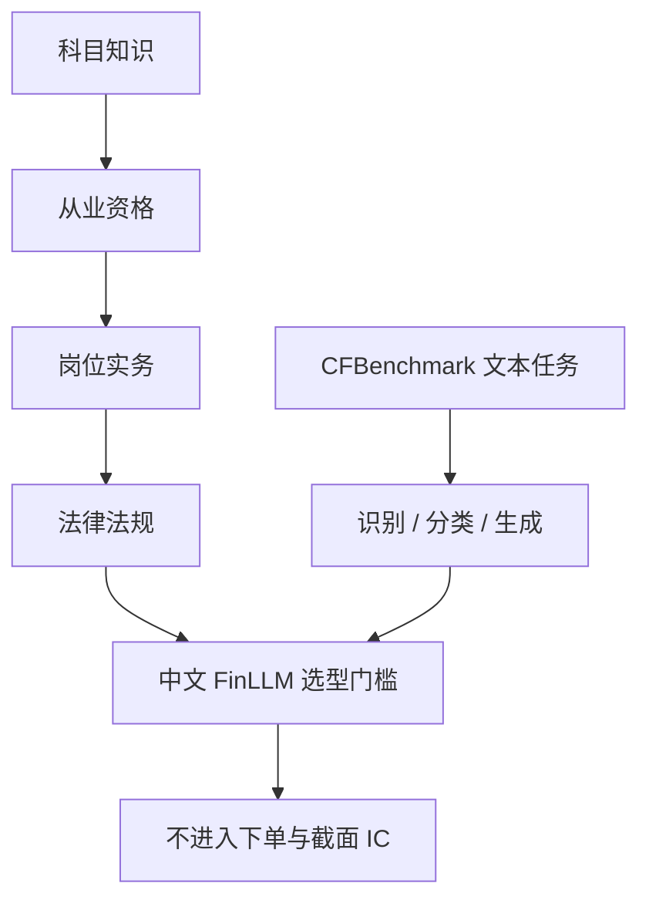

# CTBench 中文金融基准

    
对齐中国金融从业者的进阶路径：先科目知识，再从业资格，再实务岗位，最后是法律法规；约十万道题上，最好模型的平均准确率仍只有约六成。

    <footer>—— Nie, Yan, Guo et al., CFinBench: A Comprehensive Chinese Financial Benchmark for Large Language Models, arXiv:2407.02301，NAACL 2025</footer>

中文金融 LLM 评测在公开文献里不叫一张统一的 CTBench，而是一条逐步加厚的栈。Lei 等人的 CFBenchmark（arXiv:2311.05812）测识别、分类、生成等文本处理；FinEval、FinanceIQ、BBT-CFLEB 测知识与基础 NLP。Nie、Yan、Guo 与华为诺亚等提出的 CFinBench 把规模推到 99,100 题、43 个二级类、三种题型（单选、多选、判断），一级类按从业路径分成科目、资格、实务、法律。约 50 个模型上，GPT-4 与若干中文取向模型领先，最高平均准确率约 60.16%（后续版本报道可到约 66%）。本篇以 CFinBench 为主卡片，把 CFBenchmark / FinEval 当作对照，写**中文金融知识考试能测什么、不能测什么**，以及它与交易研究的接口：合规与术语是门槛，不是 alpha。

## 问题

通用中文基准（C-Eval、CMMLU）覆盖金融的密度不够；英文 FLUE / FLARE / FinBen 不考察中国会计、税法、从业资格与中文披露用语。早期中文金融集要么偏 NLP 小任务（BBT-CFLEB），要么知识题量只有数千（FinEval 约 4,661 单选，FinanceIQ 约 7,173）。模型已经能在单选上刷分，需要更大、题型更多、且按职业路径分层的考试，才能看出是「会做题」还是「会从业约束」。CFinBench 的设计哲学明确写成 leveling up：科目记忆 → 资格证书 → 岗位实务 → 法律红线。

考试型基准的固有缺口是：**分数不等于在研报或行情上的可行动能力**。多选题可以测「哪些属于内幕信息」，测不出「这份年报的附注是否在隐瞒关联交易」。后者需要长文档与表格，见[EDINET-Bench](/quant/edinet-bench) 与 [FinMMDocR](/quant/finmmdocr)。检索与时效是另一缺口，见[FinSearchComp](/quant/finsearchcomp)。CTBench 这一层回答的是：模型是否具备中文金融从业的陈述性知识与法规意识。

### 题型比科目更决定难度

单选四选一可以被表面统计猜对；多选要求集合相等，漏选或多选都错；判断题逼模型对陈述真假负责，不能靠「最像教材的选项」。CFinBench 同时保留三种，比 FinEval 只保留单选更接近真实资格考试。污染是另一问题：模拟题来自互联网，训练语料可能已经见过。作者用清洗、内外去重、LLM 改写、选项打乱与人工交叉验证来降泄漏。即便如此，闭源模型的训练数据不可审计，高分仍可能部分来自背题。报告分数时应同时关心改写子集与持出年份。

把资格考试准确率写成「已通过证券从业」是范畴错误。考试测的是可检索的规范知识；牌照与执业还涉及执业纪律、利益冲突与未公开信息——这些不应、也不能由公开基准提供。

## 方法

**CFinBench 分类。** 科目：政治经济学、微观宏观、财税、统计、审计、金融学等 11 门。资格：税务、期货、基金、房地产、保险、证券、银行、CPA 等 8 类。实务：初中级会计、审计、经济、银行、税务师、评估师、证券分析师等 13 岗。法律：税法、商法、证券法、保险法、经济法、银行法、期货法、民法等 11 类。题目主要来自公开模拟卷，处理后约 9.91 万条。评测按类平均，避免「只刷会计单选」。

**CFBenchmark-Basic。** 3,917 条中文金融文本，八任务：公司/产品识别，情绪、板块、事件分类，摘要、投资建议、风险提示生成。它测的是**文本处理**，与 CFinBench 的**知识考试**互补。生成任务的「投资建议」只应作为语言质量评测，不应接进回测。FinEval（Guo et al.）以单选知识为主，规模较小，适合做快速回归，不适合当唯一验收。

**实验协议。** 零样本或固定提示，禁止把测试题写入微调。中文分词与数字格式要固定。对闭源 API，记录模型日期。50 模型对照的意义是：中文取向模型在法规与资格上往往强于纯英文基座，GPT-4 仍有竞争力；无人接近满分。60% 不是「接近从业」，是「刚过随机与弱开卷之间的地带」。

### 与量化流程的接口

合法用法：作为中文 FinLLM 选型的回归集——换基座、换 LoRA 之后，科目与法律分不得显著下降；生成投顾话术前，法律类必须高于内部门槛。非法用法：用模拟题准确率论证策略、或用「投资建议」生成任务的 BLEU 当选股 IC。文本 alpha 仍按[舆情](/quant/news-nlp-alpha) 的时间戳与中性化走。合规闸门可以把法律类错题模式（内幕、误导性陈述）映射到禁止输出列表，而不是映射到仓位。

选项打乱能降低「永远选 C」的捷径，不能降低「训练语料含原题」。真正的持出是时间：用基准发布之后的新法规与新考纲再测一轮。金融法会改，静态 9.9 万题会过期。

## 机制

职业路径分类起作用，是因为它逼模型同时具备理论、牌照型记忆、岗位计算与禁止事项。只在研报摘要上微调的模型，可能实务生成流畅而法律判断翻车——这正是分层要暴露的。多选与判断降低了单选的猜测期权。中文金融术语（「涨跌停」「融券」「信息披露暂缓」）在英文混训模型里是稀有词，中文取向模型的优势来自分词与语料密度，不是来自「更会投资」。

知识考试与市场预测的机制几乎正交。会背《证券法》不提供截面收益；反过来，价量模型不需要会背税法。把两者焊在一个「金融大模型」叙事里，会让选型指标膨胀。正确的分解是：交易研究用价量与 PIT 基本面；投顾与合规用考试型基准；文档分析用长文档与多模态基准；检索用搜索基准。CTBench 只覆盖第一段里的「中文金融陈述知识」。

数据改写降低污染，也引入改写噪声：LLM 改写可能把正确答案改错，或把多选改成单选语义。人工交叉验证是必要成本。规模从几千到十万，主要增加的是估计精度与覆盖，不是增加「理解市场」。

### 中英不可互换

同一会计概念在 CAS 与 US GAAP 下并不总等价；资格考试用中国准则。用英文 FinBen 代替 CFinBench，会漏掉中国特定制度（T+1、涨跌停、北向、信息披露时点）。反之，CFinBench 高分不保证 ConvFinQA 式英文表推理。双语产品要两套基准，不要平均成一个「金融分」。

## 边界与工程取舍

不要把公开模拟题微进模型再报 SOTA。不要用生成任务里的「投资建议」当研究结论对外发布——那是评测提示，不是投顾。不要假设判断题上的法规能力等于实盘合规：真实合规看流程与权限，见[研究、模拟、实盘隔离](/quant/research-sim-prod)。题库应版本化：法规修订后旧答案可能变错。

计算上，9.9 万题全量回归昂贵，可按一级类分层抽样做日常，全量留给发版。与 CFBenchmark 的生成任务一起跑时，生成应用独立的评分规则（事实性、幻觉、禁止承诺收益），不要和准确率加总。对量化团队，CTBench 是**中文 FinLLM 的准入考试**，不是因子库。

最高分约六成，说明刷题远未饱和。但饱和之后也不会自动出现可交易 alpha。基准的终点是「模型不再在基础法规上闹笑话」，不是「模型开始解释截面」。

## 小结

- 本卡覆盖中文金融评测栈：CFinBench（Nie et al., arXiv:2407.02301）以约 9.91 万题、四段职业路径为主；CFBenchmark、FinEval 等是更早的文本与知识集。
- 最好模型平均准确率约六成；多选与判断比单选更接近资格考试，仍可能有题库污染。
- 用途是中文金融知识与合规意识的回归，不是选股。长文档、多模态、检索要另测。
- 法规会过期；禁止用测试题微调后报分。生成「投资建议」不得接入交易。
- 出处：Nie, Yan, Guo et al., *CFinBench*，arXiv:2407.02301，NAACL 2025；Lei et al., *CFBenchmark*，arXiv:2311.05812；对照 FinEval、BBT-CFLEB、FinanceIQ。
