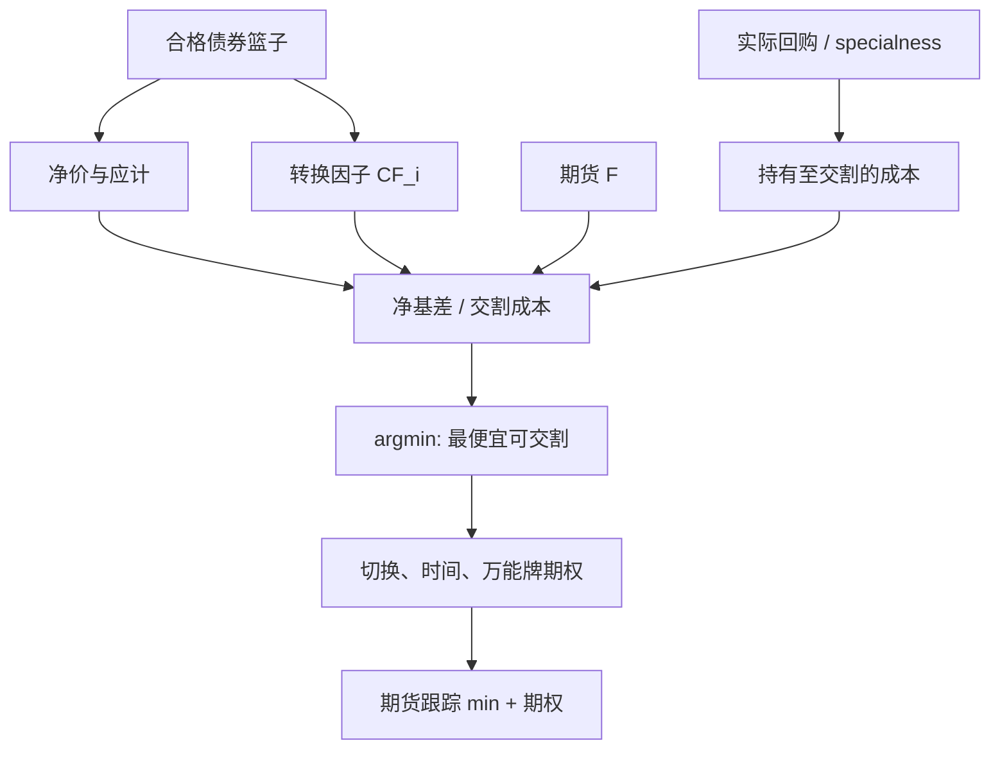

# 最便宜可交割 CTD

债券期货的空头不会交「标准券」，而会交发票金额最低的那只合格券；转换因子把久期不同的券硬折成同一合约，残差就是基差交易的对象。

<footer>—— Burghardt, Belton, Lane & McVey, The Treasury Bond Basis；交割期权见 Hemler；万能牌见 Kane & Marcus</footer>

国债与部分公司债、超长期国债期货允许一篮子合格债券交割。发票价格大致是期货结算价乘以转换因子再加上应计利息。转换因子按合约标准票息把每只券折成「标准券等价」，在收益率恰好等于标准票息、收益率曲线平坦时近似公平；曲线一弯、收益率一离开发行时的假设，因子就不再使所有券无差异。空头选择使

$$
\mathrm{Invoice}_i = F \times \mathrm{CF}_i + \mathrm{AI}_i
$$

相对该券净价最优的那只，即最便宜可交割（cheapest-to-deliver, CTD）。Burghardt 等人把期货基差写成现货减去发票，基差交易就是交易 CTD 与期货的相对价值。Hemler（1990）把一篮子交割权写成期权；Kane 与 Marcus（1986）给国债期货的万能牌期权定价。Hull 的教材把 CTD 当作债券期货定价的入口。没有 CTD，[隐含回购利率](/quant/implied-repo)没有定义，债券期现也没有交割锚。

## 问题

基差的一种常用写法是

$$
B_i = P_i - F \times \mathrm{CF}_i,
$$

（应计与区间惯例随市场而变）。$B_i$ 最小（或净基差经持有成本调整后最小）的券是 CTD。问题是 CTD 会切换：收益率水平、曲线斜率、个券流动性与回购特殊性（specialness）都会改变排序。期货价格跟踪的是当前 CTD 加上空头持有的切换期权，而不是跟踪一只固定券。用一只「习惯上的」十年券去对冲期货，在切换时 delta 会跳。Gay 与 Manaster 在一般期货里讨论品质期权；债券期货把品质写成可计算的因子表，因此切换是日常事件，不是极端事件。

第二层问题是因子表的老化。转换因子在合约上市时按当时的标准票息规则固定，随后利率可以走很远。低利率时期，久期长、票息低的券往往更便宜交割；高利率时期排序可以反过来。把旧样本的 CTD 经验套到新利率体制，基差的均值和波动都错。第三层是交割月内的时间期权与（美债历史上的）万能牌：空头可以在下午现货已收盘、期货仍交易时决定是否按当日结算价交割，Kane–Marcus 指出这是对期货结算规则的期权。

### 净基差与毛基差

毛基差含应计与票息，净基差再扣掉把券持有到交割的融资与票息，接近「期权价值 + 错误定价」。Burghardt 的体系要求用实际回购利率算持有成本，而不是用国债收益率。券 special 时，融资贵（对空头融券）或便宜（对多头持券），CTD 排序会把 specialness 算进去。忽略回购特殊性，会把一只因被挤而 special 的券误判成 CTD，期货空头若去买它来交，实际成本不是屏幕上的净基差。

转换因子不是久期对冲比。用 CF 当 DV01 权重去对冲期货，只在标准票息附近、曲线平坦时勉强可用。正确的对冲比是当前 CTD 的 DV01 相对期货的有效 DV01，并计及切换时有效久期跳变。

## 方法

每日对篮子里每只合格券计算交割成本：净价、因子、应计、融资到最可能交割日、票息、交割费用。排序得到 CTD 与次 CTD 的差距。差距小，切换期权贵，期货相对「当前 CTD 期现」应更便宜（空头的期权有价值）；差距大，期货行为接近单一券远期。Hemler 的交割期权价值随篮内离散度与波动上升。交易上，买 CTD 空期货（或反向）是债券版[期现套利](/quant/cash-and-carry)；利润用[隐含回购](/quant/implied-repo)与实际回购比较更干净。

对冲与风险：情景应包含平行移动、扭转、以及 CTD 切换（指定使次 CTD 胜出的收益率冲击）。有效 CTD 久期在切换点不可导，线性 DV01 会在该点失效。流动性：CTD 往往是发行量大、可借的券，但一旦成为 CTD 会被基差交易者拥挤，repo 可以变 special，容量自我消耗。交割月持仓限额与最便宜券的可借量构成硬容量。

### 切换、曲线与凸性

收益率下降时，高久期券相对因子可能变得更便宜交割，期货的有效久期上升，空头期货的损失可以大于「按旧 CTD 估计」。这是债券期货凸性与期权性的来源之一，与纯持有成本曲线不同。商品期货的 CTD 是地点与品质，见[仓单与交割](/quant/futures-delivery)；债券是因子与回购。两者都使期货价格低于「你盯着的那一种现货」的简单远期，差额是选择权。把差额当成错误定价去卖期货买现货，可能是在卖空期权。

## 机制

空头的最优交割把期货变成一篮子最小值期权的标的。期货价格 $\approx \min_i(\text{该券远期发票})$ 再扣时间与万能牌等期权。套利资本买 CTD 空期货，把期货拉向当前最小值；切换概率上升时，拉向的是最小值的期望，而不是当前实现。收敛在交割日对实际交出的那只券成立，对未交的券不成立。因此「篮子里每一只券都与期货协整」是假命题。

回购机制：成为 CTD 的券需求上升，repo 更 special，持有成本下降（对多头持券），进一步巩固其 CTD 地位，直到另一只券在价格或因子上更合算。这是正反馈，也是容量杀手：你越做多 CTD 空期货，越把该券买 special，隐含回购与实际回购的差被你自己收窄。保证金盯市见[保证金与盯市](/quant/futures-margin)，债券跌时期货盈利不够补券的融资追加，路径与商品期现同构。

### 破裂：交割失败、规则修改、流动性消失

交割失败（fails）在美债体系里有制度成本，严重时 CTD 逻辑被结算摩擦主导。因子规则或合格篮子修改（新券加入、旧券退出、标准票息调整）使期权价值重估。压力期若干券只有报价没有深度，屏幕 CTD 无法买到，期货对锁失败。万能牌与晚间新闻使现货与期货时钟错位，Kane–Marcus 的期权变成真实的单向选择。非美市场（国债期货在不同交易所）的交割日、发票公式与可否部分交割不同，不能把美债 Burghardt 公式直接填进本地合约。

Hemler（1990）估的是交割期权在样本期的价值，不是你今天的期权表面。篮内离散度随曲线形状变，低波动、高离散与高波动、低离散可以给出相近的期权值。必须重估，不能引用一个历史基点当「期权成本」永久扣除。

## 边界与工程取舍

不要用转换因子当对冲比。不要假设 CTD 在合约期内不变。不要把净基差为负当成无风险：它可能是期权价值、specialness 或不可借。成本含债券买卖价差、期货价差、repo、失败交割惩罚、以及切换后重新套保的冲击。容量由 CTD 券的可获得性与期货交割月限额决定。与商品仓单相比，债券 CTD 可计算性更好，但回购市场的状态依赖同样能让纸面基差不可执行。

报告应列出：当前 CTD、次 CTD、净基差、隐含回购、实际回购、篮内离散度、以及切换情景下的有效 DV01。缺任何一项，债券期货就不是「久期工具」那么简单。Hull 足够用来入门；实盘以 Burghardt 的基差会计与交易所交割通告为准。

基差交易的「收敛」是对交割结算，不是对 CTD 现货价格的任意路径。中途 CTD 切换，你买的券不再是最便宜，期货跟踪新券，两边都留下方向性残差。时间止损必须考虑切换，而不是只考虑基差 z-score。

## 小结

- CTD 是发票金额经持有成本调整后对空头最优的合格券；期货跟踪当前最小值加上交割选择权，而不是跟踪一只固定券。
- Burghardt 等人建立基差会计；Hemler 为交割期权定价；Kane–Marcus 处理万能牌；Gay–Manaster 给出一般品质期权背景。
- 转换因子不是 DV01；切换使有效久期跳跃。回购特殊性进入 CTD 排序并自我强化。
- 破裂包括 fails、篮子规则修改、不可成交的屏幕 CTD，以及交割月资金与限额。
- 出处：Burghardt, Belton, Lane and McVey, *The Treasury Bond Basis*；Hemler, *Journal of Finance*, 1990；Kane and Marcus, *Journal of Finance*, 1986；Gay and Manaster, *JFE*, 1984；Hull, *Options, Futures, and Other Derivatives*。
