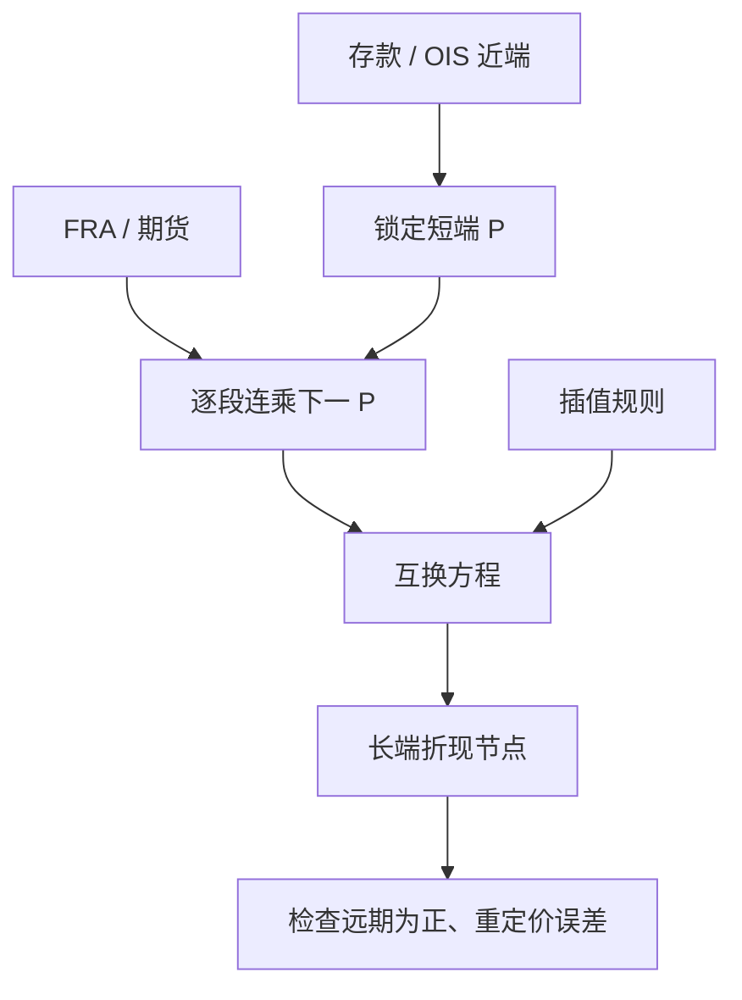

# Bootstrap 曲线

    
用最短端的存款锁定近端折现，再用 FRA 或期货一节一节往外推，最后用互换利率解出更长的折现因子；每一步只引入一个新未知量。

    <footer>—— 标准自助法；插值与实现见 Hagan and West, Interpolation Methods for Curve Construction, Applied Mathematical Finance, 2006</footer>

构建收益率曲线，不是拟合一条漂亮的参数函数了事，而是让可交易工具在曲线上重定价到市场。自助法（bootstrap）按到期排序，每个工具多提供一个方程，解一个新的折现节点或远期节点。近端用存款与隔夜指数，中段用 FRA 或利率期货，远端用固定对浮动互换。Hull 给出单曲线版本的教学顺序；Hagan 与 West 2006 年把「在哪一坐标上插值」写成会影响远期光滑与对冲稳定性的选择。2008 年后同一套逻辑要对折现曲线与投影曲线各做一次，见 [OIS 与多曲线](/quant/multi-curve-ois)，但逐步解未知量的结构没有变。

## 问题

市场只在稀疏到期上给报价。曲线却需要对任意起息日的 $P(0,T)$ 或 $F(0;T,T+\delta)$，以便为错位现金流、远期起息互换与风险情景定价。若用全局参数曲线（Nelson–Siegel 一类）去拟合，残差可能系统性地错过短端期货与长端互换的基差，交易台无法对冲到报价。自助法的目标是精确重现用于构建的那些工具（在插值假设下），把剩余的自由度全部推给插值规则。

因此必须先规定：哪些工具进曲线、何种报价清洗（期货凸性、日历、买卖中间价）、在 $P$、$\ln P$ 还是瞬时远期内插值。同一组互换，不同插值会给出不同的中间节点与不同的 Delta 分桶。Hagan–West 强调：插值应保持正的远期、避免振荡，并且对输入报价的扰动局部化，否则关键利率对冲会到处漏。

### 工具的排序与唯一性

理想情况下，第 $k$ 个工具的最晚现金流刚好落在新节点 $T_k$，此前节点已知，方程对 $P(0,T_k)$ 单调，可唯一解。现实里互换有一串未知折现，必须靠插值把未知降到一维，例如假设在 $(T_{k-1},T_k]$ 上远期恒定或 $\ln P$ 线性。若两个工具到期几乎相同（期货与 FRA 重叠），方程组超定，要用权重或优先规则，否则自助失败或来回跳。短端存款与 OIS 也可能重叠，多曲线里应让它们各归其线，而不是塞进同一未知量。

「精确重现输入」只对选中的构建集成立。同一发行人的冷门到期债券不一定落在互换曲线上；残差是信用与流动性，不应通过把插值拧成扭曲远期来消灭。

## 方法

单曲线示意。用隔夜到 $T_1$ 的存款得 $P(0,T_1)$。对随后每个 FRA，由 [即期、远期与折现](/quant/spot-forward-df) 的连乘解下一折现。进入互换段，固定端现值等于浮动端现值：单曲线下浮动端等于 $1-P(0,T_n)$ 的面额形式（标准假设下），于是互换利率 $S$ 满足

$$
S\sum_i \delta_i P(0,T_i) = 1-P(0,T_n),
$$

未知是新节点上的 $P$，中间节点由插值用已解出的点与待解点表达，用一维根寻找求解。加入期货时，先把报价调成远期利率（凸性调整后）再当 FRA 用。Hagan–West 比较了若干插值：对折现线性会导致远期锯齿；对 $\ln P$ 线性给出分段常数瞬时远期；单调凸插值等则试图光滑且保正。

### 插值坐标决定风险

风险是输入报价扰动后现值的变化。若插值全局（一次多项式贯穿全部点），扰动一个 5Y 互换会改变 30Y 的中间形状，Delta 泄漏到远桶。局部插值（样条在节点附近紧支撑更好）让 [关键利率久期](/quant/key-rate-duration) 更可解释。这是自助法与参数拟合的政治：自助把误差赶到插值；参数拟合把误差赶到残差。交易台通常坚持自助重现可对冲工具，再用单独的基差曲线去吸收债券或跨币种残差。

## 机制

每一步都是「用更长的工具，减去已经被更短工具锁住的现金流，剩下最远端的未知」。经济上这是剥离（stripping）：短端信息不要污染的部分应在进入长端方程前被减掉。若短端插值已经振荡，振荡会传进每一个更长的互换方程，长端 $P$ 会为了抵消短端噪音而扭曲——这就是为什么短端期货的凸性与日历错误会表现为长端无法理解的远期尖峰。

多曲线下，OIS 自助给出折现 $P^D$，LIBOR 互换给出的是带 $P^D$ 权重的投影远期，未知变成投影曲线的节点，而不是再解一条「既折现又投影」的 $P$。算法仍是逐步一维求解，只是方程里同时出现两条曲线。把 2008 年前的单曲线程序直接套到有 CSA 的抵押组合上，构建集本身就选错了。

### 凸性、IMM 与节假日

Eurodollar 一类期货的到期是 IMM 日，与互换的即期起息网格不对齐，必须在期货网格上建一段，再切换到互换网格，中间用插值衔接。凸性调整依赖波动率假设，调整过大过小会在衔接处留下折缝，看起来像「市场的 FRA–期货基差」，其实可能是自己的模型。节假日让 $\delta_i$ 不是名义上的 0.25。自助代码里日历是一等公民；没有日历的解析公式只适合考试。

根寻找失败往往不是数学没有根，而是插值让 $P$ 非单调或互换公式用了错误的固定端频率。先画远期曲线再查方程，比加大迭代次数有用。

## 边界

自助法保证的是构建集在所选插值下的重定价，不保证曲线之外的产品、也不保证动态。输入工具若有买卖价差，中间价曲线对两边都不精确。流动性差的长端互换会把噪声写成 40Y 远期。Hagan–West（2006）讨论插值性质，不是给出唯一「正确」曲线。Nelson–Siegel 一类宏观拟合曲线服务的是另一问题（水平、斜率、曲率的低维描述），与交易自助曲线不要混成一条。

IBOR 退出后，构建集改为 SOFR 互换、基差互换、期限利率等，步骤仍是自助，对象变了。不要把旧 LIBOR 节点表当成永恒结构。Hull 的单曲线例题用来理解剥离逻辑；生产曲线要以当前货币的交易惯例与抵押约定为准。

把 Bootstrap 理解成「Excel 里按到期 VLOOKUP」会漏掉插值与凸性。真正决定中间到期风险的，是你声明的坐标与光滑条件。

## 小结

- 自助法按到期逐个解折现或远期节点，使构建集在给定插值下精确重定价。
- 存款、FRA/期货、互换分段提供方程；每步把未知降到一维。
- 插值坐标影响远期光滑与 Delta 局部性；振荡会从短端污染长端。
- 期货凸性、IMM 网格与日历是构建的一部分，不是事后修补。
- 多曲线下同一算法分别服务折现曲线与投影曲线。
- 出处：Hull；Hagan and West, *Applied Mathematical Finance*, 2006；多曲线文献见 Bianchetti、Hull and White 等。
