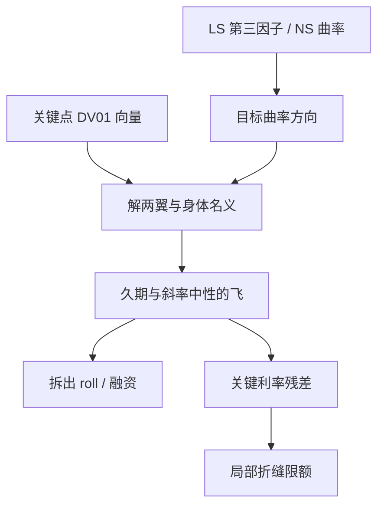

# 曲线蝶式交易

    
债券收益的共同变动几乎被三个主成分吸收；第三因子是中段相对两端的弯曲，蝶式并不是一种无关的交易癖好，而是这组特征向量的可交易近似。

    <footer>—— Litterman & Scheinkman, Common Factors Affecting Bond Returns, Journal of Fixed Income, 1991</footer>

[上一课](/quant/curve-pca)对债券收益（或 $\Delta y$）做 PCA，前三因子呈水平、斜率、曲率；对冲用贴近 $\phi$ 的久期、陡峭化、蝶式。缺口是蝶式还没有写成可交易权重：如何把平行移动与斜率压到接近零，只留下「中间相对两端」。本课写飞的约束与坐标。不重讲相关矩阵对协方差的解释比例。它与期权里的[蝶式无套利](/quant/butterfly-calendar-arb)不是同一对象。

## 问题

平行久期中性的陡峭化（2s10s、5s30s）对第一、第二共同冲击近似免疫，对第三因子仍然暴露：中间期限相对两翼可以独立弯曲。子弹组合（bullet）把久期集中在一个关键点，杠铃（barbell）把同样的久期拆到两端，二者可以有相同的修正久期和相近的斜率，曲率符号却相反。交易台需要一种权重，使组合对水平、斜率的一阶敏感同时消失，只对曲率留下明确的 01。问题是三维约束在真实工具上不能精确满足：票息、融资、CTD 与插值会泄漏，飞看起来「中性」却在平行 10bp 里亏钱。

第二个问题是坐标。对即期收益率做 $1,-2,1$ 的蝶式，与对远期、对平价互换、对关键利率三角形冲击，不是同一个希腊字母。Ho（1992）的关键利率把局部平移定义成三角形基；蝶式交易往往是「中间关键点为正、两翼为负」的线性组合，对应曲率而不是单一关键点。用错坐标，飞的 PnL 解释会对不上[关键期限 DV01](/quant/key-tenor-dv01) 的分桶。

### 三个约束：现金、水平、斜率

最干净的教科书飞用三只零息：期限 $T_s<T_b<T_l$，名义 $n_s,n_b,n_l$。令 $D$ 为修正久期，$P$ 为价格。常见约束是

$$
n_s P_s + n_b P_b + n_l P_l = 0,
\quad
n_s P_s D_s + n_b P_b D_b + n_l P_l D_l = 0,
$$

再用加权到期或关键利率斜率（例如 $D$ 对期限的一阶矩）把斜率打零。两翼同号、中间反号时，第三式的解给出曲率暴露。实务里现金中性往往让位于融资中性（repo 后的净支出），水平中性用 DV01 而不是修正久期，斜率中性用 2s10s 或 5s30s 的回归对冲比而不是解析矩。约束取法一变，同一组报价会得到不同的「中性飞」。

口语里的「买飞」通常指买两翼、卖中间，等价于做多曲率：若中间收益率相对两翼上升（曲线变凹、驼峰变大），中间债券更便宜，空头中间获利。符号必须钉在收益率空间还是价格空间，二者差一个负号。

## 方法

**选点。** 流动性决定网格，而不是对称美观。美元常用 2s5s10s、5s10s30s、2s10s30s；欧元与国债期货 CTD 会把名义期限改写成可交割篮子。关键点应与对冲工具对齐，见[关键利率久期](/quant/key-rate-duration)：把身体放在 7Y 却只能交易 5Y 与 10Y，飞要对相邻桶拆腿，曲率与斜率重新缠在一起。

**权重。** 先算三只工具的关键期限 DV01 向量，再解

$$
w_s\,\mathrm{DV01}_s + w_b\,\mathrm{DV01}_b + w_l\,\mathrm{DV01}_l = c\,v_{\mathrm{curv}},
$$

其中 $v_{\mathrm{curv}}$ 是目标曲率方向（例如与经验第三特征向量对齐，或简单的 $(1,-2,1)$ 在关键点上的投影），并附加水平和斜率正交条件。Golub 与 Tilman（1997）把 PCA、VaR 与关键利率放在同一套报告里，正是为了避免「按经验 1:-2:1 下单」与「按特征向量下单」各说各话。解出的名义不要太大：条件数一高，飞会变成两对巨大的陡峭化对敲，买卖价差吃掉曲率观点。

**Carry 与 roll。** 即使曲线不变，票息、融资与沿曲线滚下也会产生日 PnL。曲率交易的 roll 取决于这段远期的凸凹：若中间远期高于两翼的线性插值，空头中间、多头两翼在纯滚下里可能有正 carry，这不是 alpha，是曲线形状的会计。应把 roll 从「曲率因子实现」里拆开，否则会把期限溢价的实现当成飞的技能。

### 与 PCA、Nelson–Siegel 的翻译

Litterman–Scheinkman 的 $\phi_3$ 在中段一峰、两端反号，形状随样本与网格旋转。Diebold–Li 把 Nelson–Siegel 的曲率载荷写成 $((1-e^{-\lambda\tau})/(\lambda\tau))-e^{-\lambda\tau}$，驼峰位置由 $\lambda$ 决定，不是由 10Y 这个整数决定。交易飞是离散的三只债券，统计曲率是连续载荷：要对齐，应把 $\phi_3$ 或 NS 曲率投到你的三只工具上再定权重，而不是默认身体永远是 10Y。危机里第四个主成分变大时，一只 2s10s30s 飞会剩下无法用三因子解释的局部折缝，那是关键利率残差，不是飞「失效」。

无套利短端模型里，一因子 [Hull-White](/quant/hull-white) 几乎没有独立曲率：曲线只能沿 $B(\tau)$ 族变形。用一因子树给飞标价，弯曲风险会被压进虚假的平行 01。要让模型里存在曲率，至少两因子或直接用 [HJM](/quant/hjm) / [LMM](/quant/lmm) 的多因子波动；风险报告则仍用关键点，不要用模型状态当飞的对冲工具。

## 机制

经济上，曲率冲击来自中段供需与凸性流量，而不是「第三个宏观故事」。养老金与保险人在 10Y–20Y 的负债匹配、抵押贷款对冲在中间期限的负凸性、以及期权商对中间互换的伽马，都会把中段相对于两翼挤出一块溢价。水平冲击来自政策与通胀的共同移动，斜率来自政策路径相对长期中性；曲率更局部、更流量化，夏普不必更高，方差占比也通常明显小于前两个因子。

凸性本身会制造曲率：收益率波动上升时，长端因凸性获得额外的期望收益补偿，中间与超长的相对定价会动。这与 [久期、凸性](/quant/duration-convexity) 的二阶项是同一件事在形状上的投影。飞若在波动率冲击里亏钱，先问权重是否在超长腿上堆了过多凸性，而不是先改 PCA 窗口。

### 融资、特殊券与期货 CTD

现券飞还暴露 repo。一只临时特殊的中间券会把飞的「曲率」变成融资交易：身体借券成本上升，空头中间的 carry 恶化。期货飞则暴露 CTD 切换：名义 10Y 期货的 DV01 与久期随 CTD 跳，权重昨天还中性、今天已偏斜率。应把飞定义在曲线关键点或互换上，再用期货当廉价代理，并单独限额 CTD 与 cheapest 切换，见[最便宜可交割](/quant/ctd-cheapest)。互换飞避开了个券特殊，但引入[互换价差](/quant/swap-spread) 与[基差互换](/quant/basis-swap)：两翼与身体若分属不同折现或不同投影指数，曲率仓位里会藏进信用与期限基差。

把飞的历史夏普当成曲率风险溢价，样本里往往混着 1990 年代的斜率和 2010 年代的监管供需。Litterman–Scheinkman 解释的是共同收益的方差，不是说第三因子必须有稳定的正价格。

## 边界与工程取舍

不要用期权蝶式的 $1,-2,1$ 去理解债券飞：前者检验密度凸性，后者是期限结构的形状仓位。不要在未平滑的折线远期上读「曲率信号」，bootstrap 的折缝会假装成可交易飞，见[曲线自助](/quant/curve-bootstrap)。不要每天根据「哪个第三因子最强」更换身体期限，科目一变，PnL 解释断裂。

网格过密时，相邻飞高度共线，名义爆炸。应限制同时交易的飞的个数，或先做 PCA 再映射到少量关键工具。含权产品、MBS、可赎回债的有效曲率是状态依赖的，线性飞只是一阶；波动上升时要用情景而不是只看 DV01。A 股利率债的中段还叠加政策沟通与流动性分层，美债样本的 $\phi_3$ 不能当本地权重。

实现测试：把三个关键点同向平移 1bp，飞的 PnL 应接近零；把斜率冲击（短正长负）加上，也应接近零；只在曲率冲击下才出现与 $v_{\mathrm{curv}}$ 同号的 PnL。过不了这三项，权重或插值泄漏，不是市场「无效」。

## 小结

- 曲线蝶式是对曲率因子的可交易近似：两翼对中间，并尽量打掉水平与斜率。
- Litterman–Scheinkman（1991）给出统计理由；Diebold–Li / Nelson–Siegel 给出驼峰载荷；Ho 的关键利率给出局部基。
- 权重应由关键期限 DV01 向量求解，而不是固定 $1:-2:1$；约束取现金、融资还是回归对冲比，会改变同一观点的实现。
- 一因子短端模型几乎没有独立曲率，飞的定价与对冲要放到多因子或模型外的关键点上。
- Carry、特殊券、CTD 与互换价差会污染曲率 PnL，必须拆开记账。
- 出处：Litterman & Scheinkman, *Journal of Fixed Income*, 1991；Diebold & Li, *Journal of Econometrics*, 2006；Ho, *Journal of Fixed Income*, 1992；Golub & Tilman, *Journal of Portfolio Management*, 1997。
