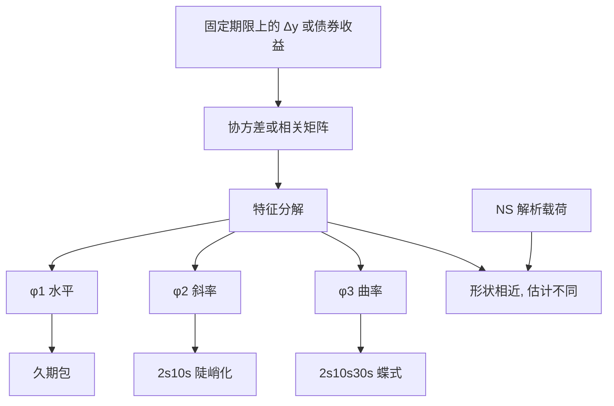

# 曲线 PCA：水平、斜率、曲率

    
国债收益协方差的前三个特征向量，稳定地呈现几乎平行的平移、短端对长端的扭转、以及中段对两翼的弯曲；这组形状是相关结构的代数后果，也是久期、陡峭化与蝶式作为对冲基的统计理由。

    <footer>—— Litterman and Scheinkman, Common Factors Affecting Bond Returns, Journal of Fixed Income, 1991</footer>

[收益率曲线因子](/quant/yield-curve-factors) 已经把水平、斜率、曲率写成可交易语言，并强调 PCA 一般不满足无套利。[Nelson–Siegel](/quant/nelson-siegel) 用解析载荷**模仿**这三种形状。本篇把对象收窄到估计程序本身：Robert Litterman 与 José Scheinkman 对债券收益做主成分时，估的是哪一张矩阵、特征向量为何几乎总是「LSC」、以及 Lord–Pelsser 所谓「事实还是伪迹」。它与 [关键利率](/quant/key-rate-duration) 的分工是全局正交基对局部三角形基；与 Svensson 的分工是样本正交对参数驼峰。不把宏观 APT 或仿射定价模型再展开。

## 问题

取固定网格 $\tau_1,\ldots,\tau_N$ 上的零息收益率变动 $\Delta y_t\in\mathbb{R}^N$（或久期标准化后的债券超额收益）。样本协方差 $\Sigma=\mathrm{Cov}(\Delta y)$ 或相关矩阵 $R$ 的特征分解

$$
\Sigma = Q\,\mathrm{diag}(\lambda_1,\ldots,\lambda_N)\,Q^\top,\qquad \lambda_1\ge\lambda_2\ge\cdots
$$

给出正交载荷 $Q$ 的列 $\phi_1,\phi_2,\phi_3,\ldots$。经验上 $\lambda_1$ 解释绝大部分方差，$\phi_1$ 近乎平坦，$\phi_2$ 一次过零，$\phi_3$ 中段一峰两端反号——即水平、斜率、曲率（level, slope, curvature, LSC）。问题是：这是利率市场的经济结构，还是「期限相邻的变量高度相关」这一统计事实的自动推论？若是后者，任何光滑曲线的 PCA 都会画出 LSC，用它当「发现了三因子」就过强；若同时还是经济结构，则对冲仍应沿这组方向做，但不要把方差比例写成风险溢价比例。

Litterman–Scheinkman 的对象是债券**收益**的共同因子，形状用久期解释后仍呈 LSC。实务风控更常对 $\Delta y$ 做 PCA，使因子直接说「曲线怎么扭」。两套特征向量相近但不相同：收益 PCA 混入滚动与凸性实现。必须声明分解对象，否则「第一因子解释 85%」不可比。

### 相关矩阵还是协方差矩阵

协方差保留波动的绝对水平：短端政策波动大时，$\phi_1$ 会被短端拉斜。相关矩阵先把各期限标准化，载荷更接近「纯形状」，但回到 PnL 要对冲比率再乘各 $\sigma(\tau)$。LS 原文与许多交易台用接近协方差（或收益协方差）的对象，因为钱是按波动绝对大小赔的。用相关矩阵做图更好看、用协方差做对冲更贴近。同一篇笔记里不要混用还比较「解释比例」——相关 PCA 的 90% 与协方差 PCA 的 90% 不是同一个 90%。

特征向量换号。比较历史因子收益前，把 $\phi_1$ 与十年变动的相关定为正，$\phi_2$ 与 2s10s 陡峭化定为正，否则夏普符号无意义地翻转。

## 方法

**网格。** 每日先把可交易券映到固定期限的即期或平价收益率（无套利插值），再差分。不要在「今日有哪些基准券」的变动集合上直接 PCA：加入 7 年、去掉 20 年，会使 $\phi_3$ 跳。缺失点用曲线插值补齐，插值规则应与定价系统一致。

**个数。** 前三因子在国债上常解释九成以上；危机里政策短端与长端溢价脱钩，第四因子暂时变大。停止准则不要只看累积比例，还要看：用三因子对冲后的残差是否仍有可交易的关键利率结构。有，就保留 KRD；没有，三因子足够。过早砍到两因子，蝶式风险会进残差并被当成 alpha。

**可交易投影。** 把 $\phi_1,\phi_2,\phi_3$ 回归到 2s、5s、10s、30s 的久期组合，得到对冲篮子，使篮子在样本里尽量复制主成分。权重应随 $\phi$ 更新而慢变，避免每日重估把噪声当成换仓信号。与 NS 参数久期对照：NS 的 $L_1,L_2,L_3(\tau)$ 是解析 LSC，PCA 的 $\phi$ 是数据 LSC；二者相关高时，可用 NS 情景做沟通、用 PCA 篮子做对冲。

### Lord–Pelsser：LSC 是相关结构的事实

Roger Lord 与 Antoon Pelsser（2007）指出：若收益率变动的相关随 $|\tau_i-\tau_j|$ 光滑衰减——近似 Toeplitz——则前几个特征向量在数学上就接近平坦、一次过零、二次弯曲。这是离散 Sturm–Liouville / 振荡定理一类现象，不一定需要宏观故事。含义有两层。正向：你几乎总会看到 LSC，它是「曲线光滑」的伴随事实，跨币种重复出现并不神秘。反向：第四、第五因子更可能是网格、插值与样本噪声，把它们当成新的风险溢价因子要格外谨慎。经济内容进入的是**因子的价格**（超额收益对 $\phi_k$ 的回归），不是进入「是否画得出曲率」。

## 机制

相邻期限几乎一起动，是因为贴现因子是短率路径的积分（期望），共同冲击——政策、通胀、增长——沿曲线传导并被均值回复与溢价倾斜。传导核若光滑，相关就是光滑的，LSC 随之而来。斜率因子额外对应「短端跟央行、长端跟增长与期限溢价」的差分；曲率对应中段供需与政策路径的非单调。宏观可以把 $\phi$ 的实现回归到公告，那是第二层；第一层 PCA 不需要宏观就能存在。

方差贡献与定价贡献错位：$\lambda_1$ 最大，水平冲击却可能被短期利率政策对冲掉一大部分，超额收益对斜率更敏感。这与股票里市场因子解释方差、价值解释截面均值是同一类现象，[Giglio–Xiu](/quant/giglio-xiu) 的逻辑在此同样适用。做风险：按 $\lambda_k$ 分配限额。做溢价：按 $\beta$ 对后续超额收益的预测，而不是按特征值排序去叠加杠杆。

### 与 NS / Svensson、与关键利率

NS 强制 LSC 形状，残差是第四方向以后。PCA 让数据决定 $\phi$，可能出现略斜的「水平」或略弯的「斜率」，对冲比更贴样本，跨样本不可比。Svensson 的第二驼峰一般**不是** $\phi_4$：$\phi_4$ 正交于前三，NSS 的 $L_3$ 与 $L_2$ 高度相关。把 NSS 的 $\beta_3$ 当成第四主成分，会双重计算曲率。关键利率是局部基，三因子是全局基：同一平行移动不要既用久期又用 $\phi_1$ 对冲一遍。残差应落在 KRD 限额里，而不是再提取 $\phi_4$ 去交易，除非该方向稳定且可交易。

对超额收益做 PCA 还是对 $\Delta y$ 做 PCA，决定因子能否直接解释「钱」。风险管理用 $\Delta y$；讨论期限溢价用收益。Litterman–Scheinkman 标题是债券收益的共同因子，形状讨论常改用收益率冲击，写作时要分开。

## 边界与工程取舍

短样本的 $\phi_3$ 极噪，蝶式对冲可能在付点差。期权、MBS 的暴露是状态依赖的，线性三因子只是一阶；波动上升时负凸性把残差放大。信用曲线、通胀曲线、掉期曲线要各自分解：名义国债的 $\phi$ 不能当全部利率产品的风险模型。A 股政策短端钉住时，$\phi_1$ 更斜、$\phi_2$ 对沟通更敏感，美债样本的解释比例不能当本地参数。

PCA 冲击一般隐含锁定价，模拟未来曲线应对无套利投影，或只在短视野当情景。Litterman–Scheinkman（1991）发表于 *Journal of Fixed Income*，是债券风险的共同语言来源。Lord–Pelsser（2007）警告不要把 LSC 神化成发现。Nelson–Siegel（1987）提供解析对照。Ho（1992）的关键利率是局部补充。不要把 LSC 标成 Chen–Roll–Ross 宏观 APT 的债券版，也不要标成 Fama–French：后者是截面特征排序，前者是一条曲线上的统计降维。

解释比例随平静期上升，并不等于市场「更三因子化」。低波动时噪声相对共同冲击更小，特征值更集中。应用压力子样本再估一次 $\phi$，检查对冲篮子是否仍稳。

用相关 PCA 画出漂亮的 $\phi$、用协方差 PCA 算对冲比，必须在同一笔记声明。只贴相关图去定仓，短端绝对风险会被低估或高估。

## 小结

- Litterman–Scheinkman 对债券收益（实务亦常对 $\Delta y$）做 PCA，前三因子呈水平、斜率、曲率，解释大部分共同变动。
- 光滑的期限相关结构在代数上就会产生 LSC（Lord–Pelsser）；经济内容主要在因子是否被定价，不在是否画得出曲率。
- 对冲用贴近 $\phi$ 的久期、陡峭化、蝶式，并与关键利率分担局部残差。
- NS 解析载荷模仿 LSC 但不是特征向量；Svensson 第二驼峰不是第四主成分。
- 协方差与相关、收益与 $\Delta y$，解释比例不可混比；PCA 不宜当无套利定价模型。
- 出处：Litterman and Scheinkman, *Journal of Fixed Income*, 1991；Lord and Pelsser, *Applied Mathematical Finance*, 2007；对照 Nelson and Siegel, 1987；关键利率见 Ho, 1992。
