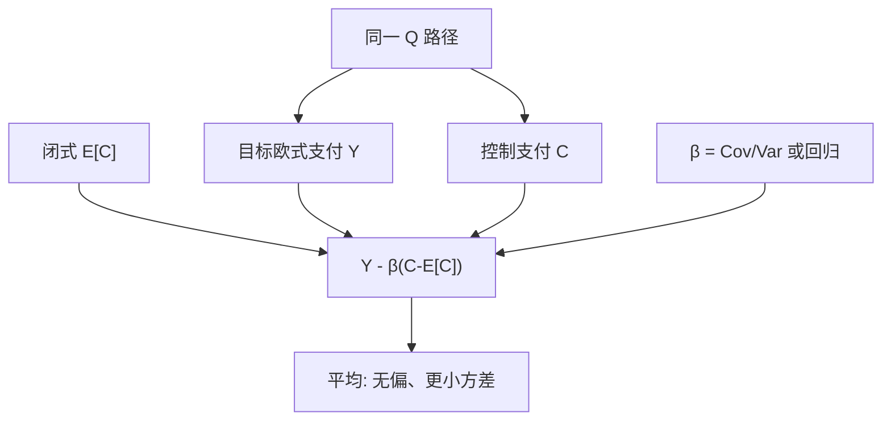

# 控制变量对欧式

    
在同一条风险中性路径上计算目标支付与一个期望已知的相关支付，用回归系数减去偏差之后再平均；欧式香草因此常把 Black–Scholes 闭式当成几乎免费的方差锚。

    <footer>—— Glasserman, Monte Carlo Methods in Financial Engineering, 2004；Boyle, Options: A Monte Carlo Approach, Journal of Financial Economics, 1977</footer>

[蒙特卡洛定价](/quant/mc-pricing) 写风险中性抽样与离散偏差。[对偶、控制变量与重要性采样](/quant/mc-variance-reduction) 把三种方差缩减放在同一约束下。本篇只把控制变量落到**欧式**支付：为什么闭式香草是默认 $C$、$\beta$ 怎么估、几何亚式如何控算术亚式、随机波动里用哪一个 Heston 近似、以及控制解决不了什么。美式 LSM 的策略偏差不在此消除；障碍与稀有事件优先重要性采样。Heston 的特征函数定价见 [Heston](/quant/heston) 与 [Carr–Madan](/quant/carr-madan)，那些是解析引擎，不是本篇的 $C$。

## 问题

欧式 $Y=e^{-rT}g(S_T)$ 或路径泛函但行权仍在 $T$。朴素平均的标准误是 $s/\sqrt{N}$。欧式的 $g$ 往往与某个**可解析定价**的支付高度相关：同一 $S_T$ 上的看涨与 Black–Scholes 看涨、算术平均与几何平均、篮子与其几何平均。控制变量构造

$$
Y(\beta)=Y-\beta\bigl(C-\mathbb{E}[C]\bigr),
$$

$\mathbb{E}[Y(\beta)]=\mathbb{E}[Y]$ 当且仅当 $\mathbb{E}[C]$ 正确。最优 $\beta^*=\mathrm{Cov}(Y,C)/\mathrm{Var}(C)$，方差缩减因子为 $1-\rho_{Y,C}^2$。问题是找 $\rho$ 接近 1 且 $\mathbb{E}[C]$ 廉价精确的 $C$，并在有限 $N$ 上估 $\beta$ 而不引入明显偏差。

欧式相对美式的优势正在这里：到期支付是路径（或终点）的已知函数，没有「回归出来的停时」插在中间，$Y$ 与 $C$ 的相关是结构上的。把同一技巧套到 LSM 的最终现金流上，只能降评估方差，早执行规则仍然次优。

### 闭式必须与模拟是同一测度、同一离散

$C$ 若是连续 Black–Scholes，$\mathbb{E}[C]$ 用公式；模拟若用 Euler 离散的局部波动或随机波动，则 $Y$ 与 $C$ 不是同一过程上的支付，$\rho$ 仍可能高，但「同一 $S_T$」要定义清楚：通常 $C$ 用这条路径上的 $S_T$ 代入 BS 公式，当作相关的随机变量，其期望仍用 BS 闭式——此时 $C$ 的期望对应的是**对数正态**，不是你模拟的模型。无偏性仍成立，因为减的是 $C-\mathbb{E}_{\mathrm{BS}}[C]$，$Y$ 的期望不变；降方差靠的是 $S_T$ 仍与对数正态高度相关。若错误地把 $\mathbb{E}[C]$ 改成「同一 MC 估出来的均值」，控制项期望为零的样本版本互相抵消，方差几乎不降。

$\mathbb{E}[C]$ 必须来自闭式、级数或独立的高精度引擎（COS/FFT），不能来自正在平均的那批路径。Heston 香草当控制时，应用特征函数价，而不是再用一套粗 MC。

## 方法

单控制：路径上同时算 $Y_i,C_i$，样本协方差给 $\hat\beta$，再平均 $Y_i-\hat\beta(C_i-\mathbb{E}[C])$。$\beta$ 用全样本时引入 $O(1/N)$ 偏差，欧式大 $N$ 下通常可忽略；严谨可分批。经典配对：

- 香草看涨模拟（检验、或无闭式的模型）用同一 $K,T$ 的 BS 作为 $C$。
- 算术亚式用几何亚式闭式（Kemna–Vorst）：$\rho$ 常在 0.9 以上，方差降一个数量级很常见。
- 篮子、最大值期权用几何平均或单资产香草的组合。
- 终点 $S_T$ 本身：$\mathbb{E}[S_T]=S_0 e^{(r-q)T}$，对近似线性的支付有用，对带 $\max(\cdot,0)$ 的香草弱于 BS 控制。

多控制：$C$ 为向量，$\beta$ 为多元回归系数。例如同时用 ATM 与目标 $K$ 的 BS，或用 $S_T$ 与 $S_T^2$。边际收益递减，且 $\beta$ 估计的噪声随维数升。Delta 鞅控制：沿路径用 BS $\Delta$ 对冲，残差是离散对冲误差，期望仍为期权价减去组合初值；这是控制变量的连续时间版本，实现成本高于终点 $C$。

### Heston 与局部波动上的控制

模拟 [Heston](/quant/heston) 路径给欧式，控制可选：同一参数的特征函数价格（此时 $C$ 是常数！——常数控制方差减零，无意义）或「把本路径的 $S_T$ 代入 BS，波动用某种等效」。常数不能当 $C$。正确做法是选一条**路径级**随机变量：例如用瞬时方差积分 $\int v_t dt$ 构造的对数正态代理，再代入 BS，期望用特征函数或用代理的解析均值。更稳妥：用几何布朗、$\sigma^2=\theta$ 或 $v_0$ 的 BS 作为 $C(S_T)$，期望用 BS 公式。局部波动路径与 Dupire 香草闭式不存在，仍可用 BS 当 $C$。相关随微笑变陡而下降，翼部产品降方差有限，应改重要性采样。

## 机制

$Y(\beta)$ 是 $Y$ 对 $C$ 做线性回归的残差再平移回正确均值。$\rho\to 1$ 时残差趋向 0，一条路径就定价格——几何亚式控算术亚式接近这一理想。$\rho=0$ 时最优 $\beta=0$，控制无益但无害（若 $\mathbb{E}[C]$ 正确）。$\beta$ 估错只影响方差，不影响无偏性（全样本 $\hat\beta$ 的高阶项除外）。这与重要性采样不同：IS 估错漂移会让权重崩溃，期望仍对但方差更大；控制估错 $\beta$ 最坏回到朴素方差。

欧式支付对终点单调时，对偶与控制可叠：先 $(Y(Z)+Y(-Z))/2$ 再减 $C$。二者降的是不同部分：对偶降对称噪声，控制降与闭式共有的部分。计算预算应计入两次支付；若 $\rho$ 已经极高，对偶的边际常很小。

$\beta=1$ 在 $Y$ 与 $C$ 同量纲、几乎同一支付时可用，避免估 $\beta$ 的小样本噪声。算术对几何亚式通常估 $\beta$ 更值得。不要把 $\beta$ 解释成对冲比：它是方差最优的回归系数，可以远大于 1。

### 标准误、有效样本量与验收

报告 $\widehat{\mathrm{Var}}(Y(\hat\beta))$ 时，若 $\beta$ 由同批估计，标准误略乐观，大 $N$ 可忽略。验收：Black–Scholes 世界里用 BS 当控制，残差应接近机器零（同一 $S_T$、同一公式），这是代码测试。Heston 上控制后的标准误应下降，价格应仍落在 COS 价的未控制置信区间里——若均值挪了，是 $\mathbb{E}[C]$ 写错或测度错。深虚值欧式 $\rho$ 可以很高但 $Y$ 几乎全零，相对误差仍大，控制代替不了改抽样。

## 边界与工程取舍

路径依赖若没有近亲闭式，控制变弱：回望、障碍的指示函数与香草相关有限。离散观察亚式要用对应观察日的几何平均闭式，连续几何公式会对错 $\mathbb{E}[C]$。美式不能用欧式 BS 当控制来「修正提前行权」——减的是错误产品。随机利率下 $C$ 的贴现必须与 $Y$ 一致，否则相关被贴现噪声稀释。

不要用控制掩盖 Euler 偏差：弱收敛误差在 $\mathbb{E}[Y]$ 里，减 $C-\mathbb{E}[C]$ 不去掉它。不要把特征函数价格当路径级 $C$（那是常数）。引用 Boyle 1977 是早期 MC；控制变量的系统论述见 Glasserman 2004。几何亚式闭式见 Kemna and Vorst, 1990。

本篇是方差缩减在欧式上的专章，不是定价理论。无套利与测度仍由 [风险中性](/quant/risk-neutral-pricing) 与模拟动力学负责。Heston 香草的生产价格应走傅里叶，MC 加控制用于路径产品或验收。

## 小结

- 欧式控制变量用路径级 $C$ 与精确 $\mathbb{E}[C]$，最优 $\beta$ 为回归系数，方差因子 $1-\rho^2$。
- $\mathbb{E}[C]$ 必须闭式或独立高精度；同批 MC 估均值等于没有控制。
- 默认锚：BS 对香草、几何亚式对算术亚式；Heston 要用路径函数而非常数模型价。
- 无偏性在 $\mathbb{E}[C]$ 正确时成立；$\beta$ 估错主要伤方差。不消除离散偏差与美式策略偏差。
- 深虚值与障碍优先改抽样；控制与对偶可叠，预算要计入额外支付。
- 出处：Glasserman, 2004；Boyle, *JFE*, 1977；几何亚式见 Kemna and Vorst, 1990；总览见 [方差缩减](/quant/mc-variance-reduction)。
