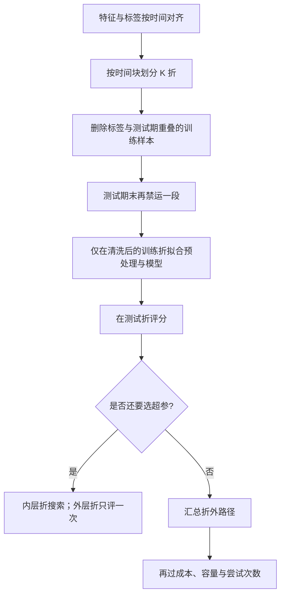

# 交叉验证在金融中的泄漏

标准 K 折交叉验证假定观测独立同分布。金融标签在时间上重叠、特征在截面上同时被全样本标准化，折外分数于是含有折内信息。

<footer>—— López de Prado, Advances in Financial Machine Learning, Chapter 7, 2018</footer>

机器学习把交叉验证当成防过拟合的默认工具：把样本切成 $K$ 折，轮流用 $K-1$ 折训练、一折检验，用折外误差选模型。该程序在独立同分布的分类问题上近似无偏。金融里两条假设同时坏掉。第一，收益与标签是序列相关的，三障碍、持有期收益、重叠的月度超额都让相邻观测共享同一段未来路径。第二，特征工程经常在全样本上做标准化、主成分、行业中性化，等于让检验折的分布信息流入训练。López de Prado 把由此产生的乐观偏差称为泄漏（leakage）；Arnott、Harvey 与 Markowitz（2019）的回测协议把「特征是否仅用当时可得信息构造」写成纪律，而不是写成可选项。本篇只讨论时间序列与截面金融里的泄漏机制，以及清洗（purging）与禁运（embargo）如何把 $K$ 折改成可用的近似。

## 问题

设每条样本有特征 $X_t$ 与标签 $y_t$。若 $y_t$ 是未来 $h$ 期收益，则 $y_t$ 与 $y_{t+1}$ 共享 $h-1$ 期的市场价格。把 $t$ 放进训练集、把 $t+1$ 放进测试集，测试标签的实现路径已经有一部分出现在训练标签里。模型不必真正可预测，只要记住这段重叠路径的噪声，折外就会偏高。持有期越长、采样越密，重叠越严重。这与普通监督学习教材里「随机打乱再切折」的建议正好相反：打乱会把未来事件均匀洒进每一折，泄漏从偶发变成系统性。

截面上还有第二种泄漏。用全样本估计的均值、方差、主成分载荷、行业中性化的行业收益，都含有「未来那些天」的信息。检验折里一只股票的 Z-score 若用了含检验期的截面均值，排序在折外被人为稳定。点-in-time 基本面、指数成份、停牌状态若未按当时可得版本对齐，泄漏以[迟到数据](/quant/late-data-recon)的形式出现，交叉验证无法发现它，只会重复它。

### 标签重叠不是唯一的通道

信息也可以从目标泄漏到特征：把同一只股票的未来成交量、未来波动、未来是否被纳入因子 ETF 写进 $X_t$，再宣称折外 AUC 很高。也可以从预处理泄漏：先在全样本上做特征选择或超参网格，再对选定的子集做 $K$ 折，折外分数度量的是「已被全样本挑过的子集」，不是算法在新数据上的误差。这与[多重检验](/quant/multiple-testing-factors)是同一自由度，只是藏在流水线而不是藏在 $t$ 统计量表里。

sklearn 默认的 `KFold(shuffle=True)` 在价格序列上几乎总是错的。时间序列应使用过去训练、未来检验的切分；若坚持 $K$ 折，必须按时间块切，并在训练与测试的接缝处做清洗与禁运。

## 方法

Purged $K$-fold（López de Prado）：仍把样本分成 $K$ 个连续时间块作为测试折，但训练折里凡是标签与测试折时间区间重叠的观测一律删除（purge）。若测试折覆盖 $[t_1,t_2]$，任何标签区间与 $[t_1,t_2]$ 相交的训练样本都出局。这样训练标签不再包含测试期的价格路径。

Embargo：在测试折结束之后再空出一小段，不让紧邻的训练样本用到测试期之后、却仍与测试收益序列相关的那段。经验上禁运长度与标签平均持有期、自相关长度同阶。清洗处理的是标签重叠，禁运处理的是残差的序列相关；两者都做，折外分数才会接近真正的「当时只能看到过去」。

### 特征管道必须嵌在每一折之内

标准化、PCA、目标编码、行业收益的估计，只能在当前训练折上拟合，再变换到测试折。任何 `fit` 若看见了测试折的 $X$ 或 $y$，折外指标就作废。嵌套交叉验证把超参搜索关在内层折，外层折只评一次；金融里外层还应是[滚动](/quant/walk-forward)或组合清洗验证，而不是随机折。Arnott–Harvey–Markowitz 要求：样本起止、 universes、成本假设与研究决策按时间顺序记录，禁止用全样本统计量去裁剪后来才定义的策略。

清洗会丢掉大量训练样本，尤其是标签很长时。这不是浪费，是在用样本换无偏。若清洗后训练折空了，说明你的标签长度与折长度不匹配，应加长折、减短标签，或改用[滚动检验](/quant/walk-forward)，而不是取消清洗。

## 机制

泄漏让模型学习**测试期已经实现的共同因子路径**。一个极端例子：标签是未来二十日收益，特征是过去五日收益，随机 $K$ 折会让部分「过去五日」落在另一部分样本的「未来二十日」里，动量或反转的折外表现于是含有同一段价格。更隐蔽的例子是：用全样本估计的协方差去做风险中性化，检验折的残差在样本内已经被抽掉了检验期真正出现的那一个主成分，折外 $R^2$ 虚高。

从统计量看，泄漏缩小的是折外误差与折内误差的差距，让你以为泛化很好。过拟合没有消失，只是评估器坏了。这比「样本内夏普很高、样本外很低」更危险，因为后者至少会阻止部署；泄漏过的交叉验证会给过拟合策略一张合格证。Bailey 与 López de Prado 后来用 Deflated Sharpe 与 CPCV 从另一头计量选择偏差；交叉验证泄漏是更早的一步——评估器本身就偏了，后面的夏普调整也是在偏的输入上做算术。

### 截面相关与分组切分

股票在同一天高度相关，按观测（股票-日）随机切折，测试折里总会有与训练折同一天的其他股票。共同冲击被训练看见，测试只是同一天的另一半截面。按日期分组切分（同一天所有股票同进同出）能堵住这一条。若策略是截面排序，测试折仍应是未来的日期，而不是同一天的另一组股票。行业、主题 ETF 成份重叠时，仅按股票代码分组不够，因为测试名字的标签仍由训练名字的交易日决定。

## 边界与工程取舍

清洗与禁运使折与折之间不再对称，也不再有 $K$ 份几乎等长的训练。这会降低估计精度，换来偏差下降。高换手、短标签的微观结构信号，清洗损失较小；长持有的价值因子，清洗可能删掉训练折的大部分，此时滚动或锚定窗口更自然。不要把 purged CV 的折外夏普直接当成可交易夏普：折外预测值还要经过成交假设、[费用敏感性](/quant/cost-sensitivity) 与容量，评估器无偏不等于策略可执行。

不要用交叉验证去替代经济约束。泄漏修干净之后，许多机器学习信号的折外优势会消失——这应视为方法在做它该做的事。也不要在清洗之后，又用全样本调一次特征列表。López de Prado 的七条失败原因里，第一条往往不是模型不够深，而是数据与标签的时间结构被当成了表格。工程上，流水线必须是 `fit` 只碰训练索引；任何全局 `fit_transform` 都应视为缺陷。

验证集若用来早停神经网络，它就参与了训练。金融里常见的做法是再切一段最终检验，或用嵌套滚动。把早停的验证曲线画进研报当「样本外」，是泄漏的一种礼貌形式。

## 小结

- 金融观测不满足 IID；$K$ 折随机打乱会把未来路径与全样本统计量漏进训练。
- 标签重叠用 purging 删除，序列相关用 embargo 隔开；预处理必须在每一训练折内独立拟合。
- 截面策略应按日期分组切分，避免同一天的共同因子被训练与测试共享。
- 评估器无偏之后，仍需处理尝试次数、成本与容量；泄漏修复不是 alpha 证明。
- 嵌套与滚动用来防止「折外分数」本身成为选择对象。
- 出处：López de Prado, *Advances in Financial Machine Learning*, Wiley, 2018，第 7 章；Arnott, Harvey and Markowitz, *Journal of Financial Data Science*, 2019；Bailey, Borwein, López de Prado and Zhu, *Notices of the AMS*, 2014。
