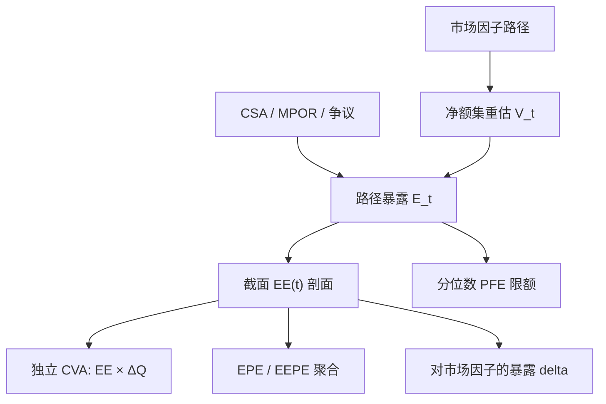

# CVA 暴露剖面 EPE

CVA 积分的被积函数是未来正暴露的期望路径，不是某个 EAD 常数；剖面从哪条净额集、哪份 CSA、哪个估值模型来，决定了乘上生存概率之后还剩多少可信的价格。

<footer>—— Gregory, Counterparty Credit Risk and Credit Value Adjustment；暴露统计的标准定义对照 Pykhtin & Zhu, GARP, 2007</footer>

[CVA 要点](/quant/cva-lite) 在独立假设下把单边 CVA 写成 $\sum \mathrm{DF}(t_i)\,\mathrm{EE}(t_i)\,\Delta Q_i$。本篇写 $\mathrm{EE}(t)$ 这条曲线如何从模拟里造出来，以及 EPE、有效 EPE、PFE 各自进哪张报表。Canabarro–Duffie 与 Pykhtin–Zhu 把暴露过程当成与贷款 EAD 不同的对象：它是净额集市值的正部，随市场因子路径、抵押品与提前终止权变化。Gregory 的 xVA 论述把这条剖面既用于定价也用于解释「CDS 没动、EE 形状变了为何仍亏钱」。不重复单边公式的推导，也不把 DVA/FVA/MVA 在这里展开。

## 问题

与对手方的组合在 $t$ 的盯市为 $V_t$（对我为正表示对方欠我）。违约损失看的是 $V_\tau^+$，因此需要未来每个时点的正暴露分布，而不只是今日 $V_0$。定义

$$
\mathrm{EE}(t)=\mathbb{E}[V_t^+],\qquad
\mathrm{EPE}=\frac{1}{T}\int_0^T \mathrm{EE}(t)\,\mathrm{d}t.
$$

监管有效 EPE 还对 $\mathrm{EE}$ 做运行最大值再平均（EEPE），防止前端低暴露、后端高峰被平均掉。PFE$(t)$ 是 $V_t^+$ 的高分位数，服务限额，测度与置信度都与定价用的 $\mathrm{EE}$ 不同。问题是：期望在哪个测度、哪条折现、哪个净额集上取；美式与抵押如何改剖面形状；网格太疏会漏掉保证金期里的尖峰。

第二个问题是引擎与前台不一致。EE 若用简化定价（线性 DV01、忽略凸性与取消），剖面在 Bermudan、CMS、外汇期权净额集上会系统性偏。CVA 对冲的市场 delta 来自剖面随市场因子的微分，错的 EE 产生错的对冲。Gregory 强调暴露引擎必须足够接近前台，否则 CVA 台对冲的是另一个产品。

### EE 不是路径上的「平均正数」随便一取

$\mathrm{EE}(t)$ 是**固定日历时点**上、对市场因子的截面期望，不是单条路径上正暴露的时间平均。实现：模拟 $N$ 条因子路径，在网格 $\{t_i\}$ 上按净额集重估 $V^{(n)}(t_i)$，扣抵押得到 $E^{(n)}(t_i)$，再

$$
\mathrm{EE}(t_i)=\frac1N\sum_n \max\bigl(E^{(n)}(t_i),0\bigr).
$$

无抵押时 $E=V$；有 CSA 时 $E$ 是阈值、最低转账金额、合格抵押与争议之后的残余。时间平均的 EPE 把剖面压成一个数，用于资本与粗口径比较；定价必须保留整条 $\mathrm{EE}(t_i)$ 去乘 $\Delta Q_i$。把 EPE 当 CVA 名义，等于假设生存密度均匀，期限结构一陡就错。

定价 EE 用风险中性（或市场隐含）动态；限额 PFE 常用真实测度或压力校准的波动。同一引擎两套参数可以，同一套数既当 CVA 又当 99% PFE 不行。

## 方法

**因子与重估。** 利率用 [Hull-White](/quant/hull-white) 或 [LMM](/quant/lmm)，外汇、股票、商品按前台模型，信用因子若进错向则接到 [混合](/quant/rates-credit-hybrid)。每个路径、每个网格点调用与前台同一套曲线与波动切片（至少线性产品要对齐，非线性用回归或网格近似）。可赎回、美式需要在路径上估计续持，否则 EE 在期权性大的净额集上偏大或偏小，取决于你是否忽略对方的取消权。

**净额与抵押。** 法律净额集是 EE 的聚合单位，不能按「同一发行人」跨协议合并。CSA 把当前暴露压到阈值附近，剖面质量迁到未来保证金期（MPOR）里的跳价：模拟必须在保证金日之间保留足够密的网格，并在违约情景里把最后一次合格催缴之后的市场移动算进 $V^+$。争议、错配货币、评级触发的阈值跳跃，都应作为剖面的情景而不是脚注。

**从剖面到 CVA。** 独立假设下把 $\mathrm{EE}(t_i)$ 与 [自举生存](/quant/cds-survival-bootstrap) 的 $\Delta Q_i$、贴现相乘。抵押后的 EE 前端接近零、在滚动日或期权到期前再隆起，CVA 对短端 CDS 的敏感来自这些隆起与短端 $\Delta Q$ 的对齐。错向时要用路径上的 $V_t^+\lambda_t$ 而不是剖面乘边际密度。

### EEPE、峰值与期限结构风险

巴塞尔 IMM 的有效 EPE 对 $\mathrm{EE}(t)$ 取 $\max(\mathrm{EE}(s):s\le t)$ 再对 $t$ 平均，旨在惩罚「先低后高」的剖面，例如长期无抵押 IRS 在远期曲线上的滚降。资本用 EEPE，定价用 EE，二者不可互换却应能对账：同一模拟、不同聚合。峰值暴露（max EE 或某分位 PFE 的期限结构）用于限额：限制的是未来某年的潜在重置，不是 CVA 的现值。剖面的期限结构本身是风险因子：利率波动上升会把 IRS 的 EE 峰抬高并后移，即使对手方 CDS 不动，CVA 也亏——这是暴露凸性，要用市场对冲而不是只买 CDS。

网格选择：短端按保证金频率与支付日，长端可疏。支付日、定盘日、取消日必须落在网格上，否则 EE 会漏现金流尖峰。外汇远期与 CCS 的 EE 呈「上升再在本金交换处跳」，IRS 常呈驼峰；看到形状与产品类型不符，先查净额与抵押实现，再查模型。

## 机制

经济上，EE 剖面是「未来重置成本的期限结构」。净额把一堆合同压成一个期权性组合：对你同时有正负市值的互换会抵消，剖面低于逐笔 EE 之和，这是净额的全部意义。抵押把期权的当前内在价值几乎拿走，剩下时间价值加 MPOR 跳跃，所以「有 CSA 故 CVA 为零」在 2008 年已经失效。对方的取消权减少你的正暴露（对方会在对你不利时取消），你的取消权减少负暴露，剖面不对称，双边 CVA 不能用同一条 EE。

与贷款的对比：贷款 EAD 接近承诺额，剖面平坦；衍生品 EE 是市场的看涨，波动是输入。因此 CVA 台必须有市场风险对冲，信贷审批的 PD 不能替代剖面。Pykhtin–Zhu 把 EE 与 PFE 分列，就是防止用分位数当期望。

错向不是给 EE 乘一个大于 1 的系数就结束。系数无法解释 PnL，也无法对冲。能对冲的是：让 $\lambda$ 依赖市场因子，或在压力剖面与基准剖面之间做可报告的差额。

### 回归、嵌套与计算预算

每个路径每个时点全量重估美式结构，成本不可接受。标准是：线性产品闭式或快速重估；香草用公式；取消权用 Longstaff–Schwartz 在暴露模拟的内层回归，或用预先校准的网格。内层若用与前台不同的模型，剖面在波动上的敏感会错。计算预算应优先保证净额集正确、抵押逻辑正确、网格对准支付日，再增加因子个数。用一因子 Hull–White 做全部 IRS 暴露，斜率产品的 EE 会假相关，见 [两因子](/quant/hw-two-factor)。

## 边界与工程取舍

不要用债券面值或贷款 EAD 替代 EE。不要把 PFE 99% 当 CVA 名义。不要在日终抵押余额上假设「永远够券」，合格抵押短缺会让剖面在压力里重新膨胀。不要跨净额集合并正负暴露。国内无 CDS 名字的 $\Delta Q$ 来自映射，剖面再精确，CVA 仍被映射主导，两者要分列敏感度。

对冲：CDS 对 $\Delta Q$，利率/外汇对 EE 的市场导数。剖面网格与 CDS 节点不对齐时，插值惯例会变成 PnL 解释的残差。中央对手方把双边 EE 换成对 CCP 的暴露加违约基金，剖面对象变了，不能把 CCP 当零暴露，见 Gregory 后续 xVA 论述与初始保证金的 [MVA](/quant/mva-initial-margin)。

出处：Gregory 的 CVA / *The xVA Challenge*；Pykhtin & Zhu, GARP, 2007；Canabarro & Duffie, 2003。资本侧 EEPE 见巴塞尔 IMM 公式，与定价 EE 分章阅读。

## 小结

- EE$(t)$ 是固定时点上正暴露的风险中性期望，整条剖面才是 CVA 的名义；EPE 是其时间平均，EEPE 再取运行最大。
- 剖面必须按法律净额集与 CSA 构造，网格对准支付、取消与保证金期。
- PFE 与 EE 测度不同；用分位数当定价名义会把限额工具当成价格。
- 引擎重估要接近前台，否则 CVA 的市场对冲对的是错误凸性。
- 错向改的是联合期望，不是给剖面乘一个无法对冲的系数。
- 出处：Gregory；Pykhtin–Zhu, 2007；Canabarro–Duffie, 2003。
