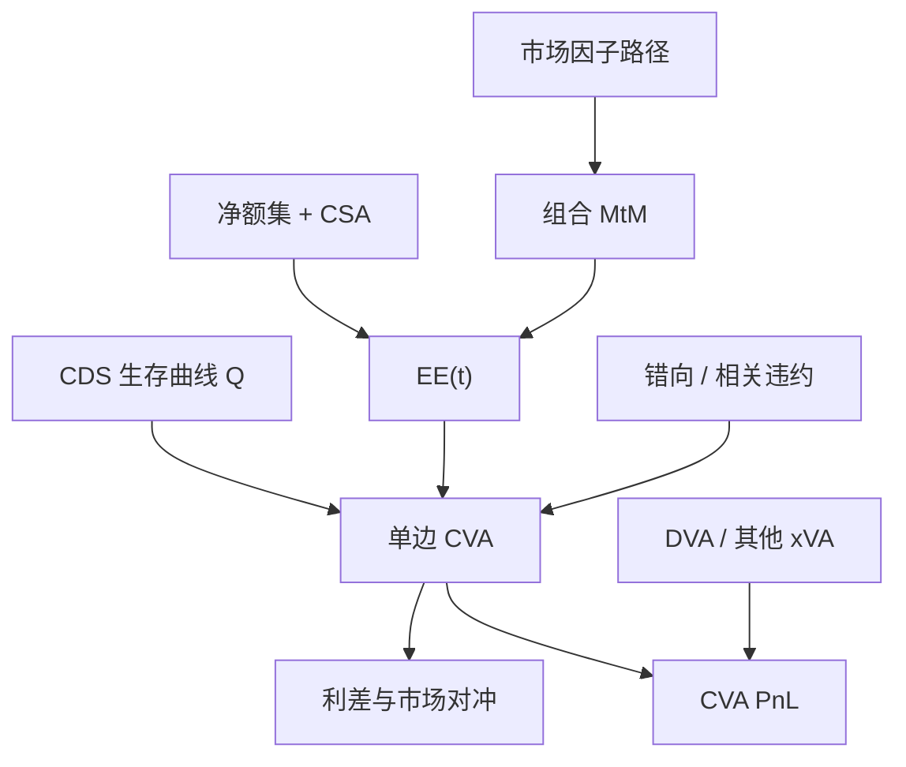

# 对手方 CVA 要点

CVA 是在对手方可能违约的前提下，把衍生品组合的估值从无违约价格改写成可违约价格；它是一笔对冲簿，不是到违约日才入账的会计准备。

<footer>—— Gregory, Counterparty Credit Risk and Credit Value Adjustment, 对照其后续 xVA 论述</footer>

[对手方与信用风险](/quant/counterparty-credit) 把暴露、净额、PFE 与错向风险摊开。本篇收窄到 **CVA 这一条价格**：Jon Gregory 反复强调的，是把对手方违约当成可以盯市的衍生品风险，而不是信贷部年底拨一次备抵。2008 年之后，未违约的名字只要 CDS 走阔，CVA 台就会立刻亏损；资本规则随后把 CVA 波动收成独立的市场风险。读 Gregory 不是为了背完整 xVA 字母表，而是为了分清：哪些假设让公式可算，哪些假设在催缴与错向里已经作废。

## 问题

无违约的衍生品价值记为 $V$。对手方在 $\tau$ 违约时，若当时对我的市值为正，我损失大约 $(1-R)V_\tau^+$；若为负，我仍可能要付给破产财团（视净额与 close-out 条款）。单边 CVA 只给「对方违约、我的正暴露」定价；双边再引入自己违约时的 DVA。问题是 $V_t$ 随机、$\tau$ 随机，且二者往往不独立。把 CVA 写成「EAD × LGD × PD」的贷款口径，等于把随机暴露压成一个常数，这正是 Gregory 从第一章就要拆掉的习惯。

第二个问题是对冲与资本分裂。交易台用模拟 EE 曲线乘生存概率差分来报价；风控用 PFE 限额；监管用 SA-CCR 或 IMM。三套数字可以对账，也可以互相打脸。CVA 要点是：它进入 **PnL**，因此必须能解释「今天 CDS 动了、EE 没变，为什么还亏钱」。

### 单边公式是期望正暴露乘违约密度

在利率与信用独立、无错向、回收为常数的简化下，Gregory 给出的离散形式与市场惯例一致：

$$
\mathrm{CVA} \approx (1-R)\sum_{i=1}^{n} \mathrm{DF}(t_i)\,\mathrm{EE}(t_i)\,\bigl(Q(t_{i-1})-Q(t_i)\bigr).
$$

$\mathrm{EE}(t)=\mathbb{E}[V_t^+]$ 来自市场因子模拟，$Q$ 来自对手方 CDS 曲线的生存概率，$\mathrm{DF}$ 是无风险或 OIS 贴现。这一写法把 CVA 看成以 EE 为名义的单名 CDS。独立假设一旦放松，违约密度应在暴露大的路径上更高，上式偏低，这就是错向风险。抵押品把当前 $V^+$ 压到阈值附近，EE 曲线的质量集中在边际期（margin period of risk）里的跳价；这时再假装「有 CSA 所以 CVA 为零」，是 2008 年已经证伪的句子。

CVA 用的是风险中性下的期望暴露，PFE 用的是真实测度或压力情景下的高分位。把 PFE 的 99% 当成 CVA 名义，会把限额工具错当成定价工具。Gregory 把两者分章，不是文风，是测度不同。

## 方法

**暴露引擎。** 对每个净额集、每条 CSA，在利率、外汇、信用、股票因子上模拟路径，按前台接近的模型重估 $V_t$，扣抵押、加争议与转账延迟，得到 $V_t^+$。EE 是截面均值。可赎回、美式与路径依赖结构需要嵌套估值或回归，否则 EE 在期权性大的净额集上会系统性偏。

**信用曲线。** 有 CDS 的名字用标准自举；没有 CDS 的名字做映射（评级、行业、区域）。映射误差是 CVA 的第一主成分之一，应单独做敏感度，而不是埋进「信用 VaR」。回收 $R$ 在衍生品 close-out 里还受估值争议影响，不宜直接抄债券回收历史均值。

**对冲。** 对 CDS 利差的敏感度用单名或指数代理；对市场因子的敏感度（CVA 的利率、外汇 delta）要用暴露模拟的微分或再估值。Gregory 强调 CVA 对冲会引入新的对手方与基差：你买的是利差，不是法律回收。指数对冲在名字违约时可以完全失效。

### 双边、DVA 与不要一次吞下全部 xVA

双边 CVA 把自身违约时对方承担的损失记为 DVA，会计上常与自身信用利差收窄一起出现「赚钱」，经济上并不可用这笔钱。FVA 把自身融资利差推进贴现，争议在于是否与 DVA 双计、以及内部资金曲线是否可对冲。KVA、MVA 更靠资本与保证金的组织选择。CVA-lite 的纪律是：**先把单边 CVA 与抵押后 EE 算对、能对冲、能解释 PnL**，再决定哪些字母进入内部转移定价。把 xVA 一次全加上，无法分辨是暴露错了还是资金曲线错了。

## 机制

经济上，CVA 是重置成本的现值：对方倒了，你要按当时市场价格把合约找人接走。净额把重置从「每笔」变成「每个法律集」；抵押把重置窗口缩短到边际期。把这件事卖成利差之后，CVA 台的风险与信贷审批的 PD 不再是同一频率——审批看周期，台子看每日 CDS。这解释了为什么「信贷认为这家公司不会倒」挡不住 CVA 亏损。

与债券信用的差别仍然关键：债券暴露接近面值；衍生品暴露是市场的看涨期权。同一名字上，你可能债券多头与互换负市值并存，违约事件对两笔账的符号相反。CVA 必须按净额集，不能按「我对这个发行人的总胃口」合并。

### 错向与催缴比公式更致命

错向：对手方在你暴露变大时更可能倒（卖给它的保护、或它与抵押品同向）。结构模型给相关一个故事，校准几乎没有违约样本。实务是压力加权 EE，而不是假装相关为零。催缴：有 CSA 的组合在压力里碰到合格抵押变少、外汇错配、再抵押链条断裂，EE 重新膨胀。Brunnermeier 描述的 2008 年，许多损失发生在 CVA 与流动性螺旋交叉处，而不是发生在公式里的 $Q(t)$ 跳到 1 的那一天。CVA 引擎若把抵押当永不短缺的现金，会系统性低估危机 PnL。

中央对手方把双边 CVA 换成对 CCP 的暴露、初始保证金与违约基金。CVA 变小不等于信用风险消失，只是改写成会员损失分摊与流动性风险。把 CCP 当零 CVA 后不再限额，是把字母换了地方。

## 边界与工程取舍

模拟必须与前台估值足够近，否则对冲的是错误价格上的正确统计。短端 CDS 与长期无质押 IRS 的期限错配，会让 CVA 对曲线形状极敏感。国内对手方往往没有活跃 CDS，映射与内部评级会主导结果，敏感度报告比「一个 CVA 数字」更有用。不要用债券 VaR 或贷款 EAD 替代 EE。不要在独立假设的 CVA 上再乘一个「保守系数」就称为已经处理错向——系数无法对冲，也无法解释 PnL。

对冲方面，单名 CDS 流动性差时用指数，必须单列基差限额。CVA 对冲本身的对手方风险要进第二层限额，否则对冲簿在名字出事时双重暴露。与 CTA、期货保证金不同：交易所变异保证金是当日现金，OTC 的 CVA 是未违约也可波动的估值；两套体系不要共用一个「信用风险」额度名称。

出处：Gregory, *Counterparty Credit Risk and Credit Value Adjustment*（及后续 *The xVA Challenge*）。暴露与资本翻译见 Pykhtin and Zhu, GARP, 2007。强度与盯市对手方风险见 Canabarro and Duffie, 2003。危机中的催缴与螺旋见 Brunnermeier, JEP, 2009。

## 小结

- CVA 把随机正暴露的期望损失标进价格，并随 CDS 与市场因子每日波动；它是对冲簿，不是等到违约的准备。
- 独立假设下的离散公式是 EE 曲线乘生存概率差分；抵押后剩余主要是边际期跳价。
- 错向、催缴与映射误差决定危机 PnL，不能用贷款口径的 PD×LGD×EAD 代替。
- 先做对单边 CVA 与对冲，再引入 DVA/FVA；PFE、资本与 CVA 测度不同，必须分列。
- 出处：Gregory 的 CVA / xVA 论述；Pykhtin–Zhu, 2007；Canabarro–Duffie, 2003。
