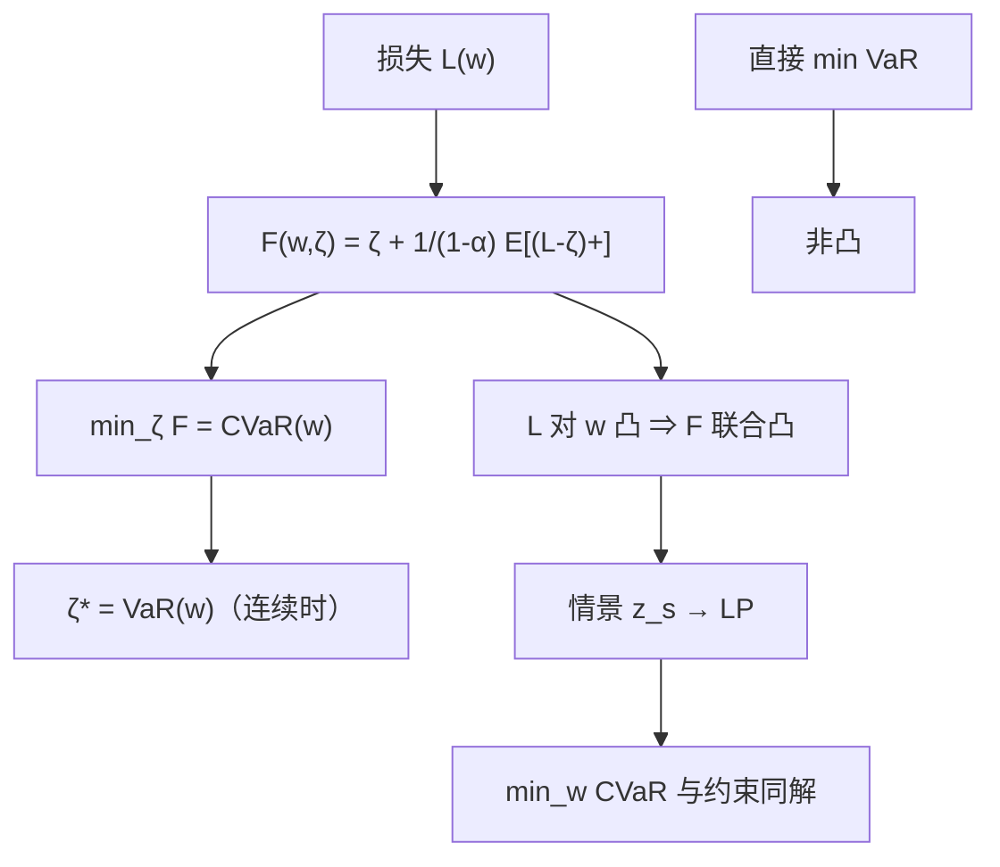

# CVaR 的 Rockafellar–Uryasev 表示

    
CVaR 等于对辅助阈值的一个凸函数取最小；最小点处的阈值是 VaR，因而最小化尾部期望不必经过非凸的分位数目标。

    <footer>—— Rockafellar and Uryasev, Optimization of Conditional Value-at-Risk, Journal of Risk, 2000</footer>

[CVaR 优化](/quant/cvar-opt) 一文写如何选 $w$：情景 LP、均值–CVaR 前沿、椭圆世界与均方重合、情景不足时的过拟合。[ES](/quant/expected-shortfall) 写度量公理。本篇只写 **Rockafellar–Uryasev（RU）表示本身**：函数 $F_\alpha(w,\zeta)$、为何对 $\zeta$ 最小化得到 CVaR、为何 $\zeta^\star$ 是 VaR、联合凸从何而来、离散分布上原子与「尾巴均值」的差别。2002 年后续论文把组合与约束写全。它补的是表示定理与辅助变量会计，不是再列一遍工程正则清单。

## 问题

VaR$_\alpha(w)$ 作为损失 $L(w)$ 的下 $\alpha$-分位数，对 $w$ 一般既非凸也不光滑，不能当凸优化的目标。CVaR（连续分布上与 ES 一致）是超过该分位数的条件期望，对固定分布关于损失水平连贯、次可加，但仍要先知道分位数才能写「超过部分的平均」——看起来像嵌套的非光滑过程。RU 的观察是：不必先算 VaR，可以把 CVaR 写成

$$
F_\alpha(w,\zeta)=\zeta+\frac{1}{1-\alpha}\mathbb{E}\bigl[(L(w)-\zeta)^+\bigr],
$$

$$
\mathrm{CVaR}_\alpha(w)=\min_{\zeta\in\mathbb{R}}F_\alpha(w,\zeta).
$$

对每个固定 $w$，内层是一元凸最小化；$(L-w$ 仿射时) $F$ 对 $(w,\zeta)$ 联合凸，于是 $\min_w\mathrm{CVaR}$ 等价于 $\min_{w,\zeta}F$。问题是把这个等价用对：优化变量里必须留下 $\zeta$，约束必须写在 $F$ 或其情景离散上，而不能优化过程中把 $\zeta$ 换成「钉 VaR 限额」——钉分位数会把问题变回非凸。

离散经验测度下，CVaR 的定义与「最坏 $k$ 个情景的平均」在有原子、有平局分位时需要小心：RU 的 $F$ 给出的是与 Rockafellar–Uryasev / Pflug 一脉相容的 CVaR，可能与朴素「排序后取尾巴平均」在平局处差一个加权。实现应优化 $F$，而不是手写排序平均再对 $w$ 差分。

### 为什么 $\zeta^\star$ 是 VaR

对固定 $w$，令 $L=L(w)$。$F(\zeta)=\zeta+\frac{1}{1-\alpha}\mathbb{E}[(L-\zeta)^+]$ 对 $\zeta$ 的次梯度含 $1-\frac{1}{1-\alpha}P(L>\zeta)$ 一类项（连续时用密度写导数）。一阶条件迫使 $P(L\le\zeta^\star)=\alpha$（在连续情形），即 $\zeta^\star=\mathrm{VaR}_\alpha$。因此最小化 CVaR 会「顺便」给出 VaR，但目标函数是 $F$，不是 $\zeta$。若分布有原子，VaR 可以是一个区间，$F$ 的最小化子是该区间上使 CVaR 定义成立的阈值；CVaR 仍唯一，VaR 不必唯一。这是离散 PnL 情景里常见现象：不要因为 $\zeta$ 在求解器里游移几个基点就认为 CVaR 不稳定——先看 $F$ 的最优值。

连续分布上 CVaR 与 ES 的 Acerbi–Tasche 定义一致。原子分布上须用正确的尾积分，RU 的 $F$ 自动处理。监管 ES 还有压力期与流动性期限，与这一表示不是同一个数。

## 方法

情景 $\{L_s(w)\}_{s=1}^S$，引入 $\zeta_s\ge 0$，

$$
\min_{w,\zeta,z}\quad \zeta+\frac{1}{(1-\alpha)S}\sum_{s=1}^S z_s
$$

$$
z_s\ge L_s(w)-\zeta,\quad z_s\ge 0,
$$

外加 $w$ 的线性（或凸）约束。$L_s(w)=-w^\top r_s$ 时这是 LP。$L$ 对 $w$ 凸则整体凸。均值约束、换手、行业中性都加在同一问题里。对偶侧大致是：在概率单纯形上重加权，使超阈情景的权重上限为 $1/((1-\alpha)S)$，这正是 CVaR 作为最坏 $(1-\alpha)$ 尾部概率的表示（Pflug / Rockafellar）。理解对偶有助于看「优化器在盯哪几天」：最优 $z_s>0$ 的情景是进入尾巴的那些，其影子价格是对那一天因子暴露的惩罚。

2002 年论文强调：约束形式 $\mathrm{CVaR}_\alpha(w)\le c$ 与目标形式可转换；多个 $\alpha$ 可并列。实现时 $\alpha=0.99$、$S=500$ 则有效尾巴约 5 个点，LP 仍可解，统计上不可信——表示的凸性不创造样本。原子很多时（相同损失的情景成批），$\zeta$ 的最优集变宽，应报告 CVaR 值与进入尾巴的情景集合，而不是报告 $\zeta$ 到小数点后八位。

### $F$ 的联合凸与非线性损失

若 $L(w,r)$ 对 $w$ 仿射（线性持仓、情景价格已给定），$F$ 联合凸。期权若用全定价路径，$L$ 对名义仍常是凸的（买入期权亏损有下界、卖出无界），卖出期权使 $L$ 对仓位线性或凸，仍可进 RU；若用局部 δ 把期权当成线性暴露，凸性保留但对象错了。非凸定价（某些数字、障碍的离散对冲）会破坏 $F$ 的凸性，求解器报的「最优」依赖初值。应在表示之前先问 $L(\cdot,r_s)$ 是否凸，而不是先问 CVaR 是否连贯。

与二次风险混合：$\lambda w^\top\Sigma w+(1-\lambda)F_\alpha$ 在 $\lambda>0$ 时对椭圆新息把日常风险拉回来，减轻纯尾巴的自由度不足。这仍是对 $F$ 的优化，不是对 VaR 的优化。约束 $\mathrm{CVaR}\le c$ 更贴近限额制度，目标最小化更贴近「在预算上尽量瘦尾巴」。两种都走同一 $F$，不要一套用排序 ES、一套用 $F$，对账会裂。

## 机制

机制是**用 $\zeta$ 把分位数变成线性不等式的右边**。$(L-\zeta)^+$ 对每个情景是关于 $(w,\zeta)$ 的凸折线；平均之后对 $\zeta$ 最小化，把质量分配在「阈值」与「超阈平均」之间。最优时，大约 $\alpha S$ 个情景在阈值以下（$z_s=0$），其余在以上并进入平均。微调 $w$ 降低那些 $z_s>0$ 的损失，直到约束挡住。这与直接对经验分位数求导不同：分位数的雅可比在情景跨越阈值时跳跃，而 $F$ 的次梯度几乎处处好处理，内点法稳定。

椭圆对称下 $L$ 的尺度族使 CVaR 与 $\sigma$ 成固定倍数，最小化 $F$ 与最小化 $\sigma$ 同解，$\zeta^\star$ 等于该组合的解析 VaR。表示仍然正确，只是不产生新的分散化。非椭圆、非对称、违约示性让进入尾巴的情景集合随 $w$ 改变成员，最优才离开 Markowitz。RU 并不自动「更看重尾巴」——若情景是多元正态，它看不见同爆。

清洗或 winsorize 一个极值情景会改变 $F$ 的最优 $w$。规则必须事前冻结。表示把极值的影响力写得很透明：那个 $z_s$ 很大。这是治理优点，不是可以把极值删到组合好看。

### 与成分 ES、监管 ES 的接口

最优 $w$ 处，情景的有效尾测度可用于 [成分 ES](/quant/component-es)：在 $\{s:z_s>0\}$（及原子上的分数权重）上取 $E[L_i\mid\text{tail}]$。优化与分配应使用同一尾集合，不要优化用 RU、分配用手写 99% 历史 ES。监管 FRTB 的 ES 有压力窗、风险类、流动性期限，不能把 RU 的最优值填进监管表格。反过来，内部限额用 RU 约束，与监管资本并列，正是表示的工程价值：限额可解、可加线性约束。

## 边界与工程取舍

不要最小化 VaR 还引用 2000 年论文。不要丢掉 $\zeta$ 只最小化经验超阈平均（分位数随 $w$ 变，目标定义循环）。不要在 $S(1-\alpha)$ 过小时把凸解当成稳定 alpha。不要对非凸 $L$ 声称全局最优。多期、中间强平使单期 $L$ 漏掉路径约束，时间一致性不是 RU 单期表示的内容；须把强平写进路径损失，或改动态风险度量。

$\alpha$ 接近 1，$F$ 的统计误差上升，优化器仍给出机器精度的 $w$。应降 $\alpha$、加压力情景权重、或对 $w$ 加 $\ell_2$ / 换手。表示保证的是：在给定测度上，你最小化的确实是该测度的 CVaR，而不是该测度是否等于未来。

「我们用了连贯风险度量的凸表示」约束的是给定情景集上的几何，不约束情景集是否完整。公理不替代压力路径。

## 小结

- Rockafellar–Uryasev（2000）证明 $\mathrm{CVaR}_\alpha(w)=\min_\zeta F_\alpha(w,\zeta)$，$F$ 对阈值凸；损失对权重凸时联合凸，情景下成 LP。
- 最优 $\zeta$ 是 VaR（连续时），但必须优化 $F$ 而不能改成钉 VaR。
- 离散原子上 CVaR 由 $F$ 唯一定义，VaR 可以是区间；实现应优化辅助变量而非手写排序平均。
- 表示不创造尾样本；椭圆情景下最优退回均方。
- 约束形式与目标形式共用同一 $F$，便于限额与选组合对齐。
- 出处：Rockafellar & Uryasev, *Journal of Risk*, 2000；组合与算法展开 *JBF*, 2002；ES 澄清见 Acerbi & Tasche, 2002；连贯性见 Artzner et al., 1999。
